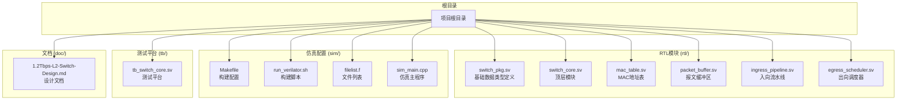
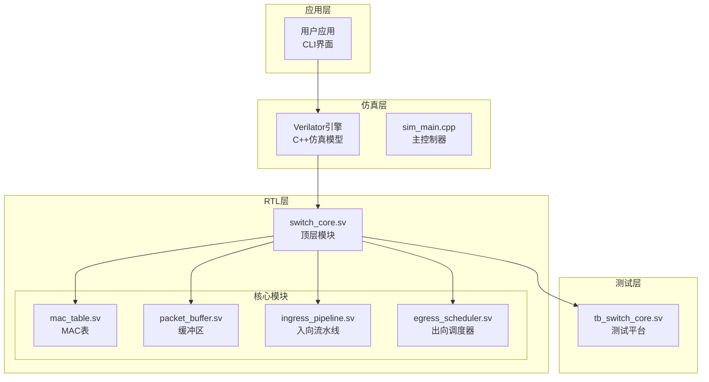
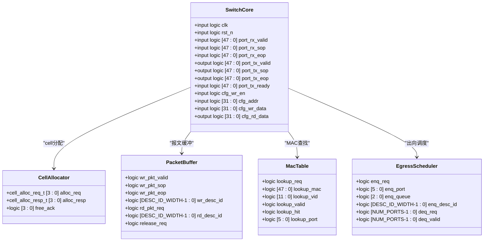
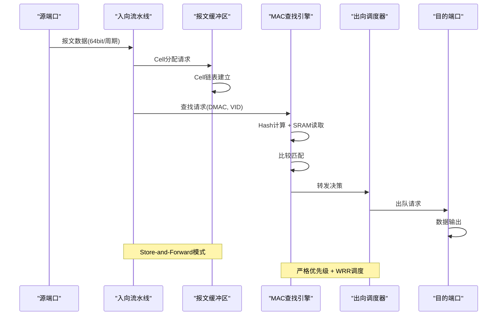
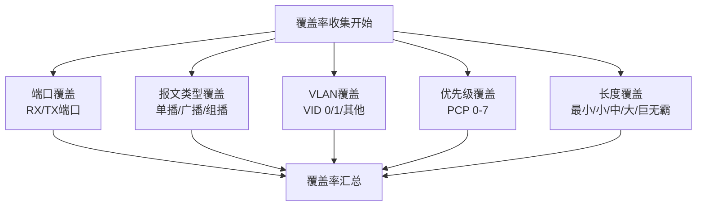
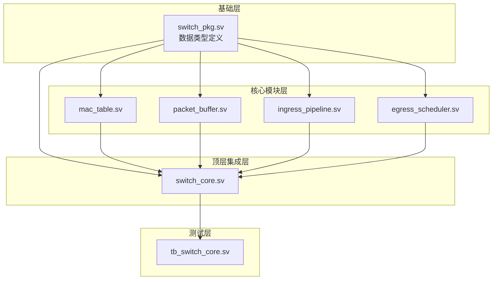
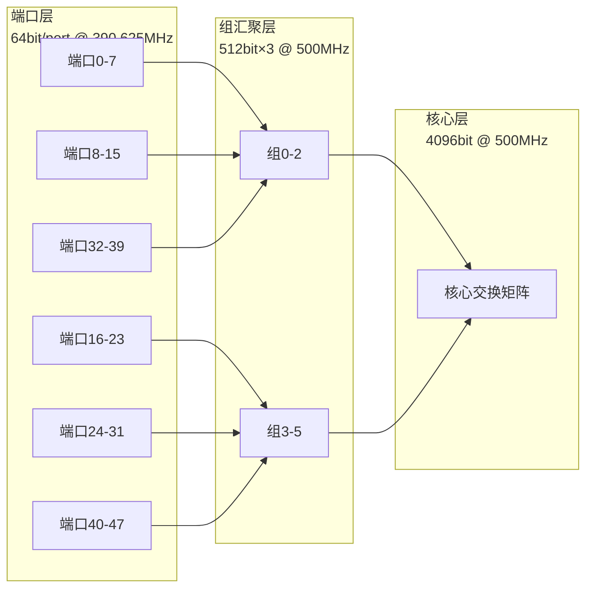

# 仿真环境搭建

<cite>
**本文档引用的文件**
- [Makefile](file://sim/Makefile)
- [run_verilator.sh](file://sim/run_verilator.sh)
- [filelist.f](file://sim/filelist.f)
- [sim_main.cpp](file://sim/sim_main.cpp)
- [switch_core.sv](file://rtl/switch_core.sv)
- [switch_pkg.sv](file://rtl/switch_pkg.sv)
- [mac_table.sv](file://rtl/mac_table.sv)
- [packet_buffer.sv](file://rtl/packet_buffer.sv)
- [ingress_pipeline.sv](file://rtl/ingress_pipeline.sv)
- [egress_scheduler.sv](file://rtl/egress_scheduler.sv)
- [tb_switch_core.sv](file://tb/tb_switch_core.sv)
- [1.2Tbps-L2-Switch-Design.md](file://doc/1.2Tbps-L2-Switch-Design.md)
</cite>

## 目录
1. [简介](#简介)
2. [项目结构](#项目结构)
3. [核心组件](#核心组件)
4. [架构概览](#架构概览)
5. [详细组件分析](#详细组件分析)
6. [依赖关系分析](#依赖关系分析)
7. [性能考虑](#性能考虑)
8. [故障排查指南](#故障排查指南)
9. [结论](#结论)
10. [附录](#附录)

## 简介

本项目是一个1.2Tbps 48×25G二层网络交换机的Verilator仿真环境。该仿真系统实现了完整的交换机核心功能，包括MAC地址学习、查找、转发、队列调度和内存管理等核心模块。系统采用Verilator作为仿真器，支持波形跟踪、代码覆盖率收集和多种测试模式。

## 项目结构

项目采用模块化设计，主要包含以下目录结构：



**图表来源**
- [Makefile](file://sim/Makefile#L1-L186)
- [run_verilator.sh](file://sim/run_verilator.sh#L1-L131)
- [filelist.f](file://sim/filelist.f#L1-L18)

**章节来源**
- [Makefile](file://sim/Makefile#L1-L186)
- [run_verilator.sh](file://sim/run_verilator.sh#L1-L131)
- [filelist.f](file://sim/filelist.f#L1-L18)

## 核心组件

### Verilator仿真器配置

Verilator是本项目的核心仿真工具，负责将SystemVerilog代码编译为C++仿真模型。主要配置包括：

- **工具配置**: VERILATOR = verilator, VERILATOR_COV = verilator_coverage, GTKWAVE = gtkwave
- **目录结构**: RTL_DIR = ../rtl, OBJ_DIR = obj_dir, COV_OBJ_DIR = obj_cov
- **顶层模块**: TOP_MODULE = switch_core
- **编译选项**: 支持并行编译(-j 4)、时序精度(--timing)、多种警告抑制

### 文件组织结构

仿真环境采用标准的文件列表组织方式：

```mermaid
flowchart TD
FILELIST[filelist.f)<br/>文件列表配置
INC_DIR[+incdir+../rtl]<br/>包含目录
PKG[../rtl/switch_pkg.sv]<br/>包定义
RTL_MODULES[RTL模块集合]
TESTBENCH[../tb/tb_switch_core.sv]<br/>测试平台
FILELIST --> INC_DIR
INC_DIR --> PKG
PKG --> RTL_MODULES
RTL_MODULES --> TESTBENCH
```

**图表来源**
- [filelist.f](file://sim/filelist.f#L1-L18)

**章节来源**
- [filelist.f](file://sim/filelist.f#L1-L18)

## 架构概览

系统采用分层架构设计，从底层硬件到高层应用形成完整的仿真体系：



**图表来源**
- [switch_core.sv](file://rtl/switch_core.sv#L1-L454)
- [switch_pkg.sv](file://rtl/switch_pkg.sv#L1-L219)
- [sim_main.cpp](file://sim/sim_main.cpp#L1-L509)

**章节来源**
- [switch_core.sv](file://rtl/switch_core.sv#L1-L454)
- [switch_pkg.sv](file://rtl/switch_pkg.sv#L1-L219)

## 详细组件分析

### 顶层模块分析

switch_core.sv作为系统顶层模块，整合了所有子模块并提供统一的接口：



**图表来源**
- [switch_core.sv](file://rtl/switch_core.sv#L7-L454)

**章节来源**
- [switch_core.sv](file://rtl/switch_core.sv#L1-L454)

### 数据包处理流程

系统采用Cell-based的报文处理架构，实现高效的内存管理和转发：



**图表来源**
- [ingress_pipeline.sv](file://rtl/ingress_pipeline.sv#L1-L319)
- [packet_buffer.sv](file://rtl/packet_buffer.sv#L1-L427)
- [mac_table.sv](file://rtl/mac_table.sv#L1-L342)
- [egress_scheduler.sv](file://rtl/egress_scheduler.sv#L1-L394)

**章节来源**
- [ingress_pipeline.sv](file://rtl/ingress_pipeline.sv#L1-L319)
- [packet_buffer.sv](file://rtl/packet_buffer.sv#L1-L427)
- [mac_table.sv](file://rtl/mac_table.sv#L1-L342)
- [egress_scheduler.sv](file://rtl/egress_scheduler.sv#L1-L394)

### 覆盖率收集机制

系统实现了全面的功能覆盖率收集，支持多种维度的覆盖率统计：



**图表来源**
- [tb_switch_core.sv](file://tb/tb_switch_core.sv#L75-L101)

**章节来源**
- [tb_switch_core.sv](file://tb/tb_switch_core.sv#L1-L840)

## 依赖关系分析

系统模块间的依赖关系呈现清晰的层次结构：



**图表来源**
- [switch_pkg.sv](file://rtl/switch_pkg.sv#L1-L219)
- [switch_core.sv](file://rtl/switch_core.sv#L1-L454)

**章节来源**
- [switch_pkg.sv](file://rtl/switch_pkg.sv#L1-L219)
- [switch_core.sv](file://rtl/switch_core.sv#L1-L454)

## 性能考虑

### 硬件参数优化

系统针对500MHz核心频率进行了精心设计：

- **Cell处理速率**: 2.34个Cell/周期，满足1.2Tbps线速需求
- **内存带宽**: 4Tbps，1.71x设计裕量
- **缓冲容量**: 8MB SRAM，支持典型数据中心突发场景
- **转发延迟**: Store-and-Forward < 2μs，Cut-Through < 500ns

### 并行处理架构



**图表来源**
- [1.2Tbps-L2-Switch-Design.md](file://doc/1.2Tbps-L2-Switch-Design.md#L78-L145)

**章节来源**
- [1.2Tbps-L2-Switch-Design.md](file://doc/1.2Tbps-L2-Switch-Design.md#L78-L145)

## 故障排查指南

### 常见构建问题

1. **Verilator版本不兼容**
   - 症状: 编译时报错，提示未知选项
   - 解决: 确保Verilator版本≥4.000，检查PATH环境变量

2. **依赖库缺失**
   - 症状: 链接阶段找不到头文件或库
   - 解决: 安装systemc-dev, libboost-all-dev等依赖

3. **文件权限问题**
   - 症状: 脚本无法执行
   - 解决: `chmod +x sim/run_verilator.sh`

### 仿真运行问题

1. **覆盖率数据为空**
   - 症状: coverage.dat文件不存在或为空
   - 解决: 确保编译时包含--coverage选项，检查VM_COVERAGE宏定义

2. **波形文件生成失败**
   - 繁忙: VCD文件无法生成
   - 解决: 确保编译时包含--trace选项，检查GTKWave安装

3. **测试用例超时**
   - 症状: 仿真长时间运行无响应
   - 解决: 检查端口ready信号，确认数据通路正确

### 性能调优建议

1. **编译优化**
   - 使用-j 4并行编译提高速度
   - 启用--timing选项确保时序精度
   - 合理设置内存限制避免编译失败

2. **仿真优化**
   - 对于简单测试使用--quick模式
   - 合理设置仿真时间限制
   - 使用覆盖率驱动测试

**章节来源**
- [Makefile](file://sim/Makefile#L25-L28)
- [run_verilator.sh](file://sim/run_verilator.sh#L62-L76)

## 结论

本1.2Tbps交换机仿真环境提供了完整的设计验证和功能测试能力。通过Verilator仿真器，系统能够高效地验证复杂的网络交换功能，包括MAC学习、查找、转发、队列调度等核心模块。完善的覆盖率收集机制确保了测试的全面性和有效性。

系统采用模块化设计，具有良好的可扩展性和维护性。通过合理的参数配置和优化策略，能够在保证精度的同时获得良好的仿真性能。

## 附录

### 环境搭建步骤

1. **系统要求**
   - Linux发行版 (Ubuntu 18.04+推荐)
   - Verilator 4.000+
   - SystemC 2.3.3+
   - CMake 3.10+
   - GTKWave (可选)

2. **依赖安装**
   ```bash
   # Ubuntu/Debian
   sudo apt-get update
   sudo apt-get install verilator libboost-all-dev systemc cmake gtkwave
   
   # CentOS/RHEL
   sudo yum install verilator boost-devel systemc cmake gtkwave
   ```

3. **项目克隆**
   ```bash
   git clone <repository-url>
   cd switch1t
   ```

4. **构建验证**
   ```bash
   # 进入sim目录
   cd sim
   
   # 基本构建
   make build
   
   # 带波形跟踪的构建
   make build-trace
   
   # 带覆盖率的构建
   make build-cov
   
   # 运行仿真
   make run
   
   # 快速测试
   make run-quick
   
   # 生成波形
   make trace
   
   # 生成覆盖率报告
   make coverage
   ```

5. **脚本使用**
   ```bash
   # 直接使用shell脚本
   ./sim/run_verilator.sh --help
   
   # 常用选项
   ./sim/run_verilator.sh --trace --coverage --quick
   ```

### 配置模板

**Makefile配置模板**
```makefile
# Verilator配置
VERILATOR = verilator
VERILATOR_COV = verilator_coverage
GTKWAVE = gtkwave

# 目录配置
RTL_DIR = ../rtl
SIM_DIR = .
OBJ_DIR = obj_dir
COV_OBJ_DIR = obj_cov
COV_ANN_DIR = coverage_annotate

# 顶层模块
TOP_MODULE = switch_core

# Verilator选项
VERILATOR_FLAGS = --cc --exe --build --timing -j 4
VERILATOR_FLAGS += -Wno-UNUSEDSIGNAL -Wno-UNDRIVEN -Wno-PINCONNECTEMPTY
VERILATOR_FLAGS += -Wno-UNUSEDPARAM -Wno-WIDTHEXPAND -Wno-WIDTHTRUNC
VERILATOR_FLAGS += -Wno-CASEINCOMPLETE -Wno-MULTIDRIVEN -Wno-IMPLICITSTATIC
```

**文件列表模板**
```verilog
// Filelist for 1.2Tbps Switch Core
// 用于仿真和综合

// Package (必须首先编译)
+incdir+../rtl
../rtl/switch_pkg.sv

// RTL模块
../rtl/cell_allocator.sv
../rtl/packet_buffer.sv
../rtl/mac_table.sv
../rtl/ingress_pipeline.sv
../rtl/egress_scheduler.sv
../rtl/switch_core.sv

// Testbench
../tb/tb_switch_core.sv
```

**章节来源**
- [Makefile](file://sim/Makefile#L1-L35)
- [filelist.f](file://sim/filelist.f#L1-L18)