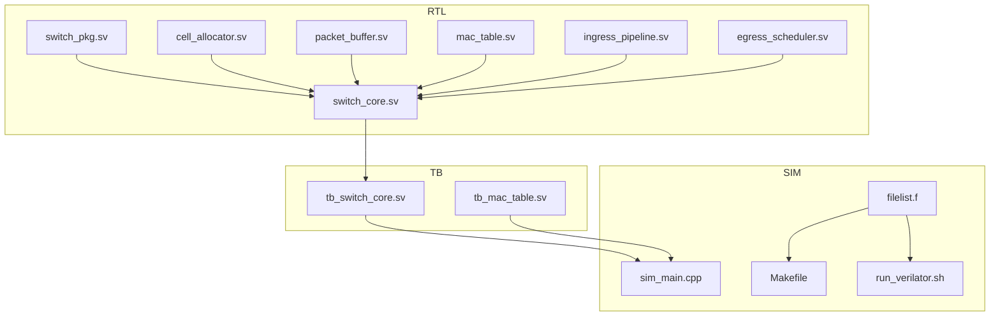
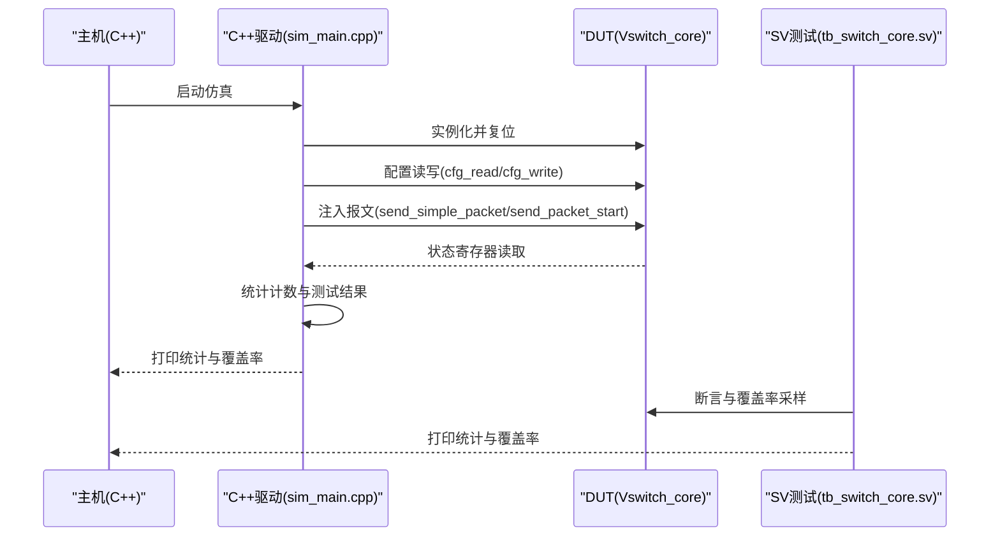
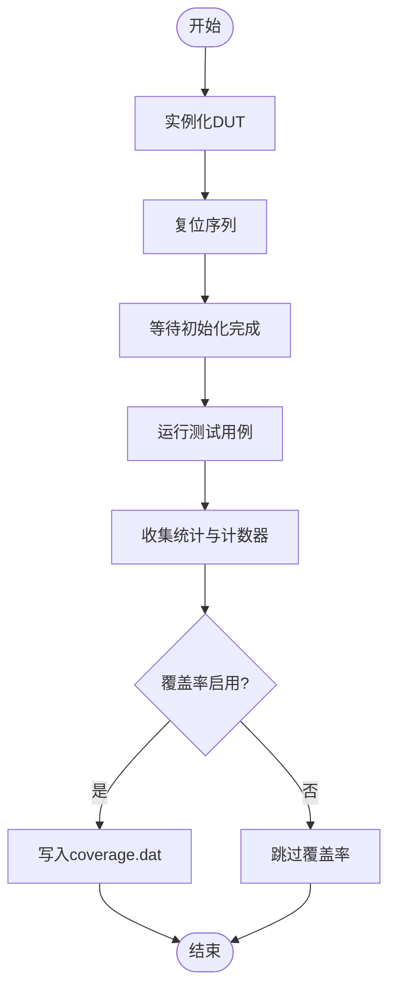
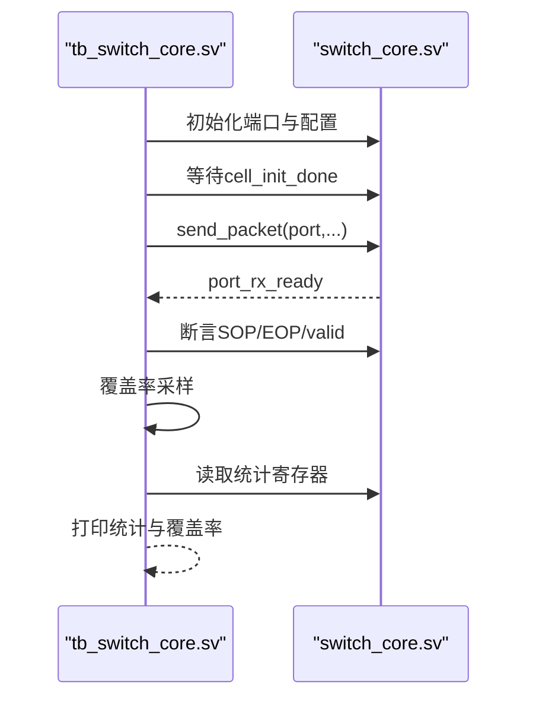
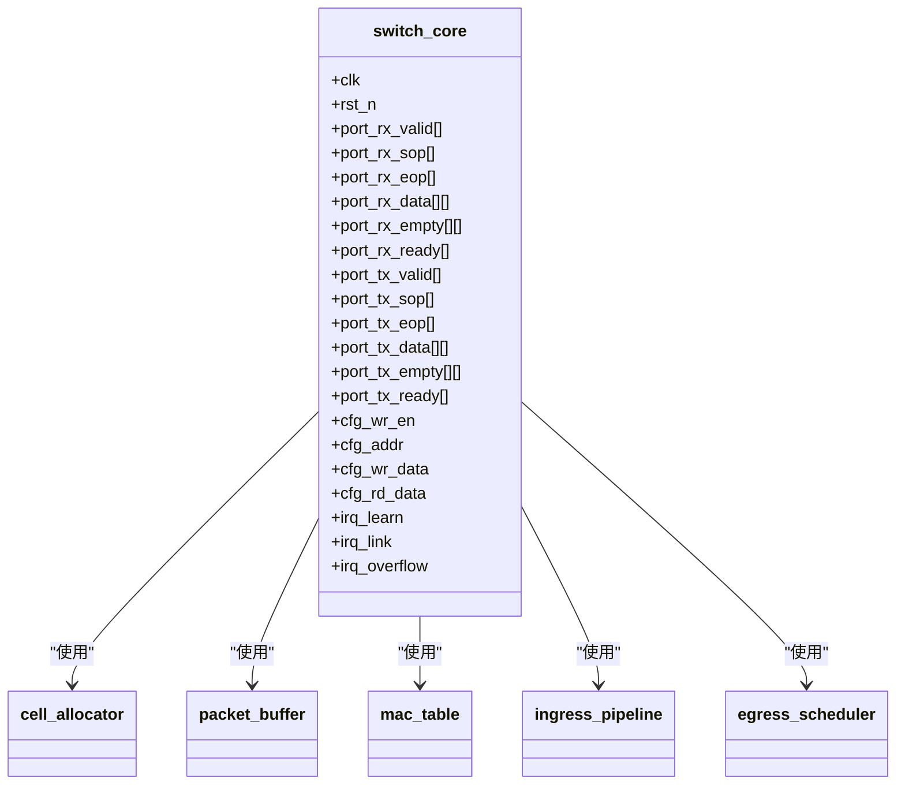
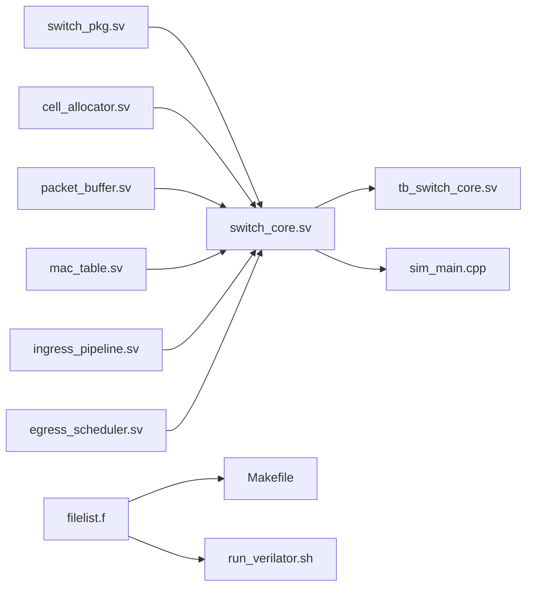

# 测试平台设计

<cite>
**本文引用的文件**
- [sim_main.cpp](file://sim/sim_main.cpp)
- [tb_switch_core.sv](file://tb/tb_switch_core.sv)
- [tb_mac_table.sv](file://tb/tb_mac_table.sv)
- [switch_core.sv](file://rtl/switch_core.sv)
- [switch_pkg.sv](file://rtl/switch_pkg.sv)
- [1.2Tbps-L2-Switch-Design.md](file://doc/1.2Tbps-L2-Switch-Design.md)
- [switch_core.py](file://model/switch_core.py)
- [Makefile](file://sim/Makefile)
- [run_verilator.sh](file://sim/run_verilator.sh)
- [filelist.f](file://sim/filelist.f)
</cite>

## 目录
1. [简介](#简介)
2. [项目结构](#项目结构)
3. [核心组件](#核心组件)
4. [架构总览](#架构总览)
5. [详细组件分析](#详细组件分析)
6. [依赖关系分析](#依赖关系分析)
7. [性能考量](#性能考量)
8. [故障排除指南](#故障排除指南)
9. [结论](#结论)
10. [附录](#附录)

## 简介
本设计文档面向1.2Tbps交换机测试平台，围绕C++驱动程序与SystemVerilog测试模块展开，系统阐述：
- DUT实例化、时钟与复位管理、信号控制机制
- 测试平台层次结构与模块间交互
- 48个25G端口输入输出行为模拟、端口仲裁与并发处理
- 测试统计与性能指标采集
- 覆盖率收集机制与配置方法
- 测试平台扩展指南与调试技巧

## 项目结构
仓库采用“RTL/测试/仿真”三层组织：
- rtl：核心RTL模块与公共包定义
- tb：SystemVerilog测试模块
- sim：C++驱动与构建脚本
- doc/model：设计文档与Python参考模型

图表来源
- [filelist.f](file://sim/filelist.f#L1-L18)
- [Makefile](file://sim/Makefile#L1-L186)
- [run_verilator.sh](file://sim/run_verilator.sh#L1-L131)
- [switch_pkg.sv](file://rtl/switch_pkg.sv#L1-L219)
- [switch_core.sv](file://rtl/switch_core.sv#L1-L454)
- [tb_switch_core.sv](file://tb/tb_switch_core.sv#L1-L840)
- [tb_mac_table.sv](file://tb/tb_mac_table.sv#L1-L281)
- [sim_main.cpp](file://sim/sim_main.cpp#L1-L509)

章节来源
- [filelist.f](file://sim/filelist.f#L1-L18)
- [Makefile](file://sim/Makefile#L1-L186)
- [run_verilator.sh](file://sim/run_verilator.sh#L1-L131)

## 核心组件
- C++驱动程序（sim_main.cpp）：负责DUT实例化、时钟/复位控制、配置读写、报文注入、并发控制、统计与覆盖率输出。
- SystemVerilog测试模块（tb_switch_core.sv）：提供端口收发协议、断言、覆盖率采样、统计打印与测试用例执行。
- DUT（switch_core.sv）：整合cell_allocator、packet_buffer、mac_table、ingress_pipeline、egress_scheduler等子模块。
- 包定义（switch_pkg.sv）：统一参数、数据类型与接口信号宽度。
- 独立MAC表测试（tb_mac_table.sv）：针对MAC表的独立验证。
- 构建与运行（Makefile、run_verilator.sh、filelist.f）：Verilator编译、波形与覆盖率生成。

章节来源
- [sim_main.cpp](file://sim/sim_main.cpp#L1-L509)
- [tb_switch_core.sv](file://tb/tb_switch_core.sv#L1-L840)
- [switch_core.sv](file://rtl/switch_core.sv#L1-L454)
- [switch_pkg.sv](file://rtl/switch_pkg.sv#L1-L219)
- [tb_mac_table.sv](file://tb/tb_mac_table.sv#L1-L281)
- [Makefile](file://sim/Makefile#L1-L186)
- [run_verilator.sh](file://sim/run_verilator.sh#L1-L131)
- [filelist.f](file://sim/filelist.f#L1-L18)

## 架构总览
测试平台采用“C++驱动 + SystemVerilog测试模块”的混合仿真架构：
- C++侧：通过Verilator生成的C++包装类Vswitch_core驱动DUT，提供更灵活的控制与统计。
- SV侧：tb_switch_core.sv作为顶层测试模块，直接实例化DUT，提供断言、覆盖率与统计打印。
- 两者均可输出VCD波形与覆盖率数据，便于联合调试与验证。

图表来源
- [sim_main.cpp](file://sim/sim_main.cpp#L403-L509)
- [tb_switch_core.sv](file://tb/tb_switch_core.sv#L640-L683)

## 详细组件分析

### C++驱动程序（sim_main.cpp）
- DUT实例化与生命周期管理：构造Vswitch_core对象，trace与覆盖率开关，最终调用final与delete。
- 时钟与复位：提供clock_cycle与run_cycles封装；reset_dut实现复位序列与初始等待。
- 配置接口：cfg_write/cfg_read封装配置写入与读取。
- 报文注入：send_simple_packet与send_packet_*系列函数，支持SOP/EOP/valid控制与并发端口注入。
- 测试用例：包含复位初始化、MAC学习、单播/广播/多播转发、QoS优先级、多端口并发、压力测试、长时间运行等。
- 统计与覆盖率：统计发送/接收包数、字节数、周期数、硬件计数器；在VM_COVERAGE宏开启时输出coverage.dat。

图表来源
- [sim_main.cpp](file://sim/sim_main.cpp#L403-L509)

章节来源
- [sim_main.cpp](file://sim/sim_main.cpp#L1-L509)

### SystemVerilog测试模块（tb_switch_core.sv）
- 时钟与复位：生成500MHz时钟与复位序列，等待rst_n拉高后进入主流程。
- DUT接口：声明48×25G端口的RX/TX信号，配置接口与中断信号。
- 初始化：端口输入初始化、TX端口ready置高、配置接口初始化、覆盖率计数器初始化。
- 断言：对RX/TX的SOP/EOP与valid协议进行断言，确保协议正确性。
- 覆盖率采样：在posedge clk时采样端口覆盖、PCP覆盖、报文类型覆盖、VLAN覆盖与长度覆盖。
- 报文生成Task：send_packet根据负载长度计算所需周期，构造数据与empty字段，等待port_rx_ready。
- 配置读写Task：read_config/write_config封装配置接口访问。
- 等待初始化Task：wait_for_init等待cell_init_done信号。
- 测试用例：TC1-TC12覆盖复位初始化、MAC学习、单播/未命中/广播/多播、QoS、并发、VLAN、不同长度、压力、端口遍历等。
- 统计与覆盖率打印：print_statistics与print_coverage分别打印硬件计数器与覆盖率汇总。

图表来源
- [tb_switch_core.sv](file://tb/tb_switch_core.sv#L132-L154)
- [tb_switch_core.sv](file://tb/tb_switch_core.sv#L204-L220)
- [tb_switch_core.sv](file://tb/tb_switch_core.sv#L225-L295)
- [tb_switch_core.sv](file://tb/tb_switch_core.sv#L317-L331)
- [tb_switch_core.sv](file://tb/tb_switch_core.sv#L638-L683)

章节来源
- [tb_switch_core.sv](file://tb/tb_switch_core.sv#L1-L840)

### DUT（switch_core.sv）
- 接口：48×25G RX/TX端口，配置接口，中断输出。
- 子模块：cell_allocator、packet_buffer、mac_table、ingress_pipeline、egress_scheduler。
- 转发决策：基于DMAC/VID查表，支持单播命中、未命中泛洪、广播、组播；源端口过滤。
- 入队/出队：根据查找结果触发入队，Egress调度器按端口优先级与DWRR调度。
- 老化：基于计数器周期性产生age_tick，驱动MAC表老化扫描。
- 配置寄存器：CPU接口读取统计计数器（MAC查找/命中/miss/learn、入队/出队/丢弃、空闲Cell数）。

图表来源
- [switch_core.sv](file://rtl/switch_core.sv#L7-L39)
- [switch_core.sv](file://rtl/switch_core.sv#L150-L167)
- [switch_core.sv](file://rtl/switch_core.sv#L172-L205)
- [switch_core.sv](file://rtl/switch_core.sv#L210-L235)
- [switch_core.sv](file://rtl/switch_core.sv#L240-L268)
- [switch_core.sv](file://rtl/switch_core.sv#L335-L359)

章节来源
- [switch_core.sv](file://rtl/switch_core.sv#L1-L454)

### 包定义（switch_pkg.sv）
- 参数：端口数、速率、Cell大小、MAC表容量、队列数、VLAN范围、描述符池大小、最大包长、核心频率等。
- 枚举：转发模式、队列状态、VLAN动作、ACL动作、端口状态。
- 数据结构：Cell元数据、报文描述符、队列描述符、MAC表条目、解析头、查找请求/结果、端口配置、Cell分配/释放接口等。
- 接口信号：Cell分配请求/响应、Cell释放请求、内存读写接口等。

章节来源
- [switch_pkg.sv](file://rtl/switch_pkg.sv#L1-L219)

### 独立MAC表测试（tb_mac_table.sv）
- 时钟与时钟生成：500MHz时钟。
- DUT实例化：mac_table。
- 测试任务：do_learn/do_lookup封装学习与查表流程。
- 测试流程：基本学习/查表、不同VLAN、MAC更新、大量学习、查表性能、老化。
- 统计打印：最终统计查找/命中/未命中/学习/条目数。

章节来源
- [tb_mac_table.sv](file://tb/tb_mac_table.sv#L1-L281)

### 构建与运行（Makefile、run_verilator.sh、filelist.f）
- filelist.f：定义编译顺序（先包后模块），包含RTL与TB。
- Makefile：提供build/build-trace/build-cov/run/run-quick/trace/wave/coverage/report/clean等目标。
- run_verilator.sh：支持--trace/--coverage/--quick/--clean/--help参数，自动编译与运行，并生成覆盖率注释与汇总。

章节来源
- [filelist.f](file://sim/filelist.f#L1-L18)
- [Makefile](file://sim/Makefile#L1-L186)
- [run_verilator.sh](file://sim/run_verilator.sh#L1-L131)

## 依赖关系分析
- 顶层依赖：switch_pkg.sv必须最先编译；其余RTL模块依赖该包。
- TB依赖：tb_switch_core.sv直接实例化switch_core.sv；tb_mac_table.sv独立测试mac_table。
- C++驱动依赖：sim_main.cpp依赖Vswitch_core（由Verilator生成），并包含VM_TRACE/VM_COVERAGE条件编译。
- 构建依赖：Makefile与run_verilator.sh通过filelist.f统一管理编译顺序与目标。

图表来源
- [filelist.f](file://sim/filelist.f#L1-L18)
- [Makefile](file://sim/Makefile#L1-L186)
- [run_verilator.sh](file://sim/run_verilator.sh#L1-L131)
- [switch_pkg.sv](file://rtl/switch_pkg.sv#L1-L219)
- [switch_core.sv](file://rtl/switch_core.sv#L1-L454)
- [tb_switch_core.sv](file://tb/tb_switch_core.sv#L1-L840)
- [sim_main.cpp](file://sim/sim_main.cpp#L1-L509)

章节来源
- [filelist.f](file://sim/filelist.f#L1-L18)
- [Makefile](file://sim/Makefile#L1-L186)
- [run_verilator.sh](file://sim/run_verilator.sh#L1-L131)

## 性能考量
- 线速Cell处理：设计文档指出128B Cell线速与4096bit核心总线，满足48×25G全双工带宽。
- 并发与仲裁：Ingress采用分层时分复用，避免跨端口冲突；Egress采用严格优先+WRR+DWRR，兼顾公平性与实时性。
- 内存带宽：16 Banks并行访问，4Tbps内存带宽裕量充足。
- 调度粒度：128B Cell适配最小帧，减少碎片化。
- 延迟目标：Store-and-Forward <2μs，Cut-Through <500ns。

章节来源
- [1.2Tbps-L2-Switch-Design.md](file://doc/1.2Tbps-L2-Switch-Design.md#L78-L145)
- [1.2Tbps-L2-Switch-Design.md](file://doc/1.2Tbps-L2-Switch-Design.md#L513-L590)
- [1.2Tbps-L2-Switch-Design.md](file://doc/1.2Tbps-L2-Switch-Design.md#L633-L643)

## 故障排除指南
- 初始化超时：C++侧wait_for_init与SV侧wait_for_init均提供超时处理，必要时缩短等待周期或检查cell_init_done信号。
- 端口未就绪：确认port_rx_ready在send_packet中被正确等待；SV侧send_packet包含最多1000周期等待。
- 波形与覆盖率：
  - 启用--trace生成VCD；使用make wave或run_verilator.sh --trace打开GTKWave。
  - 启用--coverage生成coverage.dat；使用make report或run_verilator.sh --coverage生成注释与汇总。
- 断言失败：RX/TX的SOP/EOP与valid断言失败通常源于协议错误，检查SOP/EOP与valid的时序。
- 统计异常：核对配置寄存器地址空间与读取时机；SV侧read_config与C++侧cfg_read均需两次时钟周期读取。

章节来源
- [sim_main.cpp](file://sim/sim_main.cpp#L88-L103)
- [tb_switch_core.sv](file://tb/tb_switch_core.sv#L317-L331)
- [tb_switch_core.sv](file://tb/tb_switch_core.sv#L158-L199)
- [Makefile](file://sim/Makefile#L98-L130)
- [run_verilator.sh](file://sim/run_verilator.sh#L67-L76)
- [run_verilator.sh](file://sim/run_verilator.sh#L108-L127)

## 结论
本测试平台通过C++驱动与SystemVerilog测试模块协同，实现了对1.2Tbps交换机核心的全面验证。平台具备完善的时钟/复位管理、配置接口、并发注入、断言与覆盖率采样能力，并提供了丰富的测试用例与统计输出。结合设计文档与Python参考模型，可进一步扩展新测试场景与自定义模块集成。

## 附录

### 端口仲裁与并发处理
- 端口仲裁：Ingress采用分层时分复用，避免48×25G端口同时访问共享资源导致冲突。
- 并发注入：C++侧支持多端口同时注入；SV侧fork并行发送任务，验证多端口并发转发路径。

章节来源
- [1.2Tbps-L2-Switch-Design.md](file://doc/1.2Tbps-L2-Switch-Design.md#L70-L145)
- [tb_switch_core.sv](file://tb/tb_switch_core.sv#L506-L525)
- [sim_main.cpp](file://sim/sim_main.cpp#L264-L288)

### 测试统计与性能指标
- C++侧统计：测试计数、通过/失败、发送包数/字节数、周期数、硬件计数器读取。
- SV侧统计：端口发送/接收字节、MAC查找/命中/miss/learn、入队/出队/丢弃、空闲Cell数、覆盖率汇总。

章节来源
- [sim_main.cpp](file://sim/sim_main.cpp#L32-L44)
- [sim_main.cpp](file://sim/sim_main.cpp#L370-L398)
- [tb_switch_core.sv](file://tb/tb_switch_core.sv#L687-L729)
- [tb_switch_core.sv](file://tb/tb_switch_core.sv#L732-L793)

### 覆盖率收集机制
- 代码覆盖率：通过--coverage编译选项启用，运行结束后输出coverage.dat。
- 功能覆盖率：SV侧在posedge clk采样端口覆盖、PCP覆盖、报文类型覆盖、VLAN覆盖与长度覆盖。
- 报告生成：verilator_coverage工具生成注释文件与模块覆盖率排名。

章节来源
- [Makefile](file://sim/Makefile#L76-L81)
- [run_verilator.sh](file://sim/run_verilator.sh#L72-L75)
- [run_verilator.sh](file://sim/run_verilator.sh#L114-L126)
- [tb_switch_core.sv](file://tb/tb_switch_core.sv#L202-L220)
- [tb_switch_core.sv](file://tb/tb_switch_core.sv#L732-L793)

### 测试平台扩展指南
- 新测试用例添加：
  - C++侧：在sim_main.cpp中新增测试函数，调用reset_dut、wait_for_init、发送报文与读取计数器，最后打印统计。
  - SV侧：在tb_switch_core.sv中新增task与在主流程中调用。
- 自定义测试模块集成：
  - 在filelist.f中加入新模块，确保switch_pkg.sv在RTL模块之前编译。
  - 在Makefile或run_verilator.sh中添加对应目标或参数。
- 调试技巧：
  - 使用--trace生成VCD；使用--coverage生成覆盖率数据；使用--quick快速验证关键路径。
  - 利用断言定位协议问题；利用统计计数器定位转发路径问题。

章节来源
- [sim_main.cpp](file://sim/sim_main.cpp#L183-L366)
- [tb_switch_core.sv](file://tb/tb_switch_core.sv#L334-L635)
- [filelist.f](file://sim/filelist.f#L1-L18)
- [Makefile](file://sim/Makefile#L155-L181)
- [run_verilator.sh](file://sim/run_verilator.sh#L38-L53)