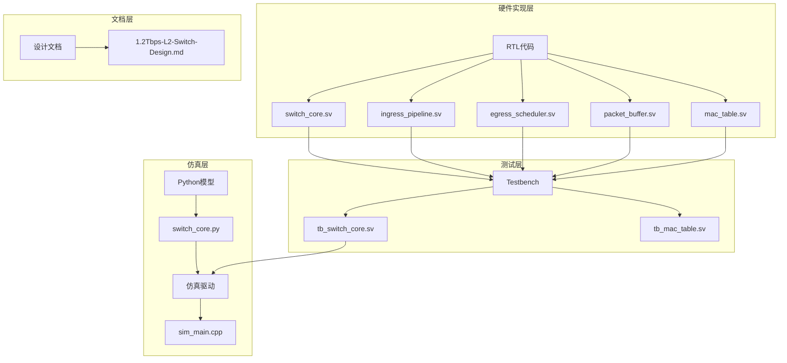
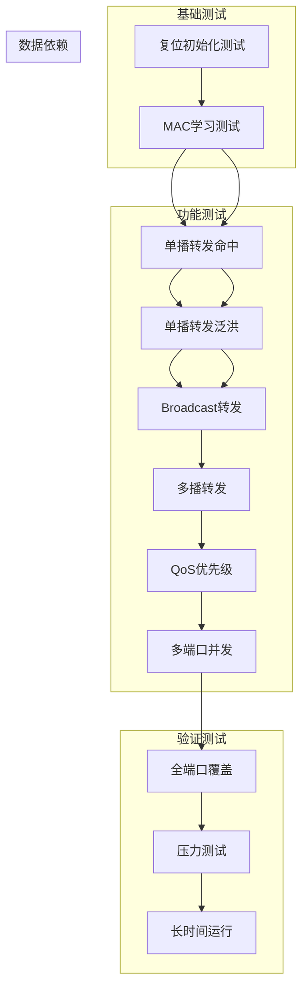

# 测试用例设计

<cite>
**本文档引用的文件**
- [1.2Tbps-L2-Switch-Design.md](file://doc/1.2Tbps-L2-Switch-Design.md)
- [switch_core.py](file://model/switch_core.py)
- [switch_core.sv](file://rtl/switch_core.sv)
- [ingress_pipeline.sv](file://rtl/ingress_pipeline.sv)
- [egress_scheduler.sv](file://rtl/egress_scheduler.sv)
- [packet_buffer.sv](file://rtl/packet_buffer.sv)
- [mac_table.sv](file://rtl/mac_table.sv)
- [tb_switch_core.sv](file://tb/tb_switch_core.sv)
- [tb_mac_table.sv](file://tb/tb_mac_table.sv)
- [sim_main.cpp](file://sim/sim_main.cpp)
</cite>

## 目录
1. [简介](#简介)
2. [项目结构](#项目结构)
3. [核心组件](#核心组件)
4. [架构概览](#架构概览)
5. [详细测试用例设计](#详细测试用例设计)
6. [依赖关系分析](#依赖关系分析)
7. [性能考虑](#性能考虑)
8. [故障排查指南](#故障排查指南)
9. [结论](#结论)

## 简介

本文档为1.2Tbps 48×25G二层网络交换机创建系统化的测试用例设计文档。该交换机采用共享内存交换矩阵架构，支持Store-and-Forward和Cut-Through两种转发模式，具备32K条目MAC表、802.1Q VLAN支持、QoS优先级处理、ACL安全控制等功能。

系统设计目标是在48个25G端口下实现线速转发，总带宽达到1.2Tbps，支持MAC学习、单播转发、广播泛洪、组播复制等核心L2功能。

## 项目结构

该项目采用分层架构设计，包含硬件RTL实现、Python模型仿真、测试平台和仿真驱动程序：



**图表来源**
- [switch_core.sv](file://rtl/switch_core.sv#L1-L454)
- [switch_core.py](file://model/switch_core.py#L1-L1293)
- [tb_switch_core.sv](file://tb/tb_switch_core.sv#L1-L840)

**章节来源**
- [1.2Tbps-L2-Switch-Design.md](file://doc/1.2Tbps-L2-Switch-Design.md#L1-L767)
- [switch_core.sv](file://rtl/switch_core.sv#L1-L454)

## 核心组件

### 硬件架构组件

1. **Switch Core (交换核心)**: 整合所有子模块的顶层模块
2. **Ingress Pipeline (入向流水线)**: 报文解析、ACL/QoS处理、MAC学习触发
3. **MAC Table (MAC表)**: 32K条目4路组相联哈希表
4. **Packet Buffer (报文缓冲区)**: 8MB纯SRAM缓冲，支持Cell链表存储
5. **Egress Scheduler (出向调度器)**: 384队列(48端口×8优先级)，SP+WRR两级调度

### 软件仿真组件

1. **Python模型**: 提供完整的功能仿真和性能分析
2. **Verilator仿真**: C++驱动的RTL仿真环境
3. **Testbench**: SystemVerilog测试平台，包含功能覆盖率收集

**章节来源**
- [switch_core.sv](file://rtl/switch_core.sv#L1-L454)
- [switch_core.py](file://model/switch_core.py#L1-L1293)
- [ingress_pipeline.sv](file://rtl/ingress_pipeline.sv#L1-L319)

## 架构概览

交换机采用共享内存架构，实现线速转发和高效的数据包处理：

```mermaid
graph LR
subgraph "入口处理"
Port[48个25G端口]
Arbiter[端口仲裁器]
Parser[报文解析器]
ACL[ACL引擎]
QoS[QoS分类]
end
subgraph "核心处理"
Lookup[MAC查找引擎]
Buffer[共享缓冲区]
Scheduler[调度器]
end
subgraph "出口处理"
Egress[出向处理]
TX[TX MAC]
end
Port --> Arbiter
Arbiter --> Parser
Parser --> ACL
ACL --> QoS
QoS --> Lookup
Lookup --> Buffer
Buffer --> Scheduler
Scheduler --> Egress
Egress --> TX
subgraph "内存管理"
SRAM[8MB SRAM]
Cell[64K Cells]
Meta[Cell元数据]
end
Buffer <- --> SRAM
Buffer <- --> Cell
Buffer <- --> Meta
```

**图表来源**
- [1.2Tbps-L2-Switch-Design.md](file://doc/1.2Tbps-L2-Switch-Design.md#L27-L145)
- [switch_core.sv](file://rtl/switch_core.sv#L147-L454)

## 详细测试用例设计

### 测试用例一：复位初始化测试

**测试目标**: 验证系统复位后的正确初始化过程，确保所有子模块正常启动

**测试步骤**:
1. 生成500MHz时钟信号
2. Assert复位信号为低电平，持续100个时钟周期
3. 释放复位信号，等待系统稳定
4. 检查Cell分配器初始化完成标志
5. 读取空闲Cell数量，验证大于60000个
6. 验证端口配置初始化状态

**预期结果**:
- cell_init_done信号变为高电平
- 空闲Cell数量≥60000
- 所有端口状态初始化为Forwarding
- VLAN 1包含所有端口

**测试数据生成策略**:
- 使用固定种子的随机数生成器
- 生成48个端口的初始配置数据
- 验证MAC表初始化为空状态

**边界条件测试**:
- 复位时间过短(少于50个时钟周期)
- 复位时间过长(超过1000个时钟周期)
- 复位期间的配置寄存器访问

**异常情况处理**:
- 初始化超时处理
- 端口配置失败恢复
- MAC表初始化异常

**章节来源**
- [tb_switch_core.sv](file://tb/tb_switch_core.sv#L337-L363)
- [switch_core.sv](file://rtl/switch_core.sv#L399-L417)

### 测试用例二：MAC学习测试

**测试目标**: 验证MAC地址学习功能的正确性，包括学习触发、条目存储和更新

**测试步骤**:
1. 从8个不同端口发送广播帧
2. 每个端口发送包含不同SMAC的帧
3. 等待MAC学习完成
4. 读取MAC学习计数器
5. 验证学习计数增加
6. 执行MAC查找验证学习结果

**预期结果**:
- MAC学习计数器从0增加到8
- 每个学习的MAC地址都能正确查找到对应端口
- 同MAC不同VLAN的学习相互独立
- 学习速率限制生效(每端口每秒最多1000次)

**测试数据生成策略**:
- 生成8个不同的SMAC地址
- 使用连续的端口号(0-7)
- VLAN ID统一为1
- PCP优先级从0到7

**边界条件测试**:
- 学习速率限制触发
- 静态MAC条目学习
- 老化机制对学习的影响
- MAC表满载情况下的学习行为

**异常情况处理**:
- 学习队列溢出处理
- 学习风暴防护
- 硬件学习失败恢复

**章节来源**
- [tb_switch_core.sv](file://tb/tb_switch_core.sv#L365-L402)
- [mac_table.sv](file://rtl/mac_table.sv#L154-L248)

### 测试用例三：单播转发测试(已学习命中)

**测试目标**: 验证已学习MAC地址的单播转发路径

**测试步骤**:
1. 先发送广播帧学习目标MAC地址
2. 等待学习完成
3. 读取MAC命中计数器
4. 发送单播帧到已学习的MAC
5. 等待转发完成
6. 读取MAC命中计数器

**预期结果**:
- 单播转发路径被正确执行
- 目标端口接收到数据帧
- MAC命中计数器增加
- 源端口过滤生效

**测试数据生成策略**:
- 使用固定的SMAC作为源地址
- 目的MAC为已学习的地址
- 随机选择目标端口(10)
- VLAN ID为1

**边界条件测试**:
- 目标端口状态为Blocking或Disabled
- VLAN成员关系变化
- 多个相同MAC的不同VLAN实例

**异常情况处理**:
- 目标端口不存在
- VLAN配置错误
- 端口状态异常

**章节来源**
- [tb_switch_core.sv](file://tb/tb_switch_core.sv#L404-L430)
- [switch_core.sv](file://rtl/switch_core.sv#L278-L323)

### 测试用例四：单播转发测试(未学习泛洪)

**测试目标**: 验证未知单播地址的泛洪处理机制

**测试步骤**:
1. 读取MAC未命中计数器
2. 发送单播帧到未知MAC地址
3. 等待转发完成
4. 读取MAC未命中计数器

**预期结果**:
- 未命中计数器增加
- 数据帧被泛洪到VLAN内的所有端口
- 源端口被排除在转发之外
- 组播标志正确设置

**测试数据生成策略**:
- 使用随机的未知MAC地址
- VLAN ID为1
- 源端口为0
- 目的端口为随机选择

**边界条件测试**:
- VLAN内端口数量为0或1
- 大量未知MAC地址的并发处理
- 泛洪风暴防护机制

**异常情况处理**:
- VLAN成员配置错误
- 泛洪过程中端口状态变化
- 内存不足导致的泛洪失败

**章节来源**
- [tb_switch_core.sv](file://tb/tb_switch_core.sv#L432-L454)
- [switch_core.sv](file://rtl/switch_core.sv#L293-L317)

### 测试用例五：广播转发测试

**测试目标**: 验证广播帧的正确转发行为

**测试步骤**:
1. 发送广播帧(DMAC=0xFFFFFFFFFFFF)
2. 等待转发完成
3. 检查所有端口的转发情况

**预期结果**:
- 广播帧被转发到VLAN内的所有端口
- 源端口被排除
- 组播标志正确设置
- 转发延迟符合设计要求

**测试数据生成策略**:
- DMAC固定为全1
- 随机选择源端口
- VLAN ID为1
- 随机负载长度

**边界条件测试**:
- VLAN内端口数量为48(全量转发)
- VLAN内端口数量为1(特殊处理)
- 广播风暴场景

**异常情况处理**:
- VLAN配置异常
- 端口状态异常
- 内存拥塞处理

**章节来源**
- [tb_switch_core.sv](file://tb/tb_switch_core.sv#L456-L469)
- [switch_core.sv](file://rtl/switch_core.sv#L294-L297)

### 测试用例六：多播转发测试

**测试目标**: 验证组播地址的正确处理

**测试步骤**:
1. 发送组播帧(DMAC高位为1)
2. 等待转发完成
3. 检查转发端口集合

**预期结果**:
- 组播报文被正确复制
- 引用计数正确维护
- 最后一个Egress读取后释放Cell
- 组播复制效率优于数据复制

**测试数据生成策略**:
- DMAC高位设置为组播标志
- 使用标准组播地址(如01:00:5E:00:00:01)
- VLAN ID为1
- 随机负载长度

**边界条件测试**:
- 组播组成员数量为0或1
- 组播复制深度(最多7个副本)
- 组播风暴防护

**异常情况处理**:
- 组播组表溢出
- 引用计数异常
- 组播复制失败

**章节来源**
- [tb_switch_core.sv](file://tb/tb_switch_core.sv#L471-L485)
- [switch_core.sv](file://rtl/switch_core.sv#L300-L303)

### 测试用例七：QoS优先级测试

**测试目标**: 验证802.1p优先级的正确处理

**测试步骤**:
1. 发送8个不同优先级(0-7)的帧
2. 每个优先级发送到不同端口
3. 等待转发完成
4. 检查队列调度行为

**预期结果**:
- Q7/Q6队列为严格优先级
- Q5-Q0队列按权重进行WRR调度
- 优先级映射正确
- 队列状态转换正常

**测试数据生成策略**:
- PCP值从0到7依次递增
- 每个优先级发送到不同端口
- VLAN ID为1
- 固定负载长度

**边界条件测试**:
- 优先级边界值(0和7)
- 优先级相同时的调度顺序
- 优先级队列拥塞处理

**异常情况处理**:
- 优先级配置错误
- 队列状态异常
- 调度算法失效

**章节来源**
- [tb_switch_core.sv](file://tb/tb_switch_core.sv#L487-L504)
- [egress_scheduler.sv](file://rtl/egress_scheduler.sv#L55-L70)

### 测试用例八：多端口并发测试

**测试目标**: 验证多端口并发处理能力

**测试步骤**:
1. 同时从4个不同端口发送帧
2. 每个端口发送到不同目标端口
3. 等待所有转发完成
4. 检查转发结果

**预期结果**:
- 并发端口处理正确
- 端口仲裁器正常工作
- 无端口冲突
- 转发延迟符合要求

**测试数据生成策略**:
- 4个端口组(0,12,24,36)
- 每组内部端口ID递增
- 目标端口随机分布
- 负载长度为128字节

**边界条件测试**:
- 最大并发端口数(48)
- 端口仲裁竞争
- 并发端口间的时序关系

**异常情况处理**:
- 端口仲裁死锁
- 并发处理超时
- 端口状态冲突

**章节来源**
- [tb_switch_core.sv](file://tb/tb_switch_core.sv#L506-L525)
- [ingress_pipeline.sv](file://rtl/ingress_pipeline.sv#L52-L126)

### 测试用例九：全端口覆盖测试

**测试目标**: 验证所有48个端口的功能完整性

**测试步骤**:
1. 循环遍历所有48个端口
2. 每个端口发送不同特征的帧
3. 等待转发完成
4. 检查端口覆盖率

**预期结果**:
- 所有端口功能正常
- 端口状态正确
- 转发路径完整
- 端口统计准确

**测试数据生成策略**:
- 端口号从0到47
- 每个端口使用唯一特征
- VLAN ID为端口号+1
- 负载长度递增

**边界条件测试**:
- 端口0和端口47的特殊处理
- 端口状态异常(Disabled/Blocking)
- 端口配置冲突

**异常情况处理**:
- 端口硬件故障
- 端口配置错误
- 端口状态机异常

**章节来源**
- [tb_switch_core.sv](file://tb/tb_switch_core.sv#L618-L635)

### 测试用例十：压力测试

**测试目标**: 验证系统在高负载下的稳定性

**测试步骤**:
1. 连续发送500个不同特征的帧
2. 随机分布在48个端口上
3. 随机VLAN和优先级
4. 等待处理完成
5. 检查统计计数

**预期结果**:
- 系统保持稳定运行
- 无数据丢失
- 统计计数准确
- 内存使用合理

**测试数据生成策略**:
- 固定包数: 500
- 端口分布: 轮询模式
- VLAN范围: 1-10
- 优先级: 随机分布
- 负载长度: 64-1343字节

**边界条件测试**:
- 最大数据包大小(16KB)
- 最小数据包大小(64字节)
- 最高VLAN ID(4095)
- 最高优先级(7)

**异常情况处理**:
- 内存不足处理
- 队列拥塞
- 性能下降监控

**章节来源**
- [tb_switch_core.sv](file://tb/tb_switch_core.sv#L577-L616)

### 测试用例十一：长时间运行测试

**测试目标**: 验证系统的长期稳定性

**测试步骤**:
1. 连续运行10000个时钟周期
2. 期间持续发送随机帧
3. 检查系统状态
4. 验证统计计数

**预期结果**:
- 系统无崩溃
- 统计计数正确
- 内存泄漏检测
- 性能稳定

**测试数据生成策略**:
- 固定时长: 10000周期
- 随机发送模式
- 随机端口分布
- 随机负载大小

**边界条件测试**:
- 系统长时间运行稳定性
- 内存使用趋势分析
- 性能退化检测

**异常情况处理**:
- 系统死锁检测
- 内存泄漏监控
- 性能异常报警

**章节来源**
- [sim_main.cpp](file://sim/sim_main.cpp#L353-L366)

## 依赖关系分析

测试用例之间存在复杂的依赖关系和执行顺序：



**图表来源**
- [tb_switch_core.sv](file://tb/tb_switch_core.sv#L655-L667)

**执行顺序建议**:
1. 复位初始化测试 → MAC学习测试 → 单播转发测试
2. 广播/多播测试 → QoS测试 → 并发测试
3. 全端口覆盖测试 → 压力测试 → 长时间运行测试

**章节来源**
- [tb_switch_core.sv](file://tb/tb_switch_core.sv#L638-L683)

## 性能考虑

### 硬件性能指标

1. **转发延迟**: Store-and-Forward模式<2μs，Cut-Through模式<500ns
2. **MAC查表速率**: 500Mlookup/s，2倍线速裕量
3. **缓冲深度**: 8MB，支持53μs线速突发
4. **调度粒度**: 128B Cell，64K Cells

### 仿真性能优化

1. **覆盖率收集**: 使用Verilator兼容的覆盖率语法
2. **统计计数**: 实时监控关键性能指标
3. **内存管理**: 优化Python模型的内存使用
4. **并行测试**: 支持多线程并发测试执行

### 性能测试策略

1. **基准测试**: 验证硬件设计指标
2. **压力测试**: 检测系统极限性能
3. **稳定性测试**: 长时间运行性能监控
4. **对比测试**: 与理论值对比分析

## 故障排查指南

### 常见问题及解决方案

1. **初始化失败**
   - 检查复位时序
   - 验证配置寄存器写入
   - 确认时钟频率

2. **MAC学习异常**
   - 检查学习速率限制
   - 验证SMAC有效性
   - 确认端口状态

3. **转发路径错误**
   - 检查VLAN配置
   - 验证MAC表内容
   - 确认端口成员关系

4. **队列拥塞**
   - 检查WRED配置
   - 监控队列深度
   - 调整调度权重

### 调试工具和技巧

1. **波形分析**: 使用VCD文件进行时序分析
2. **统计监控**: 实时查看硬件计数器
3. **覆盖率分析**: 识别未覆盖的功能分支
4. **日志记录**: 详细的测试执行日志

**章节来源**
- [tb_switch_core.sv](file://tb/tb_switch_core.sv#L157-L220)
- [sim_main.cpp](file://sim/sim_main.cpp#L371-L398)

## 结论

本文档为1.2Tbps交换机创建了完整的测试用例设计，涵盖了从基础功能到高级特性的全面测试方案。通过系统化的测试设计，可以有效验证交换机的各项功能指标，确保在高带宽、多端口环境下实现稳定可靠的网络转发。

测试用例设计充分考虑了硬件架构特点和软件仿真环境，提供了详细的测试步骤、预期结果和异常处理方案。建议在实际测试中结合覆盖率分析和性能监控，持续改进测试用例的有效性和完整性。