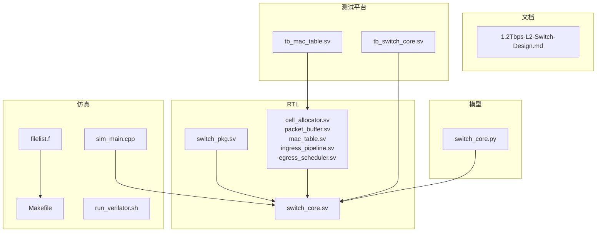
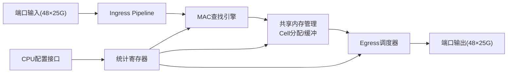
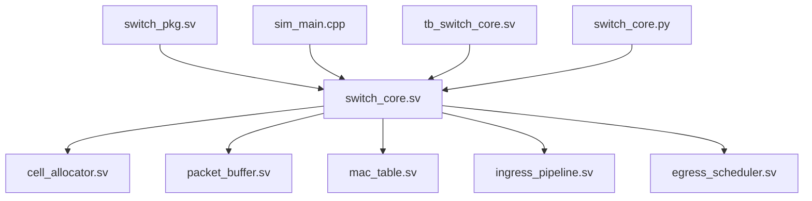

# 快速开始

<cite>
**本文引用的文件**
- [doc/1.2Tbps-L2-Switch-Design.md](file://doc/1.2Tbps-L2-Switch-Design.md)
- [sim/Makefile](file://sim/Makefile)
- [sim/run_verilator.sh](file://sim/run_verilator.sh)
- [sim/sim_main.cpp](file://sim/sim_main.cpp)
- [sim/filelist.f](file://sim/filelist.f)
- [rtl/switch_core.sv](file://rtl/switch_core.sv)
- [rtl/switch_pkg.sv](file://rtl/switch_pkg.sv)
- [rtl/mac_table.sv](file://rtl/mac_table.sv)
- [tb/tb_switch_core.sv](file://tb/tb_switch_core.sv)
- [tb/tb_mac_table.sv](file://tb/tb_mac_table.sv)
- [model/switch_core.py](file://model/switch_core.py)
</cite>

## 目录
1. [简介](#简介)
2. [项目结构](#项目结构)
3. [核心组件](#核心组件)
4. [架构总览](#架构总览)
5. [详细组件分析](#详细组件分析)
6. [依赖关系分析](#依赖关系分析)
7. [性能考虑](#性能考虑)
8. [故障排查指南](#故障排查指南)
9. [结论](#结论)
10. [附录](#附录)

## 简介
本项目是一个面向1.2Tbps交换机的L2核心参考实现，包含SystemVerilog RTL、C++仿真驱动、覆盖率与波形支持、以及Python模型参考。本文档提供“快速开始”指南，帮助你在最短时间内完成开发环境搭建、编译与运行仿真、执行基础功能测试，并理解项目结构与关键流程。

## 项目结构
项目采用“RTL/仿真/测试/文档/模型”分层组织：
- doc：设计文档与技术说明
- rtl：SystemVerilog RTL模块与包定义
- sim：仿真构建与运行脚本、C++驱动、文件清单
- tb：SystemVerilog测试平台
- model：Python参考模型（便于理解与对比）

图表来源
- [rtl/switch_pkg.sv](file://rtl/switch_pkg.sv#L1-L219)
- [rtl/switch_core.sv](file://rtl/switch_core.sv#L1-L454)
- [sim/Makefile](file://sim/Makefile#L1-L186)
- [sim/filelist.f](file://sim/filelist.f#L1-L18)
- [sim/sim_main.cpp](file://sim/sim_main.cpp#L1-L509)
- [tb/tb_switch_core.sv](file://tb/tb_switch_core.sv#L1-L840)
- [tb/tb_mac_table.sv](file://tb/tb_mac_table.sv#L1-L281)
- [model/switch_core.py](file://model/switch_core.py#L1-L800)

章节来源
- [doc/1.2Tbps-L2-Switch-Design.md](file://doc/1.2Tbps-L2-Switch-Design.md#L1-L767)
- [sim/Makefile](file://sim/Makefile#L1-L186)
- [sim/filelist.f](file://sim/filelist.f#L1-L18)

## 核心组件
- 顶层模块 switch_core：整合Ingress、MAC表、内存管理、Egress调度等子模块，提供48×25G端口接口与CPU配置接口。
- 包定义 switch_pkg：集中定义参数、枚举、数据结构与接口信号，供RTL模块复用。
- 仿真驱动 sim_main.cpp：Verilator C++主程序，负责时钟、复位、配置寄存器读写、报文注入、覆盖率与波形输出。
- 文件清单 filelist.f：统一列出RTL、包与测试平台文件，供编译器/仿真器使用。
- 测试平台 tb_switch_core.sv：基于SystemVerilog的完整测试平台，包含覆盖率采样、断言与统计打印。
- Python模型 switch_core.py：高层Python模型，便于理解数据结构与流程，便于对比验证。

章节来源
- [rtl/switch_core.sv](file://rtl/switch_core.sv#L1-L454)
- [rtl/switch_pkg.sv](file://rtl/switch_pkg.sv#L1-L219)
- [sim/sim_main.cpp](file://sim/sim_main.cpp#L1-L509)
- [sim/filelist.f](file://sim/filelist.f#L1-L18)
- [tb/tb_switch_core.sv](file://tb/tb_switch_core.sv#L1-L840)
- [model/switch_core.py](file://model/switch_core.py#L1-L800)

## 架构总览
系统采用“共享内存交换矩阵”架构，核心路径为：端口输入 → Ingress解析/ACL/QoS → MAC查表 → 内存管理（Cell分配/缓冲）→ Egress调度 → 端口输出。配置接口通过CPU寄存器访问统计计数器与内部状态。

图表来源
- [rtl/switch_core.sv](file://rtl/switch_core.sv#L1-L454)
- [rtl/mac_table.sv](file://rtl/mac_table.sv#L1-L200)
- [doc/1.2Tbps-L2-Switch-Design.md](file://doc/1.2Tbps-L2-Switch-Design.md#L1-L767)

## 详细组件分析

### 顶层模块 switch_core
- 提供48个端口的收发接口（简化为单一位宽），以及CPU配置接口与中断输出。
- 内部集成Cell分配器、报文缓冲区、MAC表、Ingress管道、Egress调度器与老化定时器。
- 通过配置寄存器读取统计计数器，如MAC查询、命中、学习、入队、出队、丢弃与空闲Cell数。

章节来源
- [rtl/switch_core.sv](file://rtl/switch_core.sv#L1-L454)

### 包定义 switch_pkg
- 定义系统参数（端口数、Cell大小、MAC表容量、队列数等）、枚举类型（转发模式、队列状态、VLAN动作、ACL动作、端口状态）。
- 定义数据结构（Cell元数据、报文描述符、队列描述符、MAC表条目、解析头、Ingress请求、查找结果、端口配置）。
- 定义接口信号（Cell分配/释放、内存读写等）。

章节来源
- [rtl/switch_pkg.sv](file://rtl/switch_pkg.sv#L1-L219)

### 仿真驱动 sim_main.cpp
- Verilator C++主程序，提供命令行参数解析（--trace/--quick）、时钟/复位、配置寄存器读写、报文注入（起始/数据/结束）、覆盖率写入与波形输出。
- 内置多套测试用例（复位初始化、MAC学习、单播转发、广播泛洪、并发端口、QoS优先级、全端口覆盖、压力测试、长时间运行）。

章节来源
- [sim/sim_main.cpp](file://sim/sim_main.cpp#L1-L509)

### 文件清单 filelist.f
- 统一列出包文件、RTL模块、测试平台文件，供编译器/仿真器使用；确保包先于模块编译。

章节来源
- [sim/filelist.f](file://sim/filelist.f#L1-L18)

### 测试平台 tb_switch_core.sv
- SystemVerilog测试平台，包含端口协议断言、覆盖率采样、报文生成Task、配置读写Task、等待初始化Task。
- 提供完整的测试用例集合（复位/初始化、MAC学习、单播命中/未命中、广播/多播、QoS、并发端口、VLAN、不同长度、压力、全端口覆盖）。
- 打印最终统计与覆盖率摘要。

章节来源
- [tb/tb_switch_core.sv](file://tb/tb_switch_core.sv#L1-L840)

### Python模型 switch_core.py
- 提供与RTL等价的数据结构与流程（Cell分配器、报文缓冲区、MAC表、VLAN表、ACL引擎、Ingress管道等）。
- 便于理解Cell链表、描述符、队列状态、MAC学习与老化等机制。

章节来源
- [model/switch_core.py](file://model/switch_core.py#L1-L800)

### MAC表模块 mac_table.sv
- 实现32K条目、4路组相联的Hash查找与MAC学习，包含流水线Stage（Hash/读取/比较）与学习状态机。
- 提供静态条目配置接口与老化触发信号，输出统计计数器。

章节来源
- [rtl/mac_table.sv](file://rtl/mac_table.sv#L1-L200)

## 依赖关系分析
- 顶层模块 switch_core 依赖包 switch_pkg 定义的参数与数据结构。
- 顶层模块内部实例化 cell_allocator、packet_buffer、mac_table、ingress_pipeline、egress_scheduler 等子模块。
- 仿真驱动 sim_main.cpp 依赖 Verilator C++ API 与顶层模块生成的C++包装类。
- 测试平台 tb_switch_core.sv 直接实例化 switch_core 并注入测试向量。
- Python模型 switch_core.py 与RTL模块在概念上等价，便于交叉验证。

图表来源
- [rtl/switch_pkg.sv](file://rtl/switch_pkg.sv#L1-L219)
- [rtl/switch_core.sv](file://rtl/switch_core.sv#L1-L454)
- [sim/sim_main.cpp](file://sim/sim_main.cpp#L1-L509)
- [tb/tb_switch_core.sv](file://tb/tb_switch_core.sv#L1-L840)
- [model/switch_core.py](file://model/switch_core.py#L1-L800)

章节来源
- [rtl/switch_core.sv](file://rtl/switch_core.sv#L1-L454)
- [rtl/switch_pkg.sv](file://rtl/switch_pkg.sv#L1-L219)

## 性能考虑
- 时钟频率：设计目标500MHz，仿真时钟也设置为500MHz。
- 带宽与Cell：核心总线位宽4096bit，Cell大小128B，满足1.2Tbps线速与裕量。
- 内存组织：纯片内SRAM（8MB），16 Banks并行访问，Cell元数据与描述符独立存储，降低访问冲突。
- 调度与拥塞：Egress采用SP/WRR/DWRR混合调度，支持WRED与整形，保障公平性与低延迟。

章节来源
- [doc/1.2Tbps-L2-Switch-Design.md](file://doc/1.2Tbps-L2-Switch-Design.md#L1-L767)

## 故障排查指南
- 编译失败（Verilator找不到文件）
  - 检查 filelist.f 中的相对路径与包含目录是否正确。
  - 确保包文件（switch_pkg.sv）在RTL模块之前编译。
  章节来源
  - [sim/filelist.f](file://sim/filelist.f#L1-L18)

- 仿真运行无输出或卡住
  - 确认复位信号已释放且等待初始化完成。
  - 检查端口ready信号是否拉高，避免阻塞。
  章节来源
  - [sim/sim_main.cpp](file://sim/sim_main.cpp#L1-L509)
  - [tb/tb_switch_core.sv](file://tb/tb_switch_core.sv#L1-L840)

- 波形未生成
  - 使用 --trace 参数启动仿真，或在Makefile中使用 trace 目标。
  章节来源
  - [sim/sim_main.cpp](file://sim/sim_main.cpp#L1-L509)
  - [sim/Makefile](file://sim/Makefile#L1-L186)

- 覆盖率未生成
  - 使用 build-cov 或 --coverage 参数编译仿真器，并在运行后生成覆盖率报告。
  章节来源
  - [sim/Makefile](file://sim/Makefile#L1-L186)
  - [sim/run_verilator.sh](file://sim/run_verilator.sh#L1-L131)

- 端口未被覆盖
  - 检查测试用例是否覆盖所有端口，或在测试平台覆盖率采样逻辑中确认端口标志位。
  章节来源
  - [tb/tb_switch_core.sv](file://tb/tb_switch_core.sv#L1-L840)

## 结论
通过本指南，你可以在本地快速完成开发环境准备、编译与运行仿真、执行基础功能测试，并理解1.2Tbps交换机核心的设计与实现要点。建议在掌握基础流程后，逐步尝试覆盖率收集、波形分析与压力测试，以深入验证系统行为。

## 附录

### 开发环境与工具链
- SystemVerilog仿真器：Verilator（支持C++仿真与覆盖率）
- C++编译器：g++/clang++（与Verilator配套）
- 可视化工具：GTKWave（查看VCD波形）
- Python（可选）：用于理解Python模型与对比验证

章节来源
- [sim/Makefile](file://sim/Makefile#L1-L186)
- [sim/run_verilator.sh](file://sim/run_verilator.sh#L1-L131)

### 编译与运行步骤（Makefile）
- 常用目标
  - build：编译仿真器（默认）
  - run：运行仿真
  - run-quick：快速测试
  - trace：启用波形并运行
  - wave：打开GTKWave查看波形
  - coverage：覆盖率仿真
  - report：生成覆盖率报告
  - clean：清理构建产物
- 常用命令
  - make：编译并运行
  - make cov-all：覆盖率全流程
  - make trace && make wave：生成并查看波形

章节来源
- [sim/Makefile](file://sim/Makefile#L1-L186)

### 编译与运行步骤（run_verilator.sh）
- 支持的命令行参数
  - --trace：启用VCD波形
  - --coverage：启用覆盖率
  - --quick：快速测试
  - --clean：清理构建目录
  - --help：显示帮助
- 功能流程
  - 解析参数 → 构建Verilator选项 → 编译 → 运行 → 可选生成覆盖率报告

章节来源
- [sim/run_verilator.sh](file://sim/run_verilator.sh#L1-L131)

### 基本使用示例（功能测试）
- 运行默认测试集
  - make run
- 运行快速测试
  - make run-quick
- 启用波形并查看
  - make trace && make wave
- 覆盖率收集与报告
  - make coverage
  - make report
  - make cov-all

章节来源
- [sim/Makefile](file://sim/Makefile#L1-L186)
- [sim/sim_main.cpp](file://sim/sim_main.cpp#L1-L509)

### 目录结构与文件作用
- doc/1.2Tbps-L2-Switch-Design.md：设计文档与架构说明
- rtl/switch_pkg.sv：参数、枚举、数据结构与接口定义
- rtl/switch_core.sv：顶层模块，整合各子模块
- rtl/*.sv：子模块（cell_allocator、packet_buffer、mac_table、ingress_pipeline、egress_scheduler）
- sim/Makefile：仿真构建与运行目标
- sim/filelist.f：编译文件清单
- sim/sim_main.cpp：Verilator C++仿真驱动
- sim/run_verilator.sh：便捷构建与运行脚本
- tb/tb_switch_core.sv：SystemVerilog测试平台
- tb/tb_mac_table.sv：MAC表独立测试平台
- model/switch_core.py：Python参考模型

章节来源
- [doc/1.2Tbps-L2-Switch-Design.md](file://doc/1.2Tbps-L2-Switch-Design.md#L1-L767)
- [rtl/switch_pkg.sv](file://rtl/switch_pkg.sv#L1-L219)
- [rtl/switch_core.sv](file://rtl/switch_core.sv#L1-L454)
- [sim/Makefile](file://sim/Makefile#L1-L186)
- [sim/filelist.f](file://sim/filelist.f#L1-L18)
- [sim/sim_main.cpp](file://sim/sim_main.cpp#L1-L509)
- [sim/run_verilator.sh](file://sim/run_verilator.sh#L1-L131)
- [tb/tb_switch_core.sv](file://tb/tb_switch_core.sv#L1-L840)
- [tb/tb_mac_table.sv](file://tb/tb_mac_table.sv#L1-L281)
- [model/switch_core.py](file://model/switch_core.py#L1-L800)