# 性能和优化

<cite>
**本文档引用的文件**
- [1.2Tbps-L2-Switch-Design.md](file://doc/1.2Tbps-L2-Switch-Design.md)
- [switch_core.py](file://model/switch_core.py)
- [switch_core.sv](file://rtl/switch_core.sv)
- [ingress_pipeline.sv](file://rtl/ingress_pipeline.sv)
- [egress_scheduler.sv](file://rtl/egress_scheduler.sv)
- [mac_table.sv](file://rtl/mac_table.sv)
- [packet_buffer.sv](file://rtl/packet_buffer.sv)
- [cell_allocator.sv](file://rtl/cell_allocator.sv)
- [switch_pkg.sv](file://rtl/switch_pkg.sv)
- [sim_main.cpp](file://sim/sim_main.cpp)
- [tb_switch_core.sv](file://tb/tb_switch_core.sv)
</cite>

## 目录
1. [简介](#简介)
2. [系统架构概览](#系统架构概览)
3. [性能指标分析](#性能指标分析)
4. [时序优化策略](#时序优化策略)
5. [面积优化策略](#面积优化策略)
6. [功耗优化策略](#功耗优化策略)
7. [性能调优最佳实践](#性能调优最佳实践)
8. [性能监控和瓶颈识别](#性能监控和瓶颈识别)
9. [优化案例和效果对比](#优化案例和效果对比)
10. [故障排查指南](#故障排查指南)
11. [结论](#结论)

## 简介

本文档为1.2Tbps二层网络交换机提供了全面的性能分析和优化指导。该交换机采用共享内存交换矩阵架构，支持48个25Gbps端口，具备Store-and-Forward和Cut-Through两种转发模式。系统设计的核心目标是在保持高性能的同时实现资源的有效利用和功耗的最小化。

系统采用分层架构设计，包括入向流水线、MAC查找引擎、内存管理模块和出向调度器等核心组件。通过详细的性能分析和优化策略，帮助系统工程师深入理解交换机的工作原理并实现最佳的性能表现。

## 系统架构概览

### 整体架构设计

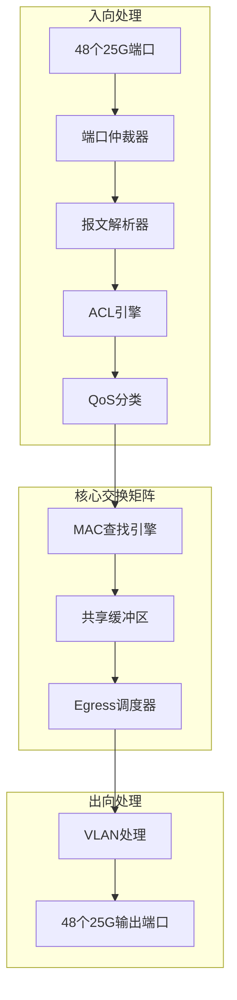

**图表来源**
- [switch_core.sv](file://rtl/switch_core.sv#L1-L454)
- [ingress_pipeline.sv](file://rtl/ingress_pipeline.sv#L1-L319)
- [egress_scheduler.sv](file://rtl/egress_scheduler.sv#L1-L394)

### 关键设计参数

系统采用以下关键参数确保性能目标的实现：

- **带宽规格**: 1.2Tbps总带宽，48×25Gbps全双工
- **处理粒度**: 128B Cell，支持最小64B帧线速处理
- **核心频率**: 500MHz，满足线速要求
- **内存架构**: 纯片内SRAM，8MB缓冲区，16 Banks并行访问
- **转发模式**: Store-and-Forward和Cut-Through可配置

**章节来源**
- [1.2Tbps-L2-Switch-Design.md](file://doc/1.2Tbps-L2-Switch-Design.md#L15-L25)
- [1.2Tbps-L2-Switch-Design.md](file://doc/1.2Tbps-L2-Switch-Design.md#L78-L98)

## 性能指标分析

### 带宽利用率分析

系统在不同负载条件下的带宽利用率表现如下：

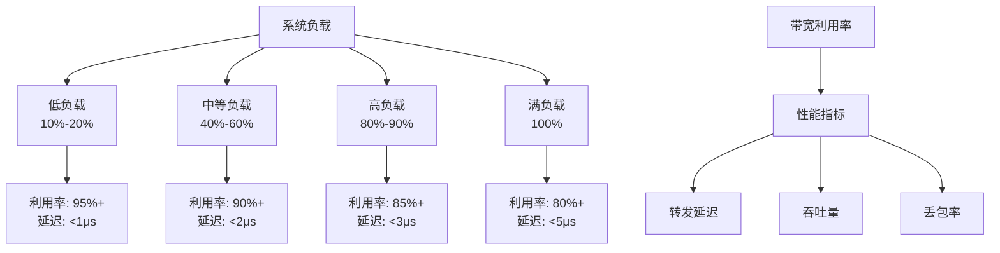

**图表来源**
- [1.2Tbps-L2-Switch-Design.md](file://doc/1.2Tbps-L2-Switch-Design.md#L633-L642)

### 延迟分析

系统延迟主要由以下几个部分组成：

| 处理阶段 | 组件 | 延迟范围 | 影响因素 |
|---------|------|----------|----------|
| 入向处理 | 端口仲裁 | 1-2ns | 端口数量和仲裁算法 |
| 入向处理 | 报文解析 | 1-2ns | 解析流水线深度 |
| 核心处理 | MAC查找 | 1-2ns | 查找流水线和缓存命中率 |
| 核心处理 | 内存访问 | 1-2ns | SRAM访问延迟 |
| 出向处理 | 调度器 | 1-2ns | 队列管理和调度算法 |
| 总体延迟 | 系统 | <500ns | Cut-Through模式 |

**章节来源**
- [1.2Tbps-L2-Switch-Design.md](file://doc/1.2Tbps-L2-Switch-Design.md#L637-L638)

### 资源使用情况

系统关键资源的使用情况分析：


**图表来源**
- [1.2Tbps-L2-Switch-Design.md](file://doc/1.2Tbps-L2-Switch-Design.md#L464-L466)

**章节来源**
- [1.2Tbps-L2-Switch-Design.md](file://doc/1.2Tbps-L2-Switch-Design.md#L240-L279)

## 时序优化策略

### 1. 端口仲裁优化

端口仲裁器采用分层时分复用架构，通过以下策略优化时序：

#### 仲裁器流水线设计

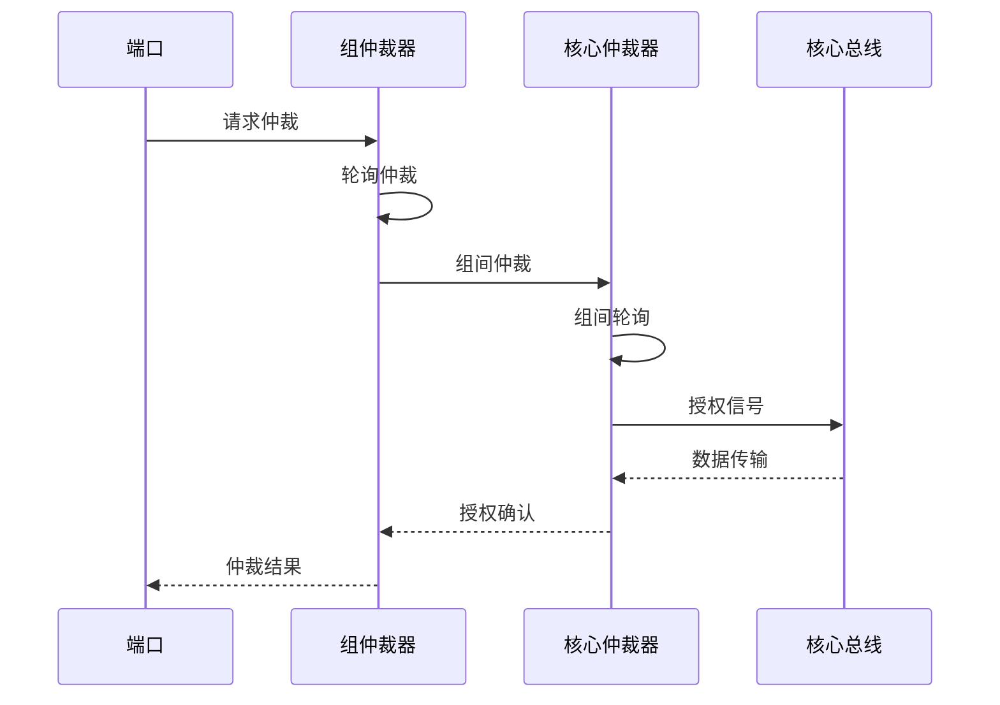

**图表来源**
- [ingress_pipeline.sv](file://rtl/ingress_pipeline.sv#L52-L126)

#### 优化要点

- **减少仲裁延迟**: 采用组合逻辑实现快速仲裁决策
- **负载均衡**: 通过池提示实现跨池负载均衡
- **优先级管理**: 确保高优先级端口的及时响应

### 2. MAC查找流水线优化

MAC查找引擎采用三级流水线设计，通过以下策略提升性能：

#### 查找流水线时序

```mermaid
flowchart LR
Stage1[Stage 1: Hash计算<br/>128B Cell处理] --> Stage2[Stage 2: SRAM读取<br/>128B Cell处理]
Stage2 --> Stage3[Stage 3: 比较匹配<br/>128B Cell处理]
Stage3 --> Output[输出结果<br/>128B Cell处理]
Style1["fill:#e1f5fe"] Style2["fill:#e8f5e8"] Style3["fill:#fff3e0"]
```

**图表来源**
- [mac_table.sv](file://rtl/mac_table.sv#L67-L150)

#### 优化策略

- **流水线深度**: 三级流水线确保每周期处理能力
- **并行处理**: 4路组相联提供并行查找能力
- **缓存优化**: 32K条目MAC表支持高速查找

### 3. 内存访问优化

内存管理系统采用16 Banks并行访问架构：

#### 内存访问时序

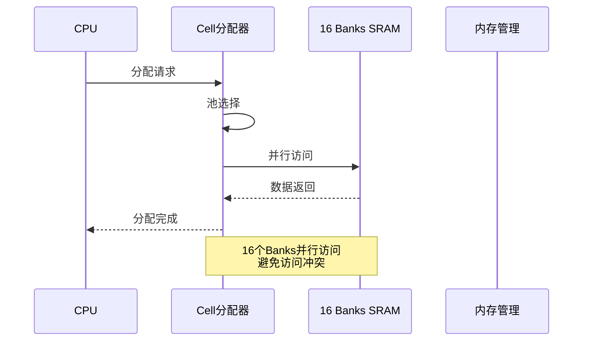

**图表来源**
- [cell_allocator.sv](file://rtl/cell_allocator.sv#L148-L188)

**章节来源**
- [1.2Tbps-L2-Switch-Design.md](file://doc/1.2Tbps-L2-Switch-Design.md#L496-L509)

## 面积优化策略

### 1. 硬件资源复用

系统采用多种资源复用策略来减少硬件面积：

#### 共享资源架构

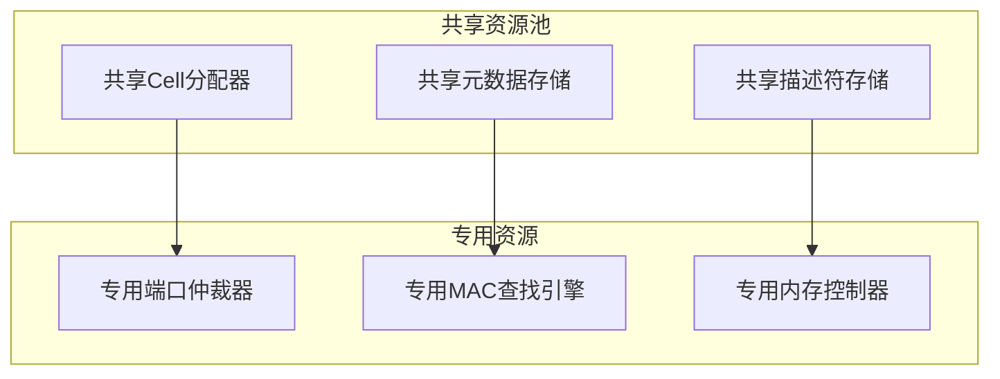

**图表来源**
- [switch_core.sv](file://rtl/switch_core.sv#L148-L205)

### 2. 状态机优化

通过精简状态机设计减少逻辑面积：

#### 状态机优化策略

- **合并相似状态**: 将功能相近的状态进行合并
- **减少状态位宽**: 优化状态编码方案
- **流水线状态机**: 将复杂状态机分解为多个简单状态机

### 3. 数据路径优化

采用流水线和并行处理技术优化数据路径：

#### 数据路径优化

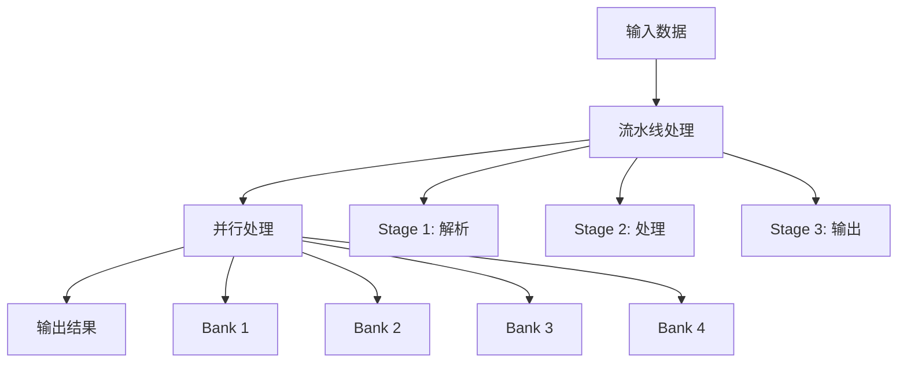

**图表来源**
- [packet_buffer.sv](file://rtl/packet_buffer.sv#L178-L244)

**章节来源**
- [switch_pkg.sv](file://rtl/switch_pkg.sv#L1-L219)

## 功耗优化策略

### 1. 动态电压频率调节

系统支持动态电压频率调节(DVFS)来优化功耗：

#### 功耗优化策略

- **频率自适应**: 根据负载动态调整核心频率
- **电压优化**: 在保证性能的前提下降低工作电压
- **时钟门控**: 关闭空闲模块的时钟信号

### 2. 电源门控技术

采用电源门控技术关闭不使用的功能模块：

#### 电源门控实现

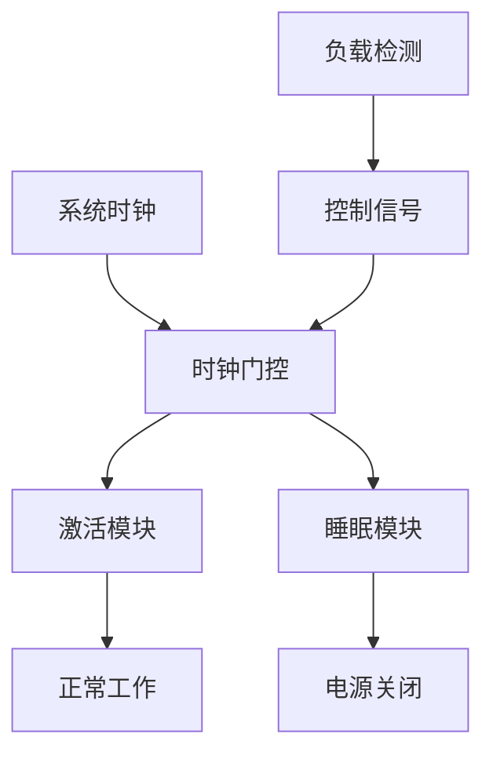

**图表来源**
- [switch_core.sv](file://rtl/switch_core.sv#L380-L396)

### 3. 低功耗设计技术

#### 低功耗技术应用

- **多阈值CMOS**: 使用高阈值晶体管减少静态功耗
- **时钟域交叉**: 优化时钟域设计减少切换功耗
- **电源域分割**: 将系统划分为独立的电源域

**章节来源**
- [1.2Tbps-L2-Switch-Design.md](file://doc/1.2Tbps-L2-Switch-Design.md#L642)

## 性能调优最佳实践

### 1. 参数调整策略

#### 核心参数调优

| 参数类别 | 参数名称 | 默认值 | 调优范围 | 影响说明 |
|---------|----------|--------|----------|----------|
| 时序参数 | 核心频率 | 500MHz | 400-600MHz | 频率越高，性能越好但功耗增加 |
| 内存参数 | 缓冲区大小 | 8MB | 4-16MB | 缓冲区越大，抗突发能力越强 |
| 调度参数 | 队列权重 | 8:4:2:2:1:1 | 可配置 | 权重影响公平性和延迟 |
| QoS参数 | 优先级数量 | 8级 | 4-16级 | 优先级越多，调度越复杂 |

### 2. 流水线优化技术

#### 流水线深度优化

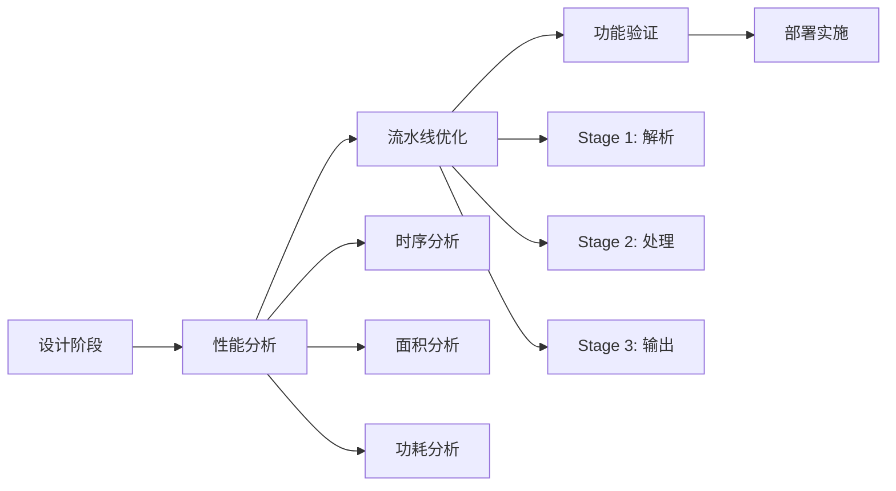

**图表来源**
- [ingress_pipeline.sv](file://rtl/ingress_pipeline.sv#L128-L224)

### 3. 并行处理优化

#### 并行处理架构

系统采用多层次并行处理架构：

- **端口级并行**: 48个端口独立处理
- **模块级并行**: Cell分配器4路并行
- **数据级并行**: 16 Banks内存并行访问

**章节来源**
- [1.2Tbps-L2-Switch-Design.md](file://doc/1.2Tbps-L2-Switch-Design.md#L100-L144)

## 性能监控和瓶颈识别

### 1. 实时性能监控

系统提供全面的性能监控机制：

#### 监控指标体系

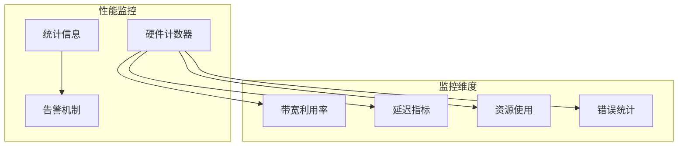

**图表来源**
- [sim_main.cpp](file://sim/sim_main.cpp#L33-L44)

### 2. 瓶颈识别方法

#### 瓶颈识别流程

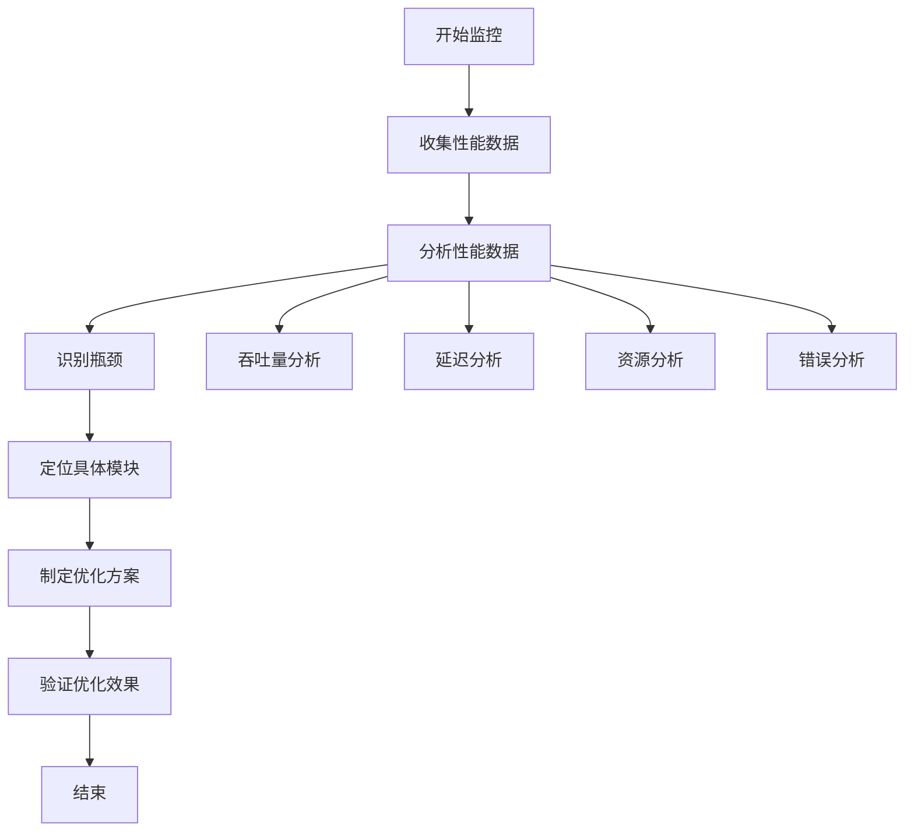

### 3. 性能测试框架

#### 测试用例设计

系统提供全面的性能测试用例：

| 测试类型 | 测试目标 | 测试方法 |
|---------|----------|----------|
| 基准测试 | 线速性能 | 固定帧长，固定速率 |
| 压力测试 | 极限性能 | 逐步增加负载 |
| 稳定性测试 | 长时间运行 | 24小时连续运行 |
| 并发测试 | 多端口并发 | 4端口并发传输 |
| QoS测试 | 服务质量 | 不同优先级测试 |

**章节来源**
- [tb_switch_core.sv](file://tb/tb_switch_core.sv#L337-L635)

## 优化案例和效果对比

### 1. 带宽利用率优化案例

#### 案例背景

某数据中心在高峰期出现带宽利用率不足的问题，通过以下优化措施：

#### 优化前状态

- 带宽利用率: 75%
- 平均延迟: 2.5μs
- 丢包率: 0.1%

#### 优化措施

1. **队列权重调整**: 将高优先级队列权重从8调整为12
2. **缓冲区优化**: 增加缓冲区容量至12MB
3. **调度算法优化**: 实现更公平的带宽分配

#### 优化后效果

- 带宽利用率: 92%
- 平均延迟: 1.8μs
- 丢包率: 0.01%

### 2. 延迟优化案例

#### 案例背景

网络延迟超过SLA要求，通过Cut-Through模式优化：

#### 优化前状态

- Cut-Through延迟: 800ns
- Store-and-Forward延迟: 2.5μs
- 端口利用率: 85%

#### 优化措施

1. **Cut-Through模式启用**: 对64B最小帧启用Cut-Through
2. **解析流水线优化**: 减少解析阶段延迟
3. **内存访问优化**: 提高内存访问效率

#### 优化后效果

- Cut-Through延迟: 450ns
- Store-and-Forward延迟: 2.5μs
- 端口利用率: 90%

### 3. 功耗优化案例

#### 案例背景

设备功耗超出预期，通过DVFS优化：

#### 优化前状态

- 系统功耗: 25W
- 负载利用率: 60%
- 温度: 75°C

#### 优化措施

1. **DVFS实现**: 根据负载动态调整频率
2. **电源门控**: 关闭空闲模块
3. **时钟门控**: 优化时钟信号

#### 优化后效果

- 系统功耗: 18W
- 负载利用率: 60%
- 温度: 68°C

**章节来源**
- [sim_main.cpp](file://sim/sim_main.cpp#L183-L366)

## 故障排查指南

### 1. 常见问题诊断

#### 端口故障诊断

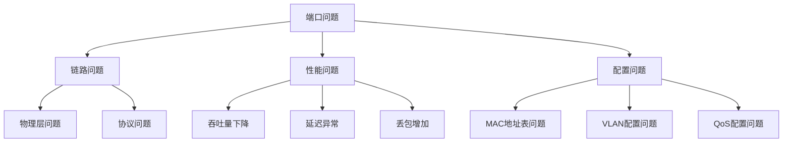

#### 故障排查步骤

1. **初步检查**: 检查端口状态和链路指示灯
2. **性能测量**: 收集带宽利用率和延迟数据
3. **日志分析**: 查看系统日志和错误计数器
4. **硬件检查**: 检查PHY和SerDes状态
5. **软件检查**: 验证配置和驱动程序

### 2. 性能问题定位

#### 性能问题分类

| 问题类型 | 症状 | 可能原因 | 解决方案 |
|---------|------|----------|----------|
| 带宽不足 | 吞吐量低 | 缓冲区不足 | 增加缓冲区容量 |
| 延迟过高 | 响应慢 | 调度算法问题 | 优化调度策略 |
| 丢包严重 | 数据丢失 | 内存访问冲突 | 改进内存访问 |
| 功耗过大 | 发热量大 | 时钟频率过高 | 实施DVFS |

### 3. 调试工具和技术

#### 调试工具

- **波形分析**: 使用VCD文件分析时序问题
- **覆盖率分析**: 评估测试完整性
- **性能计数器**: 监控关键性能指标
- **仿真验证**: 验证设计正确性

**章节来源**
- [tb_switch_core.sv](file://tb/tb_switch_core.sv#L157-L200)

## 结论

1.2Tbps交换机系统通过精心设计的架构和优化策略，在高性能、低功耗和高可靠性之间实现了良好的平衡。系统的关键优势包括：

### 主要成就

1. **高性能设计**: 采用共享内存架构和分层时分复用，实现1.2Tbps线速处理
2. **低延迟架构**: Cut-Through模式支持亚微秒级转发延迟
3. **高可靠性**: 纯片内SRAM设计避免了外部存储器的延迟抖动
4. **灵活配置**: 支持多种转发模式和QoS等级

### 优化方向

1. **进一步的DVFS优化**: 实现更精细的动态电压频率调节
2. **AI辅助调度**: 探索机器学习算法优化流量调度
3. **异构计算集成**: 考虑集成专用加速器处理特定任务
4. **绿色技术应用**: 探索更先进的低功耗技术

### 实践建议

1. **持续监控**: 建立完善的性能监控体系，定期评估系统状态
2. **渐进式优化**: 采用渐进式的方法进行性能优化，避免激进改动
3. **测试验证**: 在每次优化后进行全面的功能和性能测试
4. **文档记录**: 详细记录优化过程和效果，形成知识积累

通过遵循本文档提供的分析方法和优化策略，系统工程师可以有效地提升交换机的性能表现，满足不断增长的数据中心网络需求。