# 硬件接口规范

<cite>
**本文档引用的文件**
- [switch_pkg.sv](file://rtl/switch_pkg.sv)
- [switch_core.sv](file://rtl/switch_core.sv)
- [cell_allocator.sv](file://rtl/cell_allocator.sv)
- [packet_buffer.sv](file://rtl/packet_buffer.sv)
- [ingress_pipeline.sv](file://rtl/ingress_pipeline.sv)
- [egress_scheduler.sv](file://rtl/egress_scheduler.sv)
- [mac_table.sv](file://rtl/mac_table.sv)
- [switch_core.py](file://model/switch_core.py)
- [1.2Tbps-L2-Switch-Design.md](file://doc/1.2Tbps-L2-Switch-Design.md)
- [tb_switch_core.sv](file://tb/tb_switch_core.sv)
- [run_verilator.sh](file://sim/run_verilator.sh)
</cite>

## 目录
1. [简介](#简介)
2. [项目结构](#项目结构)
3. [核心组件](#核心组件)
4. [架构总览](#架构总览)
5. [详细组件分析](#详细组件分析)
6. [依赖关系分析](#依赖关系分析)
7. [性能考虑](#性能考虑)
8. [故障排查指南](#故障排查指南)
9. [结论](#结论)
10. [附录](#附录)

## 简介
本技术规范面向1.2Tbps交换机硬件工程师，系统性描述48×25G SFP28端口接口、配置寄存器接口、中断信号定义、Cell分配与释放接口、内存读写接口协议，以及电气特性、时序约束与功耗估算。文档基于RTL源码与设计文档，提供代码级映射与可视化图表，确保工程实现的一致性与可验证性。

## 项目结构
该仓库采用模块化RTL设计，围绕“共享内存交换矩阵”架构组织，核心模块包括：入口流水线、MAC查表引擎、内存管理（Cell分配/释放/缓冲）、出向调度器、中断与统计等。Python模型提供行为级验证与性能分析参考。

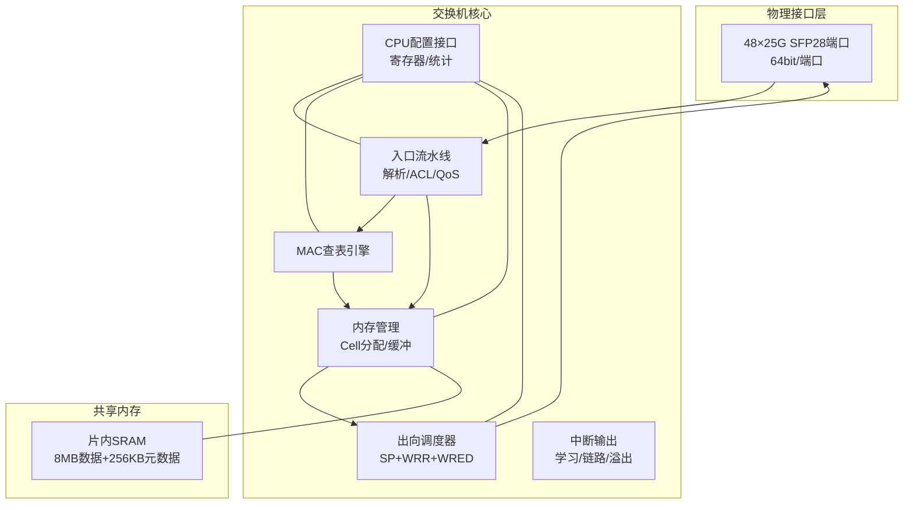

**图表来源**
- [switch_core.sv](file://rtl/switch_core.sv#L7-L454)
- [ingress_pipeline.sv](file://rtl/ingress_pipeline.sv#L7-L319)
- [egress_scheduler.sv](file://rtl/egress_scheduler.sv#L7-L394)
- [mac_table.sv](file://rtl/mac_table.sv#L7-L342)
- [cell_allocator.sv](file://rtl/cell_allocator.sv#L7-L247)
- [packet_buffer.sv](file://rtl/packet_buffer.sv#L7-L427)

**章节来源**
- [switch_core.sv](file://rtl/switch_core.sv#L7-L454)
- [1.2Tbps-L2-Switch-Design.md](file://doc/1.2Tbps-L2-Switch-Design.md#L13-L50)

## 核心组件
- 端口接口：48个25G SFP28端口，采用64bit并行数据总线，支持SOP/EOP标识与时钟域握手。
- Cell管理：统一的128B Cell作为最小处理单元，64K Cells构成8MB缓冲池，16个Bank并行访问。
- 队列调度：每端口8优先级队列（SP+WRR），全局WRED与丢弃策略。
- 配置寄存器：CPU通过地址/数据总线访问统计与配置空间。
- 中断系统：MAC学习完成、链路状态变化、缓冲区溢出等事件输出。

**章节来源**
- [switch_pkg.sv](file://rtl/switch_pkg.sv#L12-L44)
- [switch_core.sv](file://rtl/switch_core.sv#L46-L64)
- [1.2Tbps-L2-Switch-Design.md](file://doc/1.2Tbps-L2-Switch-Design.md#L646-L694)

## 架构总览
整体采用共享内存架构，端口经入口流水线解析后进入共享缓冲与调度系统，最终由出向调度器输出到对应端口。Cell分配器负责空闲Cell的分配与回收，元数据存储Cell链表与引用计数。

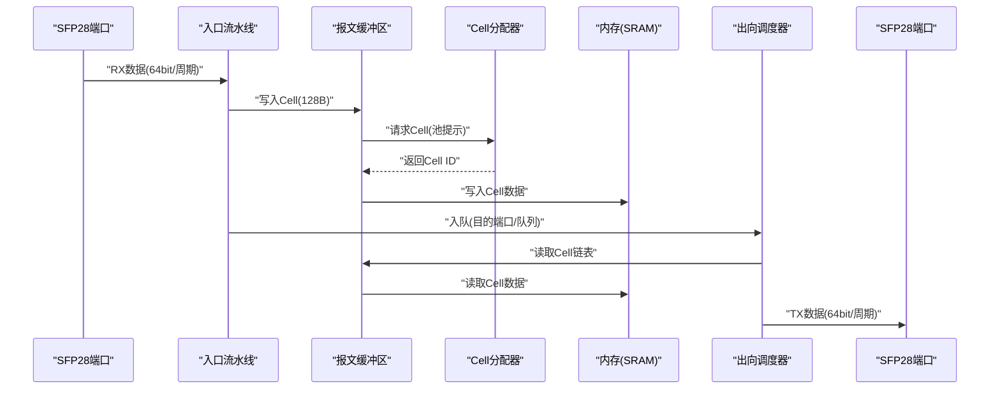

**图表来源**
- [ingress_pipeline.sv](file://rtl/ingress_pipeline.sv#L24-L33)
- [packet_buffer.sv](file://rtl/packet_buffer.sv#L45-L53)
- [cell_allocator.sv](file://rtl/cell_allocator.sv#L13-L19)
- [egress_scheduler.sv](file://rtl/egress_scheduler.sv#L13-L26)

## 详细组件分析

### 端口接口定义（48×25G SFP28）
- 数据宽度：64bit/端口，线速25Gbps。
- 时钟域：端口侧与核心侧分离，通过握手信号协调。
- 控制信号：
  - 输入：port_rx_valid、port_rx_sop、port_rx_eop、port_rx_data[63:0]、port_rx_empty[2:0]
  - 输出：port_rx_ready
  - 输出：port_tx_valid、port_tx_sop、port_tx_eop、port_tx_data[63:0]、port_tx_empty[2:0]
  - 输入：port_tx_ready
- 时序约束：
  - SOP/EOP必须与valid同时出现，且EOP出现在最后一个数据周期。
  - 有效字节由port_rx_empty指示，确保对齐与裁剪。
- 电气特性：
  - SFP28接口遵循25G以太网标准，差分信号，阻抗100Ω±10%。
  - 时钟频率：500MHz（核心），端口侧更高（约390.625MHz）以满足64bit/周期。
- 功耗估算：
  - 端口PHY功耗约1.2W/端口；核心逻辑约12-20W（不含PHY/SerDes与内存）。

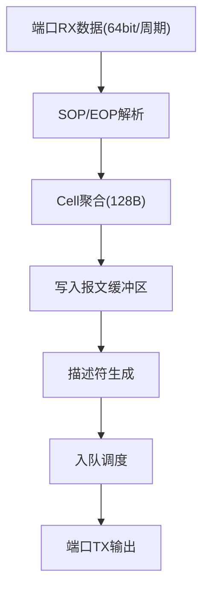

**图表来源**
- [ingress_pipeline.sv](file://rtl/ingress_pipeline.sv#L14-L33)
- [packet_buffer.sv](file://rtl/packet_buffer.sv#L13-L31)

**章节来源**
- [switch_pkg.sv](file://rtl/switch_pkg.sv#L12-L18)
- [ingress_pipeline.sv](file://rtl/ingress_pipeline.sv#L14-L33)
- [1.2Tbps-L2-Switch-Design.md](file://doc/1.2Tbps-L2-Switch-Design.md#L100-L145)

### 配置寄存器接口
- 地址总线：32bit，数据总线：32bit。
- 写使能：cfg_wr_en；地址：cfg_addr；写数据：cfg_wr_data；读数据：cfg_rd_data。
- 统计寄存器基址示例：统计MAC查找/命中/未命中/学习次数、出向入队/出队/丢弃次数、空闲Cell数量等。
- 访问协议：同步读写，写入时序需满足setup/hold；读取在写入后两周期稳定。

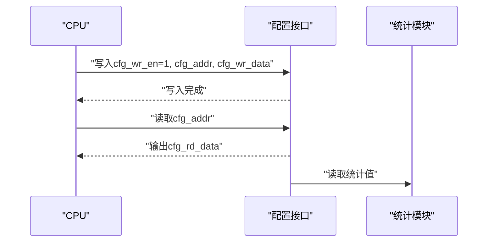

**图表来源**
- [switch_core.sv](file://rtl/switch_core.sv#L29-L33)
- [switch_core.sv](file://rtl/switch_core.sv#L420-L444)

**章节来源**
- [switch_core.sv](file://rtl/switch_core.sv#L29-L33)
- [switch_core.sv](file://rtl/switch_core.sv#L420-L444)
- [1.2Tbps-L2-Switch-Design.md](file://doc/1.2Tbps-L2-Switch-Design.md#L683-L693)

### 中断信号定义
- irq_learn：MAC学习完成且成功时触发。
- irq_link：链路状态变化（需连接PHY）。
- irq_overflow：缓冲区接近空闲（nearly_empty）时触发。
- 触发条件与处理流程：
  - MAC学习：入口流水线触发learn_req，查表引擎完成学习后产生irq_learn。
  - 缓冲区溢出：Cell分配器统计空闲Cell数量，低于阈值时置位nearly_empty，映射为irq_overflow。
  - 链路中断：需外部PHY驱动，当前RTL中为占位信号。

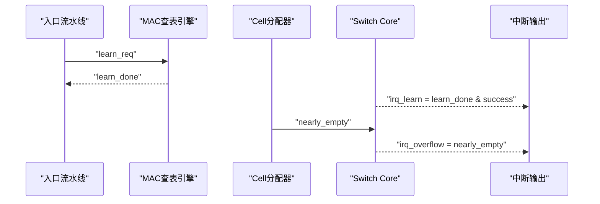

**图表来源**
- [switch_core.sv](file://rtl/switch_core.sv#L35-L38)
- [switch_core.sv](file://rtl/switch_core.sv#L449-L451)
- [mac_table.sv](file://rtl/mac_table.sv#L21-L27)

**章节来源**
- [switch_core.sv](file://rtl/switch_core.sv#L35-L38)
- [switch_core.sv](file://rtl/switch_core.sv#L449-L451)

### Cell分配与释放接口
- 请求/响应协议：
  - 分配：cell_alloc_req_t(req, pool_hint) → cell_alloc_resp_t(ack, success, cell_id)
  - 释放：cell_free_req_t(req, cell_id) → cell_free_ack
- 握手时序：
  - 分配：alloc_req[p].req → alloc_resp[p].ack；成功时返回cell_id。
  - 释放：free_req[p].req → free_ack[p]；引用计数非零时仅递减，为零时真正归还。
- 错误处理：
  - 池空：返回success=0；需重试或降级策略。
  - 归还校验：仅允许对应池归还（依据cell_id低2位）。
- 池管理：
  - 4路并行空闲池，均分64K Cells；低水位/高水位门限触发nearly_empty/nearly_full。

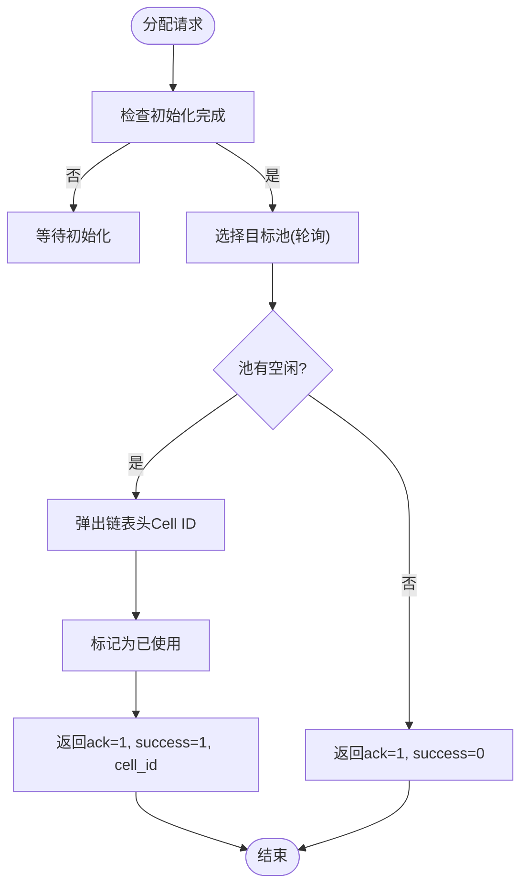

**图表来源**
- [cell_allocator.sv](file://rtl/cell_allocator.sv#L13-L19)
- [cell_allocator.sv](file://rtl/cell_allocator.sv#L163-L186)

**章节来源**
- [switch_pkg.sv](file://rtl/switch_pkg.sv#L187-L197)
- [cell_allocator.sv](file://rtl/cell_allocator.sv#L13-L34)
- [cell_allocator.sv](file://rtl/cell_allocator.sv#L163-L186)

### 内存读写接口协议
- 接口定义：
  - 写：mem_req_t(req, wr_en, cell_id, wr_data[CELL_SIZE_BITS-1:0])
  - 读：mem_resp_t(ack, rd_data[CELL_SIZE_BITS-1:0])
- 地址对齐与突发：
  - 128B对齐；Cell ID决定Bank选择（CELL_ID[3:0]）。
  - 支持16个Bank并行读写，总带宽4Tbps，满足1.2Tbps线速裕量。
- 仲裁机制：
  - Egress读取优先级最高，保证不欠速；
  - Ingress写入次之；
  - 组播指针复制最低。
- 元数据访问：
  - cell_meta_t包含next_ptr、ref_cnt、eop、valid等字段；
  - 元数据SRAM独立，支持读写并行。

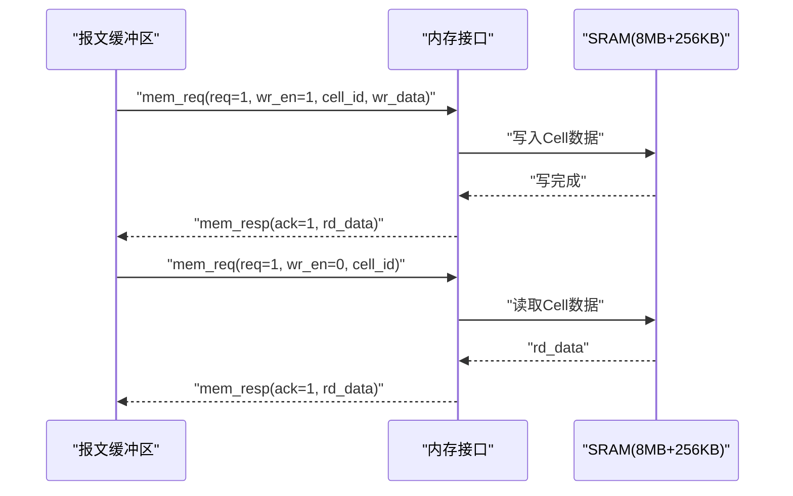

**图表来源**
- [packet_buffer.sv](file://rtl/packet_buffer.sv#L51-L53)
- [switch_pkg.sv](file://rtl/switch_pkg.sv#L205-L216)

**章节来源**
- [switch_pkg.sv](file://rtl/switch_pkg.sv#L16-L21)
- [switch_pkg.sv](file://rtl/switch_pkg.sv#L205-L216)
- [packet_buffer.sv](file://rtl/packet_buffer.sv#L51-L53)
- [1.2Tbps-L2-Switch-Design.md](file://doc/1.2Tbps-L2-Switch-Design.md#L493-L509)

### 入口流水线与解析
- 组内轮询仲裁：将48端口分为6组，组内RR仲裁，组间RR选择。
- 解析阶段：L2头提取、VLAN标签解析、PCP/DEI处理、报文长度统计。
- Cell聚合：将端口侧64bit数据聚合为128B Cell，写入缓冲区。
- MAC学习触发：仅在Forwarding状态且SMAC非组播时触发。

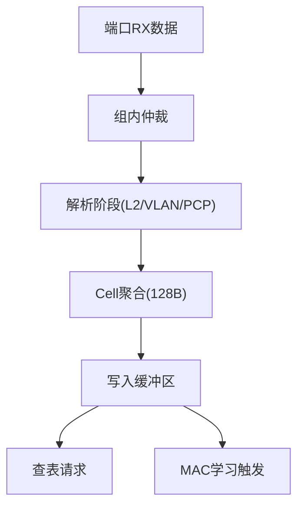

**图表来源**
- [ingress_pipeline.sv](file://rtl/ingress_pipeline.sv#L52-L99)
- [ingress_pipeline.sv](file://rtl/ingress_pipeline.sv#L128-L224)

**章节来源**
- [ingress_pipeline.sv](file://rtl/ingress_pipeline.sv#L52-L99)
- [ingress_pipeline.sv](file://rtl/ingress_pipeline.sv#L128-L224)

### 出向调度与拥塞控制
- 队列结构：每端口8队列（SP+WRR），全局WRED。
- 调度算法：Strict Priority(Q7/Q6)，WRR(Q5~Q0)权重[8,4,2,2,1,1]。
- 拥塞控制：WRED门限与丢弃概率，尾部丢弃阈值。
- 统计计数：入队/出队/丢弃计数器，查询接口返回队列深度与状态。

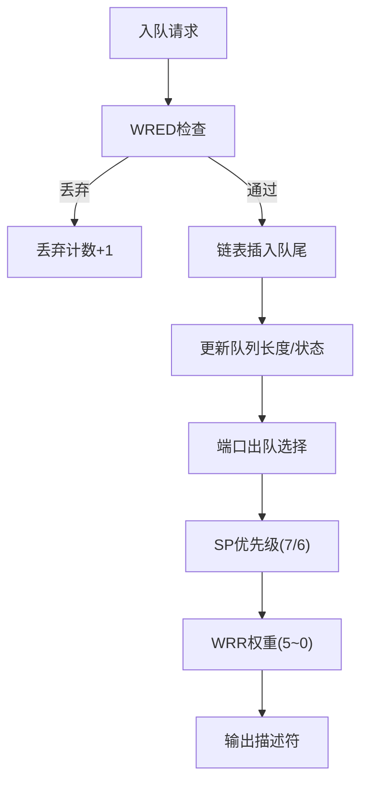

**图表来源**
- [egress_scheduler.sv](file://rtl/egress_scheduler.sv#L87-L185)
- [egress_scheduler.sv](file://rtl/egress_scheduler.sv#L188-L293)

**章节来源**
- [egress_scheduler.sv](file://rtl/egress_scheduler.sv#L55-L70)
- [egress_scheduler.sv](file://rtl/egress_scheduler.sv#L87-L185)
- [egress_scheduler.sv](file://rtl/egress_scheduler.sv#L188-L293)

### MAC查表引擎
- 表结构：32K条目，4路组相联，Hash索引+SRAM存储。
- 查表流水线：Hash计算→SRAM读取→比较匹配，1周期延迟。
- 学习机制：查找空闲/匹配项，更新年龄计数；老化扫描逐项递减。
- 配置接口：静态条目写入（通过配置端口）。

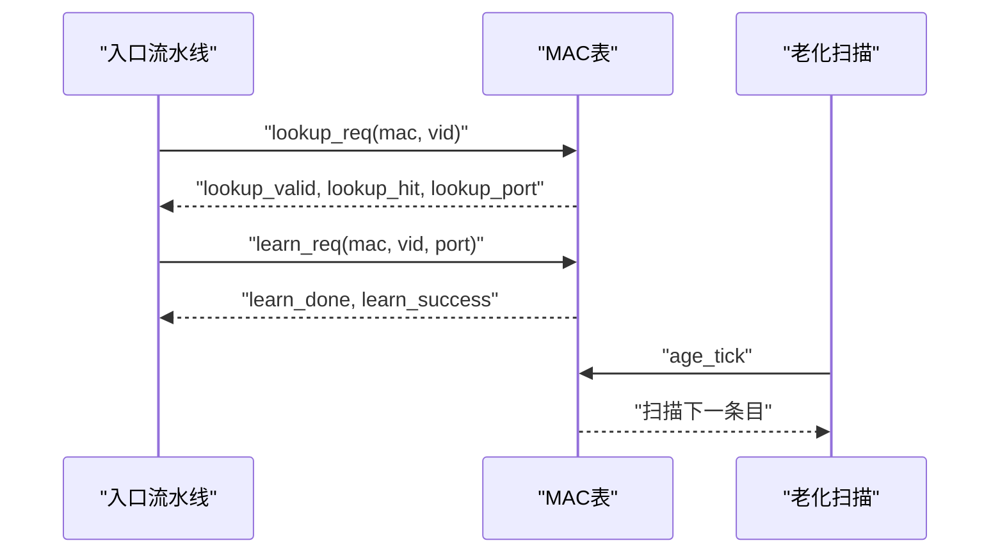

**图表来源**
- [mac_table.sv](file://rtl/mac_table.sv#L13-L27)
- [mac_table.sv](file://rtl/mac_table.sv#L154-L248)
- [mac_table.sv](file://rtl/mac_table.sv#L260-L302)

**章节来源**
- [mac_table.sv](file://rtl/mac_table.sv#L47-L49)
- [mac_table.sv](file://rtl/mac_table.sv#L154-L248)
- [mac_table.sv](file://rtl/mac_table.sv#L260-L302)

## 依赖关系分析
- 模块耦合：
  - 入口流水线与报文缓冲区通过Cell分配器耦合；
  - MAC查表引擎与入口流水线通过查表请求耦合；
  - 出向调度器与报文缓冲区通过描述符链表耦合；
  - Cell分配器与内存管理通过元数据与Cell数据耦合。
- 外部依赖：
  - SFP28 PHY/PCS/MAC层（端口侧）；
  - CPU配置接口（寄存器/统计）；
  - 外部PHY中断（链路状态）。

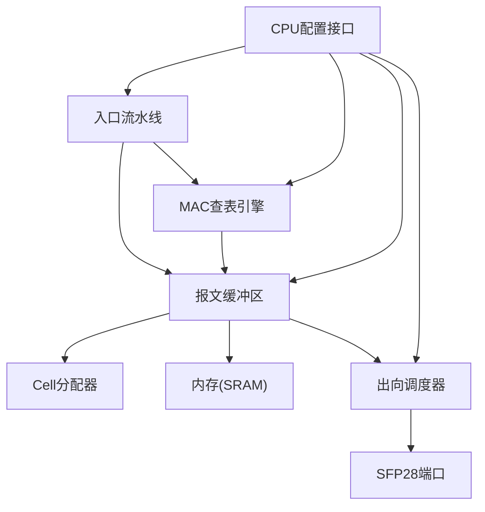

**图表来源**
- [switch_core.sv](file://rtl/switch_core.sv#L147-L235)
- [switch_core.sv](file://rtl/switch_core.sv#L332-L359)

**章节来源**
- [switch_core.sv](file://rtl/switch_core.sv#L147-L235)
- [switch_core.sv](file://rtl/switch_core.sv#L332-L359)

## 性能考虑
- 线速计算：25Gbps/端口，128B Cell，目标500MHz核心频率，理论每周期2.34个Cell，4096bit核心总线可容纳4个Cell。
- 缓冲容量：8MB SRAM，线速缓冲53μs，4:1拥塞212μs突发吸收。
- 内存带宽：16 Banks×512bit×500MHz=4Tbps，远超1.2Tbps需求。
- 调度粒度：128B Cell，适配最小帧；队列深度Cell指针链表动态共享。
- 功耗：核心逻辑12-20W（不含PHY/SerDes与内存），内存功耗显著降低（纯SRAM）。

**章节来源**
- [1.2Tbps-L2-Switch-Design.md](file://doc/1.2Tbps-L2-Switch-Design.md#L77-L145)
- [1.2Tbps-L2-Switch-Design.md](file://doc/1.2Tbps-L2-Switch-Design.md#L246-L279)
- [1.2Tbps-L2-Switch-Design.md](file://doc/1.2Tbps-L2-Switch-Design.md#L493-L509)
- [1.2Tbps-L2-Switch-Design.md](file://doc/1.2Tbps-L2-Switch-Design.md#L633-L642)

## 故障排查指南
- 端口握手异常：
  - 检查SOP/EOP与valid时序一致性；确认port_rx_ready拉高时机。
- Cell分配失败：
  - 检查nearly_empty状态；确认pool_hint与目标池一致性；观察free_count统计。
- 内存访问错误：
  - 核对cell_id与bank选择；确认wr_en与req时序；检查mem_resp ack。
- 调度拥塞：
  - 检查WRED门限与丢弃计数；核对队列深度与状态；调整WRR权重。
- 配置读写：
  - 确认cfg_wr_en与地址对齐；读取在写入后两周期稳定。

**章节来源**
- [tb_switch_core.sv](file://tb/tb_switch_core.sv#L158-L199)
- [tb_switch_core.sv](file://tb/tb_switch_core.sv#L298-L315)
- [cell_allocator.sv](file://rtl/cell_allocator.sv#L236-L244)
- [egress_scheduler.sv](file://rtl/egress_scheduler.sv#L125-L151)

## 结论
本规范基于RTL与设计文档，完整描述了1.2Tbps交换机的端口接口、Cell管理、内存访问、调度与中断机制。通过严格的时序约束、并行化设计与WRED/AQM策略，系统在保证线速转发的同时具备良好的拥塞控制与可维护性。建议在FPGA原型验证中重点覆盖端口握手、Cell分配/释放、内存读写与调度路径，结合覆盖率工具确保功能正确性。

## 附录
- 仿真运行脚本：支持波形与覆盖率收集，便于回归验证。
- Python模型：提供行为级验证与性能基准，便于算法迭代与参数调优。

**章节来源**
- [run_verilator.sh](file://sim/run_verilator.sh#L62-L105)
- [switch_core.py](file://model/switch_core.py#L1-L1293)