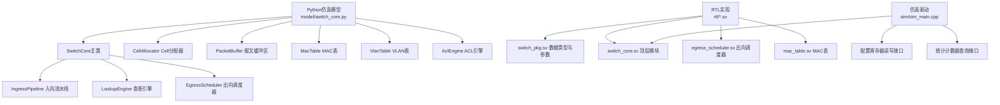
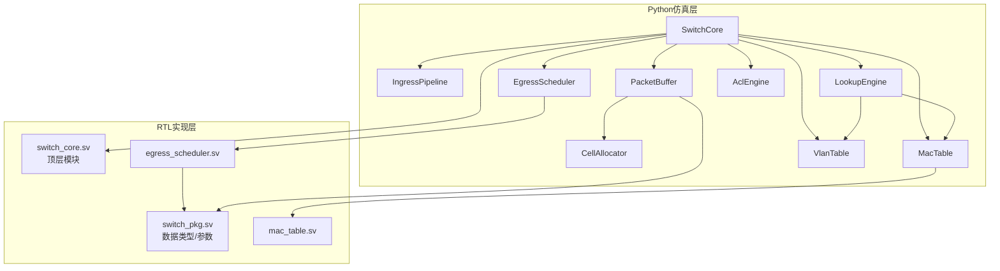
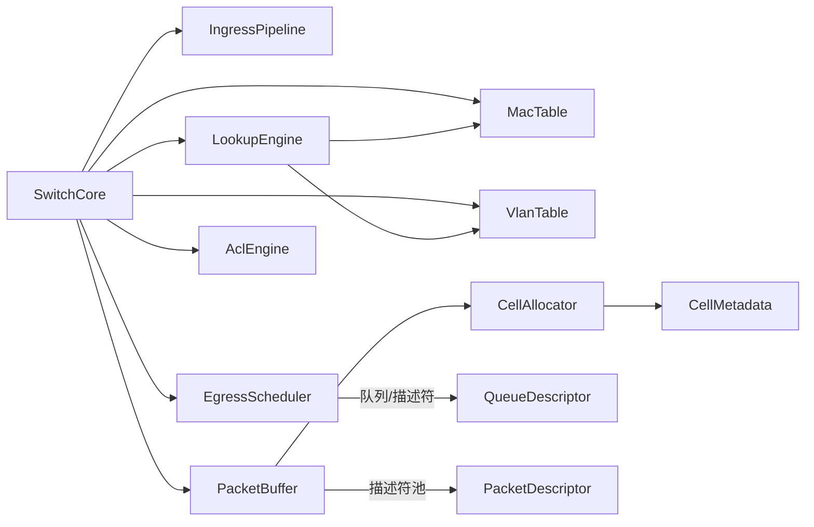

# 软件接口规范

<cite>
**本文引用的文件**
- [switch_core.py](file://model/switch_core.py)
- [1.2Tbps-L2-Switch-Design.md](file://doc/1.2Tbps-L2-Switch-Design.md)
- [switch_pkg.sv](file://rtl/switch_pkg.sv)
- [switch_core.sv](file://rtl/switch_core.sv)
- [egress_scheduler.sv](file://rtl/egress_scheduler.sv)
- [mac_table.sv](file://rtl/mac_table.sv)
- [sim_main.cpp](file://sim/sim_main.cpp)
</cite>

## 目录
1. [简介](#简介)
2. [项目结构](#项目结构)
3. [核心组件](#核心组件)
4. [架构总览](#架构总览)
5. [详细组件分析](#详细组件分析)
6. [依赖关系分析](#依赖关系分析)
7. [性能考量](#性能考量)
8. [故障排查指南](#故障排查指南)
9. [结论](#结论)
10. [附录](#附录)

## 简介
本规范面向1.2Tbps交换机软件接口，聚焦Python仿真模型的API设计与使用，涵盖：
- SwitchCore类的主要方法、参数与返回值
- 数据结构接口（PacketDescriptor、CellMeta、QueueDescriptor、MacEntry等）
- 配置接口（端口、VLAN、ACL、QoS）
- 统计接口（端口、MAC、缓冲区、错误计数）
- 事件回调机制（异步事件通知、状态变更、错误处理）
- 完整的API使用示例与最佳实践

本规范既可用于软件工程师的功能开发，也可用于系统集成工程师的对接与验证。

## 项目结构
该仓库包含三层内容：
- model/switch_core.py：Python仿真核心，包含SwitchCore及各子模块的Python实现
- rtl/：SystemVerilog RTL实现，用于硬件仿真与验证
- doc/：设计文档，包含系统架构、接口定义与寄存器映射
- sim/：Verilator仿真驱动，提供配置读写、统计查询与测试用例

图表来源
- [switch_core.py](file://model/switch_core.py#L1062-L1188)
- [switch_pkg.sv](file://rtl/switch_pkg.sv#L7-L219)
- [switch_core.sv](file://rtl/switch_core.sv#L7-L454)
- [egress_scheduler.sv](file://rtl/egress_scheduler.sv#L7-L394)
- [mac_table.sv](file://rtl/mac_table.sv#L7-L342)
- [sim_main.cpp](file://sim/sim_main.cpp#L105-L119)

章节来源
- [switch_core.py](file://model/switch_core.py#L1062-L1188)
- [1.2Tbps-L2-Switch-Design.md](file://doc/1.2Tbps-L2-Switch-Design.md#L646-L693)

## 核心组件
本节概述Python仿真模型的核心组件及其职责：
- SwitchCore：交换机核心控制器，整合CellAllocator、PacketBuffer、MacTable、VlanTable、AclEngine、IngressPipeline、LookupEngine、EgressScheduler
- IngressPipeline：入向处理流水线，负责报文解析、ACL/QoS、MAC学习触发与报文入缓冲
- LookupEngine：基于MAC表与VLAN表执行转发决策（单播/组播/广播/泛洪）
- EgressScheduler：出向调度器，实现SP+WRR两级调度与WRED拥塞控制
- CellAllocator：Cell分配器，管理64K个128B Cells与元数据
- PacketBuffer：报文缓冲区，将报文切分为Cell链表并维护描述符
- MacTable：32K条目、4路组相联的MAC表，支持学习与老化
- VlanTable：VLAN成员端口与untagged端口管理
- AclEngine：基于掩码匹配的ACL规则引擎

章节来源
- [switch_core.py](file://model/switch_core.py#L1062-L1188)
- [switch_core.py](file://model/switch_core.py#L863-L990)
- [switch_core.py](file://model/switch_core.py#L227-L350)
- [switch_core.py](file://model/switch_core.py#L351-L481)
- [switch_core.py](file://model/switch_core.py#L487-L641)
- [switch_core.py](file://model/switch_core.py#L647-L701)
- [switch_core.py](file://model/switch_core.py#L707-L775)

## 架构总览
下图展示Python仿真模型与RTL实现之间的对应关系与数据通路。

图表来源
- [switch_core.py](file://model/switch_core.py#L1062-L1188)
- [switch_pkg.sv](file://rtl/switch_pkg.sv#L7-L219)
- [switch_core.sv](file://rtl/switch_core.sv#L7-L454)
- [egress_scheduler.sv](file://rtl/egress_scheduler.sv#L7-L394)
- [mac_table.sv](file://rtl/mac_table.sv#L7-L342)

## 详细组件分析

### SwitchCore 类 API
SwitchCore是Python仿真模型的主控制器，提供以下主要接口：

- 构造函数
  - 初始化CellAllocator、PacketBuffer、MacTable、VlanTable、AclEngine、IngressPipeline、LookupEngine、EgressScheduler
  - 获取端口配置引用以便外部配置
  - 初始化统计计数器

- 接收与转发
  - receive_packet(packet: Packet, src_port: int) -> bool
    - 入向处理：ACL/QoS、MAC学习、报文入缓冲
    - 查表：单播/组播/广播/泛洪
    - 组播/广播：对Cell链表增加引用计数
    - 入队：按队列优先级入队
    - 返回是否转发成功
  - transmit_packet(port: int) -> Optional[Tuple[bytes,int]]
    - 出向调度：按端口出队
    - 读取报文数据并释放资源
    - 返回(报文字节, 描述符ID)或None

- 统计查询
  - get_statistics() -> Dict[str,Any]
    - 返回转发包数/字节数、空闲Cell数、MAC表条目数、MAC命中率、入向/出向统计等

- 状态打印
  - print_status() -> void
    - 打印当前系统状态摘要

- 内部属性
  - port_config: List[PortConfig]，端口配置数组
  - forwarded_packets/forwarded_bytes: 转发统计

章节来源
- [switch_core.py](file://model/switch_core.py#L1062-L1188)
- [switch_core.py](file://model/switch_core.py#L1090-L1157)
- [switch_core.py](file://model/switch_core.py#L1159-L1172)
- [switch_core.py](file://model/switch_core.py#L1174-L1187)

### 数据结构接口

#### PacketDescriptor（报文描述符）
- 字段与用途
  - head_ptr: 首Cell指针
  - tail_ptr: 尾Cell指针（用于快速级联）
  - cell_count: Cell数量（7bit，最大128）
  - pkt_len: 报文字节长度（14bit，最大16KB）
  - src_port/dst_port: 源/目的端口（6bit）
  - queue_id: 目的队列（3bit，0-7）
  - multicast/mc_group_id: 组播标记与组ID
  - vlan_action/new_vid/new_pcp: VLAN动作与新VID/PCP
  - timestamp: 入队时间戳（16bit）
  - drop_eligible: 可丢弃标记
  - next_desc: 链表指针（用于队列）

- 复杂度与使用
  - 描述符池大小：最大4K；描述符ID位宽12bit
  - 用于队列链表与缓冲区管理

章节来源
- [switch_core.py](file://model/switch_core.py#L105-L126)
- [switch_pkg.sv](file://rtl/switch_pkg.sv#L100-L117)

#### CellMetadata（Cell元数据）
- 字段与用途
  - next_ptr: 下一个Cell指针（16bit）
  - ref_cnt: 引用计数（3bit，支持最多7个组播副本）
  - eop: 报文结束标记（1bit）
  - valid: 有效标记（1bit）
  - reserved: 预留（11bit）

- 复杂度与使用
  - 元数据独立SRAM存储，64K条目×32bit=256KB
  - 支持并行读写，用于链表与组播复制

章节来源
- [switch_core.py](file://model/switch_core.py#L90-L102)
- [switch_pkg.sv](file://rtl/switch_pkg.sv#L91-L98)

#### QueueDescriptor（队列描述符）
- 字段与用途
  - head/tail: 队列头/尾指针（16bit，描述符ID）
  - length: 队列深度（Cell数，16bit）
  - state: 队列状态（EMPTY/NORMAL/CONGESTED/BLOCKED，2bit）
  - enqueue_count/dequeue_count/drop_count: 统计计数

- 复杂度与使用
  - 总队列数：48端口×8优先级=384队列
  - 队列描述符存储：384×64bit=3KB

章节来源
- [switch_core.py](file://model/switch_core.py#L128-L141)
- [switch_pkg.sv](file://rtl/switch_pkg.sv#L119-L126)

#### MacEntry（MAC表条目）
- 字段与用途
  - mac_addr: MAC地址（48bit）
  - vid: VLAN ID（12bit）
  - port: 端口号（6bit）
  - static: 静态条目标记（1bit）
  - age: 老化计数（2bit）
  - valid: 有效标记（1bit）
  - reserved: 预留（2bit）

- 复杂度与使用
  - 32K条目，4路组相联，8K sets
  - 查表流水线：Hash+SRAM+比较，1cycle命中

章节来源
- [switch_core.py](file://model/switch_core.py#L143-L153)
- [switch_pkg.sv](file://rtl/switch_pkg.sv#L128-L137)

#### AclRule（ACL规则）
- 字段与用途
  - src_port_mask/src_port: 源端口掩码与值
  - dmac_mask/dmac: 目的MAC掩码与值
  - smac_mask/smac: 源MAC掩码与值
  - vid_mask/vid: VLAN ID掩码与值
  - ethertype_mask/ethertype: 以太类型掩码与值
  - action: 动作（PERMIT/DENY/MIRROR/RATE_LIMIT）
  - priority: 优先级
  - valid: 有效标记

- 复杂度与使用
  - TCAM容量：1K条目
  - 匹配顺序：按优先级，命中即停

章节来源
- [switch_core.py](file://model/switch_core.py#L156-L171)
- [switch_pkg.sv](file://rtl/switch_pkg.sv#L151-L172)

#### Packet（以太网报文）
- 字段与用途
  - dmac/smac: 目的/源MAC
  - vid: VLAN ID（0表示无VLAN）
  - pcp: PCP（优先级）
  - ethertype: 以太类型
  - payload: 负载
- 方法
  - length: 计算报文长度（含VLAN标签时+4字节）
  - serialize(): 序列化为字节流

章节来源
- [switch_core.py](file://model/switch_core.py#L174-L200)
- [switch_pkg.sv](file://rtl/switch_pkg.sv#L139-L149)

#### PortConfig（端口配置）
- 字段与用途
  - enabled/state/default_vid/default_pcp/forward_mode
  - ingress_rate_limit/egress_rate_limit（单位Mbps）
  - rx_packets/rx_bytes/tx_packets/tx_bytes/rx_drops/tx_drops

章节来源
- [switch_core.py](file://model/switch_core.py#L204-L221)
- [switch_pkg.sv](file://rtl/switch_pkg.sv#L174-L181)

### 配置接口规范

#### 端口配置
- 可配置项
  - enabled: 端口使能
  - state: STP状态（DISABLED/BLOCKING/LEARNING/FORWARDING）
  - default_vid/default_pcp: 默认VLAN ID与PCP
  - forward_mode: 转发模式（STORE_AND_FORWARD/CUT_THROUGH）
  - ingress_rate_limit/egress_rate_limit: 入/出速率限制（Mbps）
- 设置位置
  - 通过SwitchCore.port_config[i]访问与修改
  - 仿真层：PortConfig对象
  - RTL层：port_config_t

章节来源
- [switch_core.py](file://model/switch_core.py#L204-L221)
- [switch_pkg.sv](file://rtl/switch_pkg.sv#L174-L181)

#### VLAN配置
- 可配置项
  - create_vlan(vid)/delete_vlan(vid)
  - add_port(vid, port, untagged=False)
  - remove_port(vid, port)
  - get_member_ports(vid)
  - is_untagged(vid, port)
- 默认行为
  - 默认创建VLAN 1并包含所有端口，且为untagged

章节来源
- [switch_core.py](file://model/switch_core.py#L647-L701)
- [switch_pkg.sv](file://rtl/switch_pkg.sv#L114-L116)

#### ACL规则配置
- 可配置项
  - add_rule(rule: AclRule) -> int：添加规则并返回索引
  - delete_rule(index: int) -> bool：删除规则
  - match(src_port, dmac, smac, vid, ethertype) -> AclAction：匹配动作
- 规则字段
  - 掩码与值组合，支持多字段匹配
  - 优先级决定匹配顺序

章节来源
- [switch_core.py](file://model/switch_core.py#L707-L775)
- [switch_pkg.sv](file://rtl/switch_pkg.sv#L151-L172)

#### QoS参数配置
- 可配置项
  - PCP映射到8个优先级队列（0-7）
  - 入向：基于802.1p PCP映射
  - 出向：SP（Q7/Q6）+ WRR（Q5-Q0），权重[8,4,2,2,1,1]
- 队列管理
  - 每端口8个队列，共384队列
  - 队列状态：EMPTY/NORMAL/CONGESTED/BLOCKED

章节来源
- [switch_core.py](file://model/switch_core.py#L863-L990)
- [switch_pkg.sv](file://rtl/switch_pkg.sv#L119-L126)

### 统计接口规范

#### 端口统计
- 字段
  - rx_packets/rx_bytes/rx_drops
  - tx_packets/tx_bytes/tx_drops
- 来源
  - IngressPipeline与PortConfig

章节来源
- [switch_core.py](file://model/switch_core.py#L796-L800)
- [switch_core.py](file://model/switch_core.py#L214-L221)

#### MAC统计
- 字段
  - lookup_count/hit_count/miss_count/learn_count
  - get_entry_count()

章节来源
- [switch_core.py](file://model/switch_core.py#L506-L510)
- [switch_core.py](file://model/switch_core.py#L633-L640)

#### 缓冲区统计
- 字段
  - store_count/retrieve_count
  - get_free_count()

章节来源
- [switch_core.py](file://model/switch_core.py#L365-L367)
- [switch_core.py](file://model/switch_core.py#L331-L333)

#### 错误计数
- 字段
  - dropped_packets（入向丢弃）
  - egress drop_count（WRED丢弃）

章节来源
- [switch_core.py](file://model/switch_core.py#L799-L800)
- [switch_core.py](file://model/switch_core.py#L908-L921)

#### CPU寄存器统计（RTL侧）
- 地址范围（示例）
  - MAC统计：0x0000, 0x0004, 0x0008, 0x000C
  - Egress统计：0x0020, 0x0024, 0x0028
  - 空闲Cell：0x0030
- 仿真驱动通过cfg_read(addr)读取

章节来源
- [1.2Tbps-L2-Switch-Design.md](file://doc/1.2Tbps-L2-Switch-Design.md#L683-L693)
- [sim_main.cpp](file://sim/sim_main.cpp#L114-L119)

### 事件回调机制
- 异步事件通知
  - 仿真层：print_status()定期打印状态
  - RTL层：irq_learn/irq_link/irq_overflow中断信号
- 状态变更回调
  - 端口状态：PortState枚举（DISABLED/BLOCKING/LEARNING/FORWARDING）
  - 队列状态：QueueState枚举（EMPTY/NORMAL/CONGESTED/BLOCKED）
- 错误处理接口
  - receive_packet返回False表示丢弃
  - transmit_packet返回None表示无包可发
  - get_statistics提供丢包与拥塞指标

章节来源
- [switch_core.py](file://model/switch_core.py#L78-L84)
- [switch_core.py](file://model/switch_core.py#L54-L59)
- [switch_core.sv](file://rtl/switch_core.sv#L449-L451)

### API使用示例与最佳实践

- 示例一：单播转发与MAC学习
  - 步骤
    - 创建SwitchCore实例
    - 配置端口状态为FORWARDING
    - 发送报文1（Port 0 -> Port 1），触发SMAC学习
    - 发送报文2（Port 1 -> Port 0），命中已学习的DMAC
  - 预期
    - 第二次转发命中率提升，端口统计tx_packets/tx_bytes增加

- 示例二：广播泛洪
  - 步骤
    - 发送广播报文（DMAC=FF:FF:FF:FF:FF:FF）
  - 预期
    - VLAN内除源端口外所有端口收到报文

- 示例三：组播/广播复制
  - 步骤
    - receive_packet后，若为广播/组播，Cell链表引用计数增加
  - 预期
    - 释放时仅当ref_cnt降为0才真正释放Cell

- 示例四：ACL与速率限制
  - 步骤
    - 添加DENY规则，发送被拒绝的报文
    - 设置端口egress_rate_limit，观察丢弃
  - 预期
    - 入向rx_drops增加，出向drop_count增加

- 最佳实践
  - 先学习再转发：确保SMAC学习成功后再进行单播转发
  - VLAN配置：默认VLAN 1包含所有端口，必要时调整untagged端口
  - QoS优先级：合理分配PCP到队列映射，避免高优先级队列拥塞
  - 监控统计：定期调用get_statistics监控拥塞与丢包

章节来源
- [switch_core.py](file://model/switch_core.py#L1194-L1289)
- [switch_core.py](file://model/switch_core.py#L1090-L1157)

## 依赖关系分析

图表来源
- [switch_core.py](file://model/switch_core.py#L1062-L1188)
- [switch_core.py](file://model/switch_core.py#L128-L141)
- [switch_core.py](file://model/switch_core.py#L105-L126)
- [switch_core.py](file://model/switch_core.py#L90-L102)

章节来源
- [switch_core.py](file://model/switch_core.py#L1062-L1188)

## 性能考量
- 线速与Cell粒度
  - 128B Cell，500MHz核心频率，线速处理2.34个Cell/周期
  - 4096bit核心总线，理论带宽2.048Tbps，裕量1.71x
- 内存带宽
  - 16 Banks并行访问，512bit×500MHz=4Tbps，远超1.2Tbps需求
- 调度与拥塞控制
  - SP（Q7/Q6）+ WRR（Q5-Q0）+ WRED，保障公平性与低延迟
- 仿真性能
  - Python层可进行大规模压力测试（如10000包/秒级）

章节来源
- [1.2Tbps-L2-Switch-Design.md](file://doc/1.2Tbps-L2-Switch-Design.md#L77-L145)
- [1.2Tbps-L2-Switch-Design.md](file://doc/1.2Tbps-L2-Switch-Design.md#L494-L509)
- [1.2Tbps-L2-Switch-Design.md](file://doc/1.2Tbps-L2-Switch-Design.md#L530-L569)

## 故障排查指南
- 丢包定位
  - 检查receive_packet返回值与端口rx_drops
  - 检查EgressScheduler drop_count与队列状态
- MAC学习异常
  - 确认端口状态为LEARNING或FORWARDING
  - 检查SMAC是否为组播地址（组播不学习）
- VLAN配置问题
  - 确认VLAN成员端口与untagged设置
  - 检查VID与PCP映射
- ACL规则冲突
  - 检查规则优先级与掩码匹配
  - 使用match()验证规则命中
- 统计核对
  - 仿真层：get_statistics()
  - RTL层：cfg_read(ADDR_STAT_COUNTERS + offset)

章节来源
- [switch_core.py](file://model/switch_core.py#L800-L856)
- [switch_core.py](file://model/switch_core.py#L896-L935)
- [sim_main.cpp](file://sim/sim_main.cpp#L114-L119)

## 结论
本规范系统性地梳理了1.2Tbps交换机软件接口，覆盖了Python仿真模型的API、数据结构、配置、统计与事件机制。通过SwitchCore主类与各子模块的清晰分工，结合RTL实现与仿真驱动，能够满足高性能、低延迟的二层交换需求。建议在实际集成中遵循最佳实践，持续监控统计指标，确保系统稳定运行。

## 附录

### API方法清单（摘要）
- SwitchCore
  - receive_packet(packet, src_port) -> bool
  - transmit_packet(port) -> Optional[Tuple[bytes,int]]
  - get_statistics() -> Dict
  - print_status() -> void

- IngressPipeline
  - process(packet, src_port) -> Optional[PacketDescriptor]

- EgressScheduler
  - enqueue(desc_id, dst_port, queue_id) -> bool
  - dequeue(port) -> Optional[int]
  - get_queue_depth(port, queue_id) -> int

- PacketBuffer
  - store_packet(packet, src_port) -> Optional[int]
  - retrieve_packet(desc_id) -> Optional[bytes]
  - release_packet(desc_id) -> bool
  - get_descriptor(desc_id) -> Optional[PacketDescriptor]

- CellAllocator
  - allocate(pool_hint=0) -> Optional[int]
  - free(cell_id) -> bool
  - write_cell(cell_id, data, offset=0) -> bool
  - read_cell(cell_id) -> Optional[bytes]
  - get_free_count() -> int
  - link_cells(cell_id, next_cell_id) -> void
  - set_eop(cell_id) -> void
  - increment_ref(cell_id, count=1) -> void

- MacTable
  - lookup(mac, vid) -> Optional[int]
  - learn(mac, vid, port) -> bool
  - add_static(mac, vid, port) -> bool
  - delete(mac, vid) -> bool
  - age_entries() -> void
  - get_entry_count() -> int

- VlanTable
  - create_vlan(vid) -> bool
  - delete_vlan(vid) -> bool
  - add_port(vid, port, untagged=False) -> bool
  - remove_port(vid, port) -> bool
  - get_member_ports(vid) -> Set[int]
  - is_untagged(vid, port) -> bool

- AclEngine
  - add_rule(rule) -> int
  - delete_rule(index) -> bool
  - match(src_port, dmac, smac, vid, ethertype) -> AclAction

章节来源
- [switch_core.py](file://model/switch_core.py#L800-L856)
- [switch_core.py](file://model/switch_core.py#L896-L990)
- [switch_core.py](file://model/switch_core.py#L369-L481)
- [switch_core.py](file://model/switch_core.py#L260-L350)
- [switch_core.py](file://model/switch_core.py#L518-L641)
- [switch_core.py](file://model/switch_core.py#L660-L701)
- [switch_core.py](file://model/switch_core.py#L714-L775)