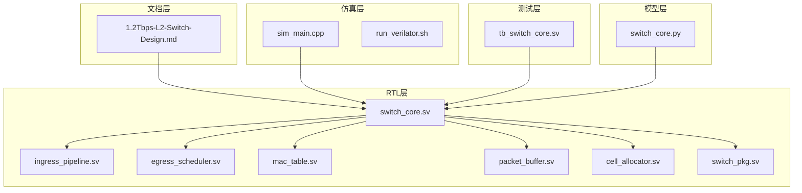
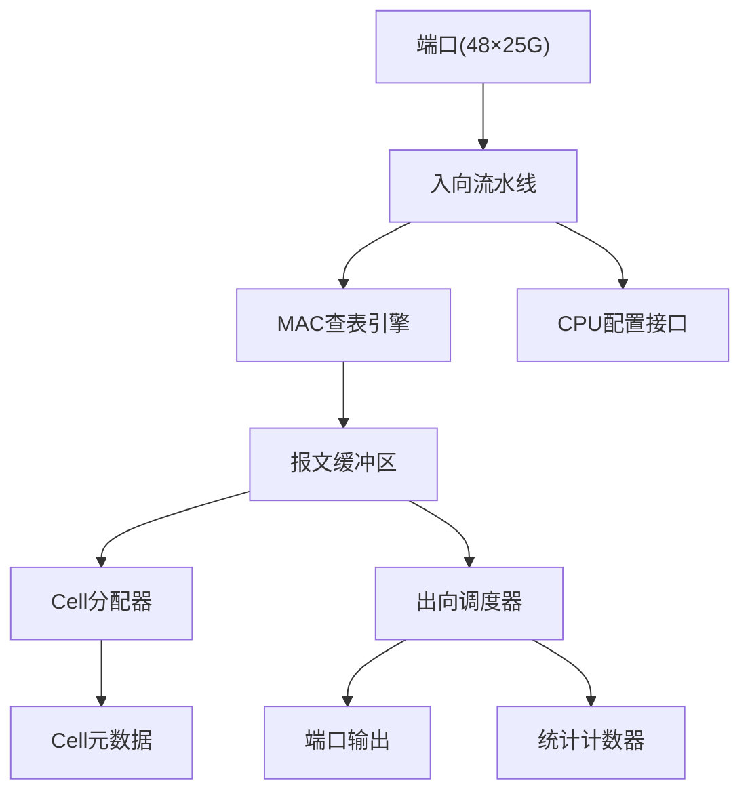
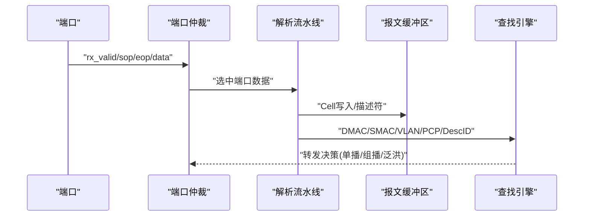
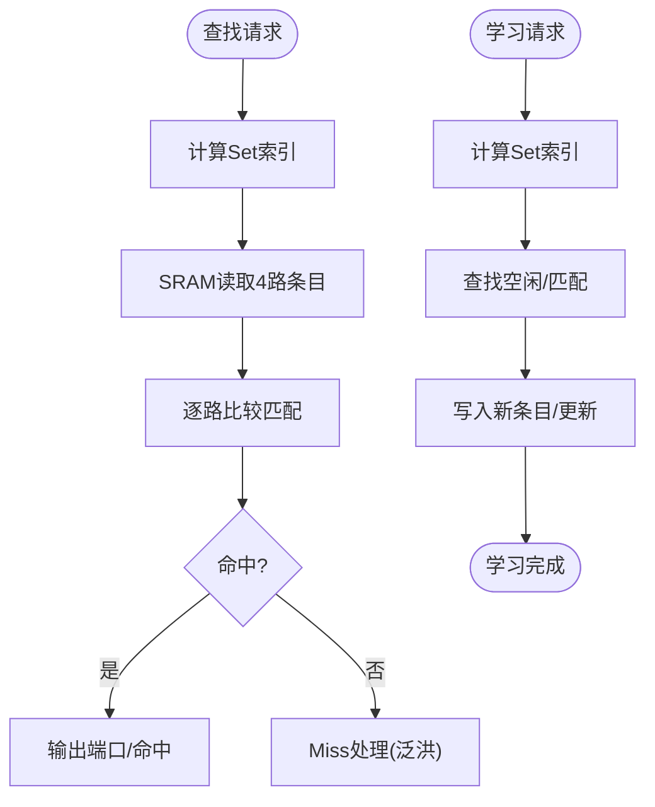
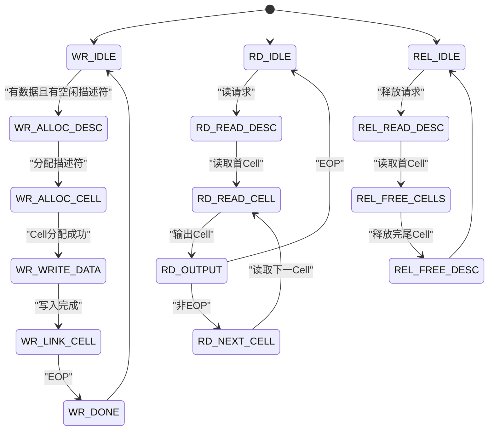
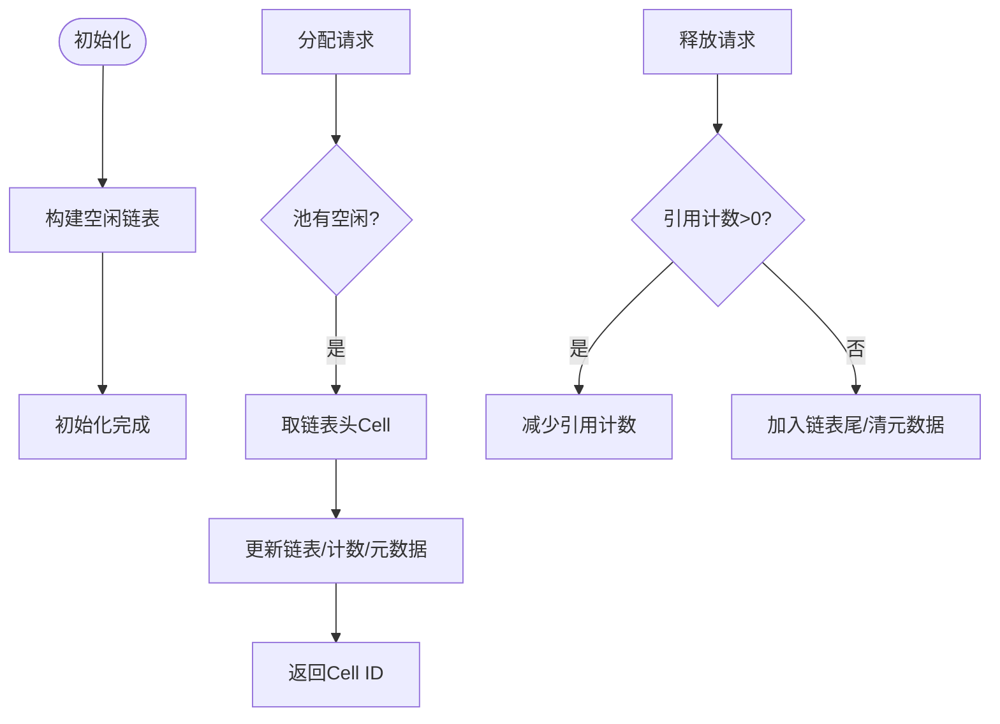
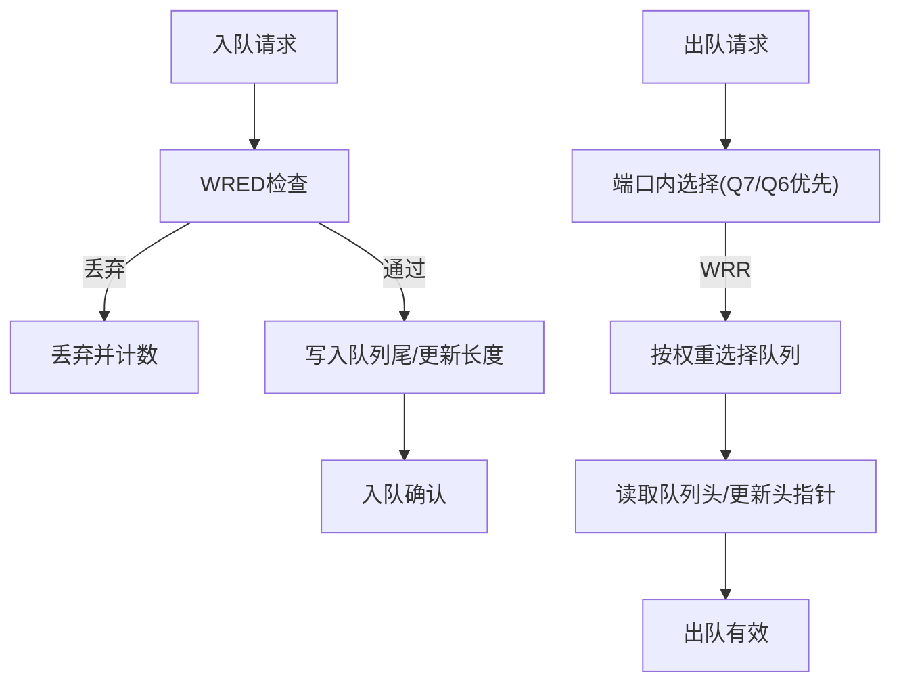
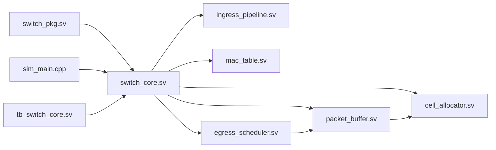

# 故障排除和调试

<cite>
**本文引用的文件**
- [doc/1.2Tbps-L2-Switch-Design.md](file://doc/1.2Tbps-L2-Switch-Design.md)
- [model/switch_core.py](file://model/switch_core.py)
- [rtl/switch_core.sv](file://rtl/switch_core.sv)
- [rtl/ingress_pipeline.sv](file://rtl/ingress_pipeline.sv)
- [rtl/egress_scheduler.sv](file://rtl/egress_scheduler.sv)
- [rtl/mac_table.sv](file://rtl/mac_table.sv)
- [rtl/packet_buffer.sv](file://rtl/packet_buffer.sv)
- [rtl/cell_allocator.sv](file://rtl/cell_allocator.sv)
- [rtl/switch_pkg.sv](file://rtl/switch_pkg.sv)
- [sim/sim_main.cpp](file://sim/sim_main.cpp)
- [sim/run_verilator.sh](file://sim/run_verilator.sh)
- [tb/tb_switch_core.sv](file://tb/tb_switch_core.sv)
</cite>

## 目录
1. [简介](#简介)
2. [项目结构](#项目结构)
3. [核心组件](#核心组件)
4. [架构总览](#架构总览)
5. [详细组件分析](#详细组件分析)
6. [依赖关系分析](#依赖关系分析)
7. [性能考虑](#性能考虑)
8. [故障排除指南](#故障排除指南)
9. [结论](#结论)
10. [附录](#附录)

## 简介
本指南面向技术支持工程师与系统集成人员，围绕1.2Tbps二层交换机的仿真与调试，提供系统性的故障排除与调试方法。内容涵盖仿真问题、综合问题、时序收敛问题的诊断与解决策略；结合仿真日志与统计信息定位问题；给出性能调优技巧与参数调整建议；并提供调试工具使用指南与最佳实践。

## 项目结构
该仓库采用“文档-RTL-模型-仿真-测试”分层组织：
- 文档层：系统设计说明，包含架构、参数、接口与性能指标
- RTL层：SystemVerilog实现，包含核心模块与接口定义
- 模型层：Python仿真实现，便于快速验证与回归
- 仿真层：Verilator驱动与脚本，支持覆盖率与波形
- 测试层：SystemVerilog测试平台，覆盖功能与覆盖率

**图表来源**
- [rtl/switch_core.sv](file://rtl/switch_core.sv#L1-L454)
- [rtl/ingress_pipeline.sv](file://rtl/ingress_pipeline.sv#L1-L319)
- [rtl/egress_scheduler.sv](file://rtl/egress_scheduler.sv#L1-L394)
- [rtl/mac_table.sv](file://rtl/mac_table.sv#L1-L342)
- [rtl/packet_buffer.sv](file://rtl/packet_buffer.sv#L1-L427)
- [rtl/cell_allocator.sv](file://rtl/cell_allocator.sv#L1-L247)
- [rtl/switch_pkg.sv](file://rtl/switch_pkg.sv#L1-L219)
- [model/switch_core.py](file://model/switch_core.py#L1-L1293)
- [sim/sim_main.cpp](file://sim/sim_main.cpp#L1-L509)
- [sim/run_verilator.sh](file://sim/run_verilator.sh#L1-L131)
- [tb/tb_switch_core.sv](file://tb/tb_switch_core.sv#L1-L840)

**章节来源**
- [doc/1.2Tbps-L2-Switch-Design.md](file://doc/1.2Tbps-L2-Switch-Design.md#L1-L767)
- [rtl/switch_core.sv](file://rtl/switch_core.sv#L1-L454)
- [rtl/ingress_pipeline.sv](file://rtl/ingress_pipeline.sv#L1-L319)
- [rtl/egress_scheduler.sv](file://rtl/egress_scheduler.sv#L1-L394)
- [rtl/mac_table.sv](file://rtl/mac_table.sv#L1-L342)
- [rtl/packet_buffer.sv](file://rtl/packet_buffer.sv#L1-L427)
- [rtl/cell_allocator.sv](file://rtl/cell_allocator.sv#L1-L247)
- [rtl/switch_pkg.sv](file://rtl/switch_pkg.sv#L1-L219)
- [model/switch_core.py](file://model/switch_core.py#L1-L1293)
- [sim/sim_main.cpp](file://sim/sim_main.cpp#L1-L509)
- [sim/run_verilator.sh](file://sim/run_verilator.sh#L1-L131)
- [tb/tb_switch_core.sv](file://tb/tb_switch_core.sv#L1-L840)

## 核心组件
- 顶层整合模块：负责端口接口、CPU配置接口、中断输出以及各子模块互联
- 入向流水线：端口仲裁、解析、ACL/QoS、MAC学习触发
- MAC查表引擎：4路组相联哈希表，流水线查表与学习
- 报文缓冲区：Cell链表存储、描述符管理、读写与释放
- Cell分配器：64K Cell管理，4路空闲池，元数据与链表
- 出向调度器：384队列（48×8），SP+WRR两级调度，WRED丢弃
- 接口与参数：统一包定义、参数常量、枚举类型

**章节来源**
- [rtl/switch_core.sv](file://rtl/switch_core.sv#L1-L454)
- [rtl/ingress_pipeline.sv](file://rtl/ingress_pipeline.sv#L1-L319)
- [rtl/mac_table.sv](file://rtl/mac_table.sv#L1-L342)
- [rtl/packet_buffer.sv](file://rtl/packet_buffer.sv#L1-L427)
- [rtl/cell_allocator.sv](file://rtl/cell_allocator.sv#L1-L247)
- [rtl/egress_scheduler.sv](file://rtl/egress_scheduler.sv#L1-L394)
- [rtl/switch_pkg.sv](file://rtl/switch_pkg.sv#L1-L219)

## 架构总览
系统采用共享内存交换矩阵，核心路径为：端口输入 → 入向流水线 → MAC查表 → 内存管理 → 出向调度 → 端口输出。各模块通过统一包参数与接口规范协同工作。

**图表来源**
- [rtl/switch_core.sv](file://rtl/switch_core.sv#L1-L454)
- [rtl/ingress_pipeline.sv](file://rtl/ingress_pipeline.sv#L1-L319)
- [rtl/mac_table.sv](file://rtl/mac_table.sv#L1-L342)
- [rtl/packet_buffer.sv](file://rtl/packet_buffer.sv#L1-L427)
- [rtl/cell_allocator.sv](file://rtl/cell_allocator.sv#L1-L247)
- [rtl/egress_scheduler.sv](file://rtl/egress_scheduler.sv#L1-L394)

## 详细组件分析

### 入向流水线（Ingress Pipeline）
- 端口仲裁：分组轮询仲裁，组内轮询，组间轮询，确保公平与时序
- 解析流水线：L2头、VLAN、负载，Cell聚合缓冲，SOP/EOP协议
- 输出到缓冲区：满足Cell边界，传递描述符ID
- MAC学习触发：非组播SMAC学习，端口状态检查

**图表来源**
- [rtl/ingress_pipeline.sv](file://rtl/ingress_pipeline.sv#L52-L126)
- [rtl/ingress_pipeline.sv](file://rtl/ingress_pipeline.sv#L129-L224)
- [rtl/ingress_pipeline.sv](file://rtl/ingress_pipeline.sv#L227-L257)
- [rtl/ingress_pipeline.sv](file://rtl/ingress_pipeline.sv#L260-L282)

**章节来源**
- [rtl/ingress_pipeline.sv](file://rtl/ingress_pipeline.sv#L1-L319)

### MAC查表引擎（MAC Table）
- 4路组相联哈希表，流水线三阶段：Hash→SRAM读→比较匹配
- 学习状态机：哈希→读取→查找空闲/匹配→写入
- 老化扫描：周期推进，非静态条目递减，<=0删除

**图表来源**
- [rtl/mac_table.sv](file://rtl/mac_table.sv#L67-L150)
- [rtl/mac_table.sv](file://rtl/mac_table.sv#L155-L248)
- [rtl/mac_table.sv](file://rtl/mac_table.sv#L262-L302)

**章节来源**
- [rtl/mac_table.sv](file://rtl/mac_table.sv#L1-L342)

### 报文缓冲区（Packet Buffer）
- 描述符池：空闲链表，分配/回收
- 写入状态机：分配描述符→分配Cell→写入→链接→完成
- 读取状态机：读取描述符→读取Cell→输出→推进
- 释放状态机：读取描述符→逐Cell释放→归还描述符

**图表来源**
- [rtl/packet_buffer.sv](file://rtl/packet_buffer.sv#L69-L96)
- [rtl/packet_buffer.sv](file://rtl/packet_buffer.sv#L179-L244)
- [rtl/packet_buffer.sv](file://rtl/packet_buffer.sv#L317-L373)
- [rtl/packet_buffer.sv](file://rtl/packet_buffer.sv#L377-L424)

**章节来源**
- [rtl/packet_buffer.sv](file://rtl/packet_buffer.sv#L1-L427)

### Cell分配器（Cell Allocator）
- 4路空闲池，均分64K Cell，链表管理
- 分配/释放：从链表头取/归还到链表尾，元数据valid/eop/ref_cnt
- 初始化：空闲链表构建，元数据清零

**图表来源**
- [rtl/cell_allocator.sv](file://rtl/cell_allocator.sv#L83-L146)
- [rtl/cell_allocator.sv](file://rtl/cell_allocator.sv#L149-L188)
- [rtl/cell_allocator.sv](file://rtl/cell_allocator.sv#L191-L231)

**章节来源**
- [rtl/cell_allocator.sv](file://rtl/cell_allocator.sv#L1-L247)

### 出向调度器（Egress Scheduler）
- 队列：每端口8优先级，共384队列，链表存储描述符
- 两级调度：端口内严格优先级Q7/Q6，其余WRR；跨端口DWRR
- WRED：基于队列长度的概率丢弃，LFSR随机数生成

**图表来源**
- [rtl/egress_scheduler.sv](file://rtl/egress_scheduler.sv#L88-L185)
- [rtl/egress_scheduler.sv](file://rtl/egress_scheduler.sv#L188-L293)
- [rtl/egress_scheduler.sv](file://rtl/egress_scheduler.sv#L76-L85)

**章节来源**
- [rtl/egress_scheduler.sv](file://rtl/egress_scheduler.sv#L1-L394)

### 顶层整合模块（Switch Core）
- 端口接口：48×RX/TX，SOP/EOP/READY协议
- CPU配置接口：寄存器读写，统计计数器
- 中断：MAC学习、链路状态、缓冲区溢出
- 老化定时器：周期触发MAC老化扫描

**章节来源**
- [rtl/switch_core.sv](file://rtl/switch_core.sv#L1-L454)

## 依赖关系分析
- 接口与参数：统一包定义贯穿RTL与仿真，确保类型与位宽一致
- 模块耦合：顶层整合各子模块；入向流水线→MAC查表→缓冲区/调度器；Cell分配器被缓冲区与调度器使用
- 外部依赖：仿真使用Verilator，测试平台包含断言与覆盖率采样

**图表来源**
- [rtl/switch_pkg.sv](file://rtl/switch_pkg.sv#L1-L219)
- [rtl/switch_core.sv](file://rtl/switch_core.sv#L1-L454)
- [rtl/ingress_pipeline.sv](file://rtl/ingress_pipeline.sv#L1-L319)
- [rtl/mac_table.sv](file://rtl/mac_table.sv#L1-L342)
- [rtl/packet_buffer.sv](file://rtl/packet_buffer.sv#L1-L427)
- [rtl/egress_scheduler.sv](file://rtl/egress_scheduler.sv#L1-L394)
- [rtl/cell_allocator.sv](file://rtl/cell_allocator.sv#L1-L247)
- [sim/sim_main.cpp](file://sim/sim_main.cpp#L1-L509)
- [tb/tb_switch_core.sv](file://tb/tb_switch_core.sv#L1-L840)

**章节来源**
- [rtl/switch_pkg.sv](file://rtl/switch_pkg.sv#L1-L219)
- [rtl/switch_core.sv](file://rtl/switch_core.sv#L1-L454)

## 性能考虑
- 线速与Cell粒度：128B Cell，500MHz核心频率，线速处理能力充足
- 内存带宽：16 Banks × 512bit × 500MHz = 4Tbps，远超1.2Tbps需求
- 调度公平性：SP+WRR+DWRR，保障高优先级低延迟与长期公平
- 拥塞控制：WRED概率丢弃，尾部丢弃阈值，抑制拥塞扩散
- Python模型：便于快速验证与回归，适合大规模压力测试

**章节来源**
- [doc/1.2Tbps-L2-Switch-Design.md](file://doc/1.2Tbps-L2-Switch-Design.md#L78-L144)
- [doc/1.2Tbps-L2-Switch-Design.md](file://doc/1.2Tbps-L2-Switch-Design.md#L240-L279)
- [doc/1.2Tbps-L2-Switch-Design.md](file://doc/1.2Tbps-L2-Switch-Design.md#L493-L509)
- [doc/1.2Tbps-L2-Switch-Design.md](file://doc/1.2Tbps-L2-Switch-Design.md#L530-L569)
- [model/switch_core.py](file://model/switch_core.py#L18-L42)

## 故障排除指南

### 一、仿真问题诊断
- 症状：仿真长时间无响应或初始化卡住
  - 排查要点：等待cell_init_done信号；检查复位时序；确认端口ready信号
  - 参考位置：顶层初始化、测试平台等待初始化
  - 建议：缩短等待超时，打印关键信号；使用波形定位阻塞点

- 症状：端口收发不匹配或丢包
  - 排查要点：SOP/EOP协议一致性；端口ready握手；Cell边界对齐
  - 参考位置：入向流水线断言；端口仲裁；缓冲区读写状态机
  - 建议：启用断言；打印端口valid/sop/eop/ready；核对Cell长度

- 症状：MAC学习未生效或学习风暴
  - 排查要点：SMAC是否组播；端口状态；学习速率限制；静态条目
  - 参考位置：入向流水线学习触发；MAC表学习状态机；学习速率限制
  - 建议：观察统计计数器；检查VLAN成员；核对端口状态

- 症状：队列拥塞导致丢弃
  - 排查要点：WRED阈值；队列长度；WRR权重；端口出队ready
  - 参考位置：WRED概率计算；队列状态机；统计计数器
  - 建议：调整WRED门限；优化队列权重；检查背压

**章节来源**
- [tb/tb_switch_core.sv](file://tb/tb_switch_core.sv#L158-L200)
- [rtl/ingress_pipeline.sv](file://rtl/ingress_pipeline.sv#L285-L291)
- [rtl/ingress_pipeline.sv](file://rtl/ingress_pipeline.sv#L260-L282)
- [rtl/mac_table.sv](file://rtl/mac_table.sv#L155-L248)
- [rtl/egress_scheduler.sv](file://rtl/egress_scheduler.sv#L125-L151)
- [rtl/egress_scheduler.sv](file://rtl/egress_scheduler.sv#L205-L229)

### 二、综合与时序收敛问题
- 症状：综合后时序不满足或资源紧张
  - 排查要点：关键路径（解析→查表→调度）；流水线级数；组合逻辑深度
  - 建议：保持流水线级数合理；避免深组合逻辑；使用包参数统一位宽

- 症状：多端口并发导致资源瓶颈
  - 排查要点：端口仲裁公平性；Cell分配器并行度；内存访问冲突
  - 建议：验证端口仲裁逻辑；检查空闲池分布；核对Bank选择

**章节来源**
- [rtl/ingress_pipeline.sv](file://rtl/ingress_pipeline.sv#L52-L126)
- [rtl/cell_allocator.sv](file://rtl/cell_allocator.sv#L149-L188)
- [rtl/packet_buffer.sv](file://rtl/packet_buffer.sv#L246-L297)

### 三、利用仿真日志与统计信息定位问题
- 日志与统计
  - MAC统计：查找次数、命中、未命中、学习次数、条目数
  - 出向统计：入队、出队、丢弃、空闲Cell数
  - 覆盖率：端口覆盖、优先级覆盖、报文类型覆盖、长度覆盖
- 使用建议
  - 启用VCD波形与覆盖率；对比前后统计计数；结合断言定位异常

**章节来源**
- [rtl/switch_core.sv](file://rtl/switch_core.sv#L420-L444)
- [tb/tb_switch_core.sv](file://tb/tb_switch_core.sv#L688-L729)
- [tb/tb_switch_core.sv](file://tb/tb_switch_core.sv#L732-L793)
- [sim/sim_main.cpp](file://sim/sim_main.cpp#L369-L398)

### 四、性能调优与参数调整
- Cell与缓冲
  - 调整Cell大小与缓冲池容量，平衡延迟与突发吸收能力
  - 监控空闲Cell计数，避免接近低水位
- 调度参数
  - WRED最小/最大阈值与丢弃概率；WRR权重；端口量子
- QoS与VLAN
  - VLAN成员配置；PCP映射；默认VID/PCP
- Python模型回归
  - 使用模型进行压力测试与回归验证，快速发现边界条件

**章节来源**
- [doc/1.2Tbps-L2-Switch-Design.md](file://doc/1.2Tbps-L2-Switch-Design.md#L254-L279)
- [doc/1.2Tbps-L2-Switch-Design.md](file://doc/1.2Tbps-L2-Switch-Design.md#L530-L569)
- [model/switch_core.py](file://model/switch_core.py#L18-L42)

### 五、调试工具使用指南与最佳实践
- Verilator仿真
  - 构建：启用覆盖率与跟踪；一键脚本支持快速迭代
  - 运行：支持快速测试与完整测试；自动输出覆盖率报告
- 测试平台
  - 断言：SOP/EOP协议断言；端口覆盖统计；覆盖率采样
  - 测试用例：复位初始化、MAC学习、单播/广播/多播、并发、压力、端口遍历
- 最佳实践
  - 逐步缩小问题范围：先功能后时序；先端口后全局
  - 保留波形与覆盖率：便于回归与根因分析
  - 使用Python模型进行快速验证与边界探索

**章节来源**
- [sim/run_verilator.sh](file://sim/run_verilator.sh#L61-L86)
- [sim/run_verilator.sh](file://sim/run_verilator.sh#L92-L105)
- [sim/run_verilator.sh](file://sim/run_verilator.sh#L107-L127)
- [sim/sim_main.cpp](file://sim/sim_main.cpp#L403-L509)
- [tb/tb_switch_core.sv](file://tb/tb_switch_core.sv#L336-L635)

## 结论
本指南提供了从架构理解到具体故障定位与性能调优的完整方法论。通过仿真日志、统计计数器与覆盖率，结合分模块的调试流程，能够高效定位并解决1.2Tbps交换机在仿真与实现过程中的常见问题。建议在开发与集成过程中持续使用覆盖率与断言，配合Python模型进行回归验证，确保系统稳定与性能达标。

## 附录

### A. 关键接口与寄存器
- CPU配置寄存器（示例地址空间）
  - MAC统计：查找/命中/未命中/学习/条目数
  - 出向统计：入队/出队/丢弃
  - 空闲Cell计数
- 端口接口
  - RX/TX：valid/sop/eop/data/empty/ready
  - 配置：使能、状态、转发模式、默认VID/PCP

**章节来源**
- [rtl/switch_pkg.sv](file://rtl/switch_pkg.sv#L174-L217)
- [rtl/switch_core.sv](file://rtl/switch_core.sv#L420-L444)

### B. 常见问题快速定位清单
- 仿真卡顿：检查cell_init_done；核对复位时序
- 端口丢包：核对SOP/EOP协议；检查端口ready
- 学习异常：检查SMAC是否组播；核对端口状态与速率限制
- 拥塞丢弃：调整WRED阈值与概率；优化队列权重
- 综合时序：检查关键路径；保持流水线级数合理

**章节来源**
- [tb/tb_switch_core.sv](file://tb/tb_switch_core.sv#L158-L200)
- [rtl/egress_scheduler.sv](file://rtl/egress_scheduler.sv#L125-L151)
- [rtl/mac_table.sv](file://rtl/mac_table.sv#L155-L248)