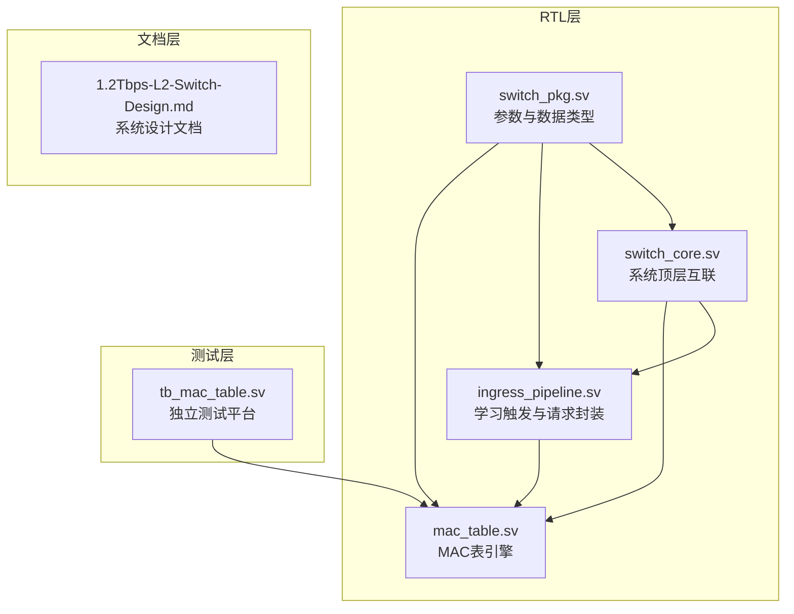
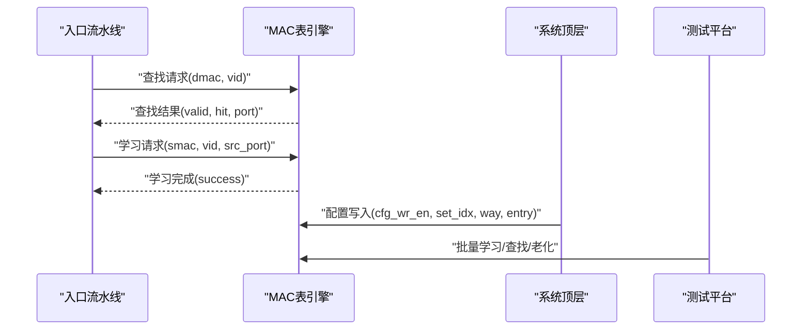
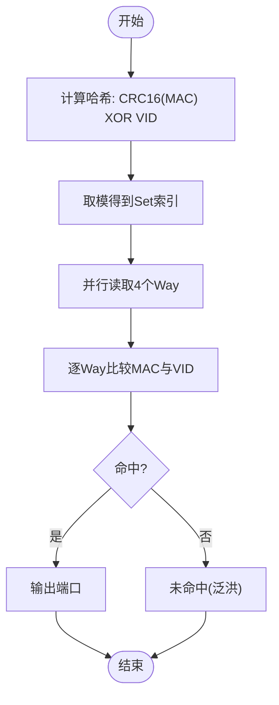
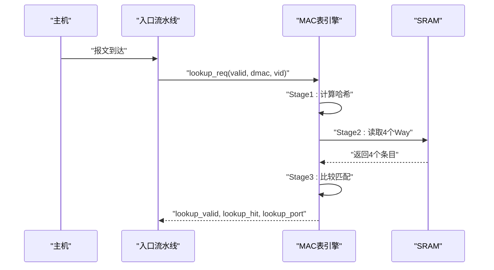
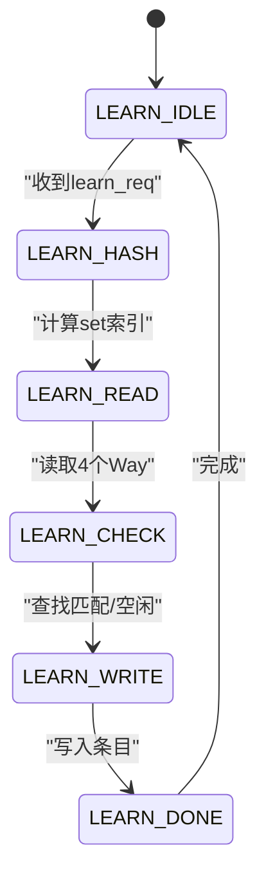
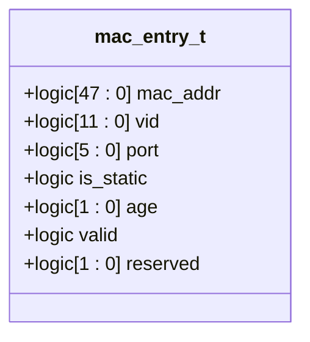
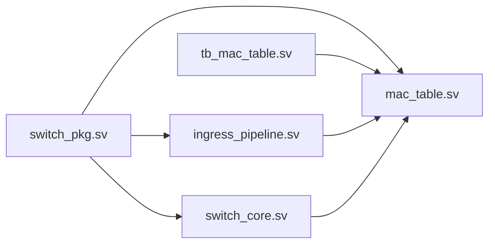

# MAC地址表模块

<cite>
**本文引用的文件列表**
- [mac_table.sv](file://rtl/mac_table.sv)
- [switch_pkg.sv](file://rtl/switch_pkg.sv)
- [tb_mac_table.sv](file://tb/tb_mac_table.sv)
- [ingress_pipeline.sv](file://rtl/ingress_pipeline.sv)
- [switch_core.sv](file://rtl/switch_core.sv)
- [1.2Tbps-L2-Switch-Design.md](file://doc/1.2Tbps-L2-Switch-Design.md)
</cite>

## 目录
1. [简介](#简介)
2. [项目结构](#项目结构)
3. [核心组件](#核心组件)
4. [架构总览](#架构总览)
5. [详细组件分析](#详细组件分析)
6. [依赖关系分析](#依赖关系分析)
7. [性能考量](#性能考量)
8. [故障排查指南](#故障排查指南)
9. [结论](#结论)
10. [附录](#附录)

## 简介
本文件为MAC地址表模块的全面技术文档，围绕4路组相联哈希表的架构设计展开，涵盖哈希函数实现、冲突解决机制、缓存策略、MAC地址学习过程（动态学习、静态配置、老化机制）、查找流水线（并行查找、命中检测、更新操作）、表项结构（MAC地址、VLAN ID、端口号、状态字段）、接口规范（学习请求、查找请求、表项更新信号），以及性能分析（查找延迟、内存使用）与使用示例及最佳实践。

## 项目结构
MAC地址表模块位于RTL目录，配合包定义、测试平台与系统顶层模块协同工作：
- RTL层：mac_table.sv（MAC表引擎）、switch_pkg.sv（参数与数据类型）、ingress_pipeline.sv（学习触发与请求封装）、switch_core.sv（系统顶层互联）
- 测试层：tb_mac_table.sv（独立MAC表测试平台）
- 文档层：1.2Tbps-L2-Switch-Design.md（系统设计文档）

图表来源
- [mac_table.sv](file://rtl/mac_table.sv#L1-L44)
- [switch_pkg.sv](file://rtl/switch_pkg.sv#L23-L26)
- [ingress_pipeline.sv](file://rtl/ingress_pipeline.sv#L240-L282)
- [switch_core.sv](file://rtl/switch_core.sv#L95-L112)
- [tb_mac_table.sv](file://tb/tb_mac_table.sv#L58-L83)

章节来源
- [mac_table.sv](file://rtl/mac_table.sv#L1-L44)
- [switch_pkg.sv](file://rtl/switch_pkg.sv#L23-L26)
- [ingress_pipeline.sv](file://rtl/ingress_pipeline.sv#L240-L282)
- [switch_core.sv](file://rtl/switch_core.sv#L95-L112)
- [tb_mac_table.sv](file://tb/tb_mac_table.sv#L58-L83)

## 核心组件
- MAC表存储：4路组相联，共32K条目，8K sets
- 哈希函数：基于MAC的CRC16与VLAN ID异或，取模得到set索引
- 查找流水线：Stage1-Hash、Stage2-SRAM读取、Stage3-比较匹配
- 学习状态机：LEARN_IDLE→HASH→READ→CHECK→WRITE→DONE
- 老化扫描：age_tick触发，顺序扫描非静态条目，2bit age计数器递减，归零删除
- 配置写入：静态条目通过配置接口写入指定set与way
- 统计计数：查找次数、命中/未命中、学习成功次数、当前条目数

章节来源
- [mac_table.sv](file://rtl/mac_table.sv#L49-L62)
- [mac_table.sv](file://rtl/mac_table.sv#L67-L151)
- [mac_table.sv](file://rtl/mac_table.sv#L155-L248)
- [mac_table.sv](file://rtl/mac_table.sv#L262-L302)
- [mac_table.sv](file://rtl/mac_table.sv#L253-L257)
- [mac_table.sv](file://rtl/mac_table.sv#L307-L339)

## 架构总览
MAC表模块作为二层交换机的核心查询引擎，与入口流水线、系统顶层、测试平台协同工作。入口流水线负责解析报文并触发学习；顶层模块负责连接MAC表与缓冲区、调度器；测试平台验证功能与性能。

图表来源
- [ingress_pipeline.sv](file://rtl/ingress_pipeline.sv#L240-L282)
- [mac_table.sv](file://rtl/mac_table.sv#L14-L44)
- [switch_core.sv](file://rtl/switch_core.sv#L95-L112)
- [tb_mac_table.sv](file://tb/tb_mac_table.sv#L58-L83)

## 详细组件分析

### 4路组相联哈希表架构
- 存储组织：8K sets × 4 ways，每set内并行读取4个条目
- 哈希函数：对MAC高位做CRC16，再与VLAN ID异或，取模得到set索引
- 冲突解决：同一set内的4个way通过并行比较解决冲突；若无空闲且无匹配，则按策略覆盖（此处实现为找到空闲或匹配即写入）
- 缓存策略：SRAM直连访问，流水线Stage2读取，Stage3比较匹配，减少等待延迟

图表来源
- [mac_table.sv](file://rtl/mac_table.sv#L54-L62)
- [mac_table.sv](file://rtl/mac_table.sv#L114-L144)

章节来源
- [mac_table.sv](file://rtl/mac_table.sv#L49-L62)
- [mac_table.sv](file://rtl/mac_table.sv#L114-L144)

### 查找流水线实现
- Stage1：接收查找请求，计算哈希，输出set索引
- Stage2：根据set索引并行读取4个条目
- Stage3：比较每个条目的valid、mac_addr、vid，命中则输出端口
- 输出：lookup_valid、lookup_hit、lookup_port

图表来源
- [mac_table.sv](file://rtl/mac_table.sv#L67-L151)
- [ingress_pipeline.sv](file://rtl/ingress_pipeline.sv#L240-L257)

章节来源
- [mac_table.sv](file://rtl/mac_table.sv#L67-L151)
- [ingress_pipeline.sv](file://rtl/ingress_pipeline.sv#L240-L257)

### MAC地址学习过程
- 动态学习：入口流水线在报文解析完成且端口处于转发状态时，若SMAC非组播，则发起学习请求
- 学习状态机：LEARN_IDLE→HASH→READ→CHECK→WRITE→DONE，检查匹配或空闲位置，写入有效位、端口、age计数器
- 静态配置：通过配置接口写入静态条目，is_static置1，不受老化影响
- 老化机制：age_tick触发扫描，非静态条目age递减，归零删除；访问时重置age

图表来源
- [mac_table.sv](file://rtl/mac_table.sv#L155-L248)
- [ingress_pipeline.sv](file://rtl/ingress_pipeline.sv#L262-L282)

章节来源
- [mac_table.sv](file://rtl/mac_table.sv#L155-L248)
- [ingress_pipeline.sv](file://rtl/ingress_pipeline.sv#L262-L282)
- [mac_table.sv](file://rtl/mac_table.sv#L262-L302)

### 表项结构与字段
- 字段：mac_addr(48bit)、vid(12bit)、port(6bit)、is_static(1bit)、age(2bit)、valid(1bit)、reserved(2bit)
- 大小：72bit/条目
- 存储：数组[sets-1:0][ways-1:0]，并行访问4个way

图表来源
- [switch_pkg.sv](file://rtl/switch_pkg.sv#L128-L137)

章节来源
- [switch_pkg.sv](file://rtl/switch_pkg.sv#L128-L137)
- [mac_table.sv](file://rtl/mac_table.sv#L49-L49)

### 接口规范
- 查找接口
  - 输入：lookup_req、lookup_mac(48bit)、lookup_vid(12bit)
  - 输出：lookup_valid、lookup_hit、lookup_port(6bit)
- 学习接口
  - 输入：learn_req、learn_mac(48bit)、learn_vid(12bit)、learn_port(6bit)
  - 输出：learn_done、learn_success
- 配置接口
  - 输入：cfg_wr_en、cfg_set_idx(13bit)、cfg_way(2bit)、cfg_entry(mac_entry_t)
- 老化接口
  - 输入：age_tick
- 统计接口
  - 输出：stat_lookup_cnt、stat_hit_cnt、stat_miss_cnt、stat_learn_cnt、stat_entry_cnt

章节来源
- [mac_table.sv](file://rtl/mac_table.sv#L14-L44)
- [switch_pkg.sv](file://rtl/switch_pkg.sv#L23-L26)

### 测试与验证
- 独立测试平台tb_mac_table.sv验证基本学习、查找、不同VLAN、大量学习、性能与老化
- 测试流程包含：初始化、基本学习与查找、不同VLAN、MAC更新、批量学习、查找性能、老化扫描与统计

章节来源
- [tb_mac_table.sv](file://tb/tb_mac_table.sv#L88-L281)

## 依赖关系分析
- 参数与类型依赖：switch_pkg.sv提供端口宽度、VLAN ID宽度、MAC表容量、表项结构等
- 模块间依赖：ingress_pipeline.sv向mac_table.sv发出查找与学习请求；switch_core.sv连接MAC表与缓冲区、调度器；tb_mac_table.sv驱动DUT进行功能与性能验证

图表来源
- [switch_pkg.sv](file://rtl/switch_pkg.sv#L23-L26)
- [mac_table.sv](file://rtl/mac_table.sv#L8-L8)
- [ingress_pipeline.sv](file://rtl/ingress_pipeline.sv#L9-L9)
- [switch_core.sv](file://rtl/switch_core.sv#L8-L8)
- [tb_mac_table.sv](file://tb/tb_mac_table.sv#L9-L9)

章节来源
- [switch_pkg.sv](file://rtl/switch_pkg.sv#L23-L26)
- [mac_table.sv](file://rtl/mac_table.sv#L8-L8)
- [ingress_pipeline.sv](file://rtl/ingress_pipeline.sv#L9-L9)
- [switch_core.sv](file://rtl/switch_core.sv#L8-L8)
- [tb_mac_table.sv](file://tb/tb_mac_table.sv#L9-L9)

## 性能考量
- 查表吞吐：500M次/秒，超过线速需求两倍
- 查找延迟：流水线3级（Hash 1+SRAM读取 2+比较 1），典型延迟与系统频率相关
- 内存使用：32K条目 × 72bit = 235.2KB；4路组相联8K sets，SRAM并行访问
- 老化开销：age_tick触发扫描，遍历全部条目，扫描周期为MAC_TABLE_SETS×MAC_TABLE_WAYS；非静态条目age递减，归零删除
- 统计计数：查找/命中/未命中/学习成功/当前条目数，便于性能监控与优化

章节来源
- [1.2Tbps-L2-Switch-Design.md](file://doc/1.2Tbps-L2-Switch-Design.md#L205-L221)
- [1.2Tbps-L2-Switch-Design.md](file://doc/1.2Tbps-L2-Switch-Design.md#L230-L234)
- [mac_table.sv](file://rtl/mac_table.sv#L307-L339)

## 故障排查指南
- 查找未命中：确认VLAN ID是否正确、是否存在静态条目、是否被老化删除
- 学习失败：检查learn_req是否有效、端口状态是否为转发、是否有空闲way可用
- 老化异常：确认age_tick是否按时触发、扫描是否完成、静态条目是否被误删
- 性能异常：关注统计计数器，分析命中率、miss率与学习率，定位热点与异常行为

章节来源
- [tb_mac_table.sv](file://tb/tb_mac_table.sv#L137-L281)
- [mac_table.sv](file://rtl/mac_table.sv#L262-L302)

## 结论
MAC地址表模块采用4路组相联哈希表，结合流水线查找与学习状态机，实现了高性能、低延迟的二层转发核心。通过静态配置与老化机制，兼顾灵活性与资源控制。测试平台验证了功能正确性与性能指标，满足系统设计要求。

## 附录
- 使用示例与最佳实践
  - 动态学习：确保入口流水线端口处于转发状态，SMAC非组播时自动触发学习
  - 静态配置：通过配置接口写入固定业务流的静态条目，提升命中率与稳定性
  - 老化策略：合理设置老化周期，结合age_tick定时器，平衡表项寿命与转发准确性
  - 性能优化：关注命中率与miss率统计，优化VLAN划分与端口配置，减少冲突与miss

章节来源
- [ingress_pipeline.sv](file://rtl/ingress_pipeline.sv#L262-L282)
- [mac_table.sv](file://rtl/mac_table.sv#L253-L257)
- [mac_table.sv](file://rtl/mac_table.sv#L262-L302)
- [tb_mac_table.sv](file://tb/tb_mac_table.sv#L137-L281)