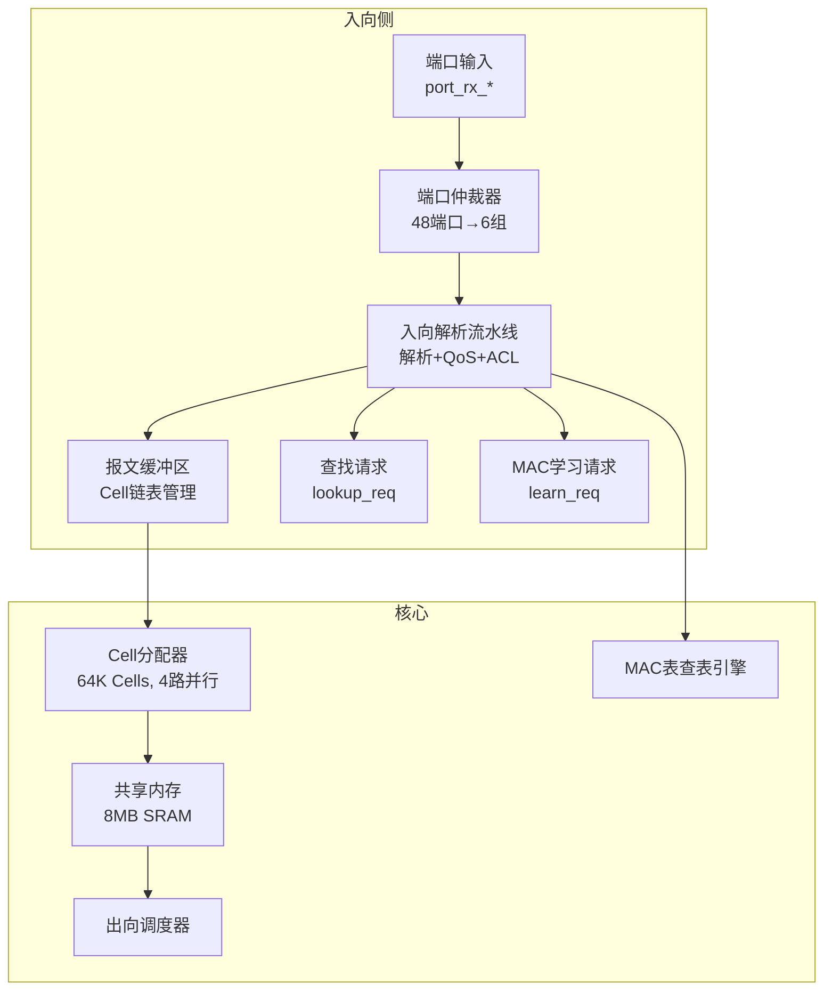
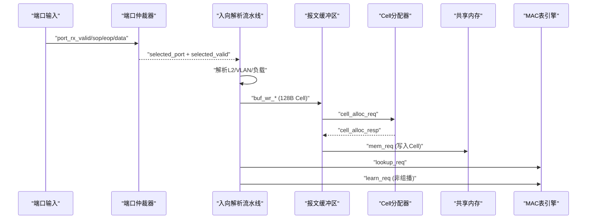
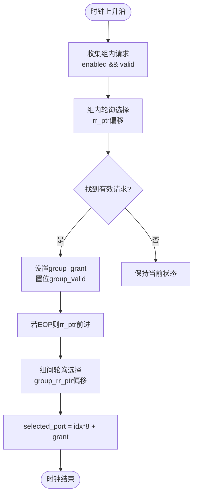
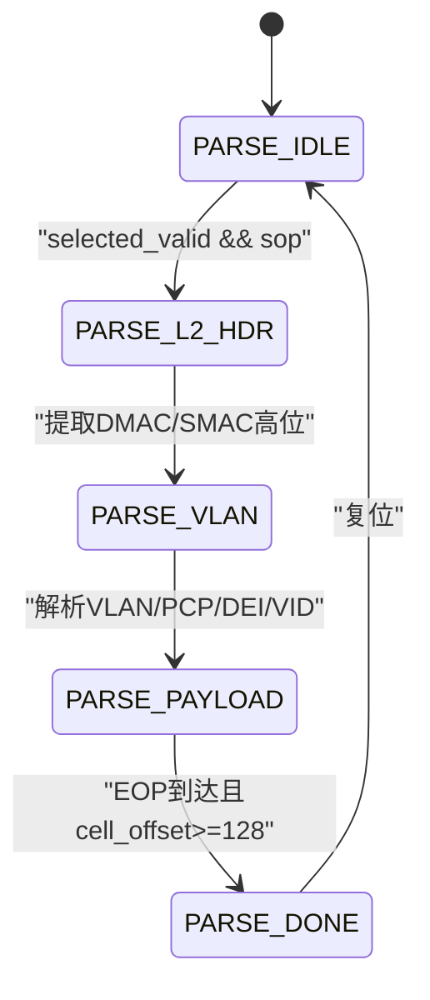
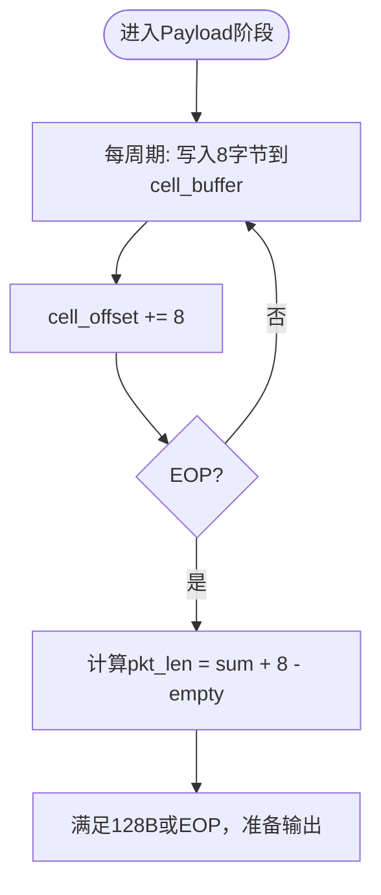
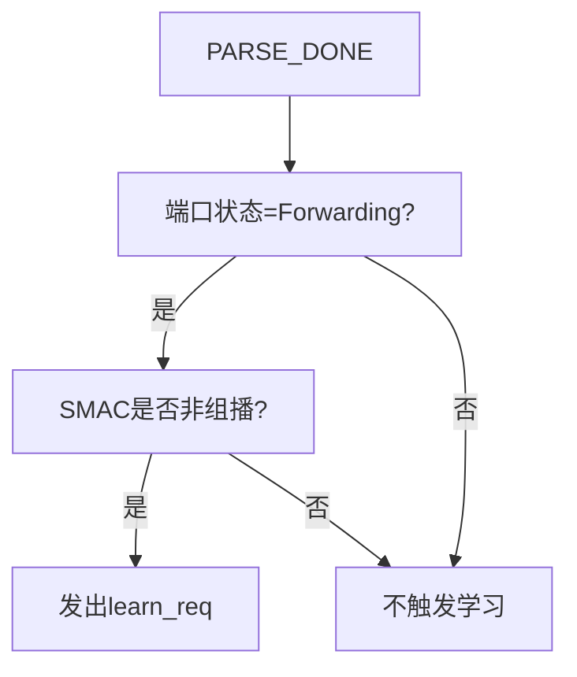
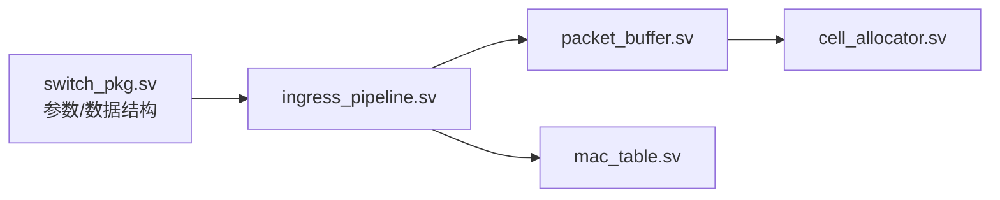

# 入向流水线模块

<cite>
**本文引用的文件**
- [ingress_pipeline.sv](file://rtl/ingress_pipeline.sv)
- [cell_allocator.sv](file://rtl/cell_allocator.sv)
- [packet_buffer.sv](file://rtl/packet_buffer.sv)
- [mac_table.sv](file://rtl/mac_table.sv)
- [switch_pkg.sv](file://rtl/switch_pkg.sv)
- [1.2Tbps-L2-Switch-Design.md](file://doc/1.2Tbps-L2-Switch-Design.md)
- [egress_scheduler.sv](file://rtl/egress_scheduler.sv)
- [tb_switch_core.sv](file://tb/tb_switch_core.sv)
- [tb_mac_table.sv](file://tb/tb_mac_table.sv)
</cite>

## 目录
1. [简介](#简介)
2. [项目结构](#项目结构)
3. [核心组件](#核心组件)
4. [架构总览](#架构总览)
5. [详细组件分析](#详细组件分析)
6. [依赖关系分析](#依赖关系分析)
7. [性能考量](#性能考量)
8. [故障排查指南](#故障排查指南)
9. [结论](#结论)
10. [附录](#附录)

## 简介
本技术文档围绕入向流水线模块展开，系统阐述其分层时分复用的端口仲裁机制、报文解析流水线的四个阶段、Cell聚合缓冲策略、MAC学习触发逻辑，并给出接口规范、时序分析、性能指标与参考代码路径。文档面向具备基础数字电路知识的读者，力求在可读性与准确性之间取得平衡。

## 项目结构
入向流水线模块位于RTL目录，配合包定义、Cell分配器、报文缓冲区、MAC表等模块协同工作，形成从端口输入到查找转发的完整链路。

图表来源
- [ingress_pipeline.sv](file://rtl/ingress_pipeline.sv#L1-L319)
- [cell_allocator.sv](file://rtl/cell_allocator.sv#L1-L247)
- [packet_buffer.sv](file://rtl/packet_buffer.sv#L1-L427)
- [mac_table.sv](file://rtl/mac_table.sv#L1-L342)
- [egress_scheduler.sv](file://rtl/egress_scheduler.sv#L1-L394)

章节来源
- [ingress_pipeline.sv](file://rtl/ingress_pipeline.sv#L1-L319)
- [switch_pkg.sv](file://rtl/switch_pkg.sv#L1-L219)

## 核心组件
- 端口仲裁器：48端口分6组（每组8端口），组内轮询仲裁，组间轮询选择，实现分层时分复用。
- 报文解析流水线：L2头部提取、VLAN标签处理、负载解析、完成状态。
- Cell聚合缓冲：将8字节数据聚合到128字节Cell中，满足共享内存粒度要求。
- MAC学习触发：基于端口状态与源MAC类型（非组播）触发学习。
- 接口规范：端口输入输出信号、配置寄存器接口、统计信号；Cell分配/释放接口、内存读写接口等。
- 性能指标：线速Cell处理能力、核心总线带宽、Cell分配吞吐、内存带宽余量等。

章节来源
- [ingress_pipeline.sv](file://rtl/ingress_pipeline.sv#L52-L126)
- [ingress_pipeline.sv](file://rtl/ingress_pipeline.sv#L128-L224)
- [ingress_pipeline.sv](file://rtl/ingress_pipeline.sv#L150-L236)
- [ingress_pipeline.sv](file://rtl/ingress_pipeline.sv#L260-L282)
- [switch_pkg.sv](file://rtl/switch_pkg.sv#L12-L44)
- [switch_pkg.sv](file://rtl/switch_pkg.sv#L187-L217)

## 架构总览
入向流水线在端口层采用分层时分复用，先在组内轮询仲裁，再在组间轮询选择，最终将选定端口的数据送入解析流水线。解析完成后，报文被聚合为Cell并写入共享内存，同时产生查找请求与MAC学习请求，供后续模块使用。

图表来源
- [ingress_pipeline.sv](file://rtl/ingress_pipeline.sv#L101-L126)
- [ingress_pipeline.sv](file://rtl/ingress_pipeline.sv#L128-L257)
- [packet_buffer.sv](file://rtl/packet_buffer.sv#L189-L244)
- [cell_allocator.sv](file://rtl/cell_allocator.sv#L151-L188)
- [mac_table.sv](file://rtl/mac_table.sv#L147-L151)

## 详细组件分析

### 端口仲裁机制（分层时分复用）
- 分组策略：48端口分为6组，每组8端口；组内轮询仲裁器维护轮询指针，遇到EOP时推进指针，确保公平性。
- 组间仲裁：组内有效后，组间轮询选择，选出最终端口。
- 时序要点：仲裁器在每个时钟周期尝试选择，若无请求则保持当前状态；selected_valid在选中有效时置位，驱动解析流水线启动。

图表来源
- [ingress_pipeline.sv](file://rtl/ingress_pipeline.sv#L57-L99)
- [ingress_pipeline.sv](file://rtl/ingress_pipeline.sv#L107-L126)

章节来源
- [ingress_pipeline.sv](file://rtl/ingress_pipeline.sv#L52-L126)

### 报文解析流水线（四阶段）
- 阶段一：L2头部提取
  - 从首个Cycle接收DMAC与SMAC高位，提取DMAC作为查找关键字之一。
- 阶段二：VLAN标签处理
  - 检测以太类型是否为0x8100，若是则解析PCP/DEI/VID；否则使用端口默认VID/PCP。
- 阶段三：负载解析与Cell聚合
  - 每周期累加8字节，写入cell_buffer，cell_offset递增；EOP时计算完整长度。
- 阶段四：完成状态
  - 解析完成后进入PARSE_DONE，准备输出到缓冲区。

图表来源
- [ingress_pipeline.sv](file://rtl/ingress_pipeline.sv#L132-L138)
- [ingress_pipeline.sv](file://rtl/ingress_pipeline.sv#L163-L223)

章节来源
- [ingress_pipeline.sv](file://rtl/ingress_pipeline.sv#L128-L224)

### Cell聚合缓冲机制
- 聚合策略：每周期从端口读取64位数据，写入cell_buffer对应位置，offset每次加8字节。
- 输出条件：当cell_offset达到128字节或到达EOP时，将128字节Cell提交到缓冲区。
- 长度计算：完整包长 = 累加字节数 - 无效字节数（port_rx_empty）。

图表来源
- [ingress_pipeline.sv](file://rtl/ingress_pipeline.sv#L204-L217)
- [ingress_pipeline.sv](file://rtl/ingress_pipeline.sv#L230-L236)

章节来源
- [ingress_pipeline.sv](file://rtl/ingress_pipeline.sv#L150-L236)

### MAC学习触发逻辑
- 触发条件：
  - 解析完成（PARSE_DONE）；
  - 端口处于Forwarding状态；
  - 源MAC不是组播地址（SMAC[40]为0）。
- 触发内容：发出learn_req，携带SMAC、VID、端口号，供MAC表学习。

图表来源
- [ingress_pipeline.sv](file://rtl/ingress_pipeline.sv#L262-L282)

章节来源
- [ingress_pipeline.sv](file://rtl/ingress_pipeline.sv#L260-L282)

### 接口规范
- 端口输入输出信号
  - 输入：port_rx_valid/sop/eop、port_rx_data[63:0]、port_rx_empty[2:0]、port_rx_ready（输出）
  - 输出：buf_wr_valid/sop/eop、buf_wr_data[CELL_SIZE_BITS-1:0]、buf_wr_len、buf_wr_port、buf_wr_ready（输入）
- 配置寄存器接口
  - 端口配置：enabled、state、fwd_mode、default_vid、default_pcp
- 统计信号
  - 每端口：stat_rx_packets、stat_rx_bytes、stat_rx_drops
- 查找与学习接口
  - lookup_req：包含DMAC、SMAC、VID、src_port、queue_id、desc_id
  - learn_req：SMAC、VID、端口
- Cell分配/释放接口
  - cell_alloc_req_t：req、pool_hint
  - cell_alloc_resp_t：ack、success、cell_id
  - cell_free_req_t：req、cell_id

章节来源
- [ingress_pipeline.sv](file://rtl/ingress_pipeline.sv#L9-L49)
- [switch_pkg.sv](file://rtl/switch_pkg.sv#L174-L181)
- [switch_pkg.sv](file://rtl/switch_pkg.sv#L151-L160)
- [switch_pkg.sv](file://rtl/switch_pkg.sv#L187-L203)

## 依赖关系分析
- 入向流水线依赖包定义中的参数与数据结构（端口数、Cell大小、队列数、VLAN ID宽度等）。
- 解析完成后，lookup_req与learn_req分别连接到MAC表引擎与后续模块。
- 报文缓冲区负责将解析得到的128B Cell写入共享内存，依赖Cell分配器提供空闲Cell。

图表来源
- [switch_pkg.sv](file://rtl/switch_pkg.sv#L1-L219)
- [ingress_pipeline.sv](file://rtl/ingress_pipeline.sv#L1-L49)
- [packet_buffer.sv](file://rtl/packet_buffer.sv#L1-L54)
- [cell_allocator.sv](file://rtl/cell_allocator.sv#L1-L35)
- [mac_table.sv](file://rtl/mac_table.sv#L1-L44)

章节来源
- [switch_pkg.sv](file://rtl/switch_pkg.sv#L1-L219)
- [ingress_pipeline.sv](file://rtl/ingress_pipeline.sv#L1-L49)

## 性能考量
- 线速Cell处理能力：单端口25Gbps，128B Cell，理论处理速率≈24.41Mpps；48端口合计≈1171.875Mpps。
- 核心总线带宽：目标500MHz，4096bit（512Bytes）总线，满足2.048Tbps带宽需求，裕量1.71x。
- Cell分配吞吐：4路并行分配，每路500MHz，合计可达2G cells/s，足以支撑线速。
- 内存带宽：16 Banks × 512bit × 500MHz = 4Tbps，远超1.2Tbps需求，裕量3.3x。
- Cut-Through与Store-and-Forward：Cut-Through在收到足够字段（如DMAC）后即可查表转发，延迟更低；S&F在整包接收后入队列，延迟更高但更稳定。

章节来源
- [1.2Tbps-L2-Switch-Design.md](file://doc/1.2Tbps-L2-Switch-Design.md#L78-L98)
- [1.2Tbps-L2-Switch-Design.md](file://doc/1.2Tbps-L2-Switch-Design.md#L281-L298)
- [1.2Tbps-L2-Switch-Design.md](file://doc/1.2Tbps-L2-Switch-Design.md#L493-L509)

## 故障排查指南
- 端口仲裁无输出
  - 检查端口使能与valid信号；确认组内请求是否真实存在；核对EOP对rr_ptr的影响。
- 解析流水线卡住
  - 检查selected_valid是否在SOP时拉高；确认PARSE_DONE是否在EOP时触发。
- Cell输出异常
  - 检查cell_offset是否正确累加；确认buf_wr_len与EOP条件；核对port_rx_empty对长度的影响。
- MAC学习未触发
  - 检查端口状态是否为Forwarding；确认SMAC是否为组播；核对learn_req的时序。
- 统计异常
  - 核对统计计数器的时钟域与条件；确认drop计数是否在port_rx_valid且!ready时增加。

章节来源
- [ingress_pipeline.sv](file://rtl/ingress_pipeline.sv#L287-L291)
- [ingress_pipeline.sv](file://rtl/ingress_pipeline.sv#L296-L316)

## 结论
入向流水线模块通过分层时分复用仲裁、四级解析流水线、128B Cell聚合与端口状态驱动的MAC学习，实现了线速下的可靠入向处理。结合Cell分配器与共享内存架构，整体系统具备充足的带宽裕量与确定性延迟特性，满足高性能二层交换需求。

## 附录
- 时序分析要点
  - 端口仲裁：组内轮询指针在EOP处推进，避免饥饿；组间轮询确保跨组公平。
  - 解析流水线：4级流水线在500MHz下可实现每周期处理≥2.34个Cell，满足线速。
  - Cell分配：4路并行分配，空闲链表头出尾入，分配/释放均为O(1)。
- 参考代码路径
  - 端口仲裁与解析：[ingress_pipeline.sv](file://rtl/ingress_pipeline.sv#L52-L224)
  - Cell聚合与输出：[ingress_pipeline.sv](file://rtl/ingress_pipeline.sv#L150-L236)
  - MAC学习触发：[ingress_pipeline.sv](file://rtl/ingress_pipeline.sv#L260-L282)
  - Cell分配器：[cell_allocator.sv](file://rtl/cell_allocator.sv#L148-L188)
  - 报文缓冲区：[packet_buffer.sv](file://rtl/packet_buffer.sv#L178-L244)
  - MAC表引擎：[mac_table.sv](file://rtl/mac_table.sv#L147-L151)
  - 接口定义：[switch_pkg.sv](file://rtl/switch_pkg.sv#L187-L217)
  - 性能与架构说明：[1.2Tbps-L2-Switch-Design.md](file://doc/1.2Tbps-L2-Switch-Design.md#L78-L98)