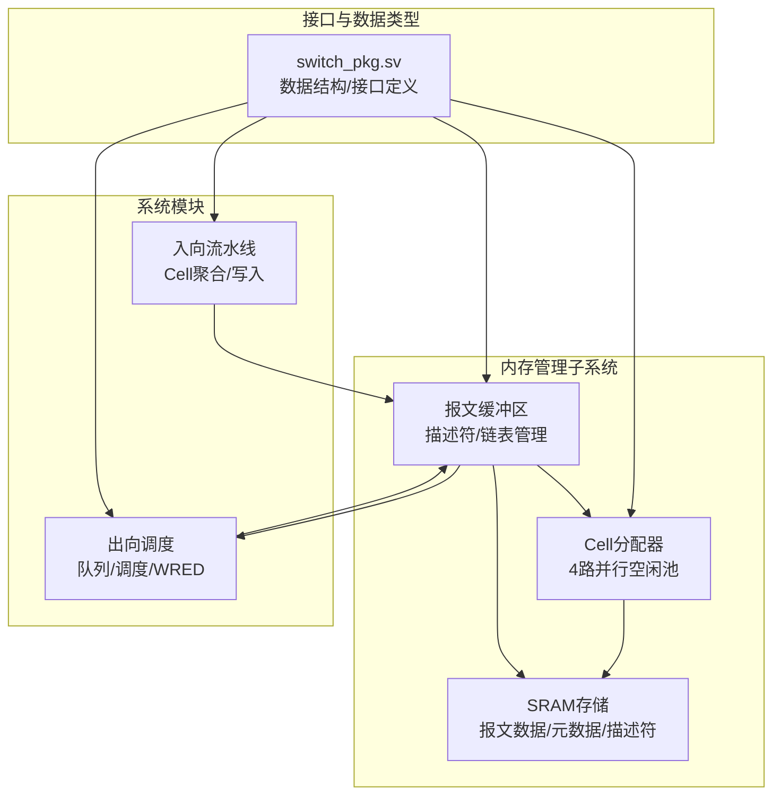
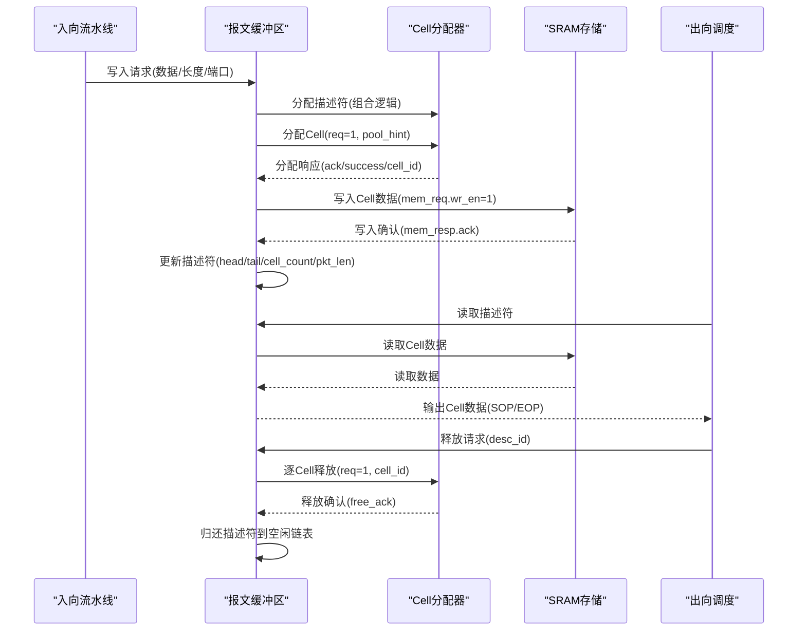
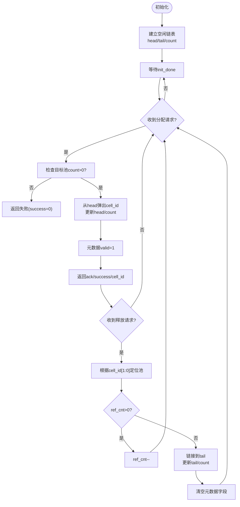
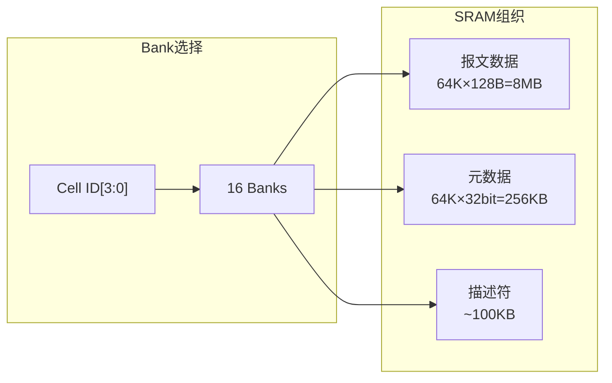
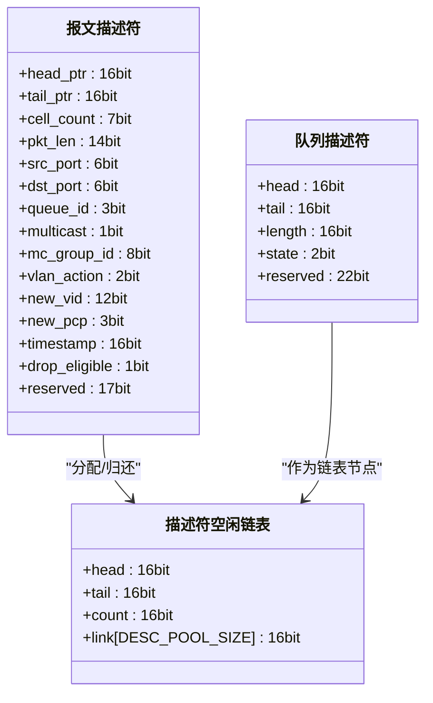
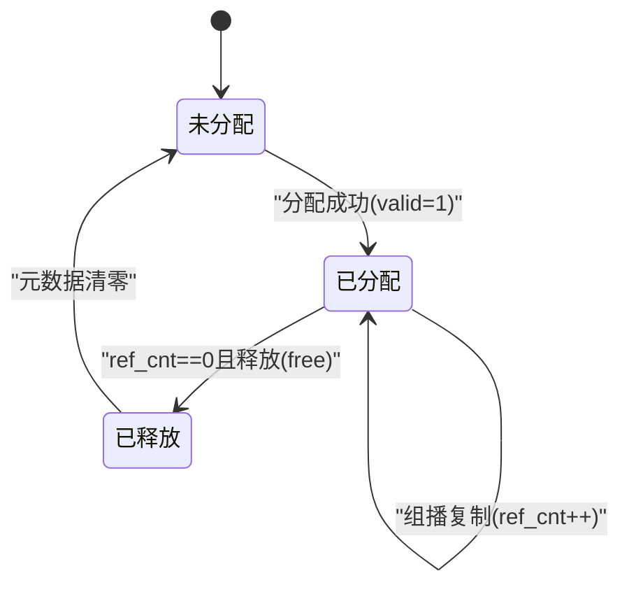
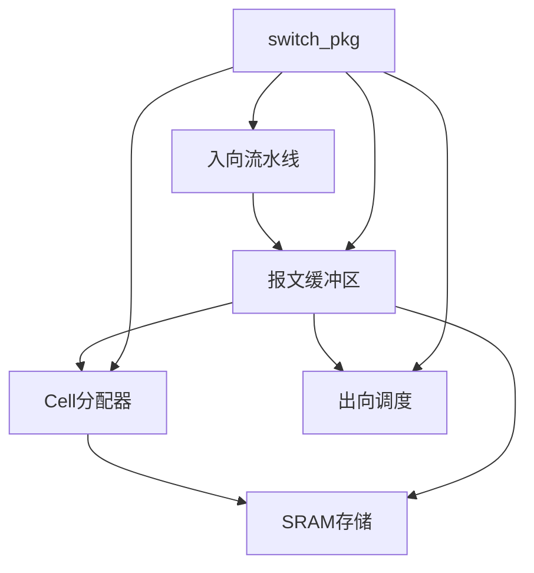

# 内存管理系统

<cite>
**本文引用的文件**
- [cell_allocator.sv](file://rtl/cell_allocator.sv)
- [packet_buffer.sv](file://rtl/packet_buffer.sv)
- [switch_pkg.sv](file://rtl/switch_pkg.sv)
- [1.2Tbps-L2-Switch-Design.md](file://doc/1.2Tbps-L2-Switch-Design.md)
- [ingress_pipeline.sv](file://rtl/ingress_pipeline.sv)
- [egress_scheduler.sv](file://rtl/egress_scheduler.sv)
- [sim_main.cpp](file://sim/sim_main.cpp)
- [tb_switch_core.sv](file://tb/tb_switch_core.sv)
</cite>

## 目录
1. [简介](#简介)
2. [项目结构](#项目结构)
3. [核心组件](#核心组件)
4. [架构总览](#架构总览)
5. [详细组件分析](#详细组件分析)
6. [依赖关系分析](#依赖关系分析)
7. [性能考量](#性能考量)
8. [故障排查指南](#故障排查指南)
9. [结论](#结论)
10. [附录](#附录)

## 简介
本技术文档围绕内存管理系统展开，重点阐述Cell分配器的4路并行架构、空闲池管理、Cell分配与回收机制；详解8MB SRAM报文缓冲区的设计（地址映射、读写时序与缓冲策略）；描述符链表的数据结构与指针管理；Cell元数据维护（链表关系、长度信息与状态标志）；给出完整的内存管理接口规范（分配请求、释放信号与状态查询）；并提供内存使用统计、碎片化分析与性能优化策略，以及实现示例与调试方法。

## 项目结构
- RTL模块
  - cell_allocator.sv：Cell分配器，4路并行空闲池管理与分配/回收
  - packet_buffer.sv：报文缓冲区，Cell链表与描述符管理
  - switch_pkg.sv：数据类型、参数与接口定义
  - ingress_pipeline.sv：入向流水线，Cell聚合与写入缓冲
  - egress_scheduler.sv：出向调度，队列链表与WRED/WRR
- 文档
  - 1.2Tbps-L2-Switch-Design.md：系统设计文档，包含内存组织、Cell元数据、描述符结构与缓冲策略
- 仿真与测试
  - sim_main.cpp：Verilator驱动，压力测试与统计
  - tb_switch_core.sv：测试平台，覆盖率与配置读写

图表来源
- [cell_allocator.sv](file://rtl/cell_allocator.sv#L1-L247)
- [packet_buffer.sv](file://rtl/packet_buffer.sv#L1-L427)
- [switch_pkg.sv](file://rtl/switch_pkg.sv#L1-L219)
- [ingress_pipeline.sv](file://rtl/ingress_pipeline.sv#L1-L319)
- [egress_scheduler.sv](file://rtl/egress_scheduler.sv#L1-L394)

章节来源
- [cell_allocator.sv](file://rtl/cell_allocator.sv#L1-L35)
- [packet_buffer.sv](file://rtl/packet_buffer.sv#L1-L54)
- [switch_pkg.sv](file://rtl/switch_pkg.sv#L7-L219)

## 核心组件
- Cell分配器（4路并行）
  - 空闲池：4组独立链表，每组16K个Cell，支持并行分配
  - 初始化：自底向上建立空闲链表，设置head/tail/count
  - 分配：从对应池头取Cell，更新链表与元数据valid位
  - 回收：按Cell ID低2位定位目标池，引用计数降为0时归还链表尾
  - 状态：free_count、nearly_empty、nearly_full、init_done
- 报文缓冲区
  - 描述符池：4K个描述符，空闲链表管理
  - 写入状态机：分配描述符→分配Cell→写入数据→链接Cell→完成
  - 读取状态机：读取描述符→逐Cell读取→输出SOP/EOP→推进
  - 释放状态机：读取描述符→逐Cell释放→归还描述符
- Cell元数据
  - 结构：next_ptr、ref_cnt、eop、valid、reserved
  - 存储：独立SRAM，32bit/entry，Dual-port支持并行读写
- 描述符链表
  - 报文描述符：head_ptr、tail_ptr、cell_count、pkt_len、src_port、dst_port、queue_id、multicast、mc_group_id、vlan_action、new_vid、new_pcp、timestamp、drop_eligible、reserved
  - 队列描述符：head、tail、length、state、reserved
- 接口规范
  - Cell分配接口：req、pool_hint、ack、success、cell_id
  - Cell释放接口：req、cell_id、ack
  - 元数据访问：meta_rd_en、meta_rd_addr、meta_rd_data；meta_wr_en、meta_wr_addr、meta_wr_data
  - 内存读写接口：mem_req（req、wr_en、cell_id、wr_data）、mem_resp（ack、rd_data）

章节来源
- [cell_allocator.sv](file://rtl/cell_allocator.sv#L40-L146)
- [packet_buffer.sv](file://rtl/packet_buffer.sv#L58-L176)
- [switch_pkg.sv](file://rtl/switch_pkg.sv#L91-L216)
- [1.2Tbps-L2-Switch-Design.md](file://doc/1.2Tbps-L2-Switch-Design.md#L281-L434)

## 架构总览
Cell分配器与报文缓冲区协同工作：
- 入向流水线将端口数据聚合为128B Cell，通过缓冲区写入SRAM
- 缓冲区为每个报文创建描述符，描述符链表串联多个Cell
- 出向调度从队列取出描述符，逐Cell读取SRAM数据并输出
- 释放阶段逐Cell释放，引用计数为0时归还空闲池

图表来源
- [ingress_pipeline.sv](file://rtl/ingress_pipeline.sv#L228-L257)
- [packet_buffer.sv](file://rtl/packet_buffer.sv#L189-L244)
- [cell_allocator.sv](file://rtl/cell_allocator.sv#L150-L188)
- [packet_buffer.sv](file://rtl/packet_buffer.sv#L377-L424)
- [egress_scheduler.sv](file://rtl/egress_scheduler.sv#L190-L293)

## 详细组件分析

### Cell分配器（4路并行）
- 空闲池管理
  - 4组独立链表，每组16K个Cell，初始化时建立head/tail/count
  - 池ID由请求ID或源端口决定，支持负载均衡
- 分配算法
  - 检查目标池count>0，从head取cell_id，更新head与count
  - 标记元数据valid=1，返回cell_id
- 回收机制
  - 根据cell_id[1:0]定位目标池
  - 若引用计数>0则减1；否则将cell_id链接到tail，更新tail/count，并清空元数据字段
- 元数据访问
  - 元数据SRAM支持读写，初始化时清零，正常运行时写入next_ptr/ref_cnt/eop/valid
- 状态输出
  - free_count为各池count之和
  - nearly_empty/free_count<阈值；nearly_full/free_count>阈值

图表来源
- [cell_allocator.sv](file://rtl/cell_allocator.sv#L84-L146)
- [cell_allocator.sv](file://rtl/cell_allocator.sv#L150-L188)
- [cell_allocator.sv](file://rtl/cell_allocator.sv#L193-L231)

章节来源
- [cell_allocator.sv](file://rtl/cell_allocator.sv#L40-L146)
- [cell_allocator.sv](file://rtl/cell_allocator.sv#L150-L231)
- [switch_pkg.sv](file://rtl/switch_pkg.sv#L91-L98)

### 8MB SRAM报文缓冲区设计
- 地址映射与组织
  - 报文数据：64K Cells × 128B = 8MB，16 Banks并行
  - Bank选择：Cell ID[3:0]决定Bank，避免访问冲突
  - 元数据：64K × 32bit = 256KB，独立SRAM，Dual-port
  - 描述符：约100KB，包含4K报文描述符、384队列描述符、空闲链表
- 读写时序
  - 写入：入向流水线聚合数据，缓冲区发起mem_req.wr_en=1，写入cell_id对应Bank
  - 读取：出向调度读取描述符，缓冲区发起mem_req.wr_en=0，读取cell_id对应Bank
  - 并行：16 Banks × 512bit × 500MHz = 4Tbps带宽，满足线速需求
- 缓冲策略
  - Store-and-Forward：整包接收后入队
  - Cut-Through：收到首Cell后立即查表转发，后续Cell流式写入/读取
  - 拥塞控制：WRED与队列长度阈值，必要时丢弃新包

图表来源
- [1.2Tbps-L2-Switch-Design.md](file://doc/1.2Tbps-L2-Switch-Design.md#L436-L466)
- [packet_buffer.sv](file://rtl/packet_buffer.sv#L51-L54)

章节来源
- [1.2Tbps-L2-Switch-Design.md](file://doc/1.2Tbps-L2-Switch-Design.md#L240-L279)
- [1.2Tbps-L2-Switch-Design.md](file://doc/1.2Tbps-L2-Switch-Design.md#L436-L509)
- [packet_buffer.sv](file://rtl/packet_buffer.sv#L51-L54)

### 描述符链表数据结构
- 报文描述符（128bit）
  - 字段：head_ptr、tail_ptr、cell_count、pkt_len、src_port、dst_port、queue_id、multicast、mc_group_id、vlan_action、new_vid、new_pcp、timestamp、drop_eligible、reserved
  - 作用：记录报文链表头尾、长度、队列与转发信息
- 队列描述符（64bit）
  - 字段：head、tail、length、state、reserved
  - 作用：管理每个端口/优先级队列的描述符链表
- 描述符空闲链表
  - 初始化：desc_init_state建立空闲链表，desc_free_head/tail/count
  - 分配：从head弹出，更新head与count
  - 归还：链接到tail，更新tail与count

图表来源
- [switch_pkg.sv](file://rtl/switch_pkg.sv#L100-L117)
- [switch_pkg.sv](file://rtl/switch_pkg.sv#L119-L126)
- [packet_buffer.sv](file://rtl/packet_buffer.sv#L58-L66)
- [egress_scheduler.sv](file://rtl/egress_scheduler.sv#L48-L53)

章节来源
- [switch_pkg.sv](file://rtl/switch_pkg.sv#L100-L126)
- [packet_buffer.sv](file://rtl/packet_buffer.sv#L58-L176)
- [egress_scheduler.sv](file://rtl/egress_scheduler.sv#L48-L391)

### Cell元数据维护机制
- 元数据结构（32bit）
  - next_ptr：指向下一Cell，支持64K寻址
  - ref_cnt：引用计数，支持最多7个组播副本
  - eop：报文结束标记
  - valid：Cell有效标记
  - reserved：预留扩展
- 维护策略
  - 分配：valid=1，next_ptr初始为NULL
  - 回收：ref_cnt>0则减1；ref_cnt==0时next_ptr清零并归还链表尾
  - 释放：清空eop/valid/next_ptr，便于后续分配复用

图表来源
- [switch_pkg.sv](file://rtl/switch_pkg.sv#L91-L98)
- [cell_allocator.sv](file://rtl/cell_allocator.sv#L176-L178)
- [cell_allocator.sv](file://rtl/cell_allocator.sv#L210-L225)

章节来源
- [switch_pkg.sv](file://rtl/switch_pkg.sv#L91-L98)
- [cell_allocator.sv](file://rtl/cell_allocator.sv#L61-L75)
- [cell_allocator.sv](file://rtl/cell_allocator.sv#L210-L225)

### 内存管理接口规范
- Cell分配接口
  - 请求：cell_alloc_req_t(req、pool_hint)
  - 响应：cell_alloc_resp_t(ack、success、cell_id)
- Cell释放接口
  - 请求：cell_free_req_t(req、cell_id)
  - 响应：free_ack（每池独立）
- 元数据访问
  - 读：meta_rd_en、meta_rd_addr、meta_rd_data
  - 写：meta_wr_en、meta_wr_addr、meta_wr_data
- 内存读写接口
  - 写：mem_req_t(req、wr_en、cell_id、wr_data)
  - 读：mem_resp_t(ack、rd_data)

章节来源
- [switch_pkg.sv](file://rtl/switch_pkg.sv#L187-L216)
- [cell_allocator.sv](file://rtl/cell_allocator.sv#L21-L35)
- [packet_buffer.sv](file://rtl/packet_buffer.sv#L45-L54)

## 依赖关系分析
- 模块耦合
  - cell_allocator与packet_buffer通过cell_alloc_req/resp与mem_req/resp耦合
  - packet_buffer与egress_scheduler通过队列描述符链表耦合
  - 所有模块共享switch_pkg定义的数据类型与参数
- 外部依赖
  - SRAM存储（报文数据、元数据、描述符）
  - 仿真平台（Verilator）用于覆盖率与统计

图表来源
- [cell_allocator.sv](file://rtl/cell_allocator.sv#L1-L35)
- [packet_buffer.sv](file://rtl/packet_buffer.sv#L1-L54)
- [switch_pkg.sv](file://rtl/switch_pkg.sv#L7-L219)
- [ingress_pipeline.sv](file://rtl/ingress_pipeline.sv#L1-L49)
- [egress_scheduler.sv](file://rtl/egress_scheduler.sv#L1-L43)

章节来源
- [cell_allocator.sv](file://rtl/cell_allocator.sv#L1-L35)
- [packet_buffer.sv](file://rtl/packet_buffer.sv#L1-L54)
- [switch_pkg.sv](file://rtl/switch_pkg.sv#L7-L219)

## 性能考量
- 带宽与延迟
  - 16 Banks × 512bit × 500MHz = 4Tbps，远超1.2Tbps线速需求
  - SRAM延迟<5ns，确定性无抖动，利于Cut-Through
- 并行度
  - 4路Cell分配并行，每路独立空闲池，提升吞吐
  - 16 Banks并行访问，避免Bank冲突
- 拥塞控制
  - 队列长度阈值与WRED概率丢弃，结合尾部丢弃，保障公平性
- 统计与监控
  - free_count、nearly_empty/nearly_full、队列深度与状态查询
  - 仿真平台提供硬件计数器读取与覆盖率统计

[本节为通用性能讨论，不直接分析具体文件]

## 故障排查指南
- 初始化问题
  - 现象：cell_init_done未置位
  - 排查：检查初始化状态机与free_link_mem写入
  - 参考：cell_allocator.sv初始化段
- 分配失败
  - 现象：success=0
  - 排查：确认目标池count>0；检查pool_hint与源端口映射
  - 参考：cell_allocator.sv分配逻辑
- 回收异常
  - 现象：Cell未归还或引用计数不正确
  - 排查：核对cell_id[1:0]定位；ref_cnt递减逻辑；归还链表尾更新
  - 参考：cell_allocator.sv回收逻辑
- 描述符泄漏
  - 现象：desc_free_count不增
  - 排查：确认释放状态机归还描述符到tail
  - 参考：packet_buffer.sv释放状态机
- 队列拥塞
  - 现象：队列长度持续增长
  - 排查：检查WRED阈值与概率；队列状态机
  - 参考：egress_scheduler.sv队列与WRED

章节来源
- [cell_allocator.sv](file://rtl/cell_allocator.sv#L84-L146)
- [cell_allocator.sv](file://rtl/cell_allocator.sv#L150-L231)
- [packet_buffer.sv](file://rtl/packet_buffer.sv#L377-L424)
- [egress_scheduler.sv](file://rtl/egress_scheduler.sv#L125-L152)

## 结论
该内存管理系统采用纯片内SRAM设计，Cell分配器通过4路并行空闲池实现高吞吐，配合描述符链表与元数据维护，支撑报文缓冲与转发调度。8MB SRAM组织与16 Banks并行访问确保了线速下的确定性延迟与带宽裕量。通过完善的接口规范、状态监控与拥塞控制，系统在高并发场景下具备良好的稳定性与可维护性。

[本节为总结性内容，不直接分析具体文件]

## 附录

### 实现示例与调试方法
- 仿真驱动（Verilator）
  - sim_main.cpp：复位、配置读写、压力测试、统计打印
  - tb_switch_core.sv：测试平台、覆盖率采样、配置读写任务
- 关键寄存器与计数器
  - 硬件计数器：MAC查找/命中/未命中/学习、入队/出队/丢弃、空闲Cell数
  - 仿真统计：发送/接收包数、字节数、仿真周期、初始化周期
- 调试要点
  - 观察cell_init_done、free_count、队列长度与状态
  - 使用波形查看分配/释放时序与Bank冲突
  - 压力测试验证拥塞控制与稳定性

章节来源
- [sim_main.cpp](file://sim/sim_main.cpp#L184-L351)
- [tb_switch_core.sv](file://tb/tb_switch_core.sv#L337-L635)
- [sim_main.cpp](file://sim/sim_main.cpp#L371-L398)
- [tb_switch_core.sv](file://tb/tb_switch_core.sv#L688-L793)