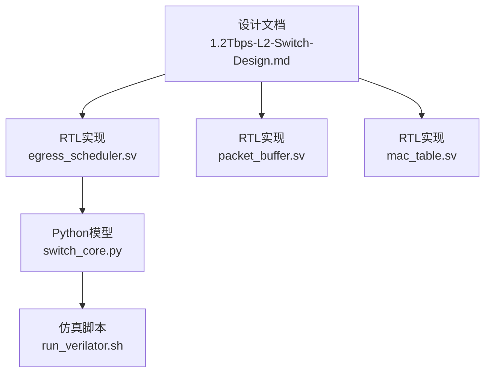
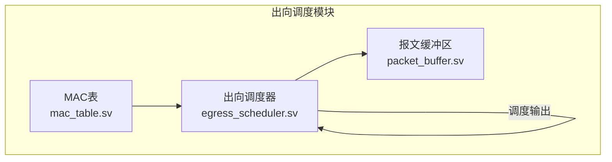
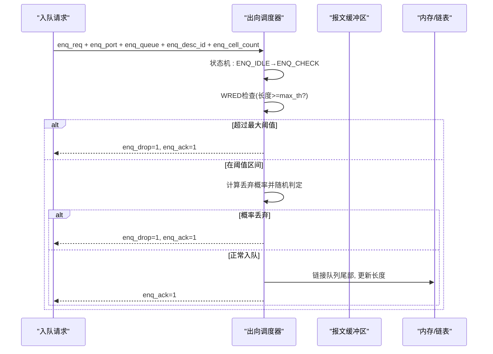
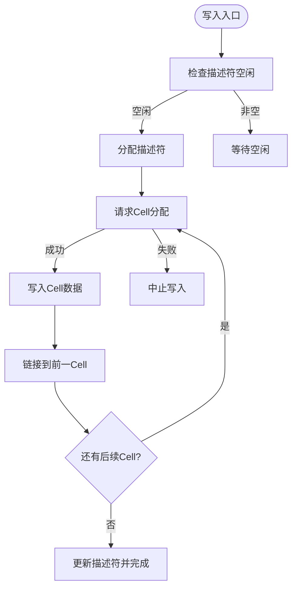
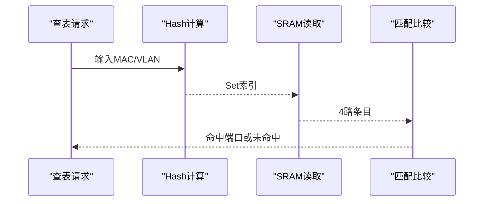
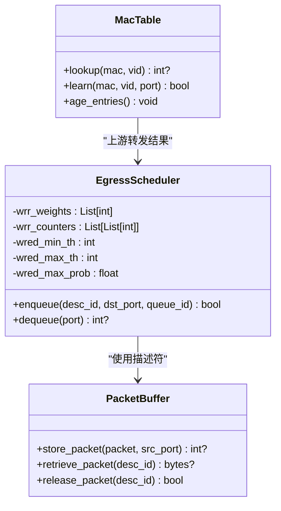
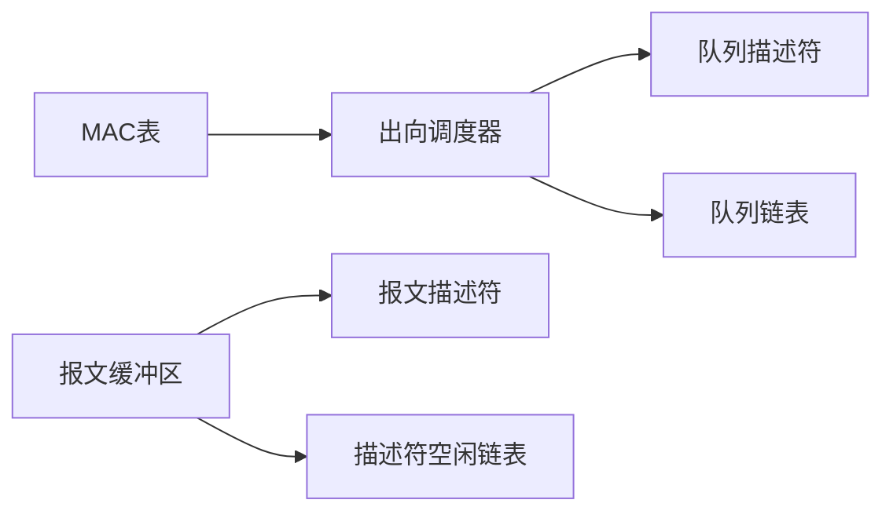

# 出向调度模块

<cite>
**本文引用的文件**
- [egress_scheduler.sv](file://rtl/egress_scheduler.sv)
- [switch_pkg.sv](file://rtl/switch_pkg.sv)
- [packet_buffer.sv](file://rtl/packet_buffer.sv)
- [mac_table.sv](file://rtl/mac_table.sv)
- [switch_core.py](file://model/switch_core.py)
- [1.2Tbps-L2-Switch-Design.md](file://doc/1.2Tbps-L2-Switch-Design.md)
- [run_verilator.sh](file://sim/run_verilator.sh)
</cite>

## 目录
1. [简介](#简介)
2. [项目结构](#项目结构)
3. [核心组件](#核心组件)
4. [架构总览](#架构总览)
5. [详细组件分析](#详细组件分析)
6. [依赖关系分析](#依赖关系分析)
7. [性能考量](#性能考量)
8. [故障排查指南](#故障排查指南)
9. [结论](#结论)
10. [附录](#附录)

## 简介
本文件面向“出向调度模块”的技术文档，围绕以下目标展开：
- 详细说明8个优先级队列的两级调度架构：端口内优先级调度与跨端口带宽公平调度。
- 解释SP+WRR混合调度算法的实现细节与切换机制。
- 文档化拥塞控制机制（WRED/AQM）与动态阈值调整思路。
- 说明流量整形功能（速率限制、令牌桶、突发控制）的设计与实现要点。
- 提供完整的调度接口规范：队列输入、调度输出、配置寄存器。
- 给出调度延迟分析、带宽利用率与公平性评估方法。
- 提供配置示例与性能调优指南。

## 项目结构
该仓库采用“系统级设计文档 + RTL实现 + Python模型 + 仿真脚本”的组织方式：
- 文档层：系统设计说明，包含调度架构、拥塞控制、接口定义等高层信息。
- RTL层：SystemVerilog实现，包含调度器、缓冲区、MAC表等模块。
- 模型层：Python仿真模型，便于验证调度算法与性能。
- 仿真层：Verilator构建与运行脚本，支持波形与覆盖率收集。

图表来源
- [1.2Tbps-L2-Switch-Design.md](file://doc/1.2Tbps-L2-Switch-Design.md#L1-L767)
- [egress_scheduler.sv](file://rtl/egress_scheduler.sv#L1-L394)
- [packet_buffer.sv](file://rtl/packet_buffer.sv#L1-L427)
- [mac_table.sv](file://rtl/mac_table.sv#L1-L342)
- [switch_core.py](file://model/switch_core.py#L1-L1293)
- [run_verilator.sh](file://sim/run_verilator.sh#L1-L131)

章节来源
- [1.2Tbps-L2-Switch-Design.md](file://doc/1.2Tbps-L2-Switch-Design.md#L513-L592)
- [egress_scheduler.sv](file://rtl/egress_scheduler.sv#L1-L43)
- [switch_pkg.sv](file://rtl/switch_pkg.sv#L12-L31)

## 核心组件
- 出向调度器（egress_scheduler.sv）
  - 实现384队列（48端口×8优先级）两级调度：端口内SP+WRR + 跨端口带宽公平。
  - 集成WRED/AQM拥塞控制与统计计数器。
- 报文缓冲区（packet_buffer.sv）
  - 管理Cell链表、描述符池、读写状态机与释放流程。
- MAC表（mac_table.sv）
  - 4路组相联Hash表，支持查表、学习、老化与配置写入。
- Python模型（switch_core.py）
  - 提供调度器、缓冲区、MAC表等模块的Python仿真实现，便于算法验证与性能分析。
- 设计文档（1.2Tbps-L2-Switch-Design.md）
  - 定义两级调度架构、WRED/AQM、流量整形、接口与寄存器等高层规范。

章节来源
- [egress_scheduler.sv](file://rtl/egress_scheduler.sv#L1-L394)
- [packet_buffer.sv](file://rtl/packet_buffer.sv#L1-L427)
- [mac_table.sv](file://rtl/mac_table.sv#L1-L342)
- [switch_core.py](file://model/switch_core.py#L863-L971)
- [1.2Tbps-L2-Switch-Design.md](file://doc/1.2Tbps-L2-Switch-Design.md#L513-L592)

## 架构总览
两级调度架构由“端口内优先级调度”和“跨端口带宽公平调度”组成：
- 端口内优先级调度：Q7/Q6严格优先级，Q5~Q0加权轮询（WRR），权重为8:4:2:2:1:1。
- 跨端口带宽公平：采用Deficit Weighted Round Robin（DWRR）思想，按端口权重分配带宽，保证长期公平性。
- 拥塞控制：WRED/AQM，结合尾部丢弃与概率丢弃，动态阈值随队列长度变化。
- 流量整形：每端口出向速率限制，支持CIR/CBS与PIR/PBS，粒度为1Mbps。

图表来源
- [egress_scheduler.sv](file://rtl/egress_scheduler.sv#L1-L394)
- [packet_buffer.sv](file://rtl/packet_buffer.sv#L1-L427)
- [mac_table.sv](file://rtl/mac_table.sv#L1-L342)

章节来源
- [1.2Tbps-L2-Switch-Design.md](file://doc/1.2Tbps-L2-Switch-Design.md#L530-L569)
- [egress_scheduler.sv](file://rtl/egress_scheduler.sv#L205-L229)

## 详细组件分析

### 出向调度器（egress_scheduler.sv）
- 队列结构与参数
  - 每端口8个优先级队列（Q7~Q0），共384队列。
  - 队列描述符包含头指针、尾指针、长度（Cell数）、状态等。
- 入队（Enqueue）流程
  - 状态机：空闲→检查→写入→完成。
  - WRED检查：超过最大阈值尾部丢弃；处于最小阈值与最大阈值之间按概率丢弃；否则正常入队。
  - 链接队列尾部，更新队列长度与尾部标记。
- 出队（Dequeue）流程（每端口独立）
  - 状态机：空闲→选择→读取→输出。
  - 端口内优先级选择：先检查Q7/Q6严格优先级，若为空则进入WRR阶段。
  - WRR阶段：对Q5~Q0按权重轮询，计数器达到权重后重置，确保公平性。
  - 读取队列头描述符ID与队列号，更新队列头，必要时清空队列并重置长度。
- WRR权重配置
  - 复位时初始化权重：Q5=8、Q4=4、Q3=2、Q2=2、Q1=1、Q0=1。
- WRED/AQM
  - 随机数生成：LFSR生成伪随机数，用于概率丢弃判定。
  - 丢弃策略：队列长度≥最大阈值尾部丢弃；在最小阈值与最大阈值之间按线性概率丢弃。
- 统计计数器
  - 入队计数、出队计数、丢弃计数，便于性能分析与调优。

图表来源
- [egress_scheduler.sv](file://rtl/egress_scheduler.sv#L90-L185)

章节来源
- [egress_scheduler.sv](file://rtl/egress_scheduler.sv#L48-L185)
- [egress_scheduler.sv](file://rtl/egress_scheduler.sv#L192-L293)

### 报文缓冲区（packet_buffer.sv）
- 描述符池管理：空闲链表、计数器与链表指针。
- 写入状态机：分配描述符→分配Cell→写入数据→链接Cell→完成。
- 读取状态机：读取描述符→读取Cell→输出→推进到下一Cell→完成。
- 释放状态机：读取描述符→逐Cell释放→归还描述符到空闲链表。
- 与Cell分配器协作：通过请求/响应接口完成Cell分配与释放。

图表来源
- [packet_buffer.sv](file://rtl/packet_buffer.sv#L180-L244)

章节来源
- [packet_buffer.sv](file://rtl/packet_buffer.sv#L56-L176)
- [packet_buffer.sv](file://rtl/packet_buffer.sv#L180-L244)
- [packet_buffer.sv](file://rtl/packet_buffer.sv#L315-L373)
- [packet_buffer.sv](file://rtl/packet_buffer.sv#L375-L424)

### MAC表（mac_table.sv）
- 查表流水线：Hash计算→SRAM读取→比较匹配，三阶段流水线提升吞吐。
- 学习状态机：Hash→读取→检查→写入，支持静态/动态条目与老化。
- 老化扫描：按Set×Way遍历，非静态条目年龄递减，归零则删除。
- 统计计数器：查找次数、命中次数、缺失次数、学习次数与条目计数。

图表来源
- [mac_table.sv](file://rtl/mac_table.sv#L67-L145)

章节来源
- [mac_table.sv](file://rtl/mac_table.sv#L47-L150)
- [mac_table.sv](file://rtl/mac_table.sv#L155-L248)
- [mac_table.sv](file://rtl/mac_table.sv#L260-L302)

### Python仿真模型（switch_core.py）
- EgressScheduler类
  - 队列结构：每端口8个队列，描述符与链表管理。
  - SP+WRR调度：Q7/Q6严格优先级，Q5~Q0按权重轮询。
  - WRED/AQM：基于队列长度的尾部丢弃与概率丢弃。
  - 统计：入队、出队、丢弃计数。
- PacketBuffer类
  - 描述符池、Cell链表、读写与释放状态机。
- MAC表类
  - 4路组相联Hash表，学习、老化与统计。

图表来源
- [switch_core.py](file://model/switch_core.py#L863-L971)
- [switch_core.py](file://model/switch_core.py#L351-L481)
- [switch_core.py](file://model/switch_core.py#L487-L641)

章节来源
- [switch_core.py](file://model/switch_core.py#L863-L971)
- [switch_core.py](file://model/switch_core.py#L351-L481)
- [switch_core.py](file://model/switch_core.py#L487-L641)

## 依赖关系分析
- 模块耦合
  - 出向调度器依赖队列描述符与链表结构，与报文缓冲区紧密耦合。
  - 报文缓冲区依赖Cell分配器与内存接口，负责描述符与Cell的生命周期管理。
  - MAC表为上游模块，提供转发决策，影响调度器的入队路径。
- 数据结构依赖
  - 队列描述符（queue_desc_t）与报文描述符（pkt_desc_t）是调度与缓冲的关键数据结构。
  - 队列链表（queue_link）与描述符空闲链表（desc_free_link）支撑O(1)入队与出队。
- 外部依赖
  - 设计文档定义了接口与寄存器地址空间，作为RTL与软件驱动的契约。

图表来源
- [egress_scheduler.sv](file://rtl/egress_scheduler.sv#L48-L52)
- [packet_buffer.sv](file://rtl/packet_buffer.sv#L58-L65)
- [mac_table.sv](file://rtl/mac_table.sv#L47-L49)

章节来源
- [switch_pkg.sv](file://rtl/switch_pkg.sv#L119-L126)
- [switch_pkg.sv](file://rtl/switch_pkg.sv#L100-L117)

## 性能考量
- 调度延迟
  - 端口内SP+WRR为组合逻辑选择，延迟主要受限于队列状态查询与链表更新。
  - 建议：保持队列状态查询与链表指针更新在单周期内完成，避免流水线插入。
- 带宽利用率
  - WRR权重8:4:2:2:1:1确保高优先级队列获得更大份额，同时兼顾低优先级公平性。
  - 建议：根据业务流量特征调整权重，如视频/语音优先级提高，后台流量降低。
- 公平性评估
  - DWRR思想：按端口权重分配带宽，长期公平性由权重决定。
  - 建议：监控各端口队列长度分布，避免某端口长期拥塞导致公平性下降。
- 拥塞控制
  - WRED/AQM：尾部丢弃与概率丢弃相结合，减少全局同步与抖动。
  - 建议：动态阈值可根据端口负载自适应调整，或引入RTT感知的AQM参数。
- 流量整形
  - 令牌桶：CIR/CBS与PIR/PBS分别控制承诺与峰值速率与突发。
  - 建议：整形粒度为1Mbps，适合数据中心场景；对超大突发需结合缓冲深度与WRED阈值协同。

章节来源
- [1.2Tbps-L2-Switch-Design.md](file://doc/1.2Tbps-L2-Switch-Design.md#L530-L569)
- [egress_scheduler.sv](file://rtl/egress_scheduler.sv#L55-L70)
- [egress_scheduler.sv](file://rtl/egress_scheduler.sv#L125-L141)

## 故障排查指南
- 入队失败（丢弃过多）
  - 检查WRED阈值设置是否过低，导致频繁概率丢弃。
  - 检查队列长度是否持续接近最大阈值，考虑增大缓冲深度或调整整形参数。
- 出队阻塞
  - 检查端口内SP队列（Q7/Q6）是否长期拥塞，优先优化高优先级业务。
  - 检查WRR计数器是否异常，确认权重与计数器重置逻辑正确。
- 描述符泄漏
  - 检查释放状态机是否正确执行，确保描述符归还到空闲链表。
  - 检查Cell释放是否与引用计数一致，避免悬挂Cell。
- MAC表学习风暴
  - 检查学习速率限制与学习队列深度，防止MAC洪泛攻击。
  - 定期触发老化扫描，清理无效条目。

章节来源
- [egress_scheduler.sv](file://rtl/egress_scheduler.sv#L125-L141)
- [egress_scheduler.sv](file://rtl/egress_scheduler.sv#L273-L280)
- [packet_buffer.sv](file://rtl/packet_buffer.sv#L375-L424)
- [mac_table.sv](file://rtl/mac_table.sv#L538-L592)

## 结论
本出向调度模块采用两级调度架构：端口内SP+WRR与跨端口带宽公平，结合WRED/AQM与流量整形，满足高吞吐、低延迟与公平性的设计目标。通过Python模型与RTL实现的对比验证，可进一步优化权重、阈值与整形参数，以适配不同业务场景的性能需求。

## 附录

### 调度接口规范
- 入队接口（来自设计文档）
  - 输入：enq_req、enq_port、enq_queue、enq_desc_id、enq_cell_count
  - 输出：enq_ack、enq_drop
- 出队接口（每端口）
  - 输入：deq_req[47:0]
  - 输出：deq_valid[47:0]、deq_desc_id[47:0]、deq_queue[47:0]
- 队列状态查询
  - 输入：query_port、query_queue
  - 输出：query_depth、query_state
- WRED配置
  - 输入：wred_min_th、wred_max_th、wred_max_prob
- 统计计数器
  - 输出：stat_enq_count、stat_deq_count、stat_drop_count

章节来源
- [1.2Tbps-L2-Switch-Design.md](file://doc/1.2Tbps-L2-Switch-Design.md#L646-L681)
- [egress_scheduler.sv](file://rtl/egress_scheduler.sv#L13-L42)

### 配置示例与性能调优
- WRED阈值设置
  - 建议：最小阈值设为缓冲深度的20%~30%，最大阈值设为80%~90%，最大丢弃概率控制在10%~30%。
- WRR权重调整
  - 建议：视频/语音业务提高Q7/Q6权重，后台业务降低Q5~Q0权重，确保关键业务优先。
- 流量整形
  - 建议：CIR按端口线速的80%~90%设置，CBS为典型MTU的若干倍，PIR为CIR的1.2~1.5倍，PBS为PIR的若干倍。
- 仿真与验证
  - 使用Verilator脚本构建与运行仿真，开启波形与覆盖率收集，验证调度公平性与拥塞控制效果。

章节来源
- [1.2Tbps-L2-Switch-Design.md](file://doc/1.2Tbps-L2-Switch-Design.md#L552-L569)
- [run_verilator.sh](file://sim/run_verilator.sh#L62-L105)