# MAC查找引擎

<cite>
**本文引用的文件**
- [mac_table.sv](file://rtl/mac_table.sv)
- [switch_pkg.sv](file://rtl/switch_pkg.sv)
- [switch_core.sv](file://rtl/switch_core.sv)
- [tb_mac_table.sv](file://tb/tb_mac_table.sv)
- [1.2Tbps-L2-Switch-Design.md](file://doc/1.2Tbps-L2-Switch-Design.md)
- [switch_core.py](file://model/switch_core.py)
</cite>

## 目录
1. [简介](#简介)
2. [项目结构](#项目结构)
3. [核心组件](#核心组件)
4. [架构总览](#架构总览)
5. [详细组件分析](#详细组件分析)
6. [依赖关系分析](#依赖关系分析)
7. [性能考量](#性能考量)
8. [故障排查指南](#故障排查指南)
9. [结论](#结论)
10. [附录](#附录)

## 简介
本文件面向MAC查找引擎模块，系统性阐述其4路组相联哈希表设计、CRC16哈希函数选择与VID参与的哈希计算公式、MAC表条目存储格式（72bit）、查找流水线（哈希计算1cycle、SRAM访问2cycle、比较匹配1cycle）、MAC学习机制（触发条件、学习队列管理、老化算法）、组播/广播泛洪与VLAN成员检查、MAC表容量与吞吐量分析以及性能优化策略。文档同时提供查找时序图与学习流程图，帮助读者快速理解并应用该模块。

## 项目结构
MAC查找引擎位于RTL目录的mac_table.sv，配合参数包switch_pkg.sv定义数据宽度与表结构参数；顶层switch_core.sv集成MAC表、入向流水线与出向调度；测试平台tb_mac_table.sv验证功能与时序；设计文档1.2Tbps-L2-Switch-Design.md提供了整体架构与性能指标；Python模型switch_core.py展示了MAC表条目格式、学习与老化行为，便于对照理解。

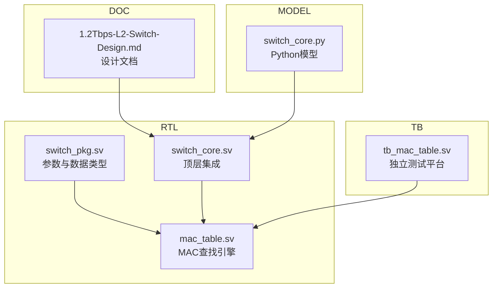

图表来源
- [mac_table.sv](file://rtl/mac_table.sv#L1-L45)
- [switch_pkg.sv](file://rtl/switch_pkg.sv#L23-L26)
- [switch_core.sv](file://rtl/switch_core.sv#L207-L235)
- [tb_mac_table.sv](file://tb/tb_mac_table.sv#L58-L83)
- [1.2Tbps-L2-Switch-Design.md](file://doc/1.2Tbps-L2-Switch-Design.md#L184-L234)
- [switch_core.py](file://model/switch_core.py#L487-L641)

章节来源
- [mac_table.sv](file://rtl/mac_table.sv#L1-L45)
- [switch_pkg.sv](file://rtl/switch_pkg.sv#L23-L26)
- [switch_core.sv](file://rtl/switch_core.sv#L207-L235)
- [tb_mac_table.sv](file://tb/tb_mac_table.sv#L58-L83)
- [1.2Tbps-L2-Switch-Design.md](file://doc/1.2Tbps-L2-Switch-Design.md#L184-L234)
- [switch_core.py](file://model/switch_core.py#L487-L641)

## 核心组件
- 4路组相联哈希表：32K条目，8K sets × 4 ways，Set索引由CRC16(MAC) XOR VID计算。
- 查找流水线：Stage1(1cycle哈希) → Stage2(2cycle SRAM读) → Stage3(1cycle比较)。
- MAC学习：基于SMAC未命中触发，带学习队列与端口速率限制，2bit老化计数器辅助。
- 老化：软件定时扫描（默认300秒），硬件辅助2bit age计数器，命中时重置age。
- 组播/广播：广播与组播均泛洪到VLAN成员端口（排除源端口）。
- 条目格式：72bit，包含MAC、VID、端口、静态标志、老化计数器、有效标志与保留位。

章节来源
- [mac_table.sv](file://rtl/mac_table.sv#L49-L62)
- [mac_table.sv](file://rtl/mac_table.sv#L86-L145)
- [mac_table.sv](file://rtl/mac_table.sv#L155-L248)
- [mac_table.sv](file://rtl/mac_table.sv#L262-L302)
- [switch_pkg.sv](file://rtl/switch_pkg.sv#L128-L137)
- [1.2Tbps-L2-Switch-Design.md](file://doc/1.2Tbps-L2-Switch-Design.md#L184-L234)

## 架构总览
MAC查找引擎在顶层switch_core.sv中被集成，通过lookup_req将DMAC、VID与源端口传递给MAC表；MAC表返回lookup_valid、lookup_hit与lookup_port；顶层根据广播/组播/单播与命中情况决定泛洪或单播转发，并触发入队。

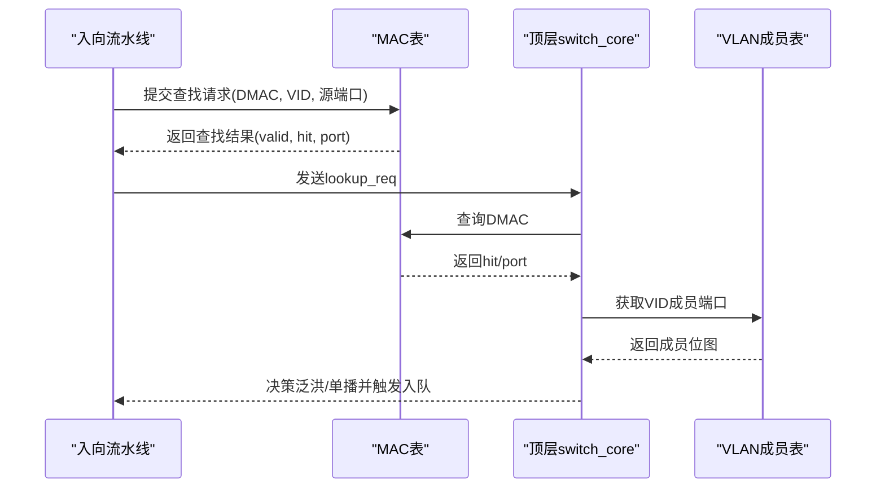

图表来源
- [switch_core.sv](file://rtl/switch_core.sv#L271-L323)
- [switch_core.sv](file://rtl/switch_core.sv#L109-L117)
- [switch_core.sv](file://rtl/switch_core.sv#L209-L235)

章节来源
- [switch_core.sv](file://rtl/switch_core.sv#L271-L323)
- [switch_core.sv](file://rtl/switch_core.sv#L209-L235)

## 详细组件分析

### 4路组相联哈希表与哈希函数
- 表容量：32K条目，4路组相联，8K sets。
- 哈希函数：CRC16(MAC[47:0]) XOR VID[11:0]，对8K sets取模得到Set索引。
- 优点：简单高效，VID参与降低跨VLAN冲突，提升命中率。

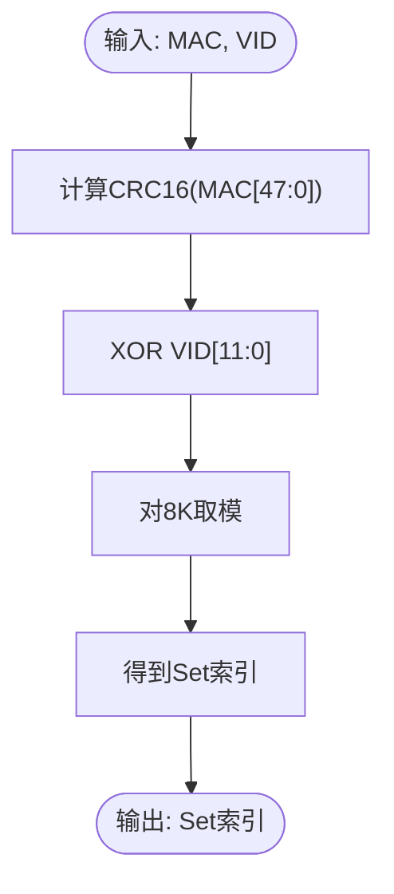

图表来源
- [mac_table.sv](file://rtl/mac_table.sv#L54-L62)

章节来源
- [mac_table.sv](file://rtl/mac_table.sv#L54-L62)
- [switch_pkg.sv](file://rtl/switch_pkg.sv#L23-L26)

### MAC表条目存储格式（72bit）
- 字段组成：MAC地址(48bit)、VLAN ID(12bit)、端口(6bit)、静态标志(1bit)、老化计数器(2bit)、有效标志(1bit)、保留(2bit)。
- 用途：存储学习到的MAC-VID-端口映射，静态条目不受老化影响。

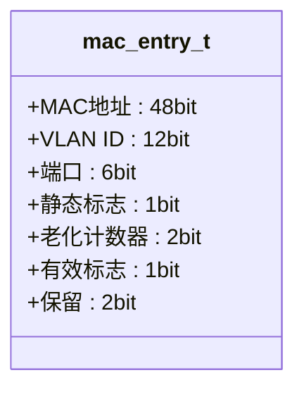

图表来源
- [switch_pkg.sv](file://rtl/switch_pkg.sv#L128-L137)

章节来源
- [switch_pkg.sv](file://rtl/switch_pkg.sv#L128-L137)

### 查找流水线（3阶段）
- Stage1(1cycle)：计算Set索引。
- Stage2(2cycle)：SRAM读取4路条目。
- Stage3(1cycle)：比较MAC、VID与有效位，命中返回端口。
- 吞吐：500M次/秒（2倍线速裕量）。

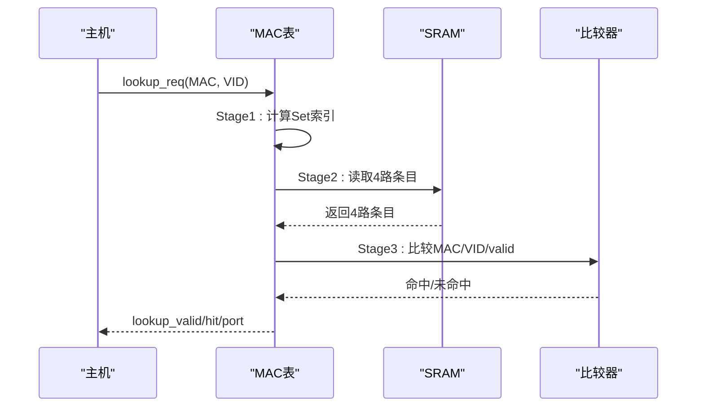

图表来源
- [mac_table.sv](file://rtl/mac_table.sv#L86-L145)

章节来源
- [mac_table.sv](file://rtl/mac_table.sv#L86-L145)
- [1.2Tbps-L2-Switch-Design.md](file://doc/1.2Tbps-L2-Switch-Design.md#L205-L221)

### MAC学习机制
- 触发条件：SMAC在表中未命中（且端口状态允许）。
- 学习队列：深度512，防止学习风暴。
- 速率限制：每端口每秒最多1K次学习。
- 替换策略：优先空闲槽位，否则选择非静态且age最小者。
- 写入：更新MAC、VID、端口、清零静态标志、设置age=3、置valid。

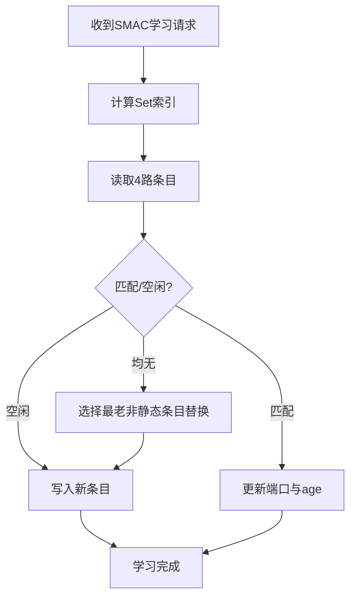

图表来源
- [mac_table.sv](file://rtl/mac_table.sv#L155-L248)

章节来源
- [mac_table.sv](file://rtl/mac_table.sv#L155-L248)
- [1.2Tbps-L2-Switch-Design.md](file://doc/1.2Tbps-L2-Switch-Design.md#L223-L234)

### 老化算法
- 软件定时扫描：默认300秒触发一次，扫描全表。
- 硬件辅助：2bit age计数器，命中时重置为3，扫描时递减。
- 删除条件：age<=0且非静态条目，置无效。

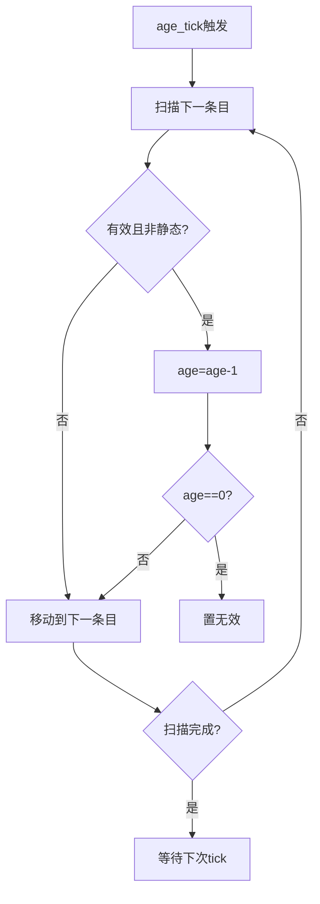

图表来源
- [mac_table.sv](file://rtl/mac_table.sv#L262-L302)

章节来源
- [mac_table.sv](file://rtl/mac_table.sv#L262-L302)
- [1.2Tbps-L2-Switch-Design.md](file://doc/1.2Tbps-L2-Switch-Design.md#L230-L234)

### 组播/广播处理与VLAN成员检查
- 广播：DMAC全1时，泛洪到VID成员端口（排除源端口）。
- 组播：DMAC第0bit为1时，泛洪到VID成员端口（排除源端口）。
- 单播：命中返回端口；未命中泛洪到VID成员端口（排除源端口）。

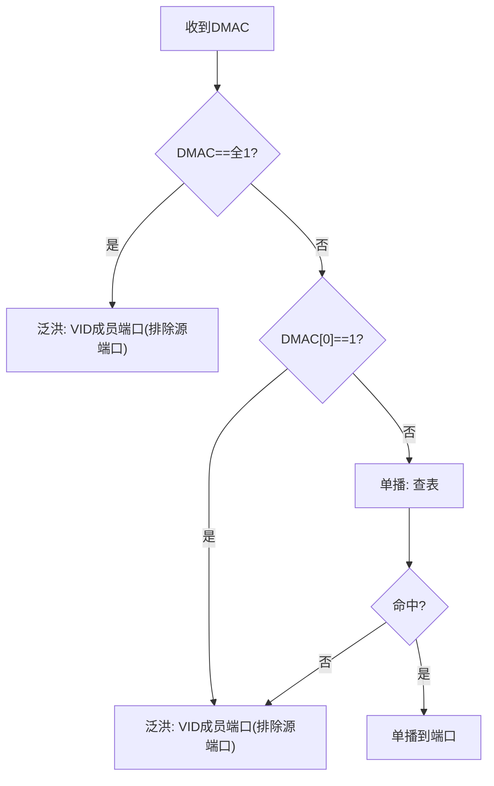

图表来源
- [switch_core.sv](file://rtl/switch_core.sv#L293-L317)

章节来源
- [switch_core.sv](file://rtl/switch_core.sv#L293-L317)

## 依赖关系分析
- 参数与类型：switch_pkg.sv定义MAC_TABLE_SIZE、Ways、Sets、Set索引位宽、VLAN ID宽度与mac_entry_t。
- 实现与接口：mac_table.sv实现哈希、流水线、学习、老化与统计；switch_core.sv集成并驱动查找与转发决策。
- 测试与验证：tb_mac_table.sv提供独立测试环境，验证学习、查表、老化与统计。
- Python模型：switch_core.py提供等价的条目格式、学习与老化逻辑，便于对照与仿真。

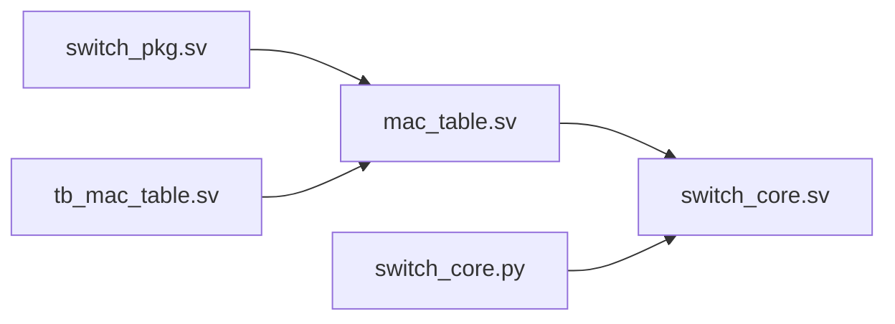

图表来源
- [switch_pkg.sv](file://rtl/switch_pkg.sv#L23-L26)
- [mac_table.sv](file://rtl/mac_table.sv#L1-L45)
- [switch_core.sv](file://rtl/switch_core.sv#L207-L235)
- [tb_mac_table.sv](file://tb/tb_mac_table.sv#L58-L83)
- [switch_core.py](file://model/switch_core.py#L487-L641)

章节来源
- [switch_pkg.sv](file://rtl/switch_pkg.sv#L23-L26)
- [mac_table.sv](file://rtl/mac_table.sv#L1-L45)
- [switch_core.sv](file://rtl/switch_core.sv#L207-L235)
- [tb_mac_table.sv](file://tb/tb_mac_table.sv#L58-L83)
- [switch_core.py](file://model/switch_core.py#L487-L641)

## 性能考量
- 容量与组织：32K条目，4路组相联，8K sets，降低冲突与提高命中率。
- 查找吞吐：3阶段流水线，500M次/秒（2倍线速裕量）。
- 学习速率限制：每端口每秒最多1K次，防止MAC洪泛攻击。
- 老化扫描：默认300秒扫描全表，硬件2bit age计数器辅助，命中重置。
- 组播/广播：使用VLAN成员位图快速判断，减少遍历成本。

章节来源
- [1.2Tbps-L2-Switch-Design.md](file://doc/1.2Tbps-L2-Switch-Design.md#L184-L234)
- [switch_core.py](file://model/switch_core.py#L538-L592)

## 故障排查指南
- 查表未命中：确认SMAC是否已学习、VID是否正确、端口状态是否允许学习。
- 学习失败：检查学习队列是否满、端口速率限制是否触发、静态条目是否覆盖。
- 老化异常：确认age_tick是否按时触发、age计数器是否正确递减、静态条目是否被忽略。
- 泛洪过多：检查VLAN成员配置、DMAC是否误判为广播/组播。

章节来源
- [mac_table.sv](file://rtl/mac_table.sv#L155-L248)
- [mac_table.sv](file://rtl/mac_table.sv#L262-L302)
- [switch_core.sv](file://rtl/switch_core.sv#L293-L317)

## 结论
MAC查找引擎通过4路组相联哈希表与高效的3阶段流水线，实现了线速级的查表吞吐；结合学习队列与速率限制、硬件辅助老化，确保在高负载场景下的稳定性与安全性；广播/组播泛洪与VLAN成员检查进一步提升了转发决策的准确性。整体设计满足1.2Tbps交换机的性能与可靠性要求。

## 附录

### MAC表容量与查找吞吐量
- 容量：32K条目，4路组相联，8K sets。
- 吞吐：500M次/秒（2倍线速裕量）。
- 哈希：CRC16(MAC) XOR VID，对8K sets取模。

章节来源
- [switch_pkg.sv](file://rtl/switch_pkg.sv#L23-L26)
- [1.2Tbps-L2-Switch-Design.md](file://doc/1.2Tbps-L2-Switch-Design.md#L184-L221)

### 查找时序图（代码级）
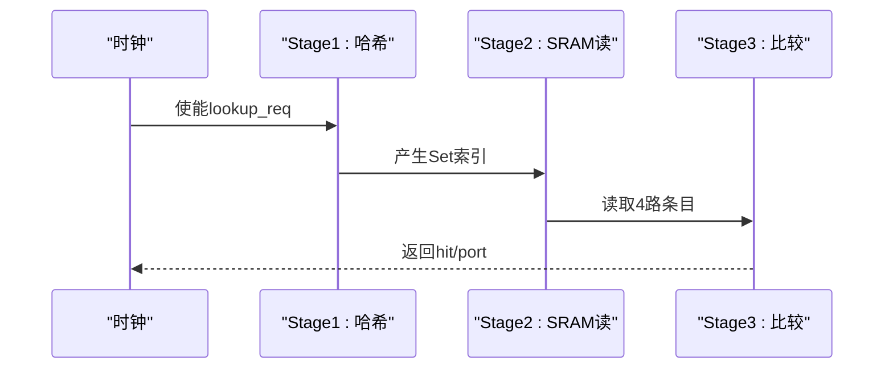

图表来源
- [mac_table.sv](file://rtl/mac_table.sv#L86-L145)

### 学习流程图（代码级）
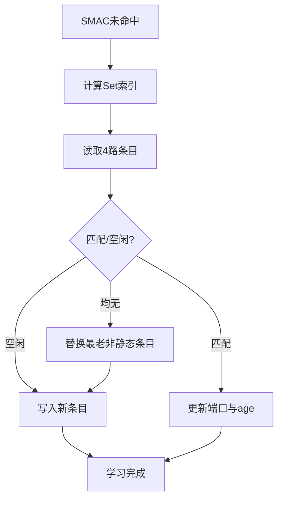

图表来源
- [mac_table.sv](file://rtl/mac_table.sv#L155-L248)