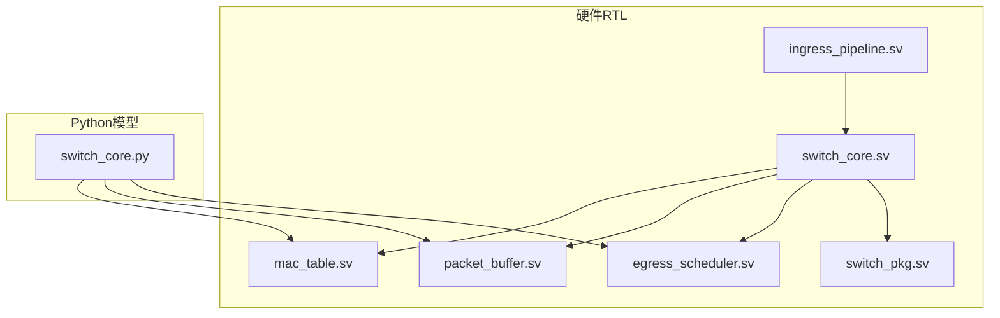
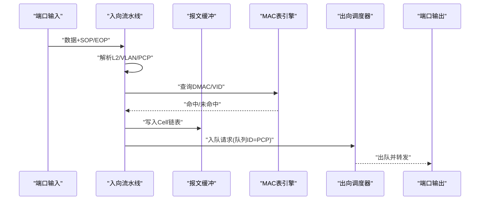
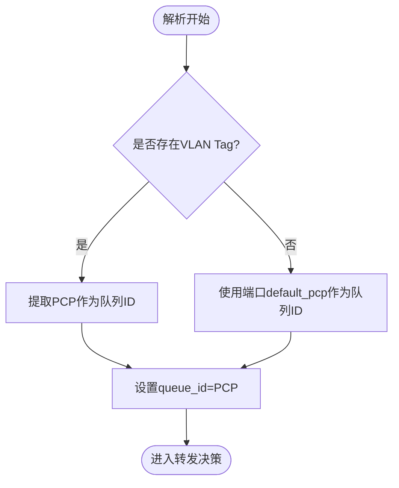
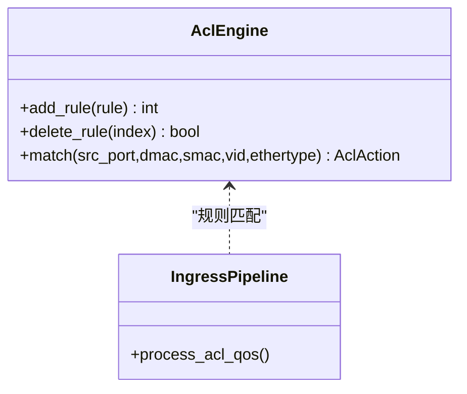
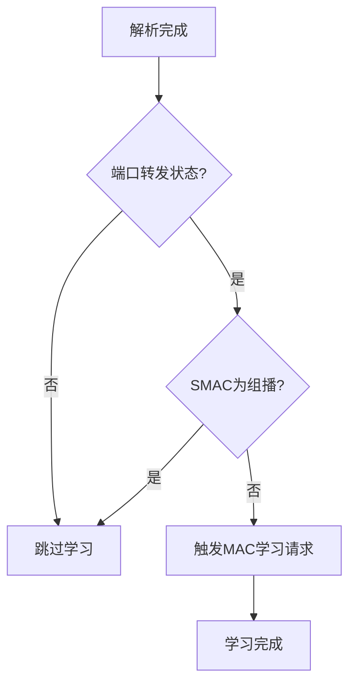
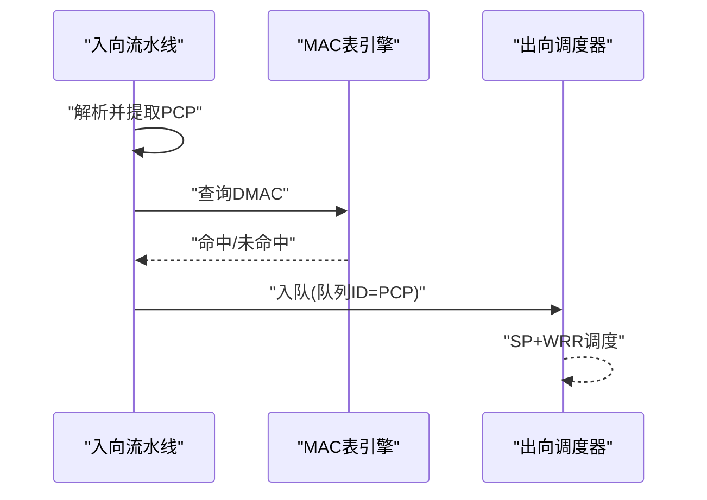
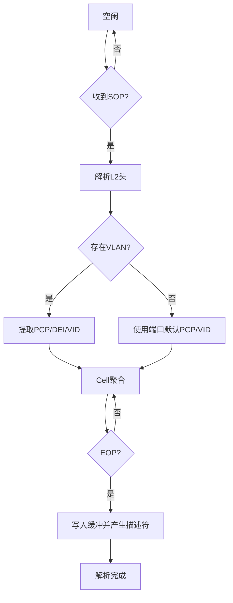
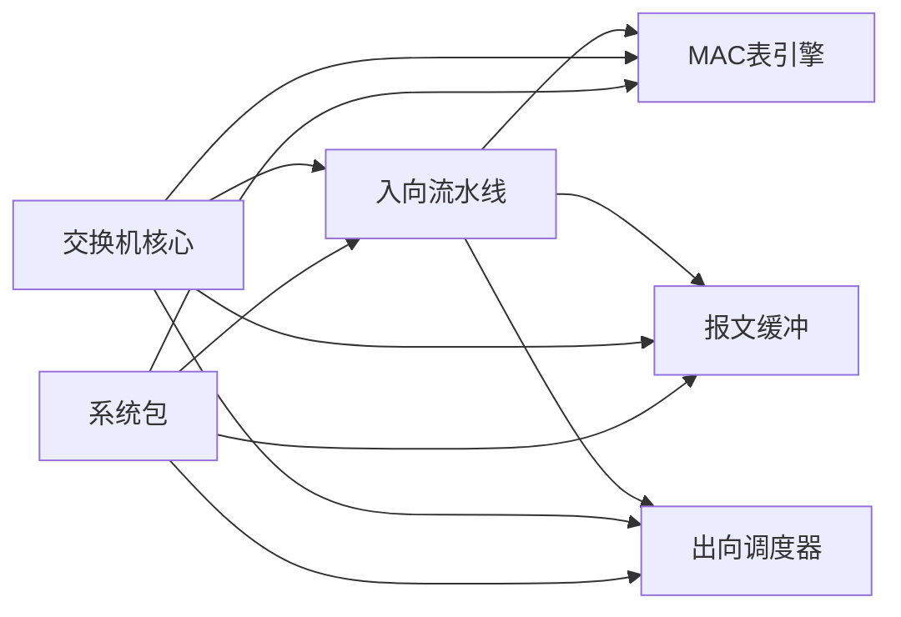
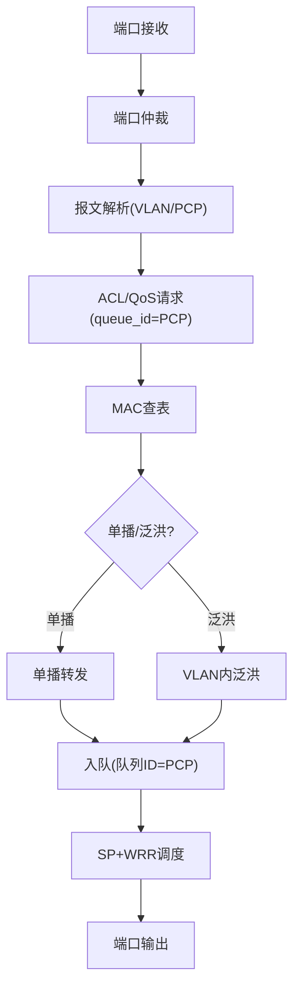

# Ingress QoS与ACL处理

<cite>
**本文引用的文件**
- [ingress_pipeline.sv](file://rtl/ingress_pipeline.sv)
- [switch_core.sv](file://rtl/switch_core.sv)
- [mac_table.sv](file://rtl/mac_table.sv)
- [packet_buffer.sv](file://rtl/packet_buffer.sv)
- [egress_scheduler.sv](file://rtl/egress_scheduler.sv)
- [switch_pkg.sv](file://rtl/switch_pkg.sv)
- [switch_core.py](file://model/switch_core.py)
- [1.2Tbps-L2-Switch-Design.md](file://doc/1.2Tbps-L2-Switch-Design.md)
</cite>

## 目录
1. [简介](#简介)
2. [项目结构](#项目结构)
3. [核心组件](#核心组件)
4. [架构总览](#架构总览)
5. [详细组件分析](#详细组件分析)
6. [依赖关系分析](#依赖关系分析)
7. [性能考量](#性能考量)
8. [故障排查指南](#故障排查指南)
9. [结论](#结论)
10. [附录](#附录)

## 简介
本文面向Ingress QoS与ACL处理模块，围绕802.1p优先级映射、ACL引擎集成、MAC学习触发机制以及QoS队列选择与ACL处理的时序安排进行深入技术说明。结合RTL与Python模型，给出从报文接收到底层转发的完整处理流程、配置示例与性能优化策略，帮助读者快速理解并正确部署该模块。

## 项目结构
本项目采用“硬件RTL + Python模型”的双轨设计：
- 硬件侧：SystemVerilog模块化实现，包含入口解析、ACL/QoS、MAC学习、缓冲与调度等子模块。
- 模型侧：Python仿真模型，提供ACL规则匹配、MAC学习、队列调度等逻辑的高层抽象与验证。

图表来源
- [ingress_pipeline.sv](file://rtl/ingress_pipeline.sv#L1-L319)
- [switch_core.sv](file://rtl/switch_core.sv#L1-L454)
- [mac_table.sv](file://rtl/mac_table.sv#L1-L342)
- [packet_buffer.sv](file://rtl/packet_buffer.sv#L1-L427)
- [egress_scheduler.sv](file://rtl/egress_scheduler.sv#L1-L394)
- [switch_pkg.sv](file://rtl/switch_pkg.sv#L1-L219)
- [switch_core.py](file://model/switch_core.py#L1-L800)

章节来源
- [switch_core.sv](file://rtl/switch_core.sv#L1-L454)
- [switch_pkg.sv](file://rtl/switch_pkg.sv#L1-L219)

## 核心组件
- 入向流水线（Ingress Pipeline）：负责端口仲裁、报文解析、QoS优先级提取、ACL请求生成、MAC学习触发与统计。
- MAC表引擎（MAC Table）：基于Hash+SRAM的4路组相联查表与学习，支持老化与静态条目。
- 报文缓冲（Packet Buffer）：Cell链表存储、描述符管理、读写与释放。
- 出向调度（Egress Scheduler）：384队列（48端口×8优先级），SP+WRR两级调度，WRED拥塞控制。
- 系统包（switch_pkg）：统一的数据类型、参数与接口定义。

章节来源
- [ingress_pipeline.sv](file://rtl/ingress_pipeline.sv#L1-L319)
- [mac_table.sv](file://rtl/mac_table.sv#L1-L342)
- [packet_buffer.sv](file://rtl/packet_buffer.sv#L1-L427)
- [egress_scheduler.sv](file://rtl/egress_scheduler.sv#L1-L394)
- [switch_pkg.sv](file://rtl/switch_pkg.sv#L1-L219)

## 架构总览
Ingress阶段的关键路径：端口仲裁 → 报文解析（含VLAN/PCP）→ 生成ACL/QoS请求 → 查询MAC表 → 决策转发/泛洪 → 入队调度 → 出队输出。

图表来源
- [ingress_pipeline.sv](file://rtl/ingress_pipeline.sv#L130-L257)
- [switch_core.sv](file://rtl/switch_core.sv#L270-L331)
- [mac_table.sv](file://rtl/mac_table.sv#L66-L151)
- [packet_buffer.sv](file://rtl/packet_buffer.sv#L180-L244)
- [egress_scheduler.sv](file://rtl/egress_scheduler.sv#L87-L185)

## 详细组件分析

### 802.1p优先级映射与默认配置
- PCP到队列ID映射：解析阶段从VLAN Tag中提取PCP（3bit），直接作为队列ID（QUEUE_ID_WIDTH=3）。该映射为一对一，无需额外映射表。
- 默认优先级配置：若无VLAN Tag，则使用端口配置中的default_pcp作为PCP；同时default_vid作为VID参与查找与学习。
- 端口默认配置：复位时初始化每个端口的default_vid与default_pcp，确保无VLAN标签报文也能进入正确的队列。

图表来源
- [ingress_pipeline.sv](file://rtl/ingress_pipeline.sv#L183-L202)
- [switch_core.sv](file://rtl/switch_core.sv#L400-L417)
- [switch_pkg.sv](file://rtl/switch_pkg.sv#L174-L181)

章节来源
- [ingress_pipeline.sv](file://rtl/ingress_pipeline.sv#L183-L202)
- [switch_core.sv](file://rtl/switch_core.sv#L400-L417)
- [switch_pkg.sv](file://rtl/switch_pkg.sv#L174-L181)

### ACL引擎集成与动作执行
- 规则匹配：ACL引擎按优先级顺序匹配，支持源端口、DMAC、SMAC、VID、以太类型等字段，掩码匹配。
- 动作执行：匹配到规则后返回动作（允许/拒绝/镜像/速率限制），当前RTL中通过lookup请求携带queue_id参与后续调度；具体丢弃/镜像/限速等动作在模型侧体现。
- 流控策略应用：模型侧提供速率限制与镜像功能，可在ACL匹配后对报文进行相应处理。

图表来源
- [switch_core.py](file://model/switch_core.py#L707-L775)
- [switch_core.py](file://model/switch_core.py#L781-L800)

章节来源
- [switch_core.py](file://model/switch_core.py#L707-L775)
- [switch_core.py](file://model/switch_core.py#L781-L800)

### MAC学习触发机制
- 触发条件：解析完成且端口处于转发状态（PORT_FORWARDING），且SMAC非组播（SMAC[40]=0）。
- 学习内容：SMAC、VID、源端口，写入MAC表引擎；模型侧提供学习速率限制与老化扫描。
- 组播过滤：SMAC为组播时不触发学习，避免浪费表项与资源。
- 端口状态检查：仅在端口转发状态下学习，阻塞/学习状态不学习。

图表来源
- [ingress_pipeline.sv](file://rtl/ingress_pipeline.sv#L262-L282)
- [switch_pkg.sv](file://rtl/switch_pkg.sv#L79-L85)

章节来源
- [ingress_pipeline.sv](file://rtl/ingress_pipeline.sv#L262-L282)
- [switch_pkg.sv](file://rtl/switch_pkg.sv#L79-L85)

### QoS队列选择与ACL处理时序
- 时序安排：解析完成后即生成ACL/QoS请求（包含DMAC、SMAC、VID、源端口、queue_id=PCP），随后查询MAC表；命中与否决定单播/泛洪；最终入队到对应队列。
- 队列权重：SP（Q7/Q6）优先，WRR（Q5~Q0）按权重调度；模型侧提供WRED与速率限制等拥塞控制策略。
- 与ACL的关系：ACL动作在模型侧体现，硬件侧通过queue_id与转发决策共同影响最终队列选择。

图表来源
- [ingress_pipeline.sv](file://rtl/ingress_pipeline.sv#L241-L257)
- [switch_core.sv](file://rtl/switch_core.sv#L270-L331)
- [egress_scheduler.sv](file://rtl/egress_scheduler.sv#L188-L293)

章节来源
- [ingress_pipeline.sv](file://rtl/ingress_pipeline.sv#L241-L257)
- [switch_core.sv](file://rtl/switch_core.sv#L270-L331)
- [egress_scheduler.sv](file://rtl/egress_scheduler.sv#L188-L293)

### 报文解析与Cell聚合
- 解析阶段：L2头提取、VLAN Tag检查、PCP/DEI/VID解析、报文长度统计与Cell聚合。
- 输出：满足CELL_SIZE或EOP时，打包为Cell并写入缓冲；描述符携带queue_id与desc_id供后续调度使用。

图表来源
- [ingress_pipeline.sv](file://rtl/ingress_pipeline.sv#L130-L224)
- [ingress_pipeline.sv](file://rtl/ingress_pipeline.sv#L226-L257)

章节来源
- [ingress_pipeline.sv](file://rtl/ingress_pipeline.sv#L130-L224)
- [ingress_pipeline.sv](file://rtl/ingress_pipeline.sv#L226-L257)

### 端口仲裁与并发处理
- 分层仲裁：48端口分为6组，组内轮询仲裁，组间轮询选择，确保公平与时序可控。
- Ready/Valid握手：根据当前解析状态与缓冲就绪情况，动态驱动端口ready信号，避免丢失数据。

章节来源
- [ingress_pipeline.sv](file://rtl/ingress_pipeline.sv#L52-L126)
- [ingress_pipeline.sv](file://rtl/ingress_pipeline.sv#L285-L291)

## 依赖关系分析
- 入向流水线依赖端口配置（default_pcp/default_vid）、解析结果（parsed_hdr）与缓冲描述符（buf_desc_id）。
- 查表引擎依赖解析结果（DMAC/VID）与端口状态（转发状态）。
- 出向调度依赖队列描述符（queue_id）与WRED/WRR配置。
- 系统包提供统一的数据类型与参数，确保模块间接口一致性。

图表来源
- [switch_core.sv](file://rtl/switch_core.sv#L238-L268)
- [switch_pkg.sv](file://rtl/switch_pkg.sv#L1-L219)

章节来源
- [switch_core.sv](file://rtl/switch_core.sv#L238-L268)
- [switch_pkg.sv](file://rtl/switch_pkg.sv#L1-L219)

## 性能考量
- 线速Cell处理：500MHz下每周期可处理约2.34个128B Cell，核心总线4096bit足以满足1.2Tbps带宽。
- 队列调度：SP优先保障关键业务（Q7/Q6），WRR平衡尽力而为流量（Q5~Q0）；WRED在拥塞时进行概率丢弃，避免尾部丢弃引发的全局震荡。
- 缓冲管理：8MB纯片内SRAM，16 Banks并行，满足突发吸收与Cut-Through转发需求。
- 学习与老化：模型侧提供学习速率限制与老化扫描，避免MAC洪泛与表项膨胀。

章节来源
- [1.2Tbps-L2-Switch-Design.md](file://doc/1.2Tbps-L2-Switch-Design.md#L78-L145)
- [egress_scheduler.sv](file://rtl/egress_scheduler.sv#L55-L70)
- [packet_buffer.sv](file://rtl/packet_buffer.sv#L281-L297)

## 故障排查指南
- 端口不转发：检查端口状态是否为PORT_FORWARDING，否则不会触发MAC学习与转发。
- VLAN/PCP异常：确认VLAN Tag存在性与default_pcp配置，避免无标签报文进入错误队列。
- ACL未生效：核对ACL规则优先级与掩码匹配，确保规则被正确匹配；模型侧确认动作类型（PERMIT/DENY/MIRROR/RATE_LIMIT）。
- 队列拥塞：观察WRED阈值与概率，必要时调整权重或启用速率限制。
- 统计异常：查看端口收发包/字节/丢弃计数，定位背压与缓冲压力。

章节来源
- [ingress_pipeline.sv](file://rtl/ingress_pipeline.sv#L262-L282)
- [switch_core.sv](file://rtl/switch_core.sv#L400-L417)
- [egress_scheduler.sv](file://rtl/egress_scheduler.sv#L125-L151)

## 结论
Ingress QoS与ACL处理模块通过简洁高效的解析与队列映射，实现了从802.1p到队列ID的一对一映射，并在转发决策前完成ACL匹配与MAC学习触发。硬件与模型协同，既保证了线速转发，又提供了灵活的策略控制与可观测性。结合合理的队列权重与WRED策略，可在高负载场景下维持稳定转发性能。

## 附录

### 配置示例（端口默认优先级）
- 设置端口默认VID与PCP：在复位初始化中为每个端口配置default_vid与default_pcp，确保无VLAN标签报文进入预期队列。
- 示例路径参考
  - [switch_core.sv](file://rtl/switch_core.sv#L400-L417)

### 处理流程图（从接收到底层转发）

图表来源
- [ingress_pipeline.sv](file://rtl/ingress_pipeline.sv#L130-L257)
- [switch_core.sv](file://rtl/switch_core.sv#L270-L331)
- [egress_scheduler.sv](file://rtl/egress_scheduler.sv#L188-L293)