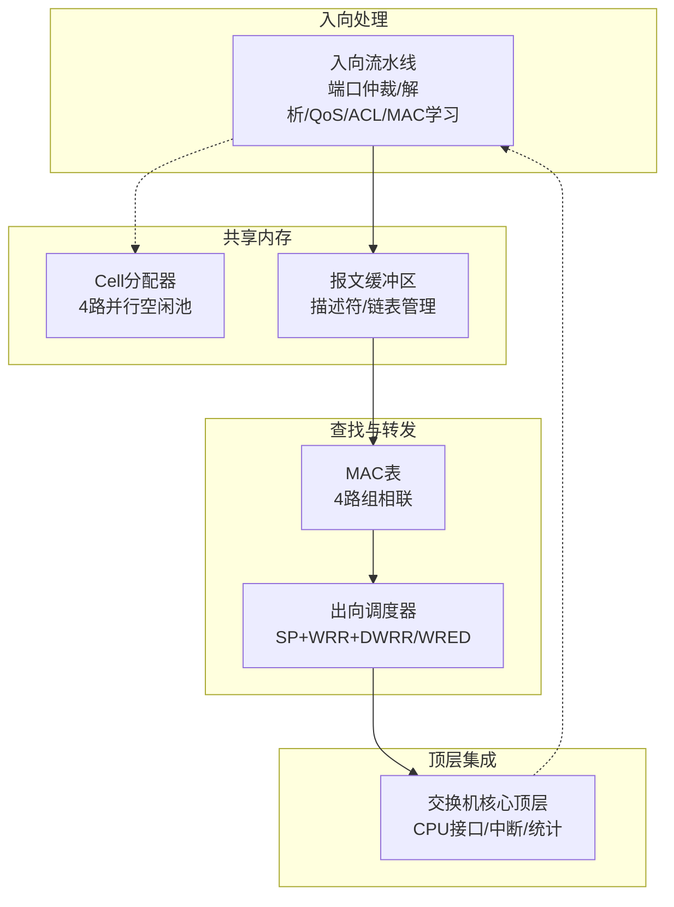
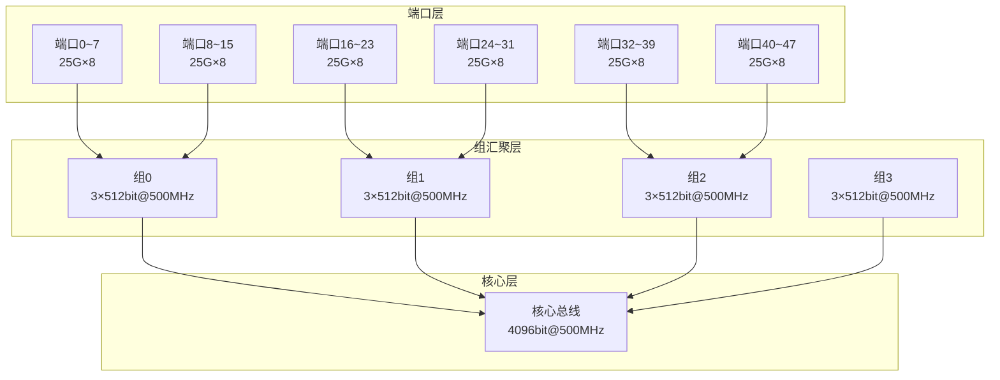
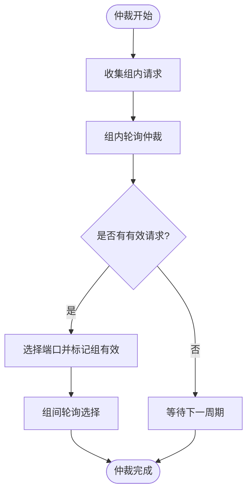
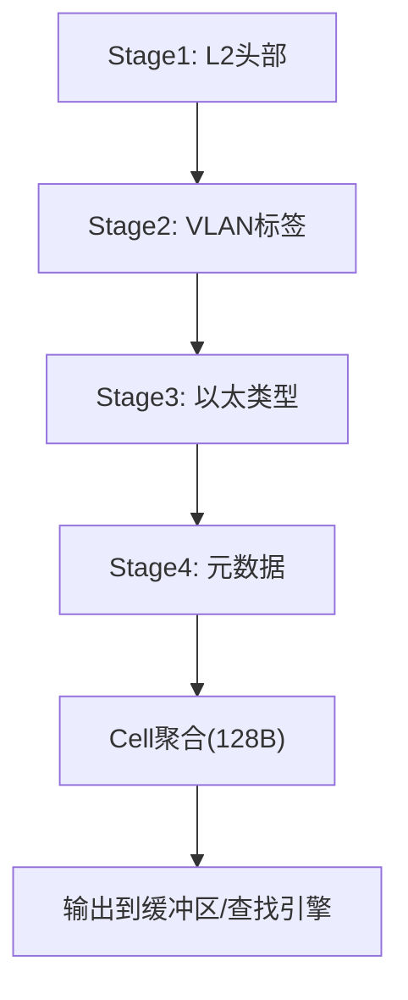
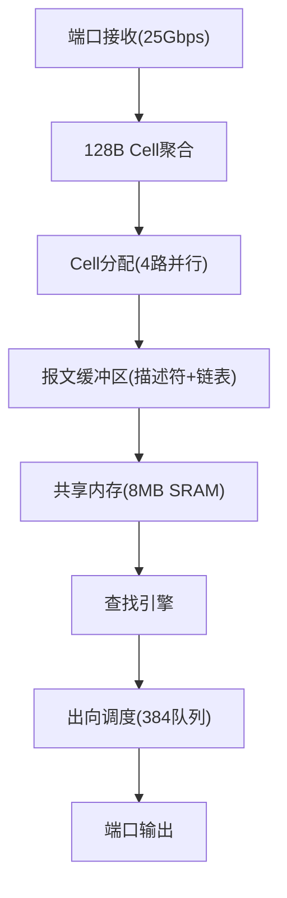
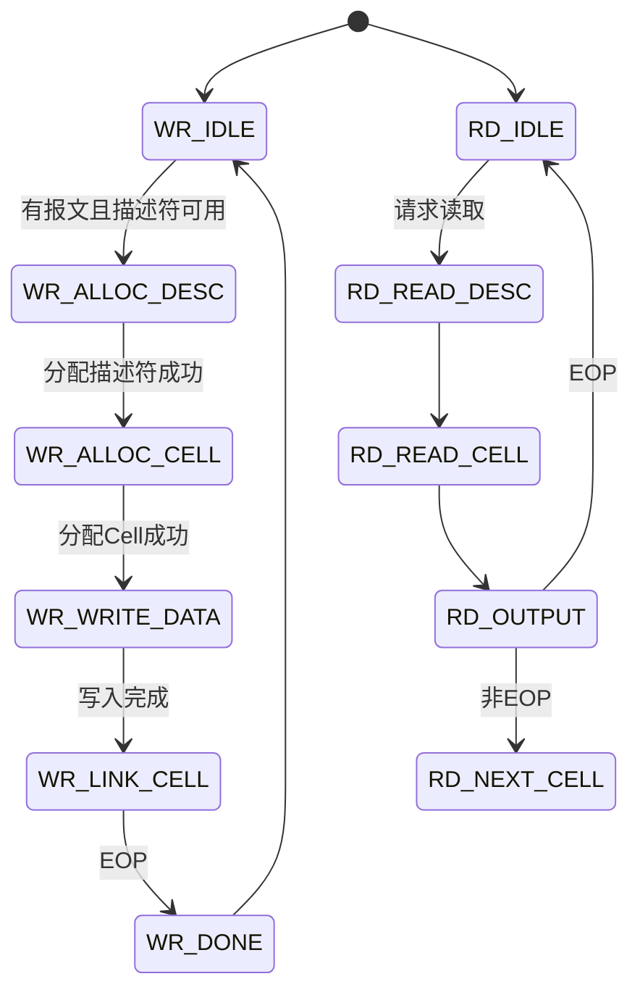
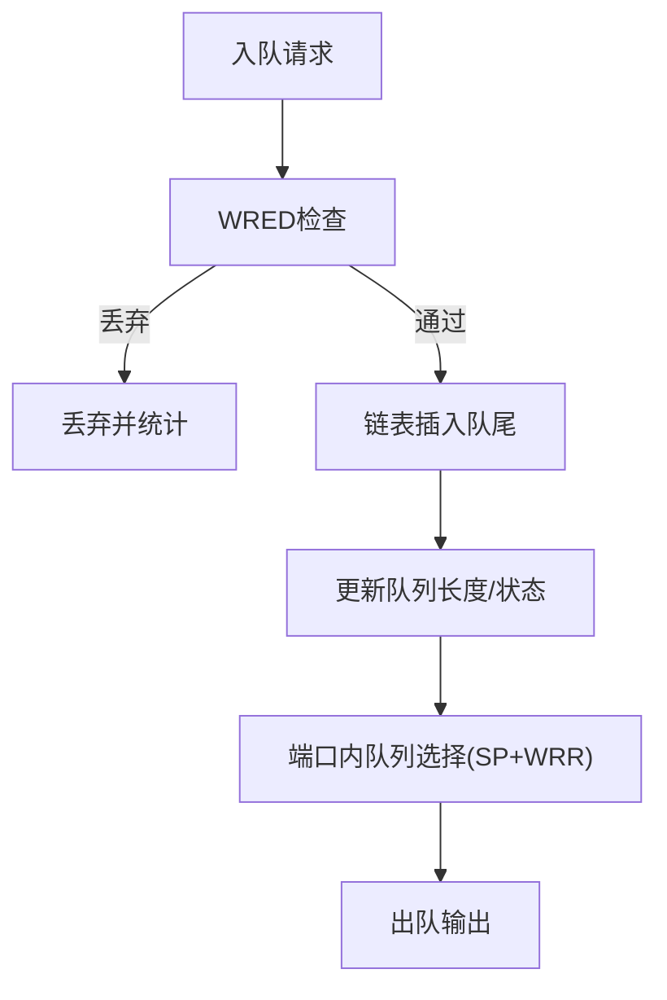
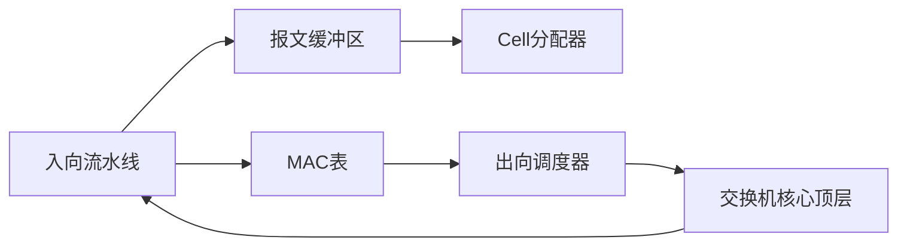

# 入向处理流水线

<cite>
**本文引用的文件**
- [ingress_pipeline.sv](file://rtl/ingress_pipeline.sv)
- [switch_core.sv](file://rtl/switch_core.sv)
- [cell_allocator.sv](file://rtl/cell_allocator.sv)
- [packet_buffer.sv](file://rtl/packet_buffer.sv)
- [egress_scheduler.sv](file://rtl/egress_scheduler.sv)
- [mac_table.sv](file://rtl/mac_table.sv)
- [switch_pkg.sv](file://rtl/switch_pkg.sv)
- [1.2Tbps-L2-Switch-Design.md](file://doc/1.2Tbps-L2-Switch-Design.md)
- [switch_core.py](file://model/switch_core.py)
</cite>

## 目录
1. [简介](#简介)
2. [项目结构](#项目结构)
3. [核心组件](#核心组件)
4. [架构总览](#架构总览)
5. [详细组件分析](#详细组件分析)
6. [依赖关系分析](#依赖关系分析)
7. [性能考量](#性能考量)
8. [故障排查指南](#故障排查指南)
9. [结论](#结论)
10. [附录](#附录)

## 简介
本文面向“入向处理流水线”模块，系统化阐述分层时分复用架构（端口层-组汇聚层-核心层）、Cell处理机制（128B作为最小处理单元）的线速计算与128B Cell线速计算公式、端口仲裁机制（48个25G端口的时分复用策略与负载均衡）、报文解析器的4级流水线（L2头部解析、VLAN标签处理、以太类型识别、元数据提取）、Ingress QoS与ACL处理机制（802.1p优先级映射、TCAM匹配与流控策略），并提供完整的时序图与数据流图，展示从端口接收到底层转发的完整处理过程。

## 项目结构
该仓库围绕1.2Tbps 48×25G L2交换机展开，核心模块包括：
- 入向流水线：负责端口仲裁、报文解析、ACL/QoS、MAC学习触发与描述符生成
- 共享内存管理：Cell分配器、报文缓冲区
- 查表引擎：MAC表
- 出向调度：384队列调度、WRED与速率整形
- 核心顶层：整合上述模块并提供CPU接口与中断



图表来源
- [switch_core.sv](file://rtl/switch_core.sv#L238-L268)
- [ingress_pipeline.sv](file://rtl/ingress_pipeline.sv#L1-L319)
- [cell_allocator.sv](file://rtl/cell_allocator.sv#L1-L247)
- [packet_buffer.sv](file://rtl/packet_buffer.sv#L1-L427)
- [egress_scheduler.sv](file://rtl/egress_scheduler.sv#L1-L394)
- [mac_table.sv](file://rtl/mac_table.sv#L1-L342)

章节来源
- [switch_core.sv](file://rtl/switch_core.sv#L1-L454)
- [1.2Tbps-L2-Switch-Design.md](file://doc/1.2Tbps-L2-Switch-Design.md#L13-L145)

## 核心组件
- 入向流水线：实现端口仲裁、解析4级流水线、生成描述符、触发MAC学习、输出到缓冲区与查找引擎
- Cell分配器：64K个128B Cells，4路并行空闲池，支持分配/释放与元数据访问
- 报文缓冲区：将报文切分为Cell链表，管理描述符与释放流程
- MAC表：4路组相联Hash表，流水线查表与学习
- 出向调度器：384队列（48端口×8优先级），SP+WRR两级调度，WRED与统计

章节来源
- [ingress_pipeline.sv](file://rtl/ingress_pipeline.sv#L1-L319)
- [cell_allocator.sv](file://rtl/cell_allocator.sv#L1-L247)
- [packet_buffer.sv](file://rtl/packet_buffer.sv#L1-L427)
- [mac_table.sv](file://rtl/mac_table.sv#L1-L342)
- [egress_scheduler.sv](file://rtl/egress_scheduler.sv#L1-L394)

## 架构总览
分层时分复用架构（端口层-组汇聚层-核心层）确保48个25G端口在共享资源下有序接入，核心总线位宽4096bit@500MHz，满足1.2Tbps线速与Cell处理裕量。



图表来源
- [1.2Tbps-L2-Switch-Design.md](file://doc/1.2Tbps-L2-Switch-Design.md#L100-L145)

章节来源
- [1.2Tbps-L2-Switch-Design.md](file://doc/1.2Tbps-L2-Switch-Design.md#L70-L145)

## 详细组件分析

### 入向流水线（端口仲裁与解析）
- 端口仲裁：48端口分6组（每组8端口），组内轮询仲裁，组间轮询仲裁，确保公平与时分复用
- 解析流水线：4级（L2头部、VLAN标签、以太类型、元数据），聚合到128B Cell，生成描述符
- 输出：到缓冲区（Cell链表+描述符）、到查找引擎（DMAC/SMAC/VLAN/PCP/源端口）

```mermaid
sequenceDiagram
participant P as "端口层"
participant ARB as "端口仲裁器"
participant PAR as "解析流水线"
participant BUF as "报文缓冲区"
participant LOOK as "查找引擎"
participant MAC as "MAC表"
P->>ARB : 端口valid/eop/data
ARB->>PAR : 选中端口数据流
PAR->>PAR : Stage1-4解析(4级流水线)
PAR->>BUF : 写入Cell链表+描述符
PAR->>LOOK : 查询请求(dmac,smac,vid,src_port,pcp,desc_id)
LOOK->>MAC : 查表请求
MAC-->>LOOK : 查表结果(命中/未命中)
LOOK-->>PAR : 转发决策(单播/泛洪/丢弃)
```

图表来源
- [ingress_pipeline.sv](file://rtl/ingress_pipeline.sv#L52-L127)
- [ingress_pipeline.sv](file://rtl/ingress_pipeline.sv#L129-L224)
- [ingress_pipeline.sv](file://rtl/ingress_pipeline.sv#L226-L257)
- [switch_core.sv](file://rtl/switch_core.sv#L271-L323)

章节来源
- [ingress_pipeline.sv](file://rtl/ingress_pipeline.sv#L52-L127)
- [ingress_pipeline.sv](file://rtl/ingress_pipeline.sv#L129-L224)
- [ingress_pipeline.sv](file://rtl/ingress_pipeline.sv#L226-L257)

#### 端口仲裁机制（48端口时分复用与负载均衡）
- 组内仲裁：每组8端口轮询，基于valid/eop与端口使能，确保公平
- 组间仲裁：在组有效时轮询选择下一组
- 负载均衡：通过组内轮询与端口池Hint（Cell分配时按端口低2位归还）实现跨池均衡



图表来源
- [ingress_pipeline.sv](file://rtl/ingress_pipeline.sv#L57-L99)
- [ingress_pipeline.sv](file://rtl/ingress_pipeline.sv#L101-L126)

章节来源
- [ingress_pipeline.sv](file://rtl/ingress_pipeline.sv#L57-L126)

#### 报文解析器（4级流水线）
- Stage1：L2头部提取（DMAC/SMAC）
- Stage2：VLAN标签处理（802.1Q TCI，PCP/DEI/VID）
- Stage3：以太类型识别
- Stage4：元数据提取（长度、队列ID、描述符ID）
- 聚合：每周期8字节，达到128B Cell边界即打包输出



图表来源
- [ingress_pipeline.sv](file://rtl/ingress_pipeline.sv#L131-L224)

章节来源
- [ingress_pipeline.sv](file://rtl/ingress_pipeline.sv#L131-L224)

#### Ingress QoS与ACL处理
- QoS：基于802.1p PCP映射到8个队列（0-7），支持端口默认优先级
- ACL：TCAM匹配（源端口、DMAC、SMAC、VID、以太类型），动作支持Permit/Deny/Mirror/Rate-limit
- 流控：WRED（尾丢+概率丢弃）与速率限制（端口级）

章节来源
- [1.2Tbps-L2-Switch-Design.md](file://doc/1.2Tbps-L2-Switch-Design.md#L167-L180)
- [switch_pkg.sv](file://rtl/switch_pkg.sv#L71-L77)

### Cell处理机制与线速计算
- 最小处理单元：128B（Cell）
- Cell分配器：64K Cells，4路并行空闲池，分配/释放链表管理
- 线速计算（128B Cell）：
  - 单端口线速Cell数：25Gbps / (128B × 8bit) ≈ 24.41M cells/s
  - 48端口：24.41M × 48 ≈ 1171.875M cells/s
  - 核心总线位宽：1.2Tbps / 500MHz = 2400bit；按1.5x裕量取4096bit
  - 每周期Cell承载：4096bit / 1024bit = 4 cells；实际处理2.34cells/cycle，裕量≈1.71x



图表来源
- [1.2Tbps-L2-Switch-Design.md](file://doc/1.2Tbps-L2-Switch-Design.md#L78-L98)
- [cell_allocator.sv](file://rtl/cell_allocator.sv#L148-L188)
- [packet_buffer.sv](file://rtl/packet_buffer.sv#L178-L244)

章节来源
- [1.2Tbps-L2-Switch-Design.md](file://doc/1.2Tbps-L2-Switch-Design.md#L78-L98)
- [cell_allocator.sv](file://rtl/cell_allocator.sv#L148-L188)
- [packet_buffer.sv](file://rtl/packet_buffer.sv#L178-L244)

### 报文缓冲区与描述符管理
- 描述符池：最大4K报文，128bit描述符，包含首尾Cell指针、Cell数量、长度、源端口、队列ID、时间戳等
- 写入状态机：分配描述符→分配Cell→写入Cell→链接→完成
- 读取状态机：读取描述符→读取Cell→输出→下一Cell
- 释放：逐Cell释放，引用计数（组播）与链表回收



图表来源
- [packet_buffer.sv](file://rtl/packet_buffer.sv#L70-L96)
- [packet_buffer.sv](file://rtl/packet_buffer.sv#L178-L244)
- [packet_buffer.sv](file://rtl/packet_buffer.sv#L317-L373)

章节来源
- [packet_buffer.sv](file://rtl/packet_buffer.sv#L58-L176)
- [packet_buffer.sv](file://rtl/packet_buffer.sv#L178-L244)
- [packet_buffer.sv](file://rtl/packet_buffer.sv#L317-L373)

### 出向调度与拥塞控制
- 两级调度：端口内严格优先级（Q7/Q6）+ WRR（Q5-Q0），跨端口DWRR保证长期公平
- WRED：低门限（min_th）、高门限（max_th）、最大丢弃概率（max_prob），概率丢弃
- 统计：入队/出队/丢弃计数



图表来源
- [egress_scheduler.sv](file://rtl/egress_scheduler.sv#L88-L185)
- [egress_scheduler.sv](file://rtl/egress_scheduler.sv#L188-L293)

章节来源
- [egress_scheduler.sv](file://rtl/egress_scheduler.sv#L55-L70)
- [egress_scheduler.sv](file://rtl/egress_scheduler.sv#L88-L185)
- [egress_scheduler.sv](file://rtl/egress_scheduler.sv#L188-L293)

## 依赖关系分析
- 入向流水线依赖Cell分配器（分配Cell）、报文缓冲区（写入Cell/描述符）、查找引擎（DMAC查表）
- 查找引擎依赖MAC表（查表/学习）
- 出向调度器依赖队列描述符与链表，受WRED与速率限制影响
- 顶层模块整合各子模块并提供CPU接口与中断



图表来源
- [switch_core.sv](file://rtl/switch_core.sv#L148-L167)
- [switch_core.sv](file://rtl/switch_core.sv#L170-L205)
- [switch_core.sv](file://rtl/switch_core.sv#L208-L235)
- [switch_core.sv](file://rtl/switch_core.sv#L333-L359)

章节来源
- [switch_core.sv](file://rtl/switch_core.sv#L148-L268)

## 性能考量
- 线速Cell处理：4096bit核心总线承载4个128B Cell，满足2.34cells/cycle处理能力
- 缓冲容量：8MB（64K Cells×128B），线速缓冲53μs，4:1拥塞212μs突发吸收
- 查表吞吐：MAC表流水线查表，2倍线速裕量（500M次/秒）
- 调度公平：SP+WRR+DWRR，WRED概率丢弃，保障长期公平与拥塞控制

章节来源
- [1.2Tbps-L2-Switch-Design.md](file://doc/1.2Tbps-L2-Switch-Design.md#L633-L642)
- [1.2Tbps-L2-Switch-Design.md](file://doc/1.2Tbps-L2-Switch-Design.md#L205-L221)
- [1.2Tbps-L2-Switch-Design.md](file://doc/1.2Tbps-L2-Switch-Design.md#L240-L279)

## 故障排查指南
- 端口ready信号：若端口ready拉低，检查缓冲区写入是否被占用或解析状态机卡住
- Cell分配失败：检查Cell分配器空闲池计数与初始化完成标志
- 描述符分配失败：确认描述符空闲链表是否耗尽
- 查表未命中：检查VLAN配置、SMAC学习状态与MAC表老化
- 出队阻塞：检查队列长度、WRED阈值与端口队列状态

章节来源
- [ingress_pipeline.sv](file://rtl/ingress_pipeline.sv#L287-L291)
- [cell_allocator.sv](file://rtl/cell_allocator.sv#L236-L244)
- [packet_buffer.sv](file://rtl/packet_buffer.sv#L130-L176)
- [egress_scheduler.sv](file://rtl/egress_scheduler.sv#L327-L391)

## 结论
入向处理流水线通过分层时分复用架构、128B Cell最小处理单元与严格的流水线设计，实现了48×25G端口的线速接入与转发。端口仲裁确保公平与时分复用，解析流水线高效提取关键字段，Cell分配与缓冲管理提供确定性延迟，MAC查表与出向调度保障转发决策与拥塞控制。整体设计在共享内存架构下平衡了吞吐、延迟与功耗，满足数据中心L2交换机的性能要求。

## 附录
- 关键参数与数据结构参考：见包定义与设计文档
- Python仿真实现：包含Cell元数据、描述符、MAC表、VLAN表、ACL引擎等

章节来源
- [switch_pkg.sv](file://rtl/switch_pkg.sv#L1-L219)
- [1.2Tbps-L2-Switch-Design.md](file://doc/1.2Tbps-L2-Switch-Design.md#L1-L767)
- [switch_core.py](file://model/switch_core.py#L1-L800)