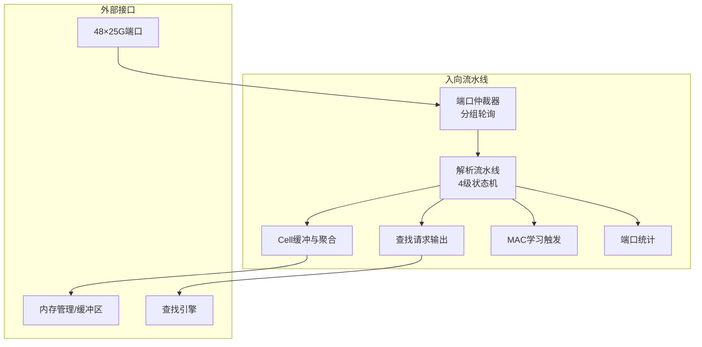
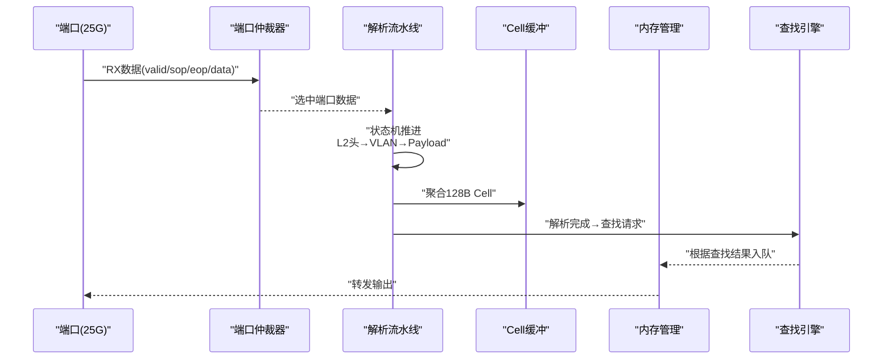
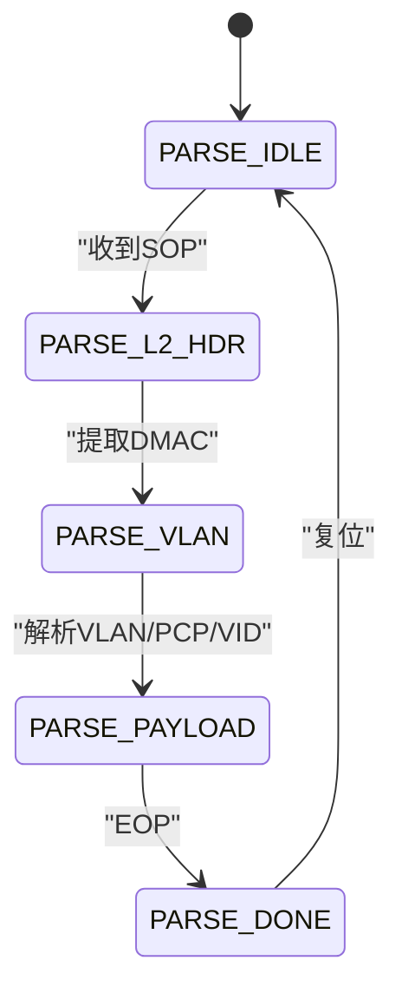
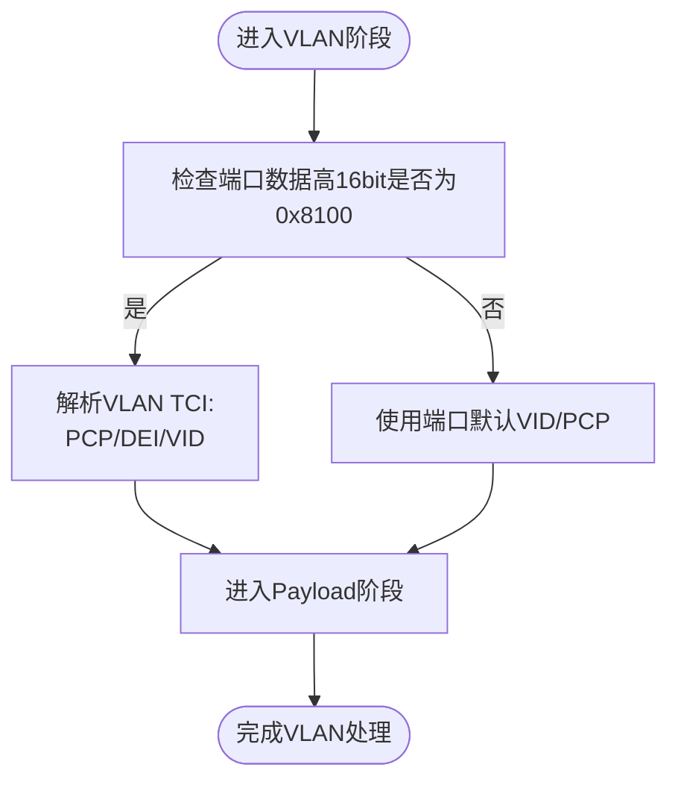
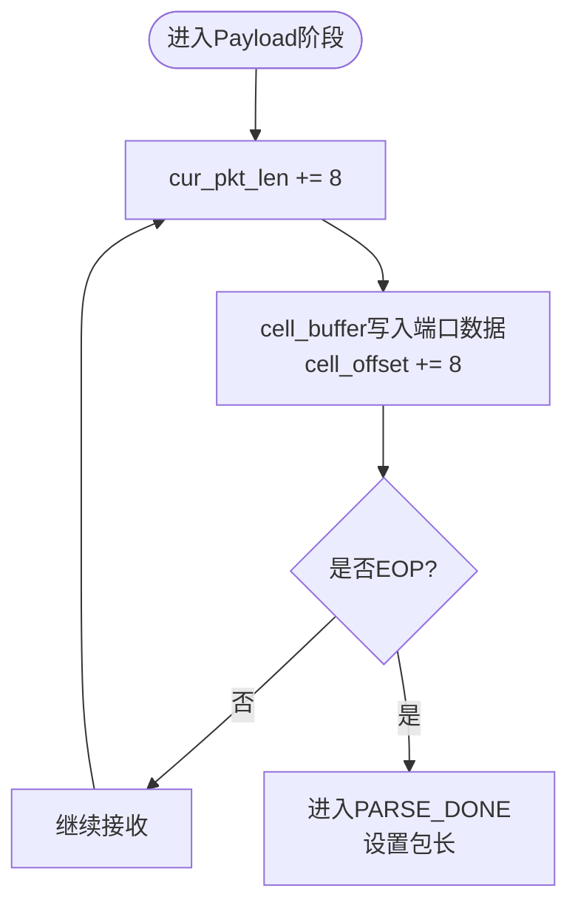
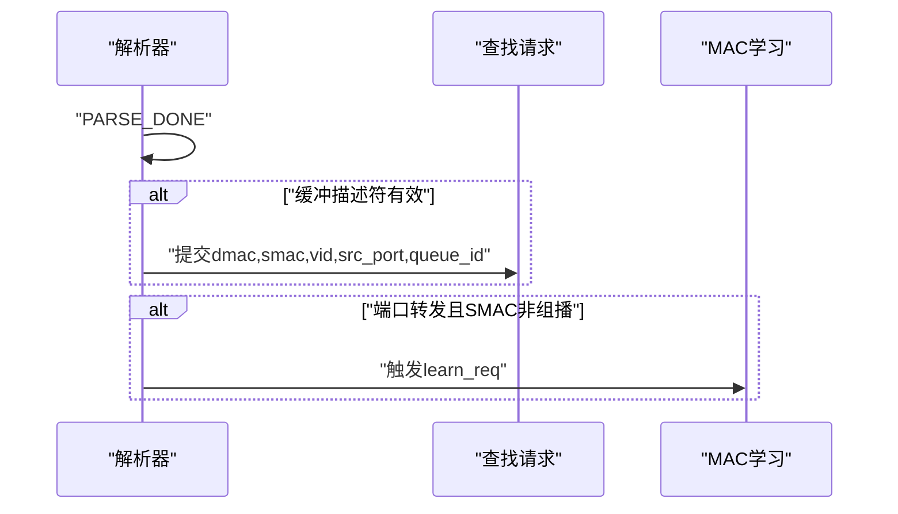
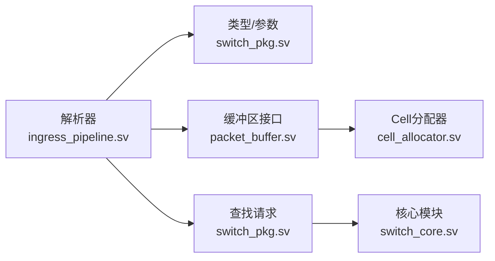

# 报文解析器

<cite>
**本文引用的文件列表**
- [ingress_pipeline.sv](file://rtl/ingress_pipeline.sv)
- [switch_pkg.sv](file://rtl/switch_pkg.sv)
- [1.2Tbps-L2-Switch-Design.md](file://doc/1.2Tbps-L2-Switch-Design.md)
- [cell_allocator.sv](file://rtl/cell_allocator.sv)
- [packet_buffer.sv](file://rtl/packet_buffer.sv)
- [switch_core.sv](file://rtl/switch_core.sv)
- [tb_switch_core.sv](file://tb/tb_switch_core.sv)
</cite>

## 目录
1. [简介](#简介)
2. [项目结构](#项目结构)
3. [核心组件](#核心组件)
4. [架构总览](#架构总览)
5. [详细组件分析](#详细组件分析)
6. [依赖关系分析](#依赖关系分析)
7. [性能考量](#性能考量)
8. [故障排查指南](#故障排查指南)
9. [结论](#结论)

## 简介
本技术文档聚焦于报文解析器模块，系统阐述其基于4级流水线的解析架构，涵盖状态机设计（PARSE_IDLE、PARSE_L2_HDR、PARSE_VLAN、PARSE_PAYLOAD、PARSE_DONE）、L2头部解析（DMAC/SMAC提取与以太类型识别）、VLAN标签处理（TPID检查、PCP/DEI/VID解析与默认值策略）、以及Payload解析与Cell聚合缓冲机制（按128B Cell进行聚合）。文档同时提供状态转换图与数据流图，展示从端口接收到底层转发的完整解析过程，并总结错误处理与边界条件策略。

## 项目结构
报文解析器位于入向流水线模块中，负责：
- 端口仲裁与选择
- 4级解析流水线（L2头/VLAN/以太类型/Metadata）
- 报文长度统计与丢包统计
- 将解析结果传递给查找引擎与缓冲区

图表来源
- [ingress_pipeline.sv](file://rtl/ingress_pipeline.sv#L52-L126)
- [ingress_pipeline.sv](file://rtl/ingress_pipeline.sv#L129-L224)
- [ingress_pipeline.sv](file://rtl/ingress_pipeline.sv#L226-L282)

章节来源
- [ingress_pipeline.sv](file://rtl/ingress_pipeline.sv#L1-L319)
- [switch_pkg.sv](file://rtl/switch_pkg.sv#L1-L219)
- [1.2Tbps-L2-Switch-Design.md](file://doc/1.2Tbps-L2-Switch-Design.md#L52-L181)

## 核心组件
- 端口仲裁器：将48个端口按组轮询仲裁，确保共享资源公平访问。
- 解析流水线：4级状态机，逐阶段提取L2头、VLAN标签、以太类型与元数据。
- Cell聚合缓冲：将接收到的数据按128B（CELL_SIZE）聚合，形成Cell链。
- 查找请求输出：在解析完成后，向查找引擎提交DMAC、SMAC、VID、源端口与队列ID。
- MAC学习触发：在特定端口状态且非组播SMAC时发起学习。
- 端口统计：统计收包、字节与丢包。

章节来源
- [ingress_pipeline.sv](file://rtl/ingress_pipeline.sv#L52-L126)
- [ingress_pipeline.sv](file://rtl/ingress_pipeline.sv#L129-L224)
- [ingress_pipeline.sv](file://rtl/ingress_pipeline.sv#L226-L282)
- [switch_pkg.sv](file://rtl/switch_pkg.sv#L139-L160)

## 架构总览
解析器采用“端口仲裁—解析流水线—Cell聚合—查找请求”的流水线结构，结合Cell链表与描述符，实现线速（128B）处理与共享内存缓冲。

图表来源
- [ingress_pipeline.sv](file://rtl/ingress_pipeline.sv#L129-L224)
- [ingress_pipeline.sv](file://rtl/ingress_pipeline.sv#L226-L257)
- [switch_pkg.sv](file://rtl/switch_pkg.sv#L139-L160)

## 详细组件分析

### 4级流水线解析架构与状态机
解析状态机包含以下状态：
- PARSE_IDLE：等待SOP，初始化当前源端口与长度计数，清空Cell偏移。
- PARSE_L2_HDR：提取DMAC；准备进入VLAN阶段。
- PARSE_VLAN：提取SMAC，检查TPID=0x8100；若带VLAN则解析PCP/DEI/VID，否则使用端口默认VID与默认PCP。
- PARSE_PAYLOAD：累计包长，聚合到Cell缓冲；遇到EOP时进入PARSE_DONE。
- PARSE_DONE：复位状态机，等待下一报文。

图表来源
- [ingress_pipeline.sv](file://rtl/ingress_pipeline.sv#L132-L138)
- [ingress_pipeline.sv](file://rtl/ingress_pipeline.sv#L163-L222)

章节来源
- [ingress_pipeline.sv](file://rtl/ingress_pipeline.sv#L132-L138)
- [ingress_pipeline.sv](file://rtl/ingress_pipeline.sv#L163-L222)

### L2头部解析：DMAC/SMAC提取与以太类型识别
- DMAC提取：在第一周期从端口数据中提取目的MAC（48bit），作为查找关键字。
- SMAC提取：在VLAN阶段拼接DMAC高位与端口数据高位，得到源MAC（48bit）。
- 以太类型识别：文档中明确指出解析流水线包含“以太类型”字段，但RTL实现中未直接解析该字段。解析结果结构体包含以太类型字段，实际解析可在后续阶段或由调用方补充。

章节来源
- [ingress_pipeline.sv](file://rtl/ingress_pipeline.sv#L173-L181)
- [ingress_pipeline.sv](file://rtl/ingress_pipeline.sv#L183-L202)
- [switch_pkg.sv](file://rtl/switch_pkg.sv#L139-L149)
- [1.2Tbps-L2-Switch-Design.md](file://doc/1.2Tbps-L2-Switch-Design.md#L147-L165)

### VLAN标签处理机制：TPID检查与PCP/DEI/VID解析
- TPID检查：当端口数据高16bit等于0x8100时，认为存在VLAN标签。
- PCP/DEI/VID解析：从VLAN TCI中提取PCP（3bit）、DEI（1bit）与VID（12bit）。
- 默认值处理：若无VLAN标签，则VID与PCP使用端口配置的默认值（default_vid/default_pcp）。

图表来源
- [ingress_pipeline.sv](file://rtl/ingress_pipeline.sv#L188-L198)

章节来源
- [ingress_pipeline.sv](file://rtl/ingress_pipeline.sv#L183-L202)
- [switch_pkg.sv](file://rtl/switch_pkg.sv#L174-L181)

### Payload解析与Cell聚合缓冲机制
- 包长累计：每周期累加8字节（端口数据宽度为64bit=8Byte）。
- Cell聚合：将端口数据写入cell_buffer，cell_offset按8字节步进。
- 128B Cell边界：当cell_offset达到CELL_SIZE（128B）或到达EOP时，满足输出条件。
- 输出控制：buf_wr_valid在满足状态与偏移条件时拉高；buf_wr_sop在L2头阶段拉高；buf_wr_eop在DONE阶段拉高；buf_wr_len在EOP时输出实际长度，否则固定为128B。

图表来源
- [ingress_pipeline.sv](file://rtl/ingress_pipeline.sv#L204-L217)
- [ingress_pipeline.sv](file://rtl/ingress_pipeline.sv#L226-L236)
- [switch_pkg.sv](file://rtl/switch_pkg.sv#L16-L17)

章节来源
- [ingress_pipeline.sv](file://rtl/ingress_pipeline.sv#L150-L153)
- [ingress_pipeline.sv](file://rtl/ingress_pipeline.sv#L204-L217)
- [ingress_pipeline.sv](file://rtl/ingress_pipeline.sv#L226-L236)

### 查找请求与MAC学习触发
- 查找请求：在PARSE_DONE且缓冲描述符有效时，向查找引擎提交DMAC、SMAC、VID、源端口与队列ID（PCP）。
- MAC学习触发：当端口处于转发状态且SMAC非组播时，触发学习请求，携带SMAC、VID与源端口。

图表来源
- [ingress_pipeline.sv](file://rtl/ingress_pipeline.sv#L241-L257)
- [ingress_pipeline.sv](file://rtl/ingress_pipeline.sv#L262-L282)

章节来源
- [ingress_pipeline.sv](file://rtl/ingress_pipeline.sv#L241-L257)
- [ingress_pipeline.sv](file://rtl/ingress_pipeline.sv#L262-L282)

### 端口仲裁与Ready信号
- 分组轮询：48端口分为6组，每组8端口，组内轮询仲裁，组间轮询选择。
- Ready信号：仅当当前解析端口或状态机空闲时，端口RX ready拉高，确保背压正确。

章节来源
- [ingress_pipeline.sv](file://rtl/ingress_pipeline.sv#L52-L126)
- [ingress_pipeline.sv](file://rtl/ingress_pipeline.sv#L287-L291)

## 依赖关系分析
- 类型与参数：解析器使用switch_pkg中的端口宽度、Cell尺寸、包长宽度、VLAN ID宽度等参数。
- Cell分配与缓冲：解析器输出到缓冲区，缓冲区依赖Cell分配器与元数据管理。
- 查找引擎：解析器将解析结果提交给查找引擎，后者决定转发路径。

图表来源
- [ingress_pipeline.sv](file://rtl/ingress_pipeline.sv#L7-L49)
- [switch_pkg.sv](file://rtl/switch_pkg.sv#L1-L219)
- [cell_allocator.sv](file://rtl/cell_allocator.sv#L1-L35)
- [packet_buffer.sv](file://rtl/packet_buffer.sv#L1-L120)
- [switch_core.sv](file://rtl/switch_core.sv#L136-L171)

章节来源
- [ingress_pipeline.sv](file://rtl/ingress_pipeline.sv#L7-L49)
- [switch_pkg.sv](file://rtl/switch_pkg.sv#L1-L219)
- [cell_allocator.sv](file://rtl/cell_allocator.sv#L1-L35)
- [packet_buffer.sv](file://rtl/packet_buffer.sv#L1-L120)
- [switch_core.sv](file://rtl/switch_core.sv#L136-L171)

## 性能考量
- 线速Cell处理：核心频率500MHz，128B Cell线速可达约2.34个Cell/周期，结合4096bit核心总线宽度，满足1.2Tbps带宽。
- 并行Cell写入：每周期可写入8字节，Cell聚合按128B边界输出，避免碎片化。
- 仲裁公平性：分层时分复用（端口层→组层→核心层），减少冲突与拥塞。
- 缓冲与内存：共享内存采用纯片内SRAM，Cell元数据与描述符独立管理，支持链表与指针复制，降低DRAM访问开销。

章节来源
- [1.2Tbps-L2-Switch-Design.md](file://doc/1.2Tbps-L2-Switch-Design.md#L77-L145)
- [1.2Tbps-L2-Switch-Design.md](file://doc/1.2Tbps-L2-Switch-Design.md#L238-L492)
- [switch_pkg.sv](file://rtl/switch_pkg.sv#L16-L17)
- [switch_pkg.sv](file://rtl/switch_pkg.sv#L38-L43)

## 故障排查指南
- SOP/EOP协议检查：测试平台对SOP/EOP与valid的时序进行断言，确保协议正确。
- 端口丢包统计：当端口RX valid但未ready时，统计计数器递增，可用于定位背压问题。
- VLAN异常：若TPID非0x8100，将使用默认VID/PCP；若VID越界或PCP非法，需检查端口配置与上游设备。
- EOP与长度：EOP时包长=累计长度+8-无效字节数，若长度异常，检查port_rx_empty与端口配置。
- Cell聚合：若cell_offset未达128B且未到EOP，buf_wr_valid不会拉高；确认端口ready与状态机推进。

章节来源
- [tb_switch_core.sv](file://tb/tb_switch_core.sv#L159-L178)
- [tb_switch_core.sv](file://tb/tb_switch_core.sv#L180-L199)
- [ingress_pipeline.sv](file://rtl/ingress_pipeline.sv#L296-L316)
- [ingress_pipeline.sv](file://rtl/ingress_pipeline.sv#L212-L215)
- [ingress_pipeline.sv](file://rtl/ingress_pipeline.sv#L230-L236)

## 结论
报文解析器通过4级流水线与Cell聚合机制，实现了对以太网帧的高效解析与转发前置处理。其状态机清晰、端口仲裁公平、VLAN处理严谨，并与查找引擎、缓冲区与MAC学习紧密协作，满足1.2Tbps带宽下的线速转发需求。在实际部署中，应重点关注SOP/EOP协议一致性、端口背压与VLAN配置，以确保解析与转发的稳定性与正确性。