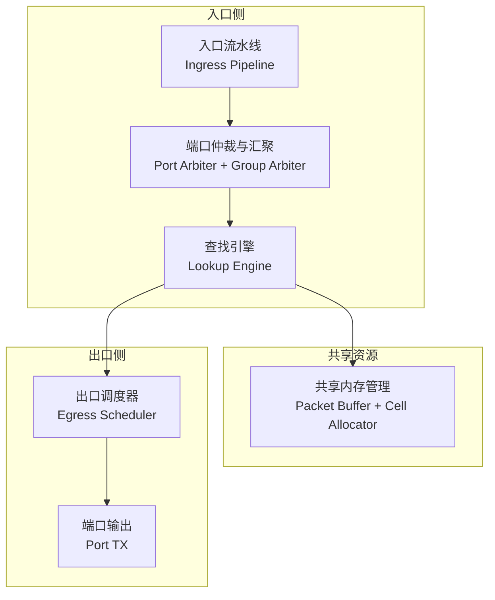
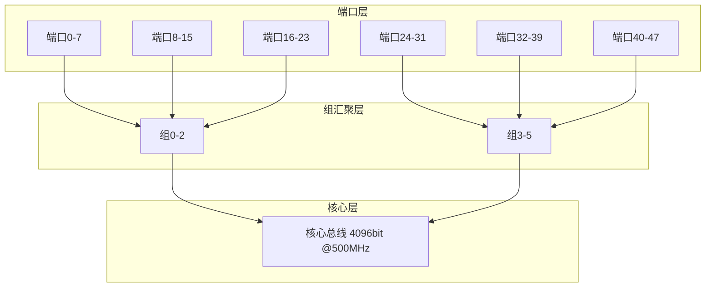
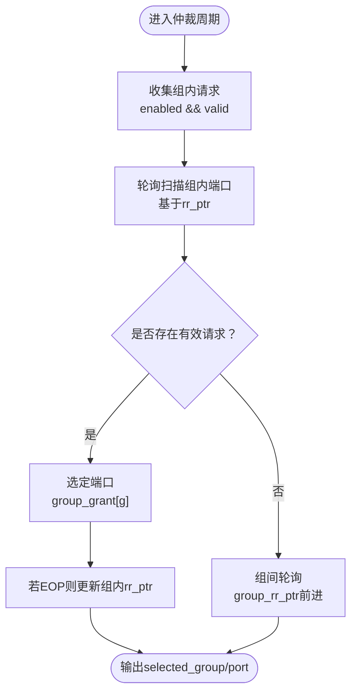
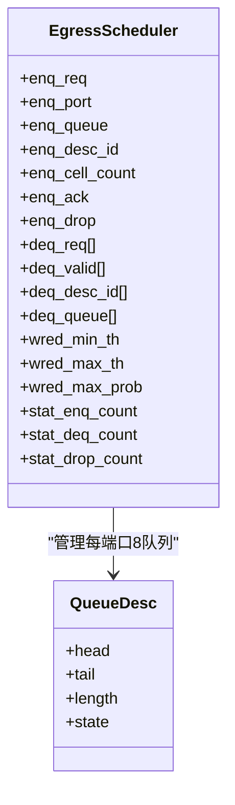
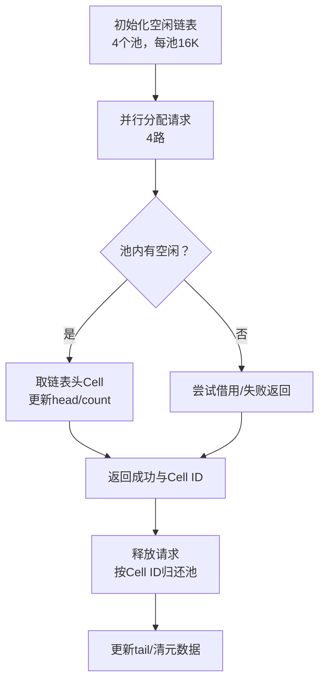
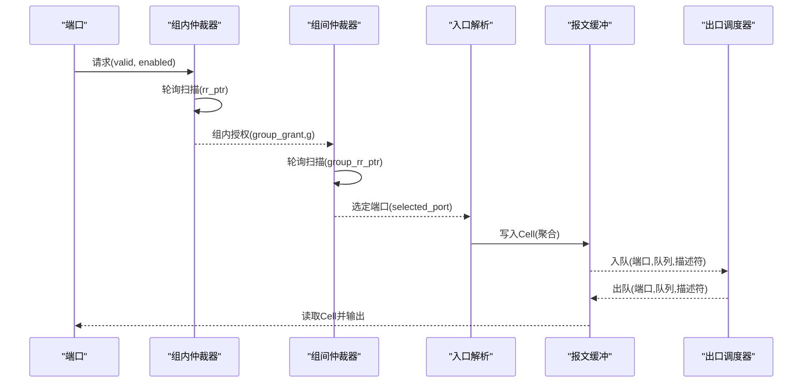

# 端口仲裁与汇聚

<cite>
**本文引用的文件列表**
- [switch_core.sv](file://rtl/switch_core.sv)
- [ingress_pipeline.sv](file://rtl/ingress_pipeline.sv)
- [egress_scheduler.sv](file://rtl/egress_scheduler.sv)
- [cell_allocator.sv](file://rtl/cell_allocator.sv)
- [switch_pkg.sv](file://rtl/switch_pkg.sv)
- [1.2Tbps-L2-Switch-Design.md](file://doc/1.2Tbps-L2-Switch-Design.md)
- [tb_switch_core.sv](file://tb/tb_switch_core.sv)
</cite>

## 目录
1. [简介](#简介)
2. [项目结构](#项目结构)
3. [核心组件](#核心组件)
4. [架构总览](#架构总览)
5. [详细组件分析](#详细组件分析)
6. [依赖关系分析](#依赖关系分析)
7. [性能考量](#性能考量)
8. [故障排查指南](#故障排查指南)
9. [结论](#结论)
10. [附录](#附录)

## 简介
本技术文档聚焦于“端口仲裁与汇聚”模块，围绕48个25G端口的分层时分复用架构展开，系统性阐述：
- 将48个端口划分为6组（每组8个端口）的组内仲裁机制；
- 轮询仲裁器（Round-Robbin Arbiter）的实现原理、仲裁指针更新逻辑与公平性保障；
- 组间仲裁机制与跨组负载均衡策略；
- 从端口请求到数据传输的完整仲裁时序与状态转换；
- 参数配置说明与性能分析，解释该架构如何实现线速处理与避免拥塞。

## 项目结构
该仓库采用“分层模块化”组织方式，核心围绕“入口流水线（Ingress）—查找引擎（Lookup）—共享内存（Memory Manager）—出口调度（Egress Scheduler）”路径构建。其中，端口仲裁与汇聚位于入口侧，负责将48个端口的并发请求有序地汇聚到共享资源。

图表来源
- [switch_core.sv](file://rtl/switch_core.sv#L238-L268)
- [ingress_pipeline.sv](file://rtl/ingress_pipeline.sv#L52-L126)
- [egress_scheduler.sv](file://rtl/egress_scheduler.sv#L1-L43)

章节来源
- [switch_core.sv](file://rtl/switch_core.sv#L1-L454)
- [ingress_pipeline.sv](file://rtl/ingress_pipeline.sv#L1-L319)
- [egress_scheduler.sv](file://rtl/egress_scheduler.sv#L1-L394)

## 核心组件
- 端口仲裁与汇聚（Ingress Pipeline内的仲裁逻辑）
- 出口调度器（Egress Scheduler，包含SP+WRR两级调度与WRED）
- Cell分配器（Cell Allocator，管理64K个128B Cells，4路并行）

章节来源
- [ingress_pipeline.sv](file://rtl/ingress_pipeline.sv#L52-L126)
- [egress_scheduler.sv](file://rtl/egress_scheduler.sv#L1-L394)
- [cell_allocator.sv](file://rtl/cell_allocator.sv#L1-L247)

## 架构总览
整体采用“共享内存交换矩阵”架构，48个25G端口经由分层时分复用汇聚到共享核心总线：
- 端口层：48个端口，64bit/端口，390.625MHz；
- 组汇聚层：6组，每组8端口，512bit×3，500MHz；
- 核心层：4096bit，500MHz，2.048Tbps。

图表来源
- [1.2Tbps-L2-Switch-Design.md](file://doc/1.2Tbps-L2-Switch-Design.md#L100-L145)
- [ingress_pipeline.sv](file://rtl/ingress_pipeline.sv#L52-L126)

章节来源
- [1.2Tbps-L2-Switch-Design.md](file://doc/1.2Tbps-L2-Switch-Design.md#L100-L145)

## 详细组件分析

### 组件A：端口仲裁与汇聚（Ingress Pipeline）
- 分组策略：将48个端口划分为6组，每组8个端口；组内采用轮询仲裁器（RR），组间采用轮询选择有效组。
- 组内仲裁（轮询仲裁器）：
  - 维护组内仲裁指针（rr_ptr），按循环顺序扫描组内请求；
  - 当检测到某端口EOP（报文结束）时，将仲裁指针前进一位，确保公平性；
  - 仅在端口使能且存在有效请求时授予。
- 组间仲裁：
  - 维护组间仲裁指针（group_rr_ptr），按循环顺序扫描有效组；
  - 一旦找到有效组，即选定该组内的端口作为当前服务对象；
  - 仲裁结果通过selected_group与selected_port反馈给后续解析与缓冲阶段。

图表来源
- [ingress_pipeline.sv](file://rtl/ingress_pipeline.sv#L62-L126)

章节来源
- [ingress_pipeline.sv](file://rtl/ingress_pipeline.sv#L52-L126)

### 组件B：出口调度器（Egress Scheduler）
- 队列结构：每端口8个优先级队列（Q7/Q6严格优先，Q5-Q0采用WRR权重[8,4,2,2,1,1]）。
- 两级调度：
  - 端口内优先级调度：SP + WRR；
  - 跨端口带宽公平：通过WRED与队列长度控制，结合端口级队列状态实现拥塞缓解。
- WRED丢弃：基于队列长度与阈值区间，利用LFSR生成随机概率进行丢弃，避免全局同步导致的不稳定。

图表来源
- [egress_scheduler.sv](file://rtl/egress_scheduler.sv#L1-L43)
- [egress_scheduler.sv](file://rtl/egress_scheduler.sv#L48-L52)

章节来源
- [egress_scheduler.sv](file://rtl/egress_scheduler.sv#L1-L394)

### 组件C：Cell分配器（Cell Allocator）
- 空闲池管理：64K Cells，分为4个独立空闲池，支持4路并行分配；
- 分配/释放：从空闲链表头取Cell，释放时按Cell ID低2位归还对应池；
- 状态监控：提供free_count、nearly_full/nearly_empty等状态信号，用于拥塞预警与调度配合。

图表来源
- [cell_allocator.sv](file://rtl/cell_allocator.sv#L84-L146)
- [cell_allocator.sv](file://rtl/cell_allocator.sv#L149-L188)
- [cell_allocator.sv](file://rtl/cell_allocator.sv#L191-L231)

章节来源
- [cell_allocator.sv](file://rtl/cell_allocator.sv#L1-L247)

### 组件D：参数配置与数据模型
- 系统参数（来自包定义）：
  - 端口数：48；端口宽度：6；端口速率：25Gbps；
  - Cell大小：128B；Cell ID宽度：16；总Cell数：65536；
  - 每端口队列数：8；总队列数：384；队列ID宽度：3；
  - 核心数据宽度：4096bit；核心频率：500MHz。
- 关键数据结构：
  - Packet Descriptor：描述报文链路（首Cell、尾Cell、Cell数量、源/目的端口、队列ID、VLAN动作等）；
  - Queue Descriptor：队列头/尾指针、队列长度、队列状态；
  - Cell Metadata：Next_Ptr、Ref_Cnt、EOP、Valid等。

章节来源
- [switch_pkg.sv](file://rtl/switch_pkg.sv#L12-L44)
- [switch_pkg.sv](file://rtl/switch_pkg.sv#L100-L126)
- [switch_pkg.sv](file://rtl/switch_pkg.sv#L119-L126)
- [switch_pkg.sv](file://rtl/switch_pkg.sv#L91-L98)

## 依赖关系分析
- Ingress Pipeline依赖：
  - 端口配置（启用/禁用、转发模式、默认VID/PCP）；
  - 报文缓冲接口（写入有效/起始/结束/数据/长度/源端口/就绪）；
  - Lookup请求（DMAC/SMAC/VLAN/源端口/队列ID/描述符ID）。
- Egress Scheduler依赖：
  - 入队接口（端口、队列、描述符ID、Cell数量）；
  - 出队接口（每端口请求/有效/描述符ID/队列）；
  - WRED配置（最小/最大阈值、最大丢弃概率）。
- Cell Allocator依赖：
  - 分配/释放请求（4路并行）；
  - 元数据读写（Cell ID、元数据内容）；
  - 状态输出（空闲计数、满/空预警）。

图表来源
- [switch_core.sv](file://rtl/switch_core.sv#L148-L205)
- [switch_core.sv](file://rtl/switch_core.sv#L335-L359)
- [switch_core.sv](file://rtl/switch_core.sv#L150-L167)

章节来源
- [switch_core.sv](file://rtl/switch_core.sv#L148-L205)
- [switch_core.sv](file://rtl/switch_core.sv#L335-L359)

## 性能考量
- 线速计算与裕量：
  - 单端口线速：25Gbps；
  - Cell处理速率：24.41Mpps；
  - 48端口合计：≈1.172Gpps；
  - 核心总线位宽：4096bit，频率500MHz，理论带宽2.048Tbps，裕量约1.71x。
- Cell聚合与缓冲：
  - 128B Cell粒度，64K Cells，8MB纯片内SRAM缓冲池；
  - 16 Banks并行访问，避免冲突，满足线速写入/读取。
- 调度公平性：
  - 组内RR：端口EOP后才推进仲裁指针，保证端口间公平；
  - 组间RR：有效组被轮询选择，避免组饥饿；
  - 出口WRR：Q7/Q6严格优先，Q5-Q0按权重调度，兼顾实时性与公平性。
- 拥塞控制：
  - WRED：基于队列长度的概率丢弃，避免尾部丢弃引发的全局同步；
  - Cell Allocator状态：nearly_full/nearly_empty用于调度与缓冲策略联动。

章节来源
- [1.2Tbps-L2-Switch-Design.md](file://doc/1.2Tbps-L2-Switch-Design.md#L78-L145)
- [cell_allocator.sv](file://rtl/cell_allocator.sv#L40-L44)
- [egress_scheduler.sv](file://rtl/egress_scheduler.sv#L55-L70)

## 故障排查指南
- 端口仲裁相关：
  - 若端口长期无法获得服务，检查端口配置是否启用、端口是否持续有有效请求；
  - 观察组内仲裁指针是否停滞，确认EOP信号是否正确驱动指针前进。
- 出口调度相关：
  - 若队列长时间拥堵，检查WRED阈值设置与队列长度状态；
  - 确认SP+WRR权重配置与端口级队列状态（NORMAL/CONGESTED/BLOCKED）。
- Cell分配相关：
  - 若频繁出现nearly_full/nearly_empty，调整缓冲策略或优化流量分布；
  - 检查Cell元数据（Ref_Cnt/EOP/Valid）一致性，避免悬挂或重复释放。

章节来源
- [ingress_pipeline.sv](file://rtl/ingress_pipeline.sv#L77-L96)
- [egress_scheduler.sv](file://rtl/egress_scheduler.sv#L125-L141)
- [cell_allocator.sv](file://rtl/cell_allocator.sv#L243-L244)

## 结论
该端口仲裁与汇聚模块通过“分层时分复用 + 组内轮询 + 组间轮询”的架构，实现了48个25G端口的线速汇聚与公平调度。结合共享内存与两级调度（端口内SP+WRR + WRED），在保证实时性的同时兼顾公平性与稳定性，满足1.2Tbps全双工带宽需求，并具备良好的拥塞控制与可扩展性。

## 附录

### 仲裁时序与状态转换（概念图）
以下为从端口请求到数据传输的完整仲裁过程的概念时序与状态转换示意（非特定源码映射）：

[此图为概念流程示意，不直接映射具体源码文件]

### 参数配置清单（节选）
- 系统参数（来自包定义）：
  - 端口数：48；端口宽度：6；端口速率：25Gbps；
  - Cell大小：128B；Cell ID宽度：16；总Cell数：65536；
  - 每端口队列数：8；总队列数：384；队列ID宽度：3；
  - 核心数据宽度：4096bit；核心频率：500MHz。
- 出口调度器WRED配置（示例）：
  - wred_min_th：100；
  - wred_max_th：500；
  - wred_max_prob：25（映射到0-100%概率）。

章节来源
- [switch_pkg.sv](file://rtl/switch_pkg.sv#L12-L44)
- [egress_scheduler.sv](file://rtl/egress_scheduler.sv#L34-L38)