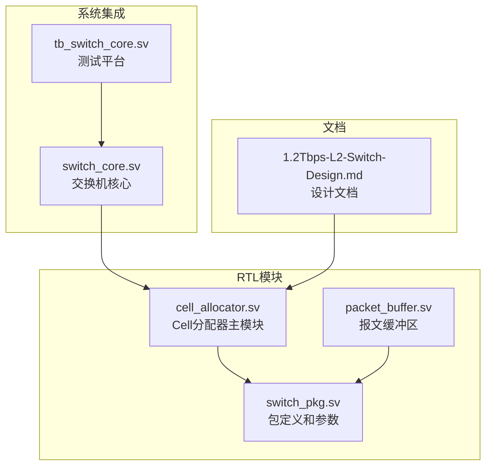
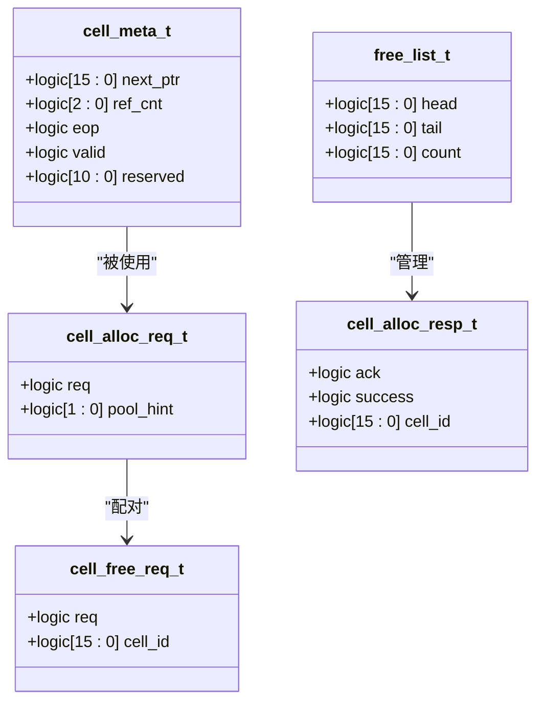
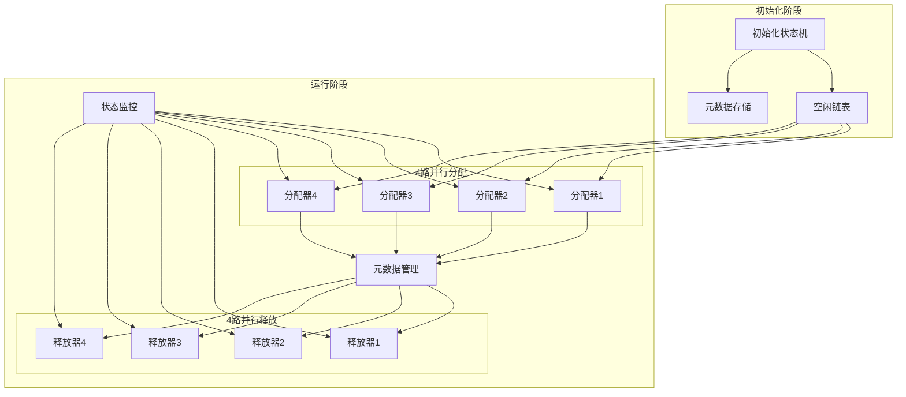
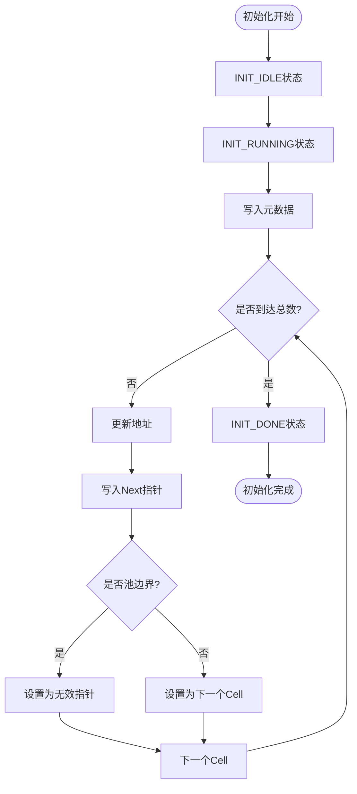
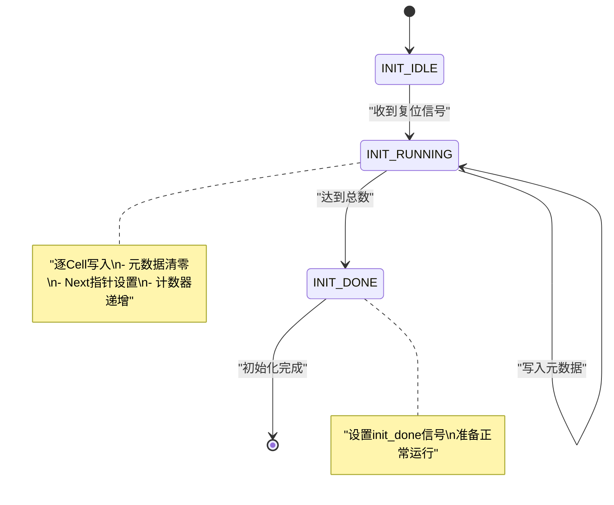
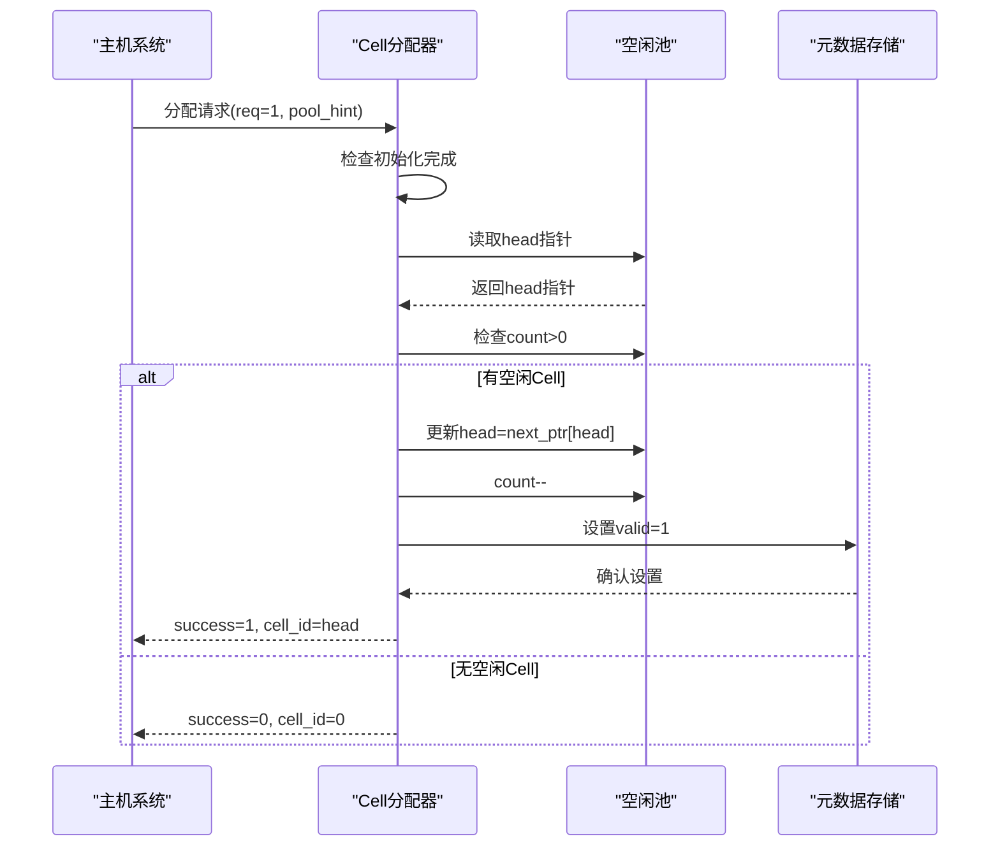
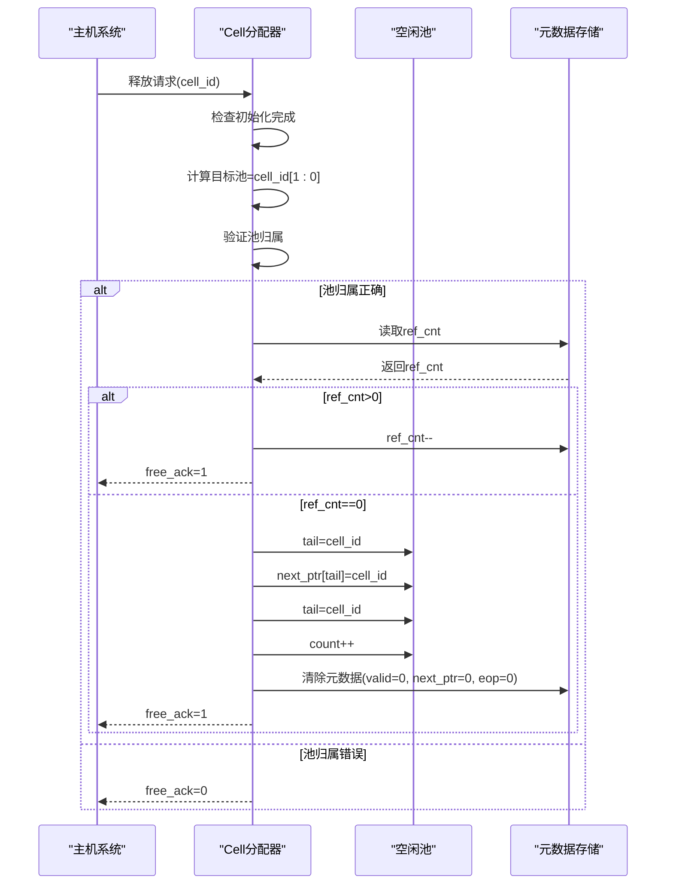
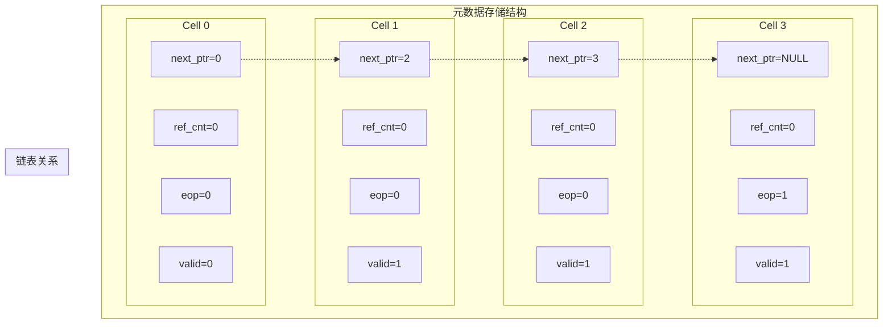
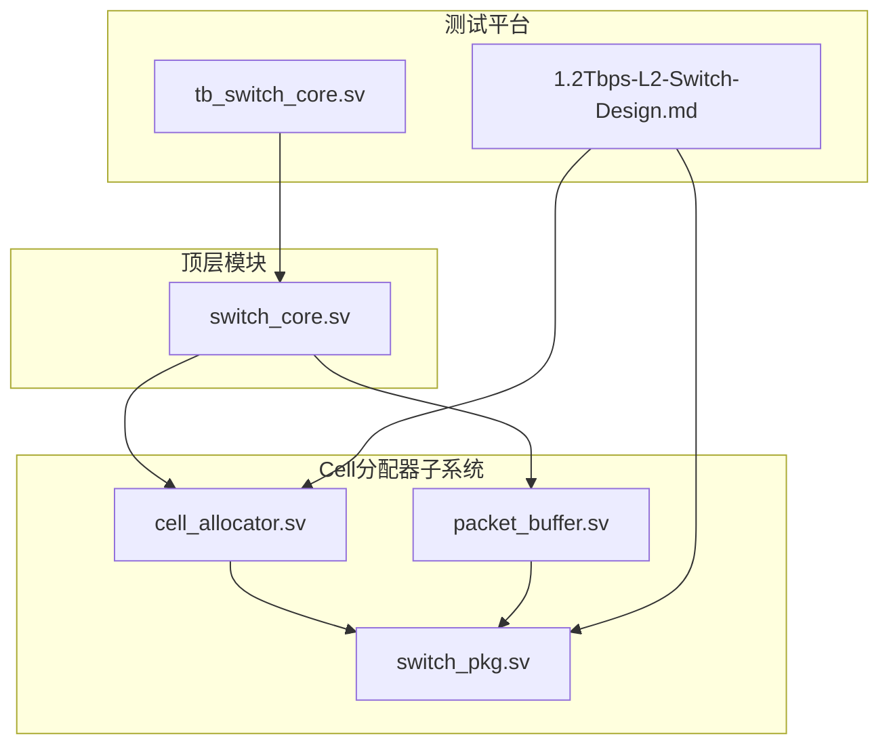
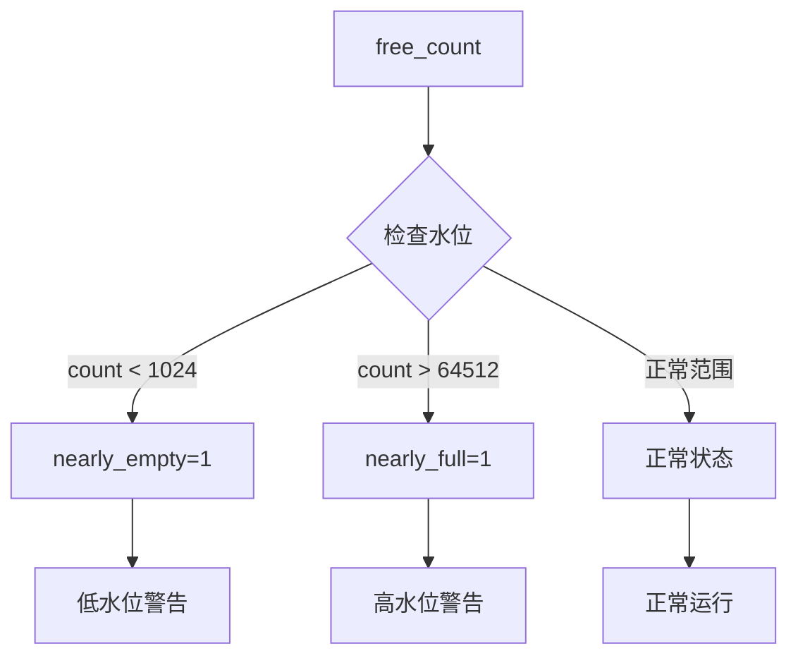

# Cell分配器

<cite>
**本文档引用的文件**
- [cell_allocator.sv](file://rtl/cell_allocator.sv)
- [switch_pkg.sv](file://rtl/switch_pkg.sv)
- [packet_buffer.sv](file://rtl/packet_buffer.sv)
- [1.2Tbps-L2-Switch-Design.md](file://doc/1.2Tbps-L2-Switch-Design.md)
- [tb_switch_core.sv](file://tb/tb_switch_core.sv)
</cite>

## 目录
1. [简介](#简介)
2. [项目结构](#项目结构)
3. [核心组件](#核心组件)
4. [架构概览](#架构概览)
5. [详细组件分析](#详细组件分析)
6. [依赖关系分析](#依赖关系分析)
7. [性能考虑](#性能考虑)
8. [故障排除指南](#故障排除指南)
9. [结论](#结论)

## 简介

Cell分配器是1.2Tbps L2交换机核心架构中的关键组件，负责管理64K个128B Cells的分配和回收。该模块采用4路并行分配架构，通过空闲链表机制实现高效的内存管理，支持线速的报文存储和转发操作。

Cell分配器采用纯片内SRAM实现，提供确定性的访问延迟和高可靠性，完全满足数据中心L2交换机对延迟和吞吐量的要求。模块设计充分考虑了系统的整体性能，确保在500MHz核心频率下实现2G cells/s的分配吞吐能力。

## 项目结构

Cell分配器模块位于RTL目录中，与整个交换机系统紧密集成：



**图表来源**
- [cell_allocator.sv](file://rtl/cell_allocator.sv#L1-L247)
- [switch_pkg.sv](file://rtl/switch_pkg.sv#L1-L219)
- [packet_buffer.sv](file://rtl/packet_buffer.sv#L1-L427)

**章节来源**
- [cell_allocator.sv](file://rtl/cell_allocator.sv#L1-L35)
- [switch_pkg.sv](file://rtl/switch_pkg.sv#L1-L44)

## 核心组件

### 系统参数配置

Cell分配器基于以下关键参数进行设计：

| 参数名称 | 数值 | 描述 |
|---------|------|------|
| TOTAL_CELLS | 65536 | 总Cell数量 (64K) |
| CELL_SIZE | 128 | 每Cell大小 (Bytes) |
| CELL_ID_WIDTH | 16 | Cell ID位宽 |
| NUM_FREE_POOLS | 4 | 空闲池数量 |
| NUM_BANKS | 16 | 内存Bank数量 |
| CELLS_PER_POOL | 16384 | 每池Cell数量 |

### 数据结构定义

Cell分配器使用多种数据结构来管理内存和元数据：



**图表来源**
- [switch_pkg.sv](file://rtl/switch_pkg.sv#L91-L98)
- [switch_pkg.sv](file://rtl/switch_pkg.sv#L187-L197)
- [switch_pkg.sv](file://rtl/switch_pkg.sv#L199-L203)

**章节来源**
- [switch_pkg.sv](file://rtl/switch_pkg.sv#L16-L21)
- [switch_pkg.sv](file://rtl/switch_pkg.sv#L91-L98)
- [switch_pkg.sv](file://rtl/switch_pkg.sv#L187-L203)

## 架构概览

Cell分配器采用分层架构设计，结合了硬件优化和软件控制的优势：



**图表来源**
- [cell_allocator.sv](file://rtl/cell_allocator.sv#L85-L146)
- [cell_allocator.sv](file://rtl/cell_allocator.sv#L153-L188)
- [cell_allocator.sv](file://rtl/cell_allocator.sv#L194-L231)

## 详细组件分析

### 空闲链表设计

空闲链表是Cell分配器的核心数据结构，采用三元组设计：

#### 链表结构详解

| 字段 | 位宽 | 类型 | 功能描述 |
|------|------|------|----------|
| head | 16位 | 逻辑 | 指向空闲链表的第一个Cell |
| tail | 16位 | 逻辑 | 指向空闲链表的最后一个Cell |
| count | 16位 | 逻辑 | 当前空闲Cell的数量 |

#### 链表初始化流程



**图表来源**
- [cell_allocator.sv](file://rtl/cell_allocator.sv#L120-L144)

**章节来源**
- [cell_allocator.sv](file://rtl/cell_allocator.sv#L48-L54)
- [cell_allocator.sv](file://rtl/cell_allocator.sv#L120-L144)

### 初始化状态机

初始化状态机确保Cell分配器在系统启动时正确配置所有数据结构：

#### 状态转换图



**图表来源**
- [cell_allocator.sv](file://rtl/cell_allocator.sv#L85-L94)
- [cell_allocator.sv](file://rtl/cell_allocator.sv#L112-L144)

#### 初始化配置细节

- **元数据存储**: 64K个32bit元数据项，总计256KB
- **链表存储**: 64K个16bit Next指针，总计128KB
- **池管理**: 4个独立空闲链表，每池16K个Cell

**章节来源**
- [cell_allocator.sv](file://rtl/cell_allocator.sv#L85-L146)

### 分配请求处理逻辑

Cell分配器采用4路并行架构，每个池都有独立的分配逻辑：

#### 分配流程时序图



**图表来源**
- [cell_allocator.sv](file://rtl/cell_allocator.sv#L163-L184)

#### 分配策略

1. **池选择**: 使用请求中的pool_hint进行负载均衡
2. **链表操作**: 从head取出Cell，更新head指针
3. **元数据更新**: 设置valid标志，清除其他标志
4. **计数管理**: 减少空闲计数

**章节来源**
- [cell_allocator.sv](file://rtl/cell_allocator.sv#L153-L188)

### 释放请求处理机制

释放操作需要严格的验证和同步机制：

#### 释放流程时序图



**图表来源**
- [cell_allocator.sv](file://rtl/cell_allocator.sv#L202-L229)

#### 释放验证机制

1. **池归属验证**: 通过Cell ID的低位验证目标池
2. **引用计数检查**: 支持组播场景的多引用管理
3. **链表更新**: 将Cell插入到对应池的tail位置
4. **元数据清理**: 清除所有有效标志和指针

**章节来源**
- [cell_allocator.sv](file://rtl/cell_allocator.sv#L194-L231)

### 空闲池管理策略

Cell分配器采用4个独立空闲池的分布式管理策略：

#### 池间负载均衡

```mermaid
flowchart LR
subgraph "池0"
P0[16K Cells<br/>ID: 0-16383]
end
subgraph "池1"
P1[16K Cells<br/>ID: 16384-32767]
end
subgraph "池2"
P2[16K Cells<br/>ID: 32768-49151]
end
subgraph "池3"
P3[16K Cells<br/>ID: 49152-65535]
end
subgraph "负载均衡策略"
LB[按ID低位分配<br/>pool_id = cell_id[1:0]]
end
LB --> P0
LB --> P1
LB --> P2
LB --> P3
```

**图表来源**
- [cell_allocator.sv](file://rtl/cell_allocator.sv#L204-L204)

#### 水位监控

- **低水位阈值**: 1024个Cell触发警告
- **高水位阈值**: 64512个Cell触发警告
- **状态信号**: nearly_empty, nearly_full

**章节来源**
- [cell_allocator.sv](file://rtl/cell_allocator.sv#L42-L43)
- [cell_allocator.sv](file://rtl/cell_allocator.sv#L243-L244)

### Cell元数据结构

每个Cell都维护32bit的元数据，支持高效的内存管理和状态跟踪：

#### 元数据字段详解

| 字段名 | 位宽 | 类型 | 功能描述 | 默认值 |
|--------|------|------|----------|--------|
| next_ptr | 16 | 逻辑 | 指向下一个Cell的指针 | 0 |
| ref_cnt | 3 | 逻辑 | 引用计数，支持最多7个副本 | 0 |
| eop | 1 | 逻辑 | 报文结束标记 | 0 |
| valid | 1 | 逻辑 | Cell有效标记 | 0 |
| reserved | 11 | 逻辑 | 预留扩展位 | 0 |

#### 元数据存储架构



**图表来源**
- [switch_pkg.sv](file://rtl/switch_pkg.sv#L92-L98)

**章节来源**
- [switch_pkg.sv](file://rtl/switch_pkg.sv#L91-L98)

## 依赖关系分析

Cell分配器模块之间的依赖关系体现了清晰的层次化设计：



**图表来源**
- [cell_allocator.sv](file://rtl/cell_allocator.sv#L7-L35)
- [switch_pkg.sv](file://rtl/switch_pkg.sv#L7-L8)
- [packet_buffer.sv](file://rtl/packet_buffer.sv#L7-L54)

### 模块间接口规范

Cell分配器通过标准化的接口与其他模块通信：

#### 分配接口规范

| 接口名称 | 方向 | 类型 | 描述 |
|----------|------|------|------|
| alloc_req | 输入 | cell_alloc_req_t[3:0] | 4路并行分配请求 |
| alloc_resp | 输出 | cell_alloc_resp_t[3:0] | 4路并行分配响应 |
| free_req | 输入 | cell_free_req_t[3:0] | 4路并行释放请求 |
| free_ack | 输出 | logic[3:0] | 4路并行释放确认 |

#### 元数据访问接口

| 接口名称 | 方向 | 类型 | 描述 |
|----------|------|------|------|
| meta_rd_en | 输入 | logic | 元数据读使能 |
| meta_rd_addr | 输入 | logic[15:0] | 元数据地址 |
| meta_rd_data | 输出 | cell_meta_t | 元数据读出 |
| meta_wr_en | 输入 | logic | 元数据写使能 |
| meta_wr_addr | 输入 | logic[15:0] | 元数据地址 |
| meta_wr_data | 输入 | cell_meta_t | 元数据写入 |

**章节来源**
- [cell_allocator.sv](file://rtl/cell_allocator.sv#L13-L34)
- [switch_pkg.sv](file://rtl/switch_pkg.sv#L187-L216)

## 性能考虑

### 吞吐量分析

Cell分配器在500MHz频率下提供卓越的性能表现：

- **理论最大吞吐**: 4路并行 × 500MHz = 2G cells/s
- **实际可用吞吐**: ~1.8G cells/s (考虑协议开销)
- **单Cell处理延迟**: < 2ns (确定性，无抖动)

### 内存访问优化

1. **并行Bank访问**: 16个Bank并行访问，避免冲突
2. **确定性延迟**: SRAM访问延迟 < 5ns，无缓存抖动
3. **地址映射**: Cell ID[3:0]决定Bank选择，实现均匀分布

### 状态监控机制



**图表来源**
- [cell_allocator.sv](file://rtl/cell_allocator.sv#L236-L244)

## 故障排除指南

### 常见问题诊断

#### 初始化失败

**症状**: cell_init_done信号始终为0
**可能原因**:
1. 复位信号异常
2. 元数据写入失败
3. 地址映射错误

**解决方法**:
1. 检查rst_n信号
2. 验证init_wr_en和init_wr_addr
3. 确认TOTAL_CELLS参数正确

#### 分配失败

**症状**: alloc_resp.success始终为0
**可能原因**:
1. 所有池都为空
2. 初始化未完成
3. 池选择错误

**解决方法**:
1. 检查free_count状态
2. 确认init_done信号
3. 验证pool_hint设置

#### 释放异常

**症状**: free_ack始终为0
**可能原因**:
1. 池归属验证失败
2. 引用计数不匹配
3. 元数据损坏

**解决方法**:
1. 检查cell_id[1:0]与目标池匹配
2. 验证ref_cnt递减逻辑
3. 重新初始化元数据

**章节来源**
- [cell_allocator.sv](file://rtl/cell_allocator.sv#L96-L146)
- [cell_allocator.sv](file://rtl/cell_allocator.sv#L163-L184)
- [cell_allocator.sv](file://rtl/cell_allocator.sv#L202-L229)

## 结论

Cell分配器模块通过精心设计的架构实现了高性能、高可靠性的内存管理。其核心特点包括：

1. **4路并行架构**: 提供线速的分配和释放能力
2. **分布式池管理**: 4个独立空闲池实现负载均衡
3. **确定性性能**: 纯SRAM实现确保无抖动延迟
4. **完善的状态监控**: 水位监控和健康检查机制
5. **严格的验证机制**: 池归属验证和引用计数管理

该设计完全满足1.2Tbps L2交换机的性能要求，在保证高吞吐量的同时提供了可靠的内存管理服务。模块的可扩展性设计也为未来的功能增强和性能优化奠定了坚实基础。