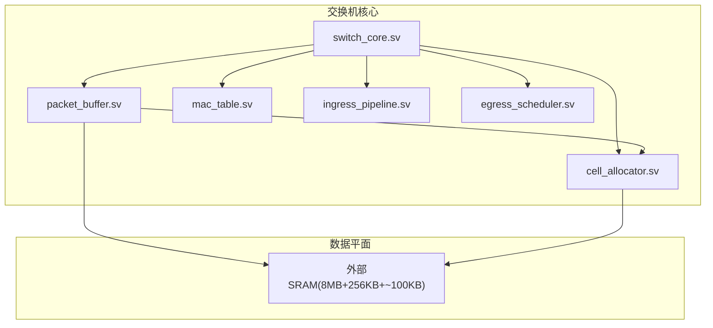
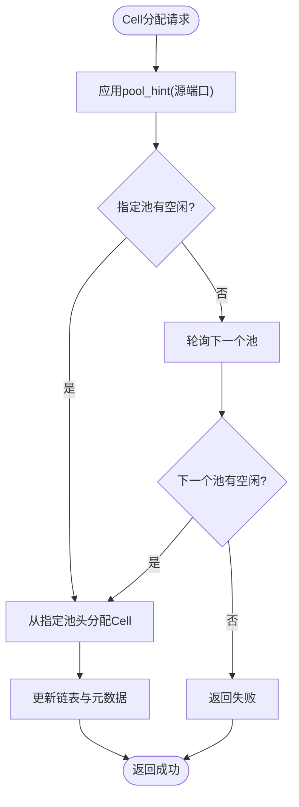
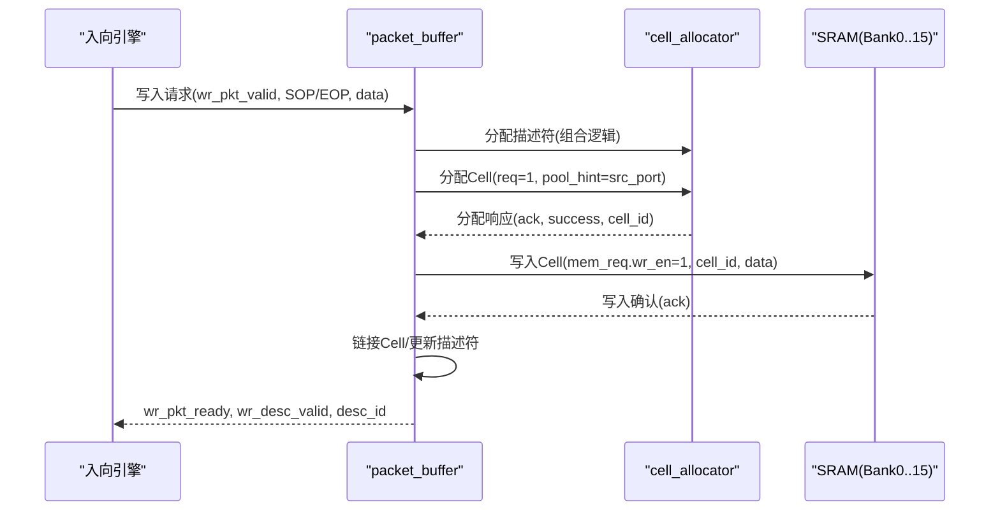
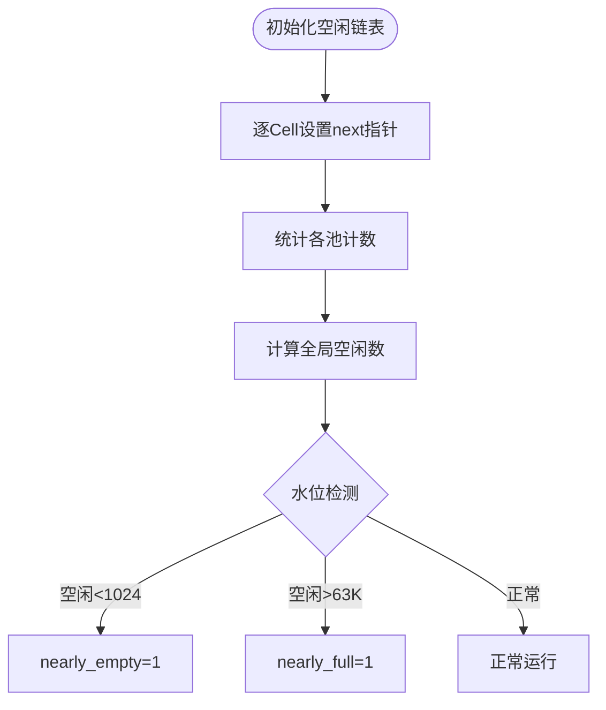
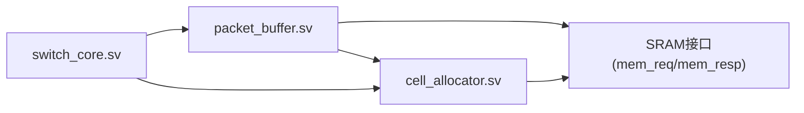

# 报文缓冲区

<cite>
**本文档引用的文件**
- [packet_buffer.sv](file://rtl/packet_buffer.sv)
- [cell_allocator.sv](file://rtl/cell_allocator.sv)
- [switch_pkg.sv](file://rtl/switch_pkg.sv)
- [switch_core.sv](file://rtl/switch_core.sv)
- [1.2Tbps-L2-Switch-Design.md](file://doc/1.2Tbps-L2-Switch-Design.md)
- [switch_core.py](file://model/switch_core.py)
</cite>

## 目录
1. [简介](#简介)
2. [项目结构](#项目结构)
3. [核心组件](#核心组件)
4. [架构总览](#架构总览)
5. [详细组件分析](#详细组件分析)
6. [依赖关系分析](#依赖关系分析)
7. [性能考虑](#性能考虑)
8. [故障排查指南](#故障排查指南)
9. [结论](#结论)
10. [附录](#附录)

## 简介
本文件面向“报文缓冲区”模块，系统化阐述其在1.2Tbps L2交换机中的作用与实现细节。重点覆盖：
- 8MB SRAM组织（64K Cells × 128B）与16 Banks并行架构
- Bank选择算法（Cell ID低位哈希映射与负载均衡）
- 读写时序控制（读使能、写使能、地址译码）
- Cell数据存储格式（128B对齐与边界处理）
- 缓冲区容量监控（空闲Cell统计与水位检测）
- 读写冲突处理（Bank间冲突避免与优先级仲裁）
- 性能分析（带宽利用率、延迟特性、可靠性保障）
- 存储器配置表与访问时序图

## 项目结构
报文缓冲区位于顶层模块中，作为交换机核心数据路径的一部分，负责将入向报文切分为Cell链表并缓存，供出向调度器读取输出。其直接依赖Cell分配器提供的空闲Cell与元数据管理，并通过描述符组织报文链路。

图表来源
- [switch_core.sv](file://rtl/switch_core.sv#L147-L205)
- [packet_buffer.sv](file://rtl/packet_buffer.sv#L1-L54)
- [cell_allocator.sv](file://rtl/cell_allocator.sv#L1-L35)

章节来源
- [switch_core.sv](file://rtl/switch_core.sv#L1-L454)
- [packet_buffer.sv](file://rtl/packet_buffer.sv#L1-L54)
- [cell_allocator.sv](file://rtl/cell_allocator.sv#L1-L35)

## 核心组件
- 报文缓冲区（packet_buffer.sv）：负责报文写入、读取、释放；维护描述符与Cell链表；协调Cell分配器。
- Cell分配器（cell_allocator.sv）：管理64K个128B Cells，4路空闲池，维护元数据（next_ptr、ref_cnt、eop、valid），提供分配/释放接口与水位监控。
- 参数包（switch_pkg.sv）：定义Cell大小、Cell ID宽度、Bank数量、描述符池大小等关键参数。
- 顶层整合（switch_core.sv）：连接各子模块，提供中断与统计接口。

章节来源
- [packet_buffer.sv](file://rtl/packet_buffer.sv#L1-L54)
- [cell_allocator.sv](file://rtl/cell_allocator.sv#L1-L35)
- [switch_pkg.sv](file://rtl/switch_pkg.sv#L16-L43)
- [switch_core.sv](file://rtl/switch_core.sv#L147-L205)

## 架构总览
报文缓冲区采用“描述符 + Cell链表”的组织方式。描述符存储在片上SRAM中，记录首尾Cell指针、Cell数量、报文长度、源端口等信息；Cell数据与元数据同样驻留在SRAM中，通过Cell ID进行寻址。Cell ID的低4位决定Bank选择，实现16 Banks并行访问。

```mermaid
graph TB
subgraph "描述符层"
DMem["描述符SRAM<br/>4K × 128bit"]
end
subgraph "Cell层"
CMeta["元数据SRAM<br/>64K × 32bit"]
CData["数据SRAM<br/>64K × 128B"]
end
subgraph "Bank矩阵"
B0["Bank0"]
B1["Bank1"]
B2["Bank2"]
B3["Bank3"]
B4["Bank4"]
B5["Bank5"]
B6["Bank6"]
B7["Bank7"]
B8["Bank8"]
B9["Bank9"]
B10["Bank10"]
B11["Bank11"]
B12["Bank12"]
B13["Bank13"]
B14["Bank14"]
B15["Bank15"]
end
DMem --- B0
DMem --- B1
DMem --- B2
DMem --- B3
DMem --- B4
DMem --- B5
DMem --- B6
DMem --- B7
DMem --- B8
DMem --- B9
DMem --- B10
DMem --- B11
DMem --- B12
DMem --- B13
DMem --- B14
DMem --- B15
CMeta --- B0
CMeta --- B1
CMeta --- B2
CMeta --- B3
CMeta --- B4
CMeta --- B5
CMeta --- B6
CMeta --- B7
CMeta --- B8
CMeta --- B9
CMeta --- B10
CMeta --- B11
CMeta --- B12
CMeta --- B13
CMeta --- B14
CMeta --- B15
CData --- B0
CData --- B1
CData --- B2
CData --- B3
CData --- B4
CData --- B5
CData --- B6
CData --- B7
CData --- B8
CData --- B9
CData --- B10
CData --- B11
CData --- B12
CData --- B13
CData --- B14
CData --- B15
```

图表来源
- [1.2Tbps-L2-Switch-Design.md](file://doc/1.2Tbps-L2-Switch-Design.md#L436-L466)
- [switch_pkg.sv](file://rtl/switch_pkg.sv#L16-L21)

章节来源
- [1.2Tbps-L2-Switch-Design.md](file://doc/1.2Tbps-L2-Switch-Design.md#L436-L466)
- [switch_pkg.sv](file://rtl/switch_pkg.sv#L16-L21)

## 详细组件分析

### 1) 8MB SRAM组织与16 Banks并行架构
- 容量与单元
  - 64K Cells × 128B = 8MB
  - 元数据：64K × 32bit = 256KB
  - 描述符：4K × 128bit ≈ 64KB；队列描述符、空闲池管理、空闲链表合计约~100KB
- 并行Bank
  - 16 Banks × 512bit × 500MHz = 4Tbps带宽
  - Bank选择：Cell ID[3:0]决定Bank
- 设计目标
  - Store-and-Forward模式下整包接收后再入队，减少跨Cell访问竞争
  - Cut-Through模式下支持边写边读，需注意Bank冲突与优先级

章节来源
- [1.2Tbps-L2-Switch-Design.md](file://doc/1.2Tbps-L2-Switch-Design.md#L436-L466)
- [switch_pkg.sv](file://rtl/switch_pkg.sv#L16-L21)

### 2) Bank选择算法与负载均衡
- 选择策略
  - 基于Cell ID的低位Hash映射：Cell ID[3:0] → Bank
  - 4路空闲池（NUM_FREE_POOLS=4）：pool_hint来自源端口，提升局部性
- 负载均衡
  - 分配器内部按池轮询，池间空闲度统计与借调（简化实现）
  - 通过pool_hint降低跨池争用，提高命中率

图表来源
- [cell_allocator.sv](file://rtl/cell_allocator.sv#L150-L188)
- [cell_allocator.sv](file://rtl/cell_allocator.sv#L193-L231)

章节来源
- [cell_allocator.sv](file://rtl/cell_allocator.sv#L150-L188)
- [cell_allocator.sv](file://rtl/cell_allocator.sv#L193-L231)

### 3) 读写操作时序控制
- 写入流程（packet_buffer）
  - 描述符初始化完成后进入写入状态机
  - 分配描述符 → 分配Cell → 写入数据 → 链接Cell → 完成并更新描述符
  - 写使能：mem_req.wr_en；地址：mem_req.cell_id；数据：mem_req.wr_data
- 读取流程（packet_buffer）
  - 读取描述符 → 读取首Cell → 输出数据 → 判断EOP → 下一Cell
  - 读使能：组合逻辑触发，状态机驱动
- 地址译码
  - Cell ID[3:0]决定Bank
  - 描述符与元数据同样按Cell ID寻址，确保一致性

图表来源
- [packet_buffer.sv](file://rtl/packet_buffer.sv#L189-L244)
- [cell_allocator.sv](file://rtl/cell_allocator.sv#L150-L188)
- [switch_pkg.sv](file://rtl/switch_pkg.sv#L206-L216)

章节来源
- [packet_buffer.sv](file://rtl/packet_buffer.sv#L189-L244)
- [packet_buffer.sv](file://rtl/packet_buffer.sv#L318-L373)
- [cell_allocator.sv](file://rtl/cell_allocator.sv#L150-L188)
- [switch_pkg.sv](file://rtl/switch_pkg.sv#L206-L216)

### 4) Cell数据存储格式与对齐
- Cell大小：128B（CELL_SIZE=128）
- 对齐要求：按128B对齐写入，避免跨Cell边界
- 边界处理：
  - 首Cell：写入前缀（含SOP）
  - 中间Cell：完整128B
  - 尾Cell：仅写入有效字节，其余清零或保留
- 元数据字段：next_ptr（指向下一Cell）、ref_cnt（组播引用计数）、eop（报文结束）、valid（有效）

章节来源
- [switch_pkg.sv](file://rtl/switch_pkg.sv#L16-L18)
- [switch_pkg.sv](file://rtl/switch_pkg.sv#L91-L98)
- [packet_buffer.sv](file://rtl/packet_buffer.sv#L281-L294)

### 5) 容量监控与水位检测
- 空闲Cell统计
  - 分配器维护4个空闲池的计数，总空闲数用于全局统计
  - nearly_empty/nearly_full阈值：低水位1024，高水位64K-1024
- 描述符池
  - 4K大小的描述符池，空闲链表管理
  - 初始化状态机一次性建立空闲链表，确保运行期无额外开销

图表来源
- [cell_allocator.sv](file://rtl/cell_allocator.sv#L85-L146)
- [cell_allocator.sv](file://rtl/cell_allocator.sv#L236-L244)

章节来源
- [cell_allocator.sv](file://rtl/cell_allocator.sv#L85-L146)
- [cell_allocator.sv](file://rtl/cell_allocator.sv#L236-L244)

### 6) 读写冲突处理与优先级仲裁
- Bank冲突避免
  - 通过Cell ID[3:0]均匀分布到16 Banks，降低热点冲突
  - 分配器按池轮询，减少同一Bank的连续争用
- 优先级仲裁
  - Egress读取（最高）：保证不欠速
  - Ingress写入（次高）
  - 组播指针复制（最低）
- 实现要点
  - 读写请求在状态机驱动下有序发起
  - 元数据与数据分离SRAM，减少耦合

章节来源
- [1.2Tbps-L2-Switch-Design.md](file://doc/1.2Tbps-L2-Switch-Design.md#L494-L509)
- [packet_buffer.sv](file://rtl/packet_buffer.sv#L318-L373)

### 7) 性能分析
- 带宽利用率
  - 4Tbps内存带宽 vs 1.2Tbps转发带宽，裕量约3.3x
  - 16 Banks并行读写，满足Store-and-Forward与Cut-Through混合场景
- 延迟特性
  - Store-and-Forward：整包接收后入队，延迟主要由队列调度决定
  - Cut-Through：收到足够头部即可查表，后续Cell边写边读，降低排队延迟
- 可靠性保证
  - 引用计数（ref_cnt）确保组播复制正确释放
  - 元数据valid/eop标志位防止脏读
  - 空闲池与描述符池的初始化状态机确保系统启动一致性

章节来源
- [1.2Tbps-L2-Switch-Design.md](file://doc/1.2Tbps-L2-Switch-Design.md#L506-L509)
- [switch_pkg.sv](file://rtl/switch_pkg.sv#L91-L98)
- [cell_allocator.sv](file://rtl/cell_allocator.sv#L209-L226)

## 依赖关系分析
- 模块耦合
  - packet_buffer依赖cell_allocator提供Cell分配/释放与元数据访问
  - switch_core将packet_buffer与cell_allocator整合，提供中断与统计
- 外部接口
  - mem_req/mem_resp用于与外部SRAM交互
  - 描述符读写接口用于队列管理

图表来源
- [switch_core.sv](file://rtl/switch_core.sv#L147-L205)
- [packet_buffer.sv](file://rtl/packet_buffer.sv#L45-L53)
- [cell_allocator.sv](file://rtl/cell_allocator.sv#L1-L35)

章节来源
- [switch_core.sv](file://rtl/switch_core.sv#L147-L205)
- [packet_buffer.sv](file://rtl/packet_buffer.sv#L45-L53)
- [cell_allocator.sv](file://rtl/cell_allocator.sv#L1-L35)

## 性能考虑
- 带宽与延迟
  - 4Tbps内存带宽足以支撑1.2Tbps转发，且16 Banks并行降低冲突
  - Cut-Through模式显著降低排队延迟，适合低时延场景
- 资源利用
  - 描述符与元数据SRAM占用较小，整体片内SRAM约8.35MB
  - 空闲池与描述符池初始化一次性完成，运行期无额外开销
- 可扩展性
  - Bank数量与Cell ID位宽可按容量需求调整
  - 池数量与水位阈值可按拥塞策略优化

[本节为通用性能讨论，无需特定文件引用]

## 故障排查指南
- 初始化问题
  - 确认cell_init_done为1后再发起写入；参考仿真测试任务等待该信号
- 水位告警
  - nearly_empty/nearly_full持续触发时，检查队列深度与入队速率
- 冲突与拥塞
  - 若出现读写超时，检查是否集中在特定Bank（Cell ID[3:0]相同）
  - 适当降低pool_hint集中度，或调整队列权重
- 数据一致性
  - 核对EOP标志与next_ptr链路，避免链表断裂
  - 组播场景下确认ref_cnt递减至0后释放

章节来源
- [tb/tb_switch_core.sv](file://tb/tb_switch_core.sv#L322-L356)
- [cell_allocator.sv](file://rtl/cell_allocator.sv#L236-L244)
- [packet_buffer.sv](file://rtl/packet_buffer.sv#L281-L294)

## 结论
报文缓冲区通过“描述符 + Cell链表 + 16 Banks并行SRAM”的架构，实现了高带宽、低延迟、可扩展的报文缓存能力。Bank选择采用Cell ID低位Hash映射，结合4路空闲池与优先级仲裁，有效避免冲突并保障吞吐。配合完善的容量监控与元数据管理，系统在Store-and-Forward与Cut-Through模式下均具备可靠的性能表现。

[本节为总结性内容，无需特定文件引用]

## 附录

### A. 存储器配置表
- 数据平面SRAM配置
  - Packet Data Memory：64K × 128B = 8MB
  - Cell Metadata Memory：64K × 32bit = 256KB
  - Descriptor Memory：~100KB（描述符、队列描述符、空闲池管理、空闲链表）
- Bank与接口
  - Bank数量：16
  - Bank选择：Cell ID[3:0]
  - 内存接口：mem_req/mem_resp（写使能、地址、数据）

章节来源
- [1.2Tbps-L2-Switch-Design.md](file://doc/1.2Tbps-L2-Switch-Design.md#L436-L466)
- [switch_pkg.sv](file://rtl/switch_pkg.sv#L16-L21)
- [switch_pkg.sv](file://rtl/switch_pkg.sv#L206-L216)

### B. 访问时序图（写入）

图表来源
- [packet_buffer.sv](file://rtl/packet_buffer.sv#L189-L244)
- [cell_allocator.sv](file://rtl/cell_allocator.sv#L150-L188)
- [switch_pkg.sv](file://rtl/switch_pkg.sv#L206-L216)