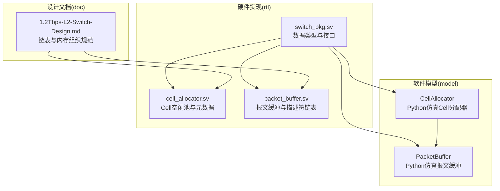
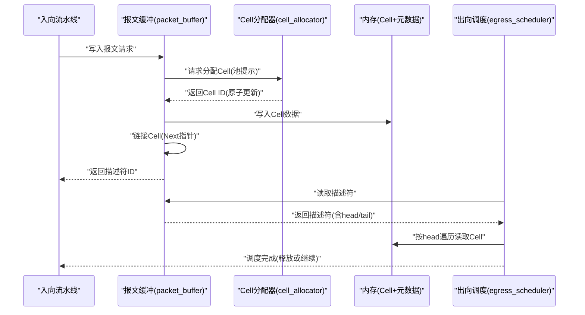
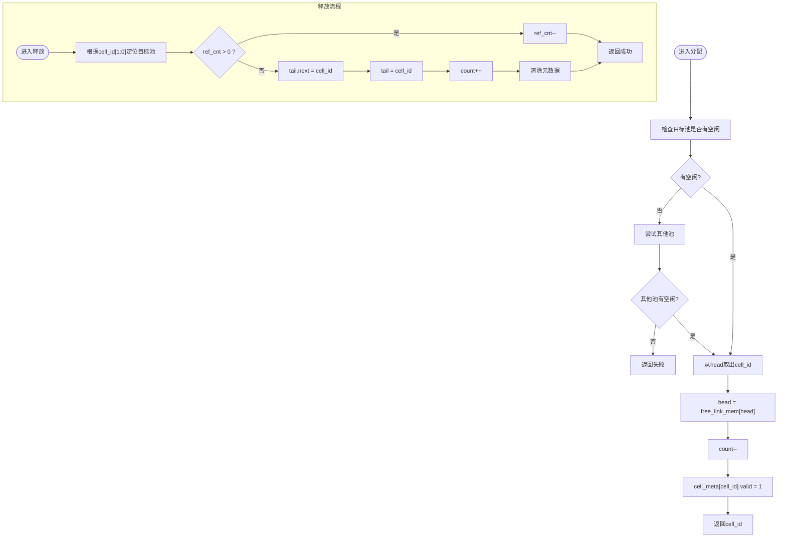
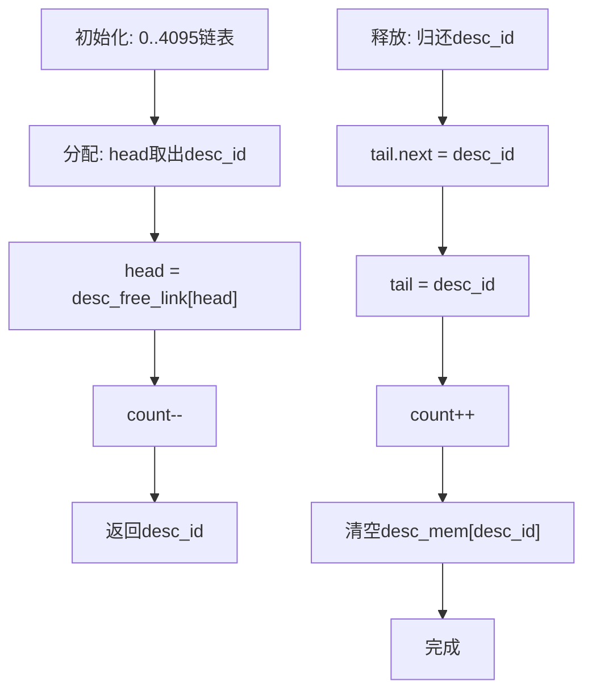
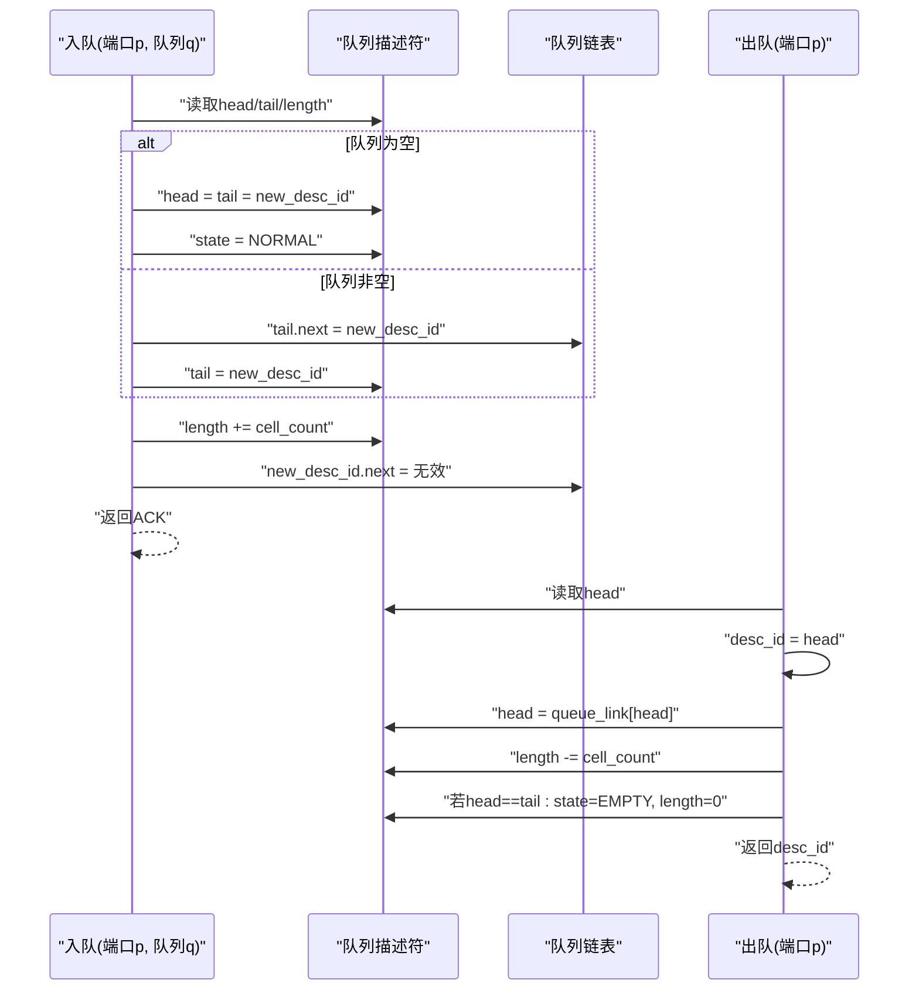
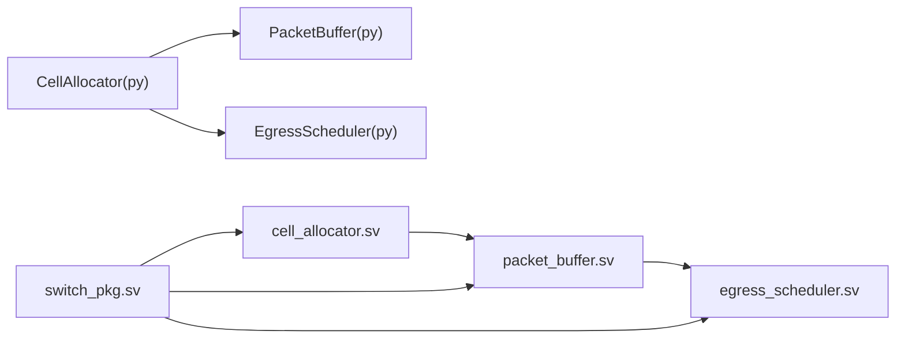
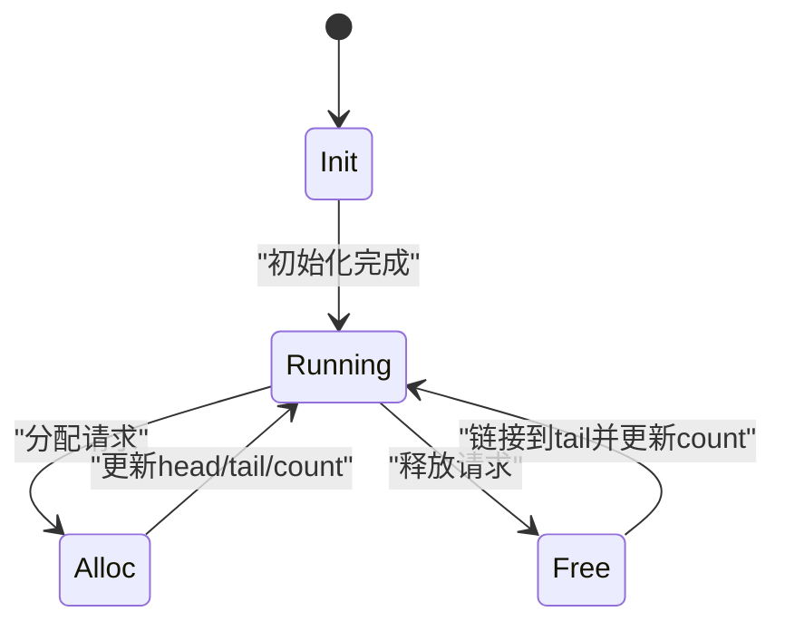
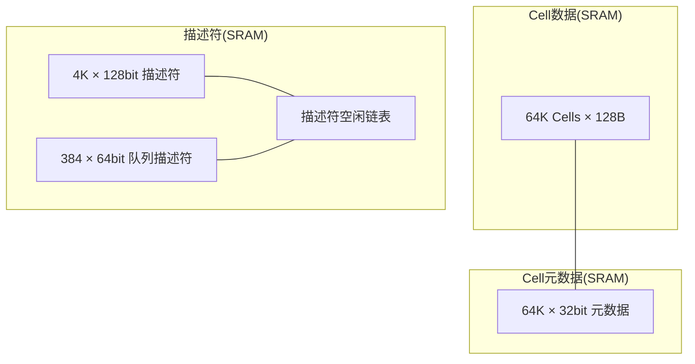

# 链表数据结构

<cite>
**本文档引用的文件**
- [packet_buffer.sv](file://rtl/packet_buffer.sv)
- [cell_allocator.sv](file://rtl/cell_allocator.sv)
- [switch_pkg.sv](file://rtl/switch_pkg.sv)
- [switch_core.py](file://model/switch_core.py)
- [1.2Tbps-L2-Switch-Design.md](file://doc/1.2Tbps-L2-Switch-Design.md)
</cite>

## 目录
1. [简介](#简介)
2. [项目结构](#项目结构)
3. [核心组件](#核心组件)
4. [架构总览](#架构总览)
5. [详细组件分析](#详细组件分析)
6. [依赖分析](#依赖分析)
7. [性能考虑](#性能考虑)
8. [故障排查指南](#故障排查指南)
9. [结论](#结论)
10. [附录](#附录)

## 简介
本文件系统性地梳理交换机系统中的链表数据结构设计与实现，重点覆盖：
- 空闲链表的设计原理与实现（单向链表Next指针、循环链表的特殊处理）
- 链表节点组织方式（Cell ID与Next指针的对应关系）
- 链表操作的原子性保证（分配与释放过程的一致性维护）
- 链表遍历算法（从head到tail的顺序访问与环形结构检测）
- 链表状态的并发控制（多路并行访问的同步策略）
- 链表性能优化（缓存友好内存布局与预取策略）
- 链表操作的伪代码与时序图（分配、释放、遍历）
- 链表状态转换图与内存使用示意图

## 项目结构
本项目采用硬件与软件协同验证的方式：
- 硬件实现位于 rtl/，包含Cell分配器、报文缓冲区等模块
- Python仿真模型位于 model/，提供链表行为的高层抽象与验证
- 设计文档位于 doc/，给出链表结构、内存组织与调度策略的规范

图表来源
- [cell_allocator.sv](file://rtl/cell_allocator.sv#L1-L247)
- [packet_buffer.sv](file://rtl/packet_buffer.sv#L1-L427)
- [switch_pkg.sv](file://rtl/switch_pkg.sv#L1-L219)
- [switch_core.py](file://model/switch_core.py#L227-L481)
- [1.2Tbps-L2-Switch-Design.md](file://doc/1.2Tbps-L2-Switch-Design.md#L360-L466)

章节来源
- [cell_allocator.sv](file://rtl/cell_allocator.sv#L1-L247)
- [packet_buffer.sv](file://rtl/packet_buffer.sv#L1-L427)
- [switch_pkg.sv](file://rtl/switch_pkg.sv#L1-L219)
- [switch_core.py](file://model/switch_core.py#L227-L481)
- [1.2Tbps-L2-Switch-Design.md](file://doc/1.2Tbps-L2-Switch-Design.md#L360-L466)

## 核心组件
- Cell空闲链表（4路并行）：由cell_allocator.sv实现，每个池维护head/tail/count，元数据存储Next指针
- 描述符空闲链表：由packet_buffer.sv实现，管理最大4K的描述符池
- 队列描述符链表：由egress_scheduler.sv实现，每个端口的8个优先级队列维护head/tail/length/state
- Python仿真链表：由switch_core.py中的CellAllocator与PacketBuffer提供高层行为验证

章节来源
- [cell_allocator.sv](file://rtl/cell_allocator.sv#L46-L81)
- [packet_buffer.sv](file://rtl/packet_buffer.sv#L59-L66)
- [switch_core.py](file://model/switch_core.py#L227-L481)

## 架构总览
链表在系统中的位置与交互如下：
- Cell分配器负责64K个Cell的空闲链表管理，支持4路并行分配
- 报文缓冲区将报文拆分为Cell链表，使用描述符记录首尾Cell与统计信息
- 出向调度器将描述符按端口与优先级组织为链表，支持SP+WRR两级调度
- Python仿真模型验证链表行为与一致性

图表来源
- [packet_buffer.sv](file://rtl/packet_buffer.sv#L189-L244)
- [cell_allocator.sv](file://rtl/cell_allocator.sv#L151-L188)
- [switch_pkg.sv](file://rtl/switch_pkg.sv#L187-L216)

## 详细组件分析

### Cell空闲链表（4路并行）
- 结构组成
  - 每个池维护free_lists[pool].head/tail/count
  - 元数据cell_meta_mem[CELL_ID]包含next_ptr、ref_cnt、eop、valid
  - free_link_mem[CELL_ID]存储Next指针（物理SRAM）
- 初始化
  - 初始化状态机将64K Cells均分到4个池，每个池16K；池内Next指针顺序连接，末尾指向无效值
- 分配
  - 从指定池head取出Cell ID，更新head为free_link_mem[head]，count减一
  - 设置元数据valid为1
- 释放
  - 根据Cell ID低2位确定目标池，将cell_id链接到tail，更新tail与count
  - 清除元数据（valid、next_ptr、eop）

图表来源
- [cell_allocator.sv](file://rtl/cell_allocator.sv#L96-L146)
- [cell_allocator.sv](file://rtl/cell_allocator.sv#L151-L188)
- [cell_allocator.sv](file://rtl/cell_allocator.sv#L193-L231)

章节来源
- [cell_allocator.sv](file://rtl/cell_allocator.sv#L46-L81)
- [cell_allocator.sv](file://rtl/cell_allocator.sv#L96-L146)
- [cell_allocator.sv](file://rtl/cell_allocator.sv#L151-L188)
- [cell_allocator.sv](file://rtl/cell_allocator.sv#L193-L231)
- [switch_pkg.sv](file://rtl/switch_pkg.sv#L91-L98)

### 描述符空闲链表
- 结构组成
  - desc_free_head/tail/count维护4K描述符池的空闲链表
  - desc_free_link[DESC_ID]存储Next指针
  - desc_mem[DESC_ID]存储pkt_desc_t（包含head/tail/cell_count/pkt_len等）
- 初始化
  - 初始化状态机将0..4095依次链接，末尾指向无效值，同时清空desc_mem
- 分配
  - 从desc_free_head取出desc_id，更新head为desc_free_link[head]，count减一
- 释放
  - 将desc_id链接到desc_free_tail，更新tail与count，清空desc_mem[desc_id]

图表来源
- [packet_buffer.sv](file://rtl/packet_buffer.sv#L140-L176)
- [packet_buffer.sv](file://rtl/packet_buffer.sv#L264-L296)
- [packet_buffer.sv](file://rtl/packet_buffer.sv#L413-L424)

章节来源
- [packet_buffer.sv](file://rtl/packet_buffer.sv#L59-L66)
- [packet_buffer.sv](file://rtl/packet_buffer.sv#L140-L176)
- [packet_buffer.sv](file://rtl/packet_buffer.sv#L264-L296)
- [packet_buffer.sv](file://rtl/packet_buffer.sv#L413-L424)

### 队列描述符链表（SP+WRR）
- 结构组成
  - queue_desc[PORT][QUEUE]包含head/tail/length/state
  - queue_link[DESC_ID]存储Next指针（描述符链表）
- 入队
  - 若队列为空：head/tail直接指向新描述符
  - 否则：将tail.next指向新描述符，更新tail；同时更新length
  - 尾部标记queue_link[new_desc_id]为无效值
- 出队
  - 读取head描述符ID，更新head为queue_link[head]
  - 检查队列是否变空（head==tail），若是则state置空且length清零
  - 更新WRR计数器

图表来源
- [egress_scheduler.sv](file://rtl/egress_scheduler.sv#L161-L185)
- [egress_scheduler.sv](file://rtl/egress_scheduler.sv#L231-L293)

章节来源
- [egress_scheduler.sv](file://rtl/egress_scheduler.sv#L161-L185)
- [egress_scheduler.sv](file://rtl/egress_scheduler.sv#L231-L293)

### Python仿真链表（对比验证）
- CellAllocator
  - 维护4个deque空闲池，按池ID轮询尝试分配
  - 释放时按cell_id%4归还到原池，支持引用计数（组播）
- PacketBuffer
  - 将报文切分为Cell链表，使用link_cells设置next_ptr
  - 遍历时按next_ptr顺序读取，直到EOP或next_ptr为空

章节来源
- [switch_core.py](file://model/switch_core.py#L227-L350)
- [switch_core.py](file://model/switch_core.py#L351-L481)

## 依赖分析
- 类型与接口
  - switch_pkg.sv定义cell_meta_t、pkt_desc_t、queue_desc_t及cell_alloc_req/resp、mem_req/resp等接口
- 模块耦合
  - packet_buffer依赖cell_allocator提供的cell_id与元数据
  - egress_scheduler依赖packet_buffer提供的描述符与元数据
  - Python模型与RTL模块在行为上保持一致，便于验证

图表来源
- [switch_pkg.sv](file://rtl/switch_pkg.sv#L88-L216)
- [cell_allocator.sv](file://rtl/cell_allocator.sv#L1-L35)
- [packet_buffer.sv](file://rtl/packet_buffer.sv#L1-L54)
- [switch_core.py](file://model/switch_core.py#L227-L481)

章节来源
- [switch_pkg.sv](file://rtl/switch_pkg.sv#L88-L216)
- [cell_allocator.sv](file://rtl/cell_allocator.sv#L1-L35)
- [packet_buffer.sv](file://rtl/packet_buffer.sv#L1-L54)
- [switch_core.py](file://model/switch_core.py#L227-L481)

## 性能考虑
- 缓存友好内存布局
  - Cell与元数据分离存储，元数据32bit×64K=256KB，支持双端口读写
  - 4路空闲池均分64K Cells，降低热点竞争
- 并行访问
  - Cell分配器支持4路并行分配，池间轮询减少冲突
  - 内存16 Banks，按Cell ID[3:0]选择Bank，支持16并行读写
- 预取策略
  - Store-and-Forward模式下，先写完所有Cell再入队，有利于缓存局部性
  - Cut-Through模式下，提前查表后流式读写，减少等待延迟
- 水位监控
  - 低水位与高水位阈值用于拥塞预警与调度调整

章节来源
- [1.2Tbps-L2-Switch-Design.md](file://doc/1.2Tbps-L2-Switch-Design.md#L393-L434)
- [1.2Tbps-L2-Switch-Design.md](file://doc/1.2Tbps-L2-Switch-Design.md#L436-L466)
- [1.2Tbps-L2-Switch-Design.md](file://doc/1.2Tbps-L2-Switch-Design.md#L493-L509)

## 故障排查指南
- 分配失败
  - 检查对应池的count是否为0；确认pool_hint是否合理
  - 确认init_done信号是否拉高
- 释放异常
  - 检查cell_meta.ref_cnt是否大于0（组播场景）
  - 确认free_req.target_pool与cell_id[1:0]一致
- 链表遍历中断
  - 检查cell_meta.eop标志与next_ptr是否正确设置
  - 对于描述符链表，确认queue_link的尾部标记为无效值
- 队列状态异常
  - head==tail但state!=EMPTY时，需检查length是否清零
  - WRR计数器是否按权重正确递增与重置

章节来源
- [cell_allocator.sv](file://rtl/cell_allocator.sv#L151-L188)
- [cell_allocator.sv](file://rtl/cell_allocator.sv#L193-L231)
- [packet_buffer.sv](file://rtl/packet_buffer.sv#L264-L296)
- [egress_scheduler.sv](file://rtl/egress_scheduler.sv#L231-L293)

## 结论
本系统通过严格的链表设计与实现，结合多路并行与缓存友好的内存组织，在硬件与软件层面确保了链表操作的原子性与一致性。Cell空闲链表、描述符空闲链表与队列描述符链表共同支撑了高性能的报文存储与调度，满足1.2Tbps的吞吐需求。

## 附录

### 链表状态转换图（Cell空闲链表）

图表来源
- [cell_allocator.sv](file://rtl/cell_allocator.sv#L96-L146)
- [cell_allocator.sv](file://rtl/cell_allocator.sv#L151-L188)
- [cell_allocator.sv](file://rtl/cell_allocator.sv#L193-L231)

### 内存使用示意图（Cell、元数据、描述符）

图表来源
- [1.2Tbps-L2-Switch-Design.md](file://doc/1.2Tbps-L2-Switch-Design.md#L436-L466)