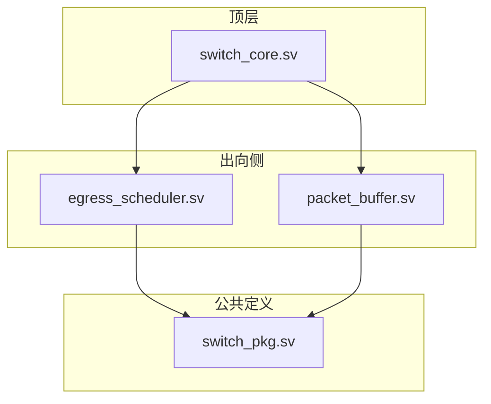
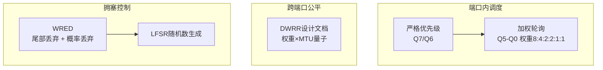
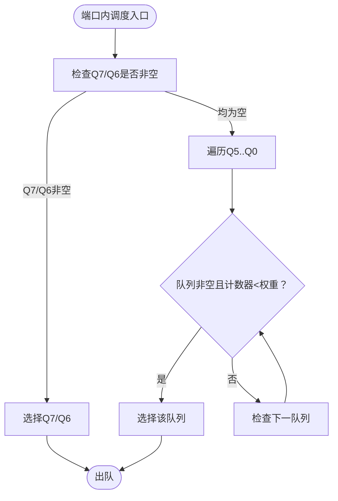
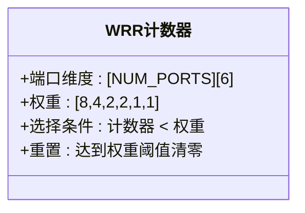
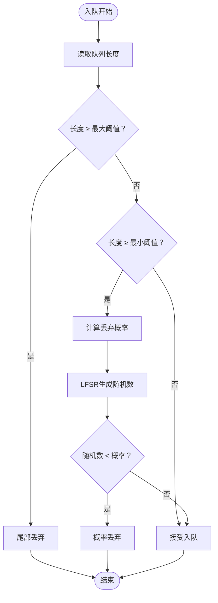
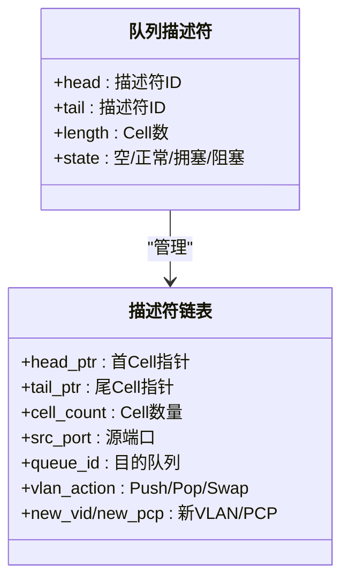
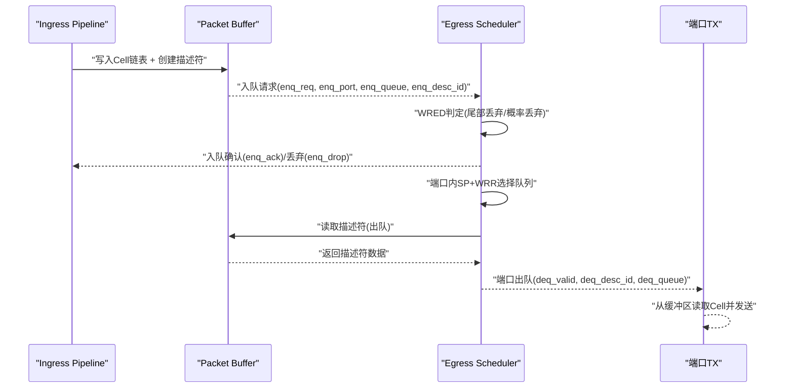
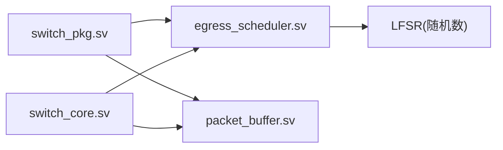

# 出向调度器

<cite>
**本文引用的文件**
- [egress_scheduler.sv](file://rtl/egress_scheduler.sv)
- [switch_pkg.sv](file://rtl/switch_pkg.sv)
- [switch_core.sv](file://rtl/switch_core.sv)
- [packet_buffer.sv](file://rtl/packet_buffer.sv)
- [1.2Tbps-L2-Switch-Design.md](file://doc/1.2Tbps-L2-Switch-Design.md)
</cite>

## 目录
1. [简介](#简介)
2. [项目结构](#项目结构)
3. [核心组件](#核心组件)
4. [架构总览](#架构总览)
5. [详细组件分析](#详细组件分析)
6. [依赖关系分析](#依赖关系分析)
7. [性能考量](#性能考量)
8. [故障排查指南](#故障排查指南)
9. [结论](#结论)
10. [附录](#附录)

## 简介
本文件面向“出向调度器”模块，系统化阐述两级调度架构的设计与实现，包括：
- 端口内优先级调度：严格优先级（Q7/Q6）与加权轮询（Q5-Q0，权重8:4:2:2:1:1）的混合调度。
- 跨端口带宽公平：基于WRED的拥塞控制与令牌桶整形，以及在当前RTL中未直接实现的Deficit Weighted Round Robin（DWRR）跨端口公平调度的原理说明。
- VLAN标签操作：Push、Pop、Swap的描述符层面语义与实现边界。
- 调度时序与队列管理流程图，帮助读者建立从入队到端口输出的完整视图。
- 调度参数配置与性能优化建议。

## 项目结构
围绕出向调度器的关键文件与职责如下：
- 顶层整合模块：负责将Ingress、MAC表、内存缓冲、出向调度器等子模块连接起来。
- 出向调度器：实现端口内SP+WRR两级调度、WRED拥塞控制、队列状态与统计。
- 包定义：统一的数据类型、枚举、参数与描述符结构，确保各模块接口一致。
- 报文缓冲区：Cell链表与描述符管理，支撑调度器的队列链表结构。
- 设计文档：提供两级调度、WRED、VLAN动作等高层设计说明。

图表来源
- [switch_core.sv](file://rtl/switch_core.sv#L335-L359)
- [egress_scheduler.sv](file://rtl/egress_scheduler.sv#L7-L43)
- [packet_buffer.sv](file://rtl/packet_buffer.sv#L7-L54)
- [switch_pkg.sv](file://rtl/switch_pkg.sv#L7-L219)

章节来源
- [switch_core.sv](file://rtl/switch_core.sv#L335-L359)
- [egress_scheduler.sv](file://rtl/egress_scheduler.sv#L7-L43)
- [packet_buffer.sv](file://rtl/packet_buffer.sv#L7-L54)
- [switch_pkg.sv](file://rtl/switch_pkg.sv#L7-L219)

## 核心组件
- 出向调度器（SP+WRR + WRED）
  - 端口内优先级：Q7/Q6严格优先级，Q5-Q0加权轮询（权重8:4:2:2:1:1）。
  - WRED：基于队列长度的尾部丢弃与概率丢弃，结合LFSR生成随机阈值。
  - 队列链表：描述符链表管理，支持O(1)入队与出队。
  - 统计：入队/出队/丢弃计数。
- 报文缓冲区（Packet Buffer）
  - Cell链表与描述符池，支持写入、读取、释放。
  - 描述符包含首尾Cell指针、Cell数量、源端口、队列ID等。
- 包定义（switch_pkg）
  - 定义队列状态、VLAN动作枚举、描述符结构、端口/队列宽度等参数。
- 顶层整合（switch_core）
  - 连接Ingress、MAC表、内存缓冲与出向调度器；提供配置寄存器与统计接口。

章节来源
- [egress_scheduler.sv](file://rtl/egress_scheduler.sv#L48-L70)
- [egress_scheduler.sv](file://rtl/egress_scheduler.sv#L125-L151)
- [packet_buffer.sv](file://rtl/packet_buffer.sv#L59-L65)
- [switch_pkg.sv](file://rtl/switch_pkg.sv#L55-L77)
- [switch_core.sv](file://rtl/switch_core.sv#L335-L359)

## 架构总览
两级调度架构在端口内先执行严格优先级（Q7/Q6），再对Q5-Q0执行加权轮询；跨端口公平调度在当前RTL中未直接实现DWRR，但设计文档明确其原理与参数（权重×MTU量子）。WRED在入队阶段根据队列长度与阈值进行尾部丢弃或概率丢弃，配合LFSR实现随机性。

图表来源
- [1.2Tbps-L2-Switch-Design.md](file://doc/1.2Tbps-L2-Switch-Design.md#L530-L549)
- [egress_scheduler.sv](file://rtl/egress_scheduler.sv#L57-L70)
- [egress_scheduler.sv](file://rtl/egress_scheduler.sv#L125-L141)
- [egress_scheduler.sv](file://rtl/egress_scheduler.sv#L78-L85)

章节来源
- [1.2Tbps-L2-Switch-Design.md](file://doc/1.2Tbps-L2-Switch-Design.md#L530-L549)
- [egress_scheduler.sv](file://rtl/egress_scheduler.sv#L57-L70)
- [egress_scheduler.sv](file://rtl/egress_scheduler.sv#L125-L141)
- [egress_scheduler.sv](file://rtl/egress_scheduler.sv#L78-L85)

## 详细组件分析

### 端口内优先级调度（SP+WRR）
- 严格优先级：Q7、Q6优先，若对应队列非空即优先选择。
- 加权轮询：对Q5-Q0按权重轮询，权重分别为8、4、2、2、1、1。每次出队后计数器累加，达到权重阈值才重置，从而实现比例公平。
- 选择逻辑：组合逻辑在每端口独立执行，选择器在SP未命中时进入WRR分支。

图表来源
- [egress_scheduler.sv](file://rtl/egress_scheduler.sv#L205-L229)
- [egress_scheduler.sv](file://rtl/egress_scheduler.sv#L273-L280)

章节来源
- [egress_scheduler.sv](file://rtl/egress_scheduler.sv#L205-L229)
- [egress_scheduler.sv](file://rtl/egress_scheduler.sv#L273-L280)

### 加权轮询（WRR）计数器与权重
- 权重初始化：在复位时加载Q5-Q0权重数组。
- 计数器：每端口每队列维护独立计数器，出队后累加，达到权重阈值重置。
- 选择条件：仅在队列非空且计数器小于权重时被选中。

图表来源
- [egress_scheduler.sv](file://rtl/egress_scheduler.sv#L57-L70)
- [egress_scheduler.sv](file://rtl/egress_scheduler.sv#L73-L73)
- [egress_scheduler.sv](file://rtl/egress_scheduler.sv#L273-L280)

章节来源
- [egress_scheduler.sv](file://rtl/egress_scheduler.sv#L57-L70)
- [egress_scheduler.sv](file://rtl/egress_scheduler.sv#L73-L73)
- [egress_scheduler.sv](file://rtl/egress_scheduler.sv#L273-L280)

### 跨端口带宽公平（DWRR）说明
- 设计文档定义：每端口量子 = MTU × Weight，使用“赤字”记录剩余额度，保证长期公平性。
- 当前RTL实现：未直接出现DWRR状态机与“赤字”变量。可在后续RTL中扩展，以实现跨端口公平调度。
- 建议：在顶层或调度器中引入每端口权重与量子，结合队列长度与权重计算每周期可传输Cell数，维持长期公平。

章节来源
- [1.2Tbps-L2-Switch-Design.md](file://doc/1.2Tbps-L2-Switch-Design.md#L543-L549)

### 拥塞控制（WRED）
- 尾部丢弃：队列长度超过最大阈值时丢弃新入队包。
- 概率丢弃：队列长度处于最小阈值与最大阈值之间时，按比例丢弃；比例由LFSR生成的随机数决定。
- LFSR：线性反馈移位寄存器，提供伪随机序列，用于WRED概率判定。

图表来源
- [egress_scheduler.sv](file://rtl/egress_scheduler.sv#L125-L141)
- [egress_scheduler.sv](file://rtl/egress_scheduler.sv#L78-L85)

章节来源
- [egress_scheduler.sv](file://rtl/egress_scheduler.sv#L125-L141)
- [egress_scheduler.sv](file://rtl/egress_scheduler.sv#L78-L85)

### VLAN标签操作（Push/Pop/Swap）
- 描述符字段：包含VLAN动作枚举与新VID/PCP字段，用于指示出向时的VLAN处理。
- 实际实现边界：当前RTL中未见具体的VLAN标签修改逻辑（如在Egress Pipeline中插入/删除/替换Tag）。描述符携带动作信息，具体修改需在Egress Pipeline中实现。
- 设计依据：描述符中定义了VLAN动作枚举与字段，便于后续在出向阶段执行Push/Pop/Swap。

章节来源
- [switch_pkg.sv](file://rtl/switch_pkg.sv#L63-L69)
- [switch_pkg.sv](file://rtl/switch_pkg.sv#L111-L116)
- [1.2Tbps-L2-Switch-Design.md](file://doc/1.2Tbps-L2-Switch-Design.md#L585-L589)

### 队列管理与链表结构
- 队列描述符：包含队列头、尾、长度与状态，支持O(1)入队与出队。
- 描述符链表：每个队列维护一个描述符链表，链表尾部以特殊标记表示队列结束。
- 初始化：通过状态机初始化队列描述符与空闲链表。

图表来源
- [switch_pkg.sv](file://rtl/switch_pkg.sv#L119-L126)
- [switch_pkg.sv](file://rtl/switch_pkg.sv#L100-L117)
- [egress_scheduler.sv](file://rtl/egress_scheduler.sv#L49-L52)
- [egress_scheduler.sv](file://rtl/egress_scheduler.sv#L329-L391)

章节来源
- [switch_pkg.sv](file://rtl/switch_pkg.sv#L119-L126)
- [switch_pkg.sv](file://rtl/switch_pkg.sv#L100-L117)
- [egress_scheduler.sv](file://rtl/egress_scheduler.sv#L49-L52)
- [egress_scheduler.sv](file://rtl/egress_scheduler.sv#L329-L391)

### 从入队到端口输出的调度时序
- 入队阶段：Ingress完成解析与ACL/QoS后，将报文存储到缓冲区并创建描述符，随后触发出向调度器入队。
- 调度阶段：端口内先SP后WRR选择队列，读取描述符并更新队列头；WRED在入队阶段进行丢弃判定。
- 出队阶段：每端口独立出队，输出到端口TX接口（当前RTL中简化为赋值，实际需要从缓冲区读取数据）。

图表来源
- [switch_core.sv](file://rtl/switch_core.sv#L325-L330)
- [egress_scheduler.sv](file://rtl/egress_scheduler.sv#L114-L184)
- [egress_scheduler.sv](file://rtl/egress_scheduler.sv#L231-L291)
- [packet_buffer.sv](file://rtl/packet_buffer.sv#L189-L244)

章节来源
- [switch_core.sv](file://rtl/switch_core.sv#L325-L330)
- [egress_scheduler.sv](file://rtl/egress_scheduler.sv#L114-L184)
- [egress_scheduler.sv](file://rtl/egress_scheduler.sv#L231-L291)
- [packet_buffer.sv](file://rtl/packet_buffer.sv#L189-L244)

## 依赖关系分析
- 出向调度器依赖包定义中的枚举与描述符结构，确保接口一致性。
- 顶层模块将调度器与缓冲区连接，形成完整的出向路径。
- 调度器内部使用LFSR生成随机数，参与WRED概率判定。

图表来源
- [switch_pkg.sv](file://rtl/switch_pkg.sv#L55-L77)
- [egress_scheduler.sv](file://rtl/egress_scheduler.sv#L78-L85)
- [switch_core.sv](file://rtl/switch_core.sv#L335-L359)

章节来源
- [switch_pkg.sv](file://rtl/switch_pkg.sv#L55-L77)
- [egress_scheduler.sv](file://rtl/egress_scheduler.sv#L78-L85)
- [switch_core.sv](file://rtl/switch_core.sv#L335-L359)

## 性能考量
- 调度粒度：128B Cell，适配最小帧，减少碎片化。
- 带宽裕量：设计文档给出内存带宽与核心频率的裕量，满足调度吞吐需求。
- 优先级与权重：严格优先级保障控制/实时流量，WRR权重实现业务带宽比例。
- WRED：在拥塞时避免全局同步丢弃，提升系统稳定性。
- DWRR：设计文档提出跨端口公平调度，建议在后续RTL中实现以进一步提升公平性。

章节来源
- [1.2Tbps-L2-Switch-Design.md](file://doc/1.2Tbps-L2-Switch-Design.md#L515-L549)
- [1.2Tbps-L2-Switch-Design.md](file://doc/1.2Tbps-L2-Switch-Design.md#L552-L569)

## 故障排查指南
- 入队丢弃过多
  - 检查WRED阈值配置是否合理，观察统计计数器。
  - 确认队列长度是否频繁接近最大阈值。
- 出队停滞
  - 检查端口内SP队列是否持续非空导致WRR无法调度。
  - 确认描述符链表尾标记是否正确，避免死循环。
- VLAN动作异常
  - 确认描述符中的VLAN动作字段是否正确设置。
  - 若未实现具体修改逻辑，需在Egress Pipeline中补充Push/Pop/Swap处理。

章节来源
- [egress_scheduler.sv](file://rtl/egress_scheduler.sv#L306-L324)
- [egress_scheduler.sv](file://rtl/egress_scheduler.sv#L125-L151)
- [switch_pkg.sv](file://rtl/switch_pkg.sv#L111-L116)

## 结论
本出向调度器采用两级调度架构：端口内严格优先级（Q7/Q6）与加权轮询（Q5-Q0），辅以WRED拥塞控制，满足实时与尽力而为流量的差异化需求。跨端口公平调度在设计文档中明确为DWRR，当前RTL尚未实现，建议在后续RTL中引入权重×MTU量子与“赤字”机制，以实现长期公平性。VLAN标签操作在描述符层面具备动作字段，具体修改逻辑需在Egress Pipeline中实现。

## 附录
- 调度参数配置建议
  - WRED阈值：根据典型突发与拥塞场景设定最小/最大阈值与最大丢弃概率。
  - WRR权重：根据业务带宽比例调整Q5-Q0权重，确保公平性与吞吐平衡。
  - DWRR：在RTL中引入每端口权重与量子，结合队列长度与权重计算每周期传输Cell数。
- 性能优化建议
  - 保持Cell粒度与内存带宽匹配，避免碎片化与访问冲突。
  - 严格优先级队列应尽量短小，避免长时间占用端口。
  - 合理设置WRED阈值，避免频繁概率丢弃导致抖动。