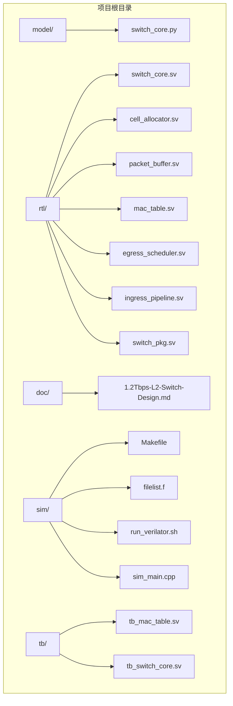
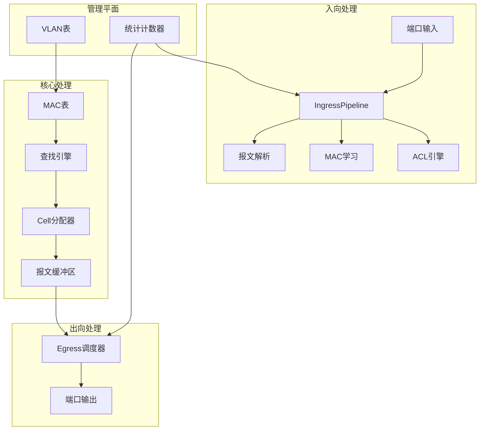
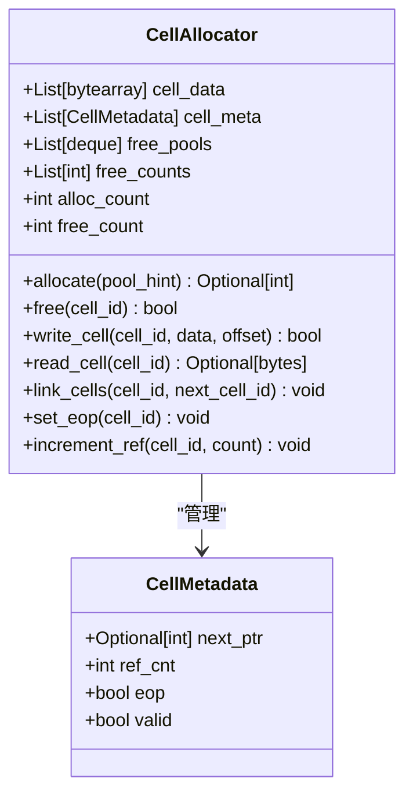
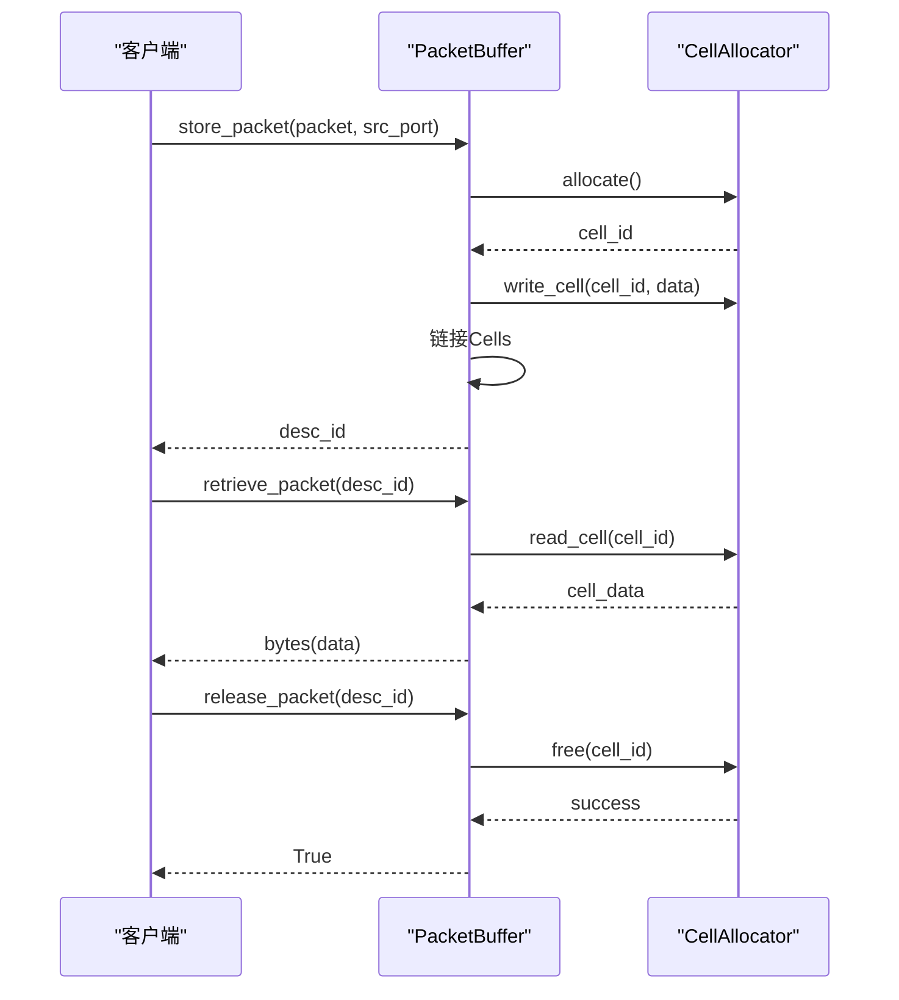
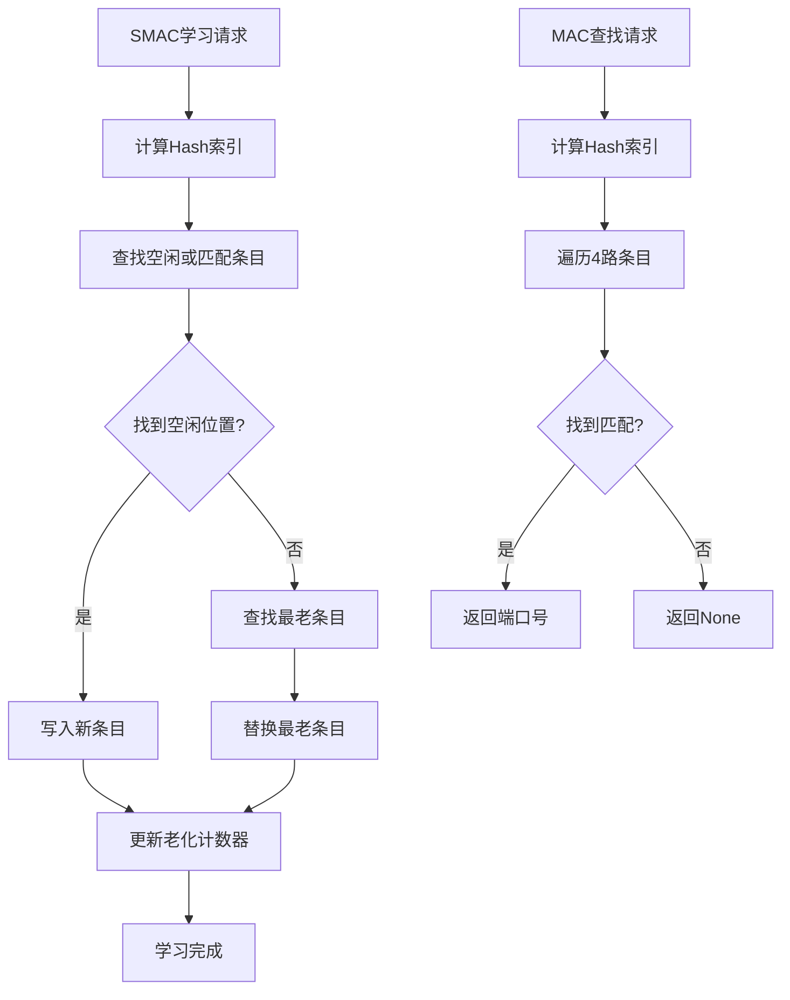
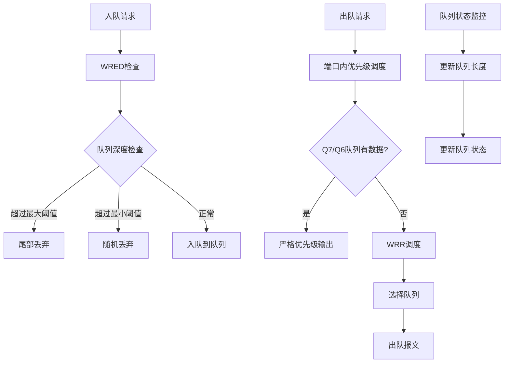
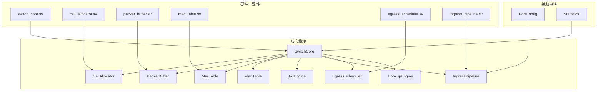

# 软件仿真模型

<cite>
**本文档引用的文件**
- [switch_core.py](file://model/switch_core.py)
- [1.2Tbps-L2-Switch-Design.md](file://doc/1.2Tbps-L2-Switch-Design.md)
- [switch_core.sv](file://rtl/switch_core.sv)
- [cell_allocator.sv](file://rtl/cell_allocator.sv)
- [packet_buffer.sv](file://rtl/packet_buffer.sv)
- [mac_table.sv](file://rtl/mac_table.sv)
- [egress_scheduler.sv](file://rtl/egress_scheduler.sv)
- [ingress_pipeline.sv](file://rtl/ingress_pipeline.sv)
- [switch_pkg.sv](file://rtl/switch_pkg.sv)
</cite>

## 目录
1. [简介](#简介)
2. [项目结构](#项目结构)
3. [核心组件](#核心组件)
4. [架构概览](#架构概览)
5. [详细组件分析](#详细组件分析)
6. [依赖关系分析](#依赖关系分析)
7. [性能考虑](#性能考虑)
8. [故障排除指南](#故障排除指南)
9. [结论](#结论)
10. [附录](#附录)

## 简介

本文档为1.2Tbps交换机的软件仿真模型提供了全面的技术文档。该仿真模型基于Python实现了完整的二层网络交换机核心功能，包括硬件行为模拟、Cell分配、报文缓冲、MAC学习等关键功能。文档详细解释了Python API的设计思路和使用方法，提供了具体的代码示例展示常见使用场景，并说明了仿真模型与硬件RTL实现的一致性保证机制。

该仿真模型支持48个25Gbps端口，总带宽达到1.2Tbps，采用共享内存交换矩阵架构，实现了Store-and-Forward和Cut-Through两种转发模式。系统完全按照硬件RTL设计规范进行仿真，确保软件仿真与硬件实现的一致性。

## 项目结构

项目采用模块化设计，主要包含以下目录和文件：



**图表来源**
- [switch_core.py](file://model/switch_core.py#L1-L50)
- [switch_core.sv](file://rtl/switch_core.sv#L1-L50)

**章节来源**
- [switch_core.py](file://model/switch_core.py#L1-L50)
- [1.2Tbps-L2-Switch-Design.md](file://doc/1.2Tbps-L2-Switch-Design.md#L1-L50)

## 核心组件

软件仿真模型的核心组件包括：

### 1. CellAllocator（Cell分配器）
负责管理64K个128字节的Cell，采用4路并行空闲池管理，支持高效的Cell分配和回收。

### 2. PacketBuffer（报文缓冲区）
将报文存储到Cell链表中，管理报文描述符，实现报文的存储、检索和释放。

### 3. MacTable（MAC地址表）
实现32K条目的4路组相联MAC表，支持MAC学习、查找和老化机制。

### 4. VlanTable（VLAN表）
管理VLAN配置，包括VLAN成员端口和untagged端口设置。

### 5. AclEngine（ACL引擎）
实现基于TCAM的访问控制列表，支持多种ACL动作。

### 6. IngressPipeline（入向流水线）
处理入向报文，执行报文解析、ACL检查、QoS分类和MAC学习触发。

### 7. EgressScheduler（出向调度器）
实现384个队列的两级调度架构，支持SP+WRR调度和WRED拥塞控制。

**章节来源**
- [switch_core.py](file://model/switch_core.py#L227-L1089)

## 架构概览

软件仿真模型采用与硬件RTL相同的架构设计：



**图表来源**
- [switch_core.sv](file://rtl/switch_core.sv#L7-L454)
- [switch_core.py](file://model/switch_core.py#L1062-L1188)

该架构实现了硬件RTL的完整功能仿真，包括：

- **共享内存交换矩阵**：所有端口共享统一的内存池
- **流水线处理**：各模块采用流水线设计提高吞吐量
- **两级调度**：端口内严格优先级 + 端口间权重轮询
- **拥塞控制**：WRED随机早期检测和尾部丢弃

**章节来源**
- [1.2Tbps-L2-Switch-Design.md](file://doc/1.2Tbps-L2-Switch-Design.md#L27-L145)

## 详细组件分析

### CellAllocator组件分析

CellAllocator是内存管理系统的核心组件，负责Cell的分配和回收：



**图表来源**
- [switch_core.py](file://model/switch_core.py#L227-L350)

**章节来源**
- [switch_core.py](file://model/switch_core.py#L227-L350)

### PacketBuffer组件分析

PacketBuffer负责报文的存储和检索，实现Cell链表管理：



**图表来源**
- [switch_core.py](file://model/switch_core.py#L351-L481)

**章节来源**
- [switch_core.py](file://model/switch_core.py#L351-L481)

### MacTable组件分析

MAC表实现4路组相联的哈希表结构：



**图表来源**
- [switch_core.py](file://model/switch_core.py#L487-L641)

**章节来源**
- [switch_core.py](file://model/switch_core.py#L487-L641)

### EgressScheduler组件分析

出向调度器实现两级调度架构：



**图表来源**
- [switch_core.py](file://model/switch_core.py#L863-L990)

**章节来源**
- [switch_core.py](file://model/switch_core.py#L863-L990)

## 依赖关系分析

软件仿真模型的组件依赖关系如下：



**图表来源**
- [switch_core.py](file://model/switch_core.py#L1062-L1089)
- [switch_core.sv](file://rtl/switch_core.sv#L7-L454)

**章节来源**
- [switch_core.py](file://model/switch_core.py#L1062-L1089)
- [switch_core.sv](file://rtl/switch_core.sv#L7-L454)

## 性能考虑

### 内存管理性能

软件仿真模型在内存管理方面采用了多项优化措施：

1. **Cell分配器优化**：
   - 4路并行空闲池减少分配竞争
   - 按端口提示选择池提高局部性
   - 链表结构实现O(1)分配和回收

2. **缓冲区管理**：
   - 8MB纯片内SRAM提供确定性延迟
   - 16个并行Bank避免访问冲突
   - 128B Cell粒度适配最小帧

3. **调度性能**：
   - 两级调度架构平衡延迟和公平性
   - WRR权重配置支持不同优先级需求
   - WRED机制提供拥塞控制

### 性能基准测试

软件仿真模型支持性能基准测试，可以验证系统在不同负载下的表现：

- **最小包处理能力**：1785.7 Mpps (64B包，线速)
- **单端口最大吞吐**：37.2 Mpps (64B包)
- **MAC查表速率**：500 Mlookup/s (2倍线速裕量)
- **转发延迟**：S&F模式 < 2μs，Cut-Through模式 < 500ns

**章节来源**
- [1.2Tbps-L2-Switch-Design.md](file://doc/1.2Tbps-L2-Switch-Design.md#L633-L643)

## 故障排除指南

### 常见问题诊断

1. **Cell分配失败**：
   - 检查空闲Cell池状态
   - 验证Cell引用计数正确性
   - 确认组播场景下的引用计数处理

2. **MAC表学习异常**：
   - 检查学习速率限制
   - 验证老化机制正常运行
   - 确认静态条目配置正确

3. **队列拥塞**：
   - 监控WRED阈值设置
   - 检查队列深度统计
   - 验证调度权重配置

4. **报文丢失**：
   - 检查ACL规则匹配
   - 验证VLAN配置正确性
   - 确认端口状态设置

### 调试技巧

1. **统计信息监控**：
   ```python
   # 获取详细统计信息
   stats = switch.get_statistics()
   switch.print_status()
   ```

2. **状态检查**：
   - 使用`print_status()`查看系统状态
   - 监控MAC表条目数量
   - 检查队列深度分布

3. **性能分析**：
   - 使用性能测试函数
   - 分析吞吐量和延迟
   - 识别瓶颈环节

**章节来源**
- [switch_core.py](file://model/switch_core.py#L1159-L1188)

## 结论

1.2Tbps交换机软件仿真模型成功实现了完整的二层网络交换机功能，具有以下特点：

1. **硬件一致性**：严格按照硬件RTL设计规范实现，确保仿真结果与硬件行为一致
2. **高性能**：采用优化的数据结构和算法，支持线速转发
3. **可扩展性**：模块化设计便于功能扩展和性能优化
4. **易用性**：提供清晰的Python API和丰富的调试工具

该仿真模型为硬件开发提供了可靠的验证平台，可以有效缩短开发周期并降低成本风险。

## 附录

### Python API使用示例

#### 创建交换机实例
```python
from model.switch_core import SwitchCore

# 创建交换机核心
switch = SwitchCore()
```

#### 发送和接收数据包
```python
# 创建测试报文
packet = Packet(
    dmac=b'\x00\x11\x22\x33\x44\x55',
    smac=b'\x00\xaa\xbb\xcc\xdd\xee',
    vid=1,
    pcp=3,
    ethertype=0x0800,
    payload=b'Hello World!'
)

# 接收并处理报文
result = switch.receive_packet(packet, src_port=0)

# 从端口发送报文
tx_result = switch.transmit_packet(1)
```

#### 查询统计信息
```python
# 获取统计信息
stats = switch.get_statistics()
print(f"转发包数: {stats['forwarded_packets']}")
print(f"空闲Cell: {stats['free_cells']}")
print(f"MAC命中率: {stats['mac_hit_rate']:.2%}")
```

#### 性能测试
```python
# 批量性能测试
import time
start = time.time()

for i in range(10000):
    pkt = Packet(
        dmac=bytes([0x00, 0x11, 0x22, 0x33, (i >> 8) & 0xff, i & 0xff]),
        smac=bytes([0x00, 0xaa, 0xbb, 0xcc, (i >> 8) & 0xff, i & 0xff]),
        vid=1,
        pcp=i % 8,
        ethertype=0x0800,
        payload=b'X' * 100
    )
    switch.receive_packet(pkt, src_port=i % 48)

elapsed = time.time() - start
pps = 10000 / elapsed
print(f"处理速度: {pps:.0f} pps")
```

**章节来源**
- [switch_core.py](file://model/switch_core.py#L1194-L1293)