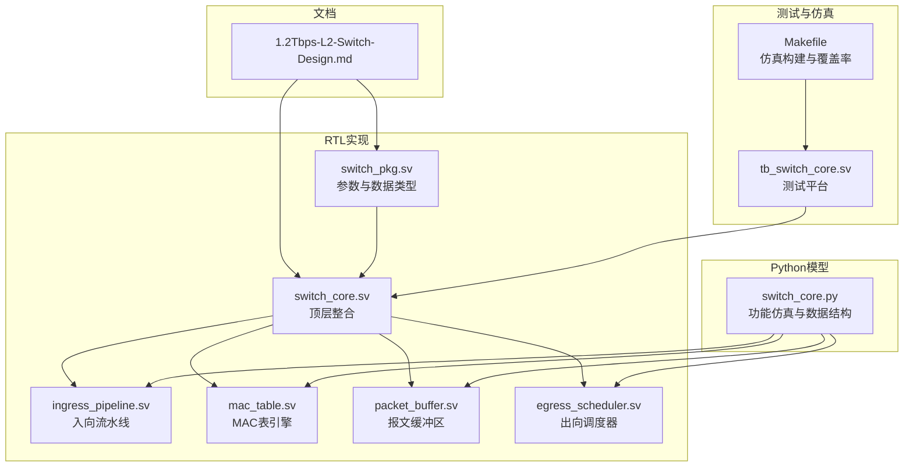
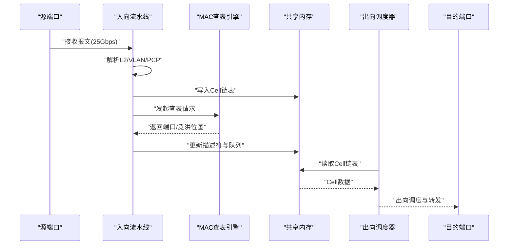
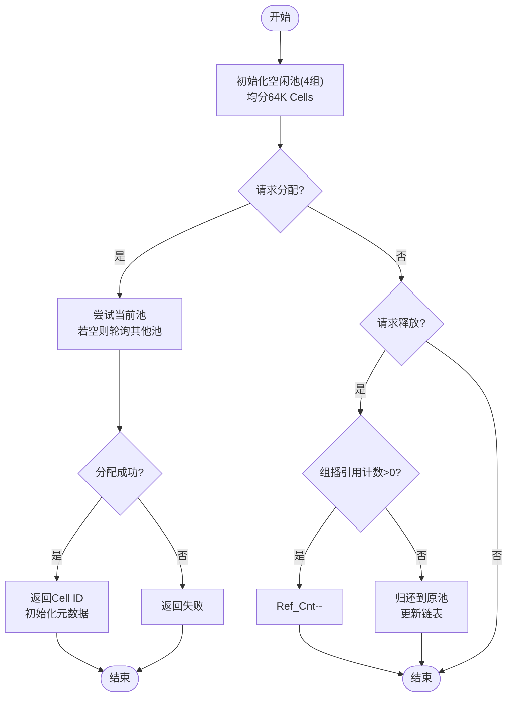
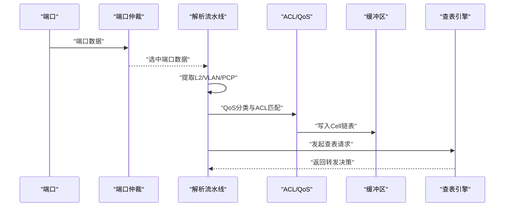
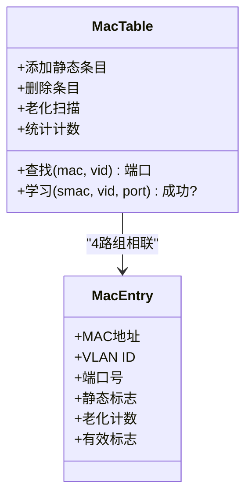
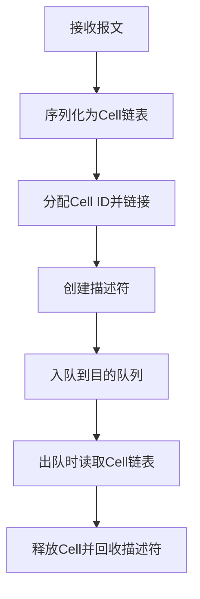
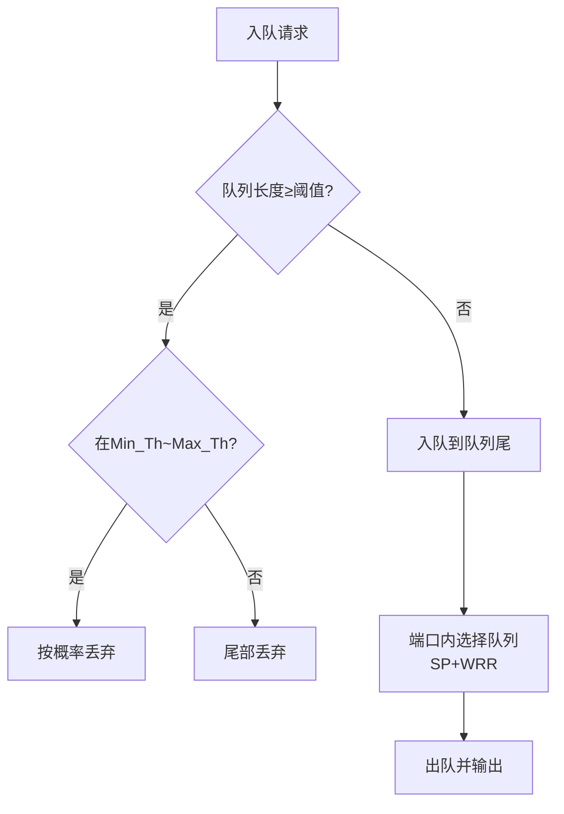
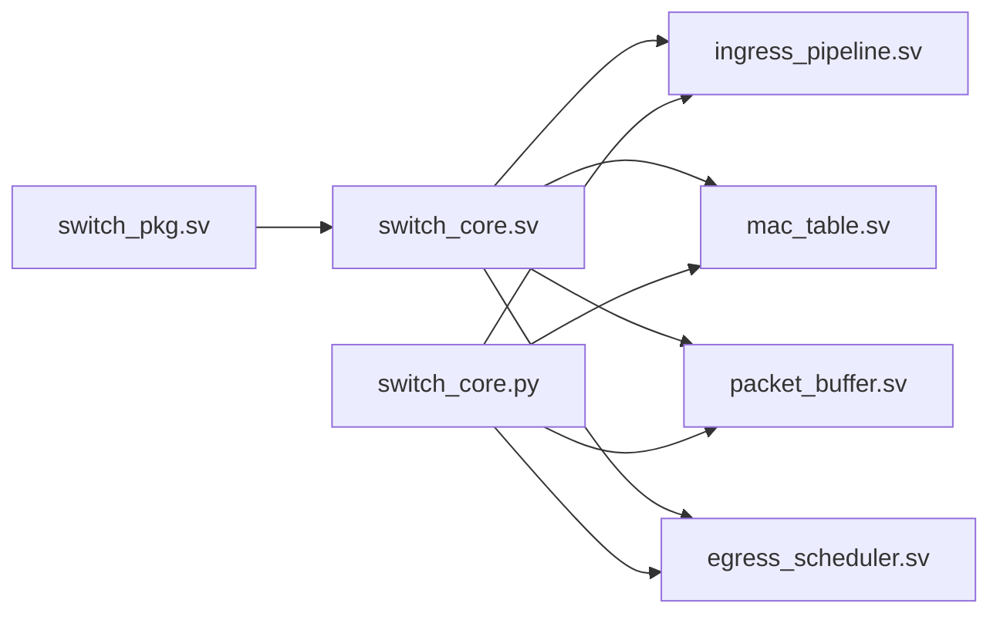

# 项目概述

<cite>
**本文档引用的文件**
- [1.2Tbps-L2-Switch-Design.md](file://doc/1.2Tbps-L2-Switch-Design.md)
- [switch_core.py](file://model/switch_core.py)
- [switch_core.sv](file://rtl/switch_core.sv)
- [switch_pkg.sv](file://rtl/switch_pkg.sv)
- [mac_table.sv](file://rtl/mac_table.sv)
- [packet_buffer.sv](file://rtl/packet_buffer.sv)
- [egress_scheduler.sv](file://rtl/egress_scheduler.sv)
- [ingress_pipeline.sv](file://rtl/ingress_pipeline.sv)
- [tb_switch_core.sv](file://tb/tb_switch_core.sv)
- [Makefile](file://sim/Makefile)
</cite>

## 目录
1. [简介](#简介)
2. [项目结构](#项目结构)
3. [核心组件](#核心组件)
4. [架构总览](#架构总览)
5. [详细组件分析](#详细组件分析)
6. [依赖关系分析](#依赖关系分析)
7. [性能考量](#性能考量)
8. [故障排查指南](#故障排查指南)
9. [结论](#结论)
10. [附录](#附录)

## 简介
本项目是一个面向数据中心和高性能网络场景的1.2Tbps 48×25G二层网络交换机设计方案与实现。项目采用共享内存交换矩阵架构，结合Store-and-Forward与Cut-Through两种转发模式，提供VLAN管理、QoS调度、ACL引擎等企业级网络功能。通过纯片内SRAM缓冲池、Cell链表存储、两级调度器与WRED拥塞控制，实现高吞吐、低延迟与可扩展的转发路径。

项目目标用户群体：
- 数据中心核心/汇聚交换机
- 高性能服务器互连（Fabric）
- 企业网络核心与汇聚层
- 网络功能虚拟化（NFV）与软件定义网络（SDN）环境

## 项目结构
项目采用分层组织方式，包含文档、RTL实现、Python模型、测试平台与仿真脚本：

图表来源
- [1.2Tbps-L2-Switch-Design.md](file://doc/1.2Tbps-L2-Switch-Design.md#L1-L767)
- [switch_pkg.sv](file://rtl/switch_pkg.sv#L1-L219)
- [switch_core.sv](file://rtl/switch_core.sv#L1-L454)
- [ingress_pipeline.sv](file://rtl/ingress_pipeline.sv#L1-L319)
- [mac_table.sv](file://rtl/mac_table.sv#L1-L342)
- [packet_buffer.sv](file://rtl/packet_buffer.sv#L1-L427)
- [egress_scheduler.sv](file://rtl/egress_scheduler.sv#L1-L394)
- [switch_core.py](file://model/switch_core.py#L1-L1293)
- [tb_switch_core.sv](file://tb/tb_switch_core.sv#L1-L840)
- [Makefile](file://sim/Makefile#L1-L186)

章节来源
- [1.2Tbps-L2-Switch-Design.md](file://doc/1.2Tbps-L2-Switch-Design.md#L1-L767)
- [switch_pkg.sv](file://rtl/switch_pkg.sv#L1-L219)
- [switch_core.sv](file://rtl/switch_core.sv#L1-L454)

## 核心组件
- 共享内存交换矩阵：统一的共享缓冲池与内存管理，避免Crossbar的N²复杂度，适合中等端口密度（48口）。
- 入向流水线（Ingress Pipeline）：端口仲裁、报文解析、ACL/QoS处理、MAC学习触发。
- MAC查表引擎：Hash + SRAM混合查找，支持静态/动态条目与老化机制。
- 报文缓冲区（Packet Buffer）：Cell链表存储，描述符管理，支持Store-and-Forward与Cut-Through。
- 出向调度器（Egress Scheduler）：两级调度（端口内严格优先+WRR，跨端口DWRR），WRED拥塞控制。
- VLAN表与ACL引擎：VLAN成员管理与TCAM规则匹配，支持多种动作。
- Python模型：用于功能验证、性能估算与教学演示。

章节来源
- [1.2Tbps-L2-Switch-Design.md](file://doc/1.2Tbps-L2-Switch-Design.md#L27-L145)
- [switch_core.sv](file://rtl/switch_core.sv#L1-L454)
- [ingress_pipeline.sv](file://rtl/ingress_pipeline.sv#L1-L319)
- [mac_table.sv](file://rtl/mac_table.sv#L1-L342)
- [packet_buffer.sv](file://rtl/packet_buffer.sv#L1-L427)
- [egress_scheduler.sv](file://rtl/egress_scheduler.sv#L1-L394)
- [switch_core.py](file://model/switch_core.py#L1-L1293)

## 架构总览
系统采用“端口→入向流水线→MAC查表→共享内存→出向调度→端口”的流水线架构。共享内存通过Cell链表管理报文，Cell大小为128B，总Cell数64K，缓冲池8MB纯片内SRAM，支持16个Bank并行访问，满足1.2Tbps总带宽与Cut-Through转发需求。

图表来源
- [switch_core.sv](file://rtl/switch_core.sv#L240-L360)
- [ingress_pipeline.sv](file://rtl/ingress_pipeline.sv#L229-L257)
- [mac_table.sv](file://rtl/mac_table.sv#L147-L151)
- [packet_buffer.sv](file://rtl/packet_buffer.sv#L246-L297)
- [egress_scheduler.sv](file://rtl/egress_scheduler.sv#L188-L293)

## 详细组件分析

### 共享内存交换矩阵与Cell分配器
- Cell组织：64K Cells × 128B，纯片内SRAM，16 Banks并行，Bank选择基于Cell ID[3:0]。
- 空闲池管理：4组独立空闲池，支持4路并行分配，降低分配竞争。
- 元数据结构：每个Cell维护Next_Ptr、Ref_Cnt、EOP、Valid等字段，独立SRAM存储。
- 分配/释放流程：分配时从空闲链表头取Cell ID并更新Bitmap；释放时根据Cell ID归还原池，支持组播引用计数。

图表来源
- [switch_core.sv](file://rtl/switch_core.sv#L149-L167)
- [packet_buffer.sv](file://rtl/packet_buffer.sv#L189-L244)
- [switch_pkg.sv](file://rtl/switch_pkg.sv#L91-L98)

章节来源
- [1.2Tbps-L2-Switch-Design.md](file://doc/1.2Tbps-L2-Switch-Design.md#L238-L466)
- [switch_pkg.sv](file://rtl/switch_pkg.sv#L16-L21)
- [packet_buffer.sv](file://rtl/packet_buffer.sv#L1-L427)

### 入向流水线（Ingress Pipeline）
- 端口仲裁：48端口分6组（每组8端口），组内轮询仲裁，组间轮询选择，避免端口饥饿。
- 解析流水线：4级解析（L2头→VLAN标签→以太类型→元数据），提取DMAC、SMAC、VID、PCP、长度等。
- QoS与ACL：基于802.1p PCP映射到8个优先级队列，ACL TCAM匹配支持Permit/Deny/Mirror/Rate-limit。
- MAC学习：在转发状态且非组播SMAC时触发学习，速率限制每端口每秒最多1K次。

图表来源
- [ingress_pipeline.sv](file://rtl/ingress_pipeline.sv#L52-L126)
- [ingress_pipeline.sv](file://rtl/ingress_pipeline.sv#L128-L224)
- [ingress_pipeline.sv](file://rtl/ingress_pipeline.sv#L229-L257)
- [switch_core.sv](file://rtl/switch_core.sv#L240-L268)

章节来源
- [1.2Tbps-L2-Switch-Design.md](file://doc/1.2Tbps-L2-Switch-Design.md#L52-L182)
- [ingress_pipeline.sv](file://rtl/ingress_pipeline.sv#L1-L319)

### MAC查表引擎
- 表结构：32K条目，4路组相联，Set Index = CRC16(MAC[47:0]) XOR VID[11:0]。
- 查表流水线：Hash计算→SRAM读取→比较匹配，128bit报文描述符作为输入，输出目的端口或泛洪位图。
- 学习机制：SMAC未命中时触发学习，支持静态条目与速率限制，硬件辅助老化扫描。
- 老化：软件定时扫描（默认300秒），硬件2bit Age计数器，访问时重置Age。

图表来源
- [mac_table.sv](file://rtl/mac_table.sv#L128-L137)
- [mac_table.sv](file://rtl/mac_table.sv#L154-L248)
- [1.2Tbps-L2-Switch-Design.md](file://doc/1.2Tbps-L2-Switch-Design.md#L184-L235)

章节来源
- [1.2Tbps-L2-Switch-Design.md](file://doc/1.2Tbps-L2-Switch-Design.md#L184-L235)
- [mac_table.sv](file://rtl/mac_table.sv#L1-L342)

### 报文缓冲区与描述符管理
- 描述符池：最大4K报文，128bit描述符，包含首尾Cell指针、Cell数量、报文长度、源端口、队列ID、VLAN动作等。
- 队列链表：每端口8优先级队列，描述符链表管理，动态共享Cell池。
- 存储策略：Store-and-Forward在完整接收后入队；Cut-Through在收到足够头部（如64B含DMAC）后立即查表转发，后续Cell流式写入/读取。

图表来源
- [switch_core.sv](file://rtl/switch_core.sv#L172-L205)
- [packet_buffer.sv](file://rtl/packet_buffer.sv#L189-L297)
- [1.2Tbps-L2-Switch-Design.md](file://doc/1.2Tbps-L2-Switch-Design.md#L468-L491)

章节来源
- [1.2Tbps-L2-Switch-Design.md](file://doc/1.2Tbps-L2-Switch-Design.md#L468-L491)
- [packet_buffer.sv](file://rtl/packet_buffer.sv#L1-L427)

### 出向调度器与拥塞控制
- 两级调度：端口内严格优先级（Q7/Q6）+加权轮询（WRR，权重8:4:2:2:1:1），跨端口DWRR保证长期公平。
- 队列状态：空/正常/拥塞/阻塞，动态更新。
- 拥塞控制：WRED（随机早期检测）+尾部丢弃，支持每端口速率限制（令牌桶）。
- 统计：入队/出队/丢弃计数器，便于性能监控与调优。

图表来源
- [egress_scheduler.sv](file://rtl/egress_scheduler.sv#L88-L185)
- [egress_scheduler.sv](file://rtl/egress_scheduler.sv#L188-L293)
- [1.2Tbps-L2-Switch-Design.md](file://doc/1.2Tbps-L2-Switch-Design.md#L513-L590)

章节来源
- [1.2Tbps-L2-Switch-Design.md](file://doc/1.2Tbps-L2-Switch-Design.md#L513-L590)
- [egress_scheduler.sv](file://rtl/egress_scheduler.sv#L1-L394)

### VLAN管理与ACL引擎
- VLAN表：成员端口位图与Untagged端口集合，支持默认VLAN 1。
- ACL引擎：TCAM规则表（1K条目），匹配字段包括源端口、DMAC、SMAC、VID、以太类型，动作支持Permit/Deny/Mirror/Rate-limit。
- 与转发路径集成：入向流水线在解析阶段提取必要字段，ACL/QoS在入队前完成处理。

章节来源
- [1.2Tbps-L2-Switch-Design.md](file://doc/1.2Tbps-L2-Switch-Design.md#L167-L181)
- [switch_core.py](file://model/switch_core.py#L647-L701)
- [switch_core.py](file://model/switch_core.py#L707-L775)

## 依赖关系分析
- 顶层模块switch_core.sv整合所有子模块，定义端口接口、CPU配置接口与中断信号。
- switch_pkg.sv集中定义系统参数、枚举类型与数据结构，供RTL与Python模型共享。
- 各子模块间通过标准化接口通信：Cell分配器接口、描述符接口、查表请求/响应等。
- Python模型switch_core.py提供与RTL一致的数据结构与行为，便于功能验证与性能估算。

图表来源
- [switch_pkg.sv](file://rtl/switch_pkg.sv#L1-L219)
- [switch_core.sv](file://rtl/switch_core.sv#L1-L454)
- [ingress_pipeline.sv](file://rtl/ingress_pipeline.sv#L1-L319)
- [mac_table.sv](file://rtl/mac_table.sv#L1-L342)
- [packet_buffer.sv](file://rtl/packet_buffer.sv#L1-L427)
- [egress_scheduler.sv](file://rtl/egress_scheduler.sv#L1-L394)
- [switch_core.py](file://model/switch_core.py#L1-L1293)

章节来源
- [switch_pkg.sv](file://rtl/switch_pkg.sv#L1-L219)
- [switch_core.sv](file://rtl/switch_core.sv#L1-L454)

## 性能考量
- 带宽与延迟目标：总带宽1.2Tbps（48×25Gbps全双工），Store-and-Forward延迟<2μs，Cut-Through延迟<500ns（64B）。
- 处理能力：最小包处理能力1785.7 Mpps（64B线速），单端口最大吞吐37.2 Mpps（64B）。
- 内存带宽：16 Banks × 512bit × 500MHz = 4Tbps，远超1.2Tbps需求，裕量充足。
- 缓冲容量：8MB纯片内SRAM，线速缓冲53μs，4:1拥塞下212μs突发吸收。
- 功耗估计：核心逻辑约12-20W（不含PHY/SerDes与DDR），纯片内SRAM方案降低功耗。

章节来源
- [1.2Tbps-L2-Switch-Design.md](file://doc/1.2Tbps-L2-Switch-Design.md#L15-L643)

## 故障排查指南
- 初始化与空闲Cell：通过CPU寄存器读取空闲Cell计数，确认cell_init_done信号。
- 端口协议一致性：RX/TX SOP/EOP必须与valid配合，违反协议将导致丢包。
- MAC学习与老化：检查learn计数器增长与老化扫描是否触发，确认SMAC学习条件与速率限制。
- 队列拥塞：关注WRED丢弃计数与队列状态，调整权重或启用速率限制。
- 覆盖率与波形：使用Makefile目标生成VCD波形与覆盖率报告，定位未覆盖路径。

章节来源
- [tb_switch_core.sv](file://tb/tb_switch_core.sv#L158-L199)
- [tb_switch_core.sv](file://tb/tb_switch_core.sv#L320-L331)
- [Makefile](file://sim/Makefile#L110-L130)

## 结论
本项目以共享内存交换矩阵为核心，结合Cell链表存储与两级调度架构，在48端口密度下实现了1.2Tbps线速转发与低延迟转发路径。通过Store-and-Forward与Cut-Through模式、VLAN/QoS/ACL等企业级功能，满足数据中心与高性能网络的应用需求。纯片内SRAM缓冲池与严格的时序设计确保了在500MHz核心频率下的稳定性能与可扩展性。

## 附录
- 术语对照
  - Cell：128字节固定粒度的存储单元，用于报文链表存储。
  - Store-and-Forward：完整接收后再转发，支持更严格的错误检查。
  - Cut-Through：收到足够头部后立即查表转发，降低转发延迟。
  - WRED：随机早期检测，按队列长度概率丢弃，缓解拥塞。
  - DWRR：Deficit Weighted Round Robin，跨端口保证长期公平性。